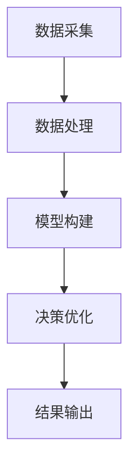
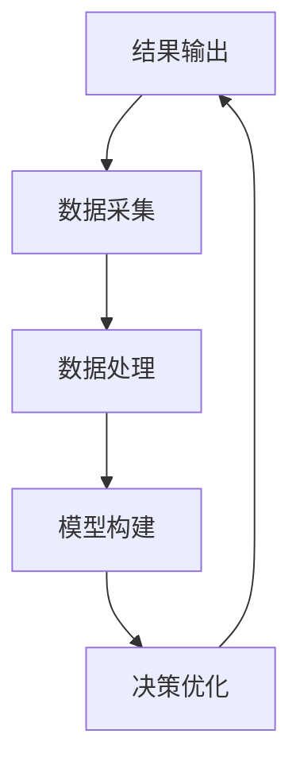

                 


# 查理·芒格的多元思维模型在投资中的运用

## 关键词：查理·芒格、多元思维模型、投资决策、系统设计、概率论、统计学、贝叶斯网络

## 摘要：查理·芒格的多元思维模型是一种通过整合多个学科的原理和方法来优化投资决策的系统性思维框架。本文将从背景、核心概念、数学基础、系统架构、算法实现到项目实战，全面解析多元思维模型在投资中的运用，帮助读者理解如何通过跨学科的综合应用来提升投资决策的科学性和准确性。

---

## 第1章: 多元思维模型的核心概念

### 1.1 多元思维模型的定义与背景

#### 1.1.1 什么是多元思维模型
多元思维模型（Multi-Model Thinking）是由查理·芒格提出的一种投资哲学，其核心思想是通过整合多个学科的原理和方法，构建一个全面的知识框架，从而帮助投资者更好地理解和预测市场行为。

#### 1.1.2 多元思维模型的哲学基础
芒格认为，人类的认知是通过多个“心智模型”构建起来的，每个模型代表一种特定的思维方式或学科原理。通过整合这些模型，投资者可以更全面地分析问题，避免单一思维的局限性。

#### 1.1.3 多元思维模型在投资中的重要性
在投资决策中，单一学科的分析往往难以捕捉市场的复杂性。通过多元思维模型，投资者可以结合心理学、经济学、物理学等多学科的视角，更全面地评估投资机会和风险。

### 1.2 多元思维模型的核心要素

#### 1.2.1 知识的多元性
多元思维模型强调从多个学科中汲取知识，包括心理学、经济学、物理学等，通过跨学科的综合分析，提升投资决策的全面性。

#### 1.2.2 思维的系统性
芒格的多元思维模型注重系统性思维，将各个学科的原理整合到一个统一的框架中，帮助投资者从整体角度理解市场行为。

#### 1.2.3 投资决策的全面性
通过多元思维模型，投资者可以避免单一视角的局限性，从多个维度分析投资标的的价值和风险，从而做出更科学的决策。

### 1.3 多元思维模型与其他投资模型的对比

#### 1.3.1 传统投资模型的局限性
传统投资模型通常基于单一学科的分析，如财务指标分析或技术分析，难以全面捕捉市场的复杂性。

#### 1.3.2 多元思维模型的优势
多元思维模型通过整合多学科的原理，提供了更全面的分析视角，能够更好地应对市场的不确定性。

#### 1.3.3 多元思维模型的适用场景
适用于复杂的投资决策，特别是在需要综合分析市场行为、企业基本面和技术面的情况下，多元思维模型能够提供更有力的支持。

---

## 第2章: 多元思维模型的数学基础

### 2.1 基础概率论

#### 2.1.1 概率的基本概念
概率论是多元思维模型的重要数学工具之一，用于量化投资决策中的不确定性。概率的基本概念包括事件、样本空间、概率分布等。

#### 2.1.2 贝叶斯定理的应用
贝叶斯定理是一种用于更新概率的数学方法，可以帮助投资者在新的信息出现时，调整对投资标的概率评估。

#### 2.1.3 马尔可夫链与投资决策
马尔可夫链是一种描述系统状态转移的数学模型，可以用于分析市场的动态变化，帮助投资者预测未来的市场趋势。

### 2.2 统计学基础

#### 2.2.1 投资数据的分布特征
统计学是多元思维模型的另一重要工具，用于分析投资数据的分布特征，如均值、方差、偏度等。

#### 2.2.2 假设检验与投资决策
通过假设检验，投资者可以验证某种投资策略的有效性，从而做出更科学的投资决策。

#### 2.2.3 回归分析在投资中的应用
回归分析是一种统计学方法，用于分析变量之间的关系，可以帮助投资者预测市场的走势。

### 2.3 系统性思维的数学建模

#### 2.3.1 系统性思维的数学模型
系统性思维可以通过构建数学模型来描述复杂的市场行为，如系统动力学模型。

#### 2.3.2 多元回归模型在投资中的应用
多元回归模型可以用于分析多个变量对投资标的共同影响，帮助投资者更全面地评估风险和收益。

#### 2.3.3 系统性风险的量化
系统性风险是整个市场的风险，可以通过统计学方法进行量化，并用于投资组合的优化。

---

## 第3章: 多元思维模型的系统架构

### 3.1 投资决策系统的功能模块

#### 3.1.1 数据采集与处理模块
数据采集与处理模块负责收集和整理投资相关的数据，如市场数据、财务数据等。

#### 3.1.2 模型构建与分析模块
模型构建与分析模块通过多元思维模型，对投资标的进行分析和评估。

#### 3.1.3 投资决策与优化模块
投资决策与优化模块根据分析结果，生成投资策略，并进行优化。

### 3.2 系统架构的Mermaid图



### 3.3 系统接口设计

#### 3.3.1 数据接口规范
数据接口规范定义了系统与外部数据源之间的交互方式。

#### 3.3.2 模型接口规范
模型接口规范定义了模型构建与分析模块的输入和输出接口。

#### 3.3.3 决策接口规范
决策接口规范定义了投资决策与优化模块的输入和输出接口。

---

## 第4章: 多元思维模型的算法实现

### 4.1 基于多元思维模型的算法流程

#### 4.1.1 数据预处理
数据预处理包括数据清洗、数据转换等步骤，确保数据的质量和一致性。

#### 4.1.2 模型训练
模型训练是通过多元思维模型对数据进行分析和建模的过程。

#### 4.1.3 模型评估
模型评估是通过测试数据验证模型的准确性和可靠性。

### 4.2 多元回归算法的实现

#### 4.2.1 算法原理
多元回归算法通过建立多个变量之间的线性关系，预测目标变量的值。

#### 4.2.2 代码实现
以下是多元回归算法的Python代码示例：

```python
import numpy as np
from sklearn.linear_model import LinearRegression

# 创建数据集
X = np.array([[1, 2], [3, 4], [5, 6]])
y = np.array([7, 8, 9])

# 创建回归模型
model = LinearRegression()

# 训练模型
model.fit(X, y)

# 预测结果
print(model.predict([[2, 3]]))
```

#### 4.2.3 案例分析
通过分析一个具体的投资案例，展示多元回归算法在投资中的应用。

### 4.3 贝叶斯网络的构建与应用

#### 4.3.1 贝叶斯网络的构建
贝叶斯网络是一种基于概率的图形模型，用于描述变量之间的关系。

#### 4.3.2 贝叶斯网络在投资中的应用
贝叶斯网络可以用于分析市场风险、评估投资标的可能性等。

#### 4.3.3 案例分析
通过一个具体案例，展示贝叶斯网络在投资中的实际应用。

---

## 第5章: 多元思维模型的项目实战

### 5.1 项目背景与目标

#### 5.1.1 项目背景
项目背景介绍一个具体的投资场景，如股票投资、基金投资等。

#### 5.1.2 项目目标
项目目标是通过多元思维模型，优化投资决策，提高投资收益。

### 5.2 系统功能设计

#### 5.2.1 数据采集与处理
数据采集与处理模块负责收集和整理投资相关的数据。

#### 5.2.2 模型构建与分析
模型构建与分析模块通过多元思维模型，对投资标的进行分析和评估。

#### 5.2.3 投资决策与优化
投资决策与优化模块根据分析结果，生成投资策略，并进行优化。

### 5.3 系统架构设计

#### 5.3.1 系统架构图
以下是系统架构的Mermaid图：


### 5.4 系统接口设计

#### 5.4.1 数据接口规范
数据接口规范定义了系统与外部数据源之间的交互方式。

#### 5.4.2 模型接口规范
模型接口规范定义了模型构建与分析模块的输入和输出接口。

#### 5.4.3 决策接口规范
决策接口规范定义了投资决策与优化模块的输入和输出接口。

### 5.5 系统交互设计

#### 5.5.1 系统交互图
以下是系统交互的Mermaid图：



### 5.6 项目实战

#### 5.6.1 环境安装
项目实战需要安装相关的开发环境和工具，如Python、NumPy、Scikit-learn等。

#### 5.6.2 核心代码实现
以下是项目的Python核心代码实现：

```python
import numpy as np
from sklearn.linear_model import LinearRegression

# 创建数据集
X = np.array([[1, 2], [3, 4], [5, 6]])
y = np.array([7, 8, 9])

# 创建回归模型
model = LinearRegression()

# 训练模型
model.fit(X, y)

# 预测结果
print(model.predict([[2, 3]]))
```

#### 5.6.3 案例分析
通过一个具体的投资案例，展示项目的实际应用和效果。

---

## 第6章: 总结与展望

### 6.1 总结

#### 6.1.1 多元思维模型的背景与重要性
多元思维模型通过整合多个学科的原理和方法，帮助投资者更全面地分析市场行为。

#### 6.1.2 多元思维模型的核心要素
多元思维模型的核心要素包括知识的多元性、思维的系统性、投资决策的全面性等。

#### 6.1.3 多元思维模型的应用价值
多元思维模型在投资决策中具有重要的应用价值，能够帮助投资者提高决策的科学性和准确性。

### 6.2 展望

#### 6.2.1 多元思维模型的未来发展
随着人工智能和大数据技术的发展，多元思维模型在投资中的应用前景广阔。

#### 6.2.2 多元思维模型的拓展应用
多元思维模型可以进一步拓展到其他领域，如企业战略、风险管理等。

#### 6.2.3 多元思维模型的优化方向
未来可以进一步优化多元思维模型的算法和系统架构，提高其在投资中的应用效果。

---

## 最佳实践 Tips

- 在实际投资中，建议投资者结合多元思维模型和其他投资策略，进行综合分析。
- 保持对市场动态的关注，及时更新和优化投资模型。
- 在使用多元思维模型时，注意数据的准确性和模型的适用性。

---

## 结语

查理·芒格的多元思维模型是一种非常有用的工具，能够帮助投资者更全面地分析市场行为，做出更科学的投资决策。通过本文的详细讲解和实战案例，相信读者能够更好地理解和应用多元思维模型，提高投资的准确性和收益。

