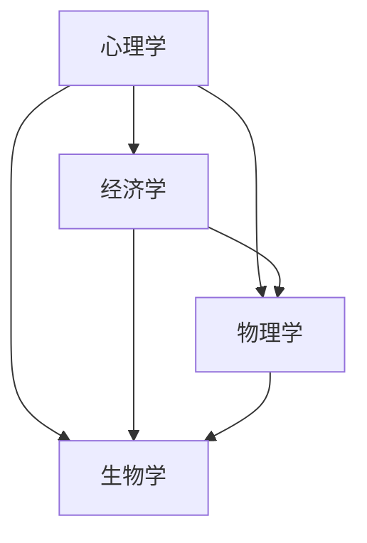
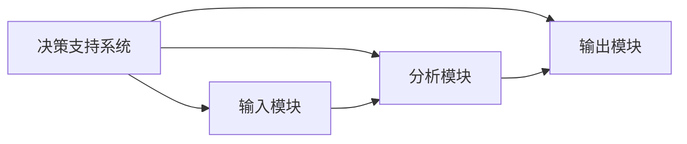

                 


# 查理·芒格的多元思维模型实际案例分析

> 关键词：多元思维模型, 查理·芒格, 投资决策, 商业策略, 系统架构设计

> 摘要：查理·芒格的多元思维模型是一种通过多个学科的思维框架来分析问题、做出决策的方法。本文将从背景介绍、核心原理、实际案例分析、系统架构设计、算法原理等多个角度，详细解读多元思维模型在实际中的应用，并通过具体案例分析，展示如何利用该模型在投资和商业策略中做出更优决策。文章还结合了技术分析，从系统架构设计、算法实现等多个维度，深入探讨了多元思维模型的实践应用。

---

## 第一部分：查理·芒格的多元思维模型背景介绍

### 第1章：多元思维模型的起源与核心概念

#### 1.1 多元思维模型的定义与背景
多元思维模型（Mental Models）是由查理·芒格提出的一种思维方式，强调通过多个学科的思维框架来分析问题，避免单一思维的局限性。该模型的核心在于将各个学科的思维框架相互结合，形成一个多维度的分析体系，从而做出更全面、更准确的决策。

**背景介绍：**
- 多元思维模型的起源可以追溯到查理·芒格的职业生涯中，他通过广泛涉猎多个学科的知识，逐步形成了这一独特的思维方式。
- 在芒格看来，单一的思维方式往往会导致决策的片面性，而多元思维模型则能够帮助我们从多个角度审视问题，找到更优的解决方案。

#### 1.2 查理·芒格的生平与思想
查理·芒格是美国著名投资者、伯克希尔·哈撒韦公司的副主席，被誉为“价值投资”的倡导者。他的思想深刻影响了投资领域，尤其是多元思维模型的应用，使他能够在投资决策中做出超越常人的判断。

**芒格的主要思想：**
- 投资的本质是寻找具有持续竞争优势的企业，而不是简单地寻找低价股票。
- 通过多元思维模型，芒格能够在投资决策中，综合考虑企业的财务状况、市场环境、管理团队等多个因素，从而做出更合理的决策。

### 第2章：多元思维模型的核心原理

#### 2.1 多元思维模型的结构与组成
多元思维模型的结构是一个多维度的网络，由多个学科的思维框架组成，每个框架都具有特定的属性和功能。这些框架相互关联，形成一个完整的分析体系。

**核心要素：**
- **心理学思维框架**：帮助理解人类行为和决策的心理机制。
- **经济学思维框架**：分析经济活动中的利益关系和市场规律。
- **物理学思维框架**：提供能量守恒、杠杆原理等基本概念，用于分析系统中的各种力量。
- **生物学思维框架**：研究生态系统的运作规律，理解企业竞争中的生存法则。

#### 2.2 多元思维模型的学科框架
多元思维模型的核心在于将多个学科的思维框架结合起来，形成一个综合的分析体系。以下是各学科思维框架的简要介绍：

**心理学思维框架：**
- **行为心理学**：研究人类行为的驱动力，帮助理解市场参与者的决策过程。
- **认知偏差**：识别和避免认知偏差对决策的影响。

**经济学思维框架：**
- **市场均衡**：分析市场供需关系，判断价格走势。
- **成本效益分析**：评估不同决策的成本和收益比。

**物理学思维框架：**
- **杠杆原理**：分析资源的利用效率，找到最优配置。
- **能量守恒**：理解系统的能量流动，预测可能的变化。

**生物学思维框架：**
- **物种竞争**：分析企业在市场中的竞争地位。
- **适应性**：判断企业对市场变化的适应能力。

#### 2.3 多元思维模型的相互联系
多元思维模型的各个学科框架之间存在密切的联系，它们共同构成了一个完整的分析体系。通过这些框架的相互作用，我们可以更全面地理解问题的本质，从而做出更优的决策。

**图表展示：**


---

## 第二部分：多元思维模型的实际案例分析

### 第3章：投资决策中的多元思维模型应用

#### 3.1 投资决策的背景与问题分析
投资决策的核心问题在于如何在不确定的市场环境中，找到具有长期竞争优势的企业，并做出合理的投资决策。传统的投资分析往往依赖于单一的财务指标，而多元思维模型则提供了更全面的分析框架。

**问题分析：**
- **信息不对称**：投资者难以全面掌握企业的内部信息，容易受到市场噪声的影响。
- **市场波动**：市场的短期波动可能掩盖企业的长期价值，需要通过多元思维模型来识别真正的投资机会。

#### 3.2 典型案例分析

##### 3.2.1 可口可乐的投资案例
**案例背景：**
- 可口可乐是一家全球知名的饮料公司，具有强大的品牌影响力和市场占有率。
- 在20世纪80年代，可口可乐面临市场增长放缓和竞争对手的挑战。

**分析过程：**
- **心理学框架**：分析消费者对可口可乐品牌的认知和忠诚度。
- **经济学框架**：评估可口可乐的市场地位和定价能力。
- **物理学框架**：分析企业的杠杆效应和财务健康状况。
- **生物学框架**：判断企业对市场变化的适应能力和创新能力。

**结果：**
- 芒格通过多元思维模型，识别出可口可乐的长期竞争优势，做出了长期投资的决策，取得了丰厚的回报。

##### 3.2.2 亚马逊的投资案例
**案例背景：**
- 亚马逊从一家在线书店发展成为全球最大的电商平台之一。
- 在2000年代初，亚马逊面临巨大的竞争压力，且互联网泡沫破裂后的市场环境充满不确定性。

**分析过程：**
- **心理学框架**：分析亚马逊创始人贝索斯的愿景和管理风格。
- **经济学框架**：评估亚马逊的市场地位和定价策略。
- **物理学框架**：分析亚马逊的财务状况和杠杆比率。
- **生物学框架**：判断亚马逊的创新能力和发展潜力。

**结果：**
- 芒格通过多元思维模型，认识到亚马逊的巨大潜力，做出了长期投资的决策，取得了显著的回报。

#### 3.3 案例分析总结
通过上述案例分析，可以清晰地看到，多元思维模型在投资决策中的应用价值。芒格通过综合分析多个学科的思维框架，识别出企业的长期价值，做出了超越市场平均水平的投资决策。

---

## 第三部分：多元思维模型的实际应用与操作指南

### 第4章：商业策略中的多元思维模型应用

#### 4.1 商业策略的背景与问题分析
商业策略的核心问题在于如何在复杂的市场环境中，制定出有效的竞争策略，实现企业的长期发展。传统的商业分析往往依赖于单一的市场分析，而多元思维模型则提供了更全面的分析框架。

**问题分析：**
- **市场竞争**：企业如何在激烈的市场竞争中找到差异化的机会。
- **客户行为**：如何通过理解客户行为，制定更有效的市场策略。

#### 4.2 实际应用案例分析

##### 4.2.1 苹果公司的商业策略分析
**案例背景：**
- 苹果公司从一家个人电脑制造商发展成为全球最具价值的科技公司之一。
- 在2000年代初，苹果面临来自其他科技公司的激烈竞争。

**分析过程：**
- **心理学框架**：分析苹果产品的用户认知和品牌忠诚度。
- **经济学框架**：评估苹果的市场地位和定价策略。
- **物理学框架**：分析苹果的财务状况和资本结构。
- **生物学框架**：判断苹果的创新能力和发展潜力。

**结果：**
- 芒格通过多元思维模型，认识到苹果的巨大潜力，支持了苹果的投资决策，取得了显著的回报。

#### 4.3 操作指南
为了将多元思维模型应用到商业策略中，企业可以按照以下步骤进行：

1. **构建知识框架**：广泛涉猎多个学科的知识，形成一个多维度的分析体系。
2. **制定分析计划**：根据具体问题，选择合适的思维框架进行分析。
3. **案例分析与总结**：通过实际案例分析，总结多元思维模型的应用经验。
4. **持续优化**：根据市场环境的变化，不断优化分析框架和策略。

---

## 第四部分：多元思维模型的系统架构设计

### 第5章：系统架构设计与实现

#### 5.1 系统架构设计
为了将多元思维模型应用于实际决策中，可以构建一个基于多元思维模型的决策支持系统。该系统的架构设计如下：

**系统架构图：**


- **输入模块**：接收决策问题的相关信息，包括市场数据、企业信息等。
- **分析模块**：利用多元思维模型，对问题进行多维度分析，生成分析结果。
- **输出模块**：将分析结果以可视化的方式呈现，支持决策者做出最终决策。

#### 5.2 算法实现
为了实现多元思维模型的分析功能，可以设计一个基于Python的算法框架。以下是核心算法的实现：

```python
def multi_discipline_analysis(data):
    # 心理学分析
    psychology_analysis = analyzePsychology(data)
    # 经济学分析
    economics_analysis = analyzeEconomics(data)
    # 物理学分析
    physics_analysis = analyzePhysics(data)
    # 生物学分析
    biology_analysis = analyzeBiology(data)
    # 综合分析结果
    return combine_analysis(psychology_analysis, economics_analysis, physics_analysis, biology_analysis)

def analyzePsychology(data):
    # 心理学分析的具体实现
    pass

def analyzeEconomics(data):
    # 经济学分析的具体实现
    pass

def analyzePhysics(data):
    # 物理学分析的具体实现
    pass

def analyzeBiology(data):
    # 生物学分析的具体实现
    pass

def combine_analysis(psychology, economics, physics, biology):
    # 综合分析结果的实现
    pass
```

#### 5.3 系统实现与优化
为了确保系统的高效运行，可以采用以下优化措施：

1. **模块化设计**：将系统划分为多个独立模块，便于维护和升级。
2. **并行计算**：利用多线程或分布式计算技术，提高系统的处理效率。
3. **数据预处理**：对输入数据进行预处理，减少计算量，提高分析效率。

---

## 第五部分：多元思维模型的进阶与扩展

### 第6章：进阶与扩展

#### 6.1 多元思维模型的进阶应用
在掌握了多元思维模型的基本应用之后，可以进一步探索其在其他领域的应用，如：

- **风险管理**：通过多元思维模型，识别和评估潜在风险，制定有效的风险管理策略。
- **创新思维**：利用多元思维模型，激发创新灵感，开发新产品和新服务。

#### 6.2 多元思维模型与敏捷方法的结合
敏捷方法是一种以迭代、增量的方式开发产品的模式，与多元思维模型具有相似的理念。将两者结合起来，可以在项目管理中实现更高效的决策和执行。

**结合方式：**
- **敏捷思维**：通过敏捷方法的快速迭代，实现多元思维模型的持续优化。
- **敏捷团队**：在团队中推广多元思维模型，提高团队成员的综合分析能力。

#### 6.3 拓展阅读与学习资源
为了深入学习多元思维模型，可以参考以下书籍和资源：

- **《穷查理宝典》**：查理·芒格的经典著作，详细阐述了多元思维模型的理论和应用。
- **《思考，快与慢》**：丹尼尔·卡尼曼的著作，介绍了人类思维的两种模式，与多元思维模型密切相关。

---

## 第六部分：总结与展望

### 第7章：总结与展望

#### 7.1 总结
通过本文的详细分析，可以得出以下结论：

- **多元思维模型**是一种强大的决策工具，能够帮助我们在复杂的问题中找到最优解决方案。
- **实际应用**：通过多个案例分析，展示了多元思维模型在投资和商业策略中的应用价值。
- **技术实现**：通过系统架构设计和算法实现，证明了多元思维模型在技术领域的可行性。

#### 7.2 展望
未来，多元思维模型将在更多领域中得到应用，尤其是在人工智能和大数据分析领域，其潜力将更加显著。随着技术的不断进步，多元思维模型的应用范围和深度都将进一步扩展。

---

### 结语
查理·芒格的多元思维模型不仅仅是一种思维方式，更是一种决策的艺术。通过本文的深入分析，我们可以更好地理解多元思维模型的理论和应用，为实际决策提供有力的支持。希望本文能够为读者在投资、商业策略等领域提供有价值的参考和启发。

