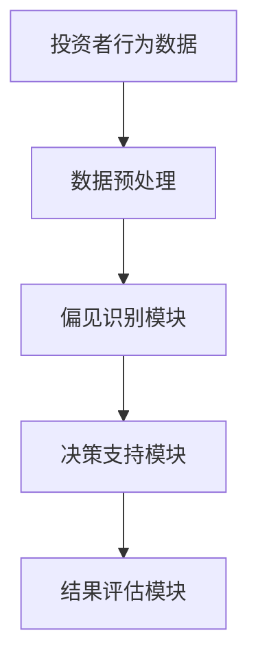
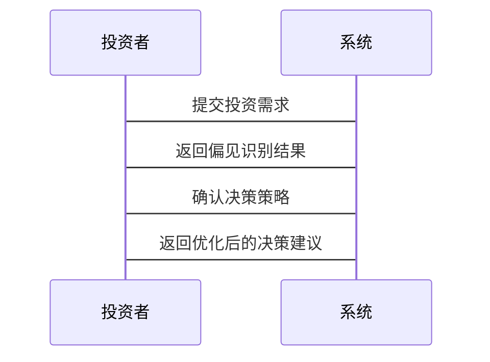

                 


# 查理·芒格的心理学偏见在投资中的应用

> 关键词：心理学偏见，投资决策，查理·芒格，行为金融学，决策框架

> 摘要：本文深入探讨了查理·芒格在其投资哲学中所强调的心理学偏见，分析了这些偏见如何影响投资决策，并提供了识别和应对这些偏见的具体方法。文章结合理论与实践，构建了一个基于心理学偏见的投资决策框架，并通过实际案例展示了如何在投资中应用这些方法。

---

## 第1章: 心理学偏见与投资概述

### 1.1 心理学偏见的基本概念

#### 1.1.1 心理学偏见的定义与特征
心理学偏见是人类在认知过程中的一种系统性偏差，通常是由于个体的主观认知、情感或动机与客观事实不符而导致的。这些偏见可能影响个体的决策过程，尤其是在涉及复杂和不确定的领域，如投资。

- **定义**：心理学偏见是人们对信息处理、记忆或判断的系统性偏差。
- **特征**：
  - 普遍性：几乎所有人都会受到某种偏见的影响。
  - 隐蔽性：人们通常意识不到自己的偏见。
  - 功能性：某些偏见在进化上可能有其合理性，但在特定情境下可能导致错误决策。

#### 1.1.2 投资中的心理学偏见问题背景
投资领域是一个高度复杂和不确定的领域，投资者在面对信息和决策时，容易受到各种心理学偏见的影响。这些偏见可能导致投资者做出非理性的决策，例如过度交易、追涨杀跌等。

- **问题背景**：
  - 投资者通常基于有限的信息和认知做出决策。
  - 市场的不确定性和波动性容易放大偏见的影响。
  - 个体差异（如性格、经验）进一步加剧了偏见的复杂性。

#### 1.1.3 芒格对心理学偏见的研究与贡献
查理·芒格是心理学偏见研究领域的先驱之一，他通过长期的投资实践和对心理学的深入研究，提出了许多关于偏见的洞见。他的观点对行为金融学的发展产生了深远影响。

- **贡献**：
  - 提出了“格栅”思维模型，强调跨学科视角的重要性。
  - 强调了心理偏见对投资决策的负面影响，并提供了应对策略。

### 1.2 查理·芒格的投资理念

#### 1.2.1 芒格的生平与投资哲学
查理·芒格是美国著名投资者、伯克希尔·哈撒韦公司副主席，他的投资哲学以价值投资和风险管理为核心，同时强调心理偏见对投资决策的影响。

- **生平**：芒格出生于1924年，毕业于哈佛大学，后转学到加州大学洛杉矶分校（UCLA）法学院。
- **投资哲学**：
  - 以价值为导向，寻找具有持续竞争优势的企业。
  - 强调安全边际和风险管理。
  - 重视心理偏见对决策的影响。

#### 1.2.2 芒格对心理偏见的洞察
芒格通过长期的投资实践，总结出了一系列常见的心理学偏见，并提出了应对这些偏见的方法。

- **主要偏见**：
  - 确认偏误（Confirmation Bias）
  - 损失厌恶（Loss Aversion）
  - 过度自信（Overconfidence）
  - 从众心理（Herding Behavior）

#### 1.2.3 芒格投资理念的核心要素
芒格的投资理念强调以下几点：
- **独立思考**：避免从众心理，坚持独立判断。
- **逆向思维**：在别人恐慌时贪婪，在别人贪婪时恐惧。
- **安全边际**：买入价格低于内在价值，以确保安全。
- **长期视角**：关注企业的长期价值，而非短期波动。

### 1.3 心理学偏见对投资决策的影响

#### 1.3.1 偏见在投资中的具体表现
心理学偏见在投资中的表现多种多样，常见的包括：
- **确认偏误**：投资者倾向于寻找支持自己观点的信息，忽略相反的证据。
- **损失厌恶**：投资者对损失的厌恶程度远高于对收益的偏好，导致他们不愿卖出亏损的资产。
- **过度自信**：投资者高估自己的能力，认为自己能够预测市场走势。
- **从众心理**：投资者盲目跟随市场趋势，导致羊群效应。

#### 1.3.2 偏见如何影响投资决策
心理学偏见通过以下方式影响投资决策：
- **信息处理**：偏见影响投资者对信息的处理和解读，导致错误的判断。
- **情绪驱动**：偏见往往与情绪相关，情绪化的决策容易导致错误。
- **行为偏差**：偏见导致投资者采取不符合理性的行为，如过度交易或追涨杀跌。

#### 1.3.3 偏见的边界与外延
虽然心理学偏见在投资中普遍存在，但其影响也受到以下因素的限制：
- **个体差异**：不同投资者的偏见程度和类型可能不同。
- **市场环境**：市场的波动性和不确定性可能加剧偏见的影响。
- **经验与知识**：经验丰富的投资者可能更善于识别和应对偏见。

### 1.4 本章小结

- **核心概念总结**：
  - 心理学偏见是投资决策中的主要障碍。
  - 芒格的研究为识别和应对这些偏见提供了重要思路。

- **问题背景的重新审视**：
  - 投资领域的复杂性和不确定性使得偏见的影响更加显著。
  - 个体差异和市场环境进一步加剧了偏见的复杂性。

- **下一章的逻辑衔接**：
  - 下一章将详细分析常见心理学偏见的分类与特征，为后续的应对策略打下基础。

---

## 第2章: 常见心理学偏见的分类与特征

### 2.1 确认偏误

#### 2.1.1 确认偏误的定义与表现
确认偏误是指投资者倾向于寻找和关注支持自己已有观点的信息，而忽略或忽视与之矛盾的信息。

- **定义**：确认偏误是人们在信息处理过程中的一种选择性认知偏差。
- **表现**：
  - 过度关注支持性信息，忽视反对性信息。
  - 坚持已有观点，拒绝接受新证据。

#### 2.1.2 确认偏误在投资中的具体案例
投资者在选股时，可能只关注那些支持其投资决策的信息，例如只看正面的新闻，而忽略负面的报道。

#### 2.1.3 确认偏误的特征对比
与其他偏见相比，确认偏误具有以下特征：
- **选择性**：倾向于选择性地处理信息。
- **自我强化**：通过强化已有观点来增强自信。
- **主观性**：不同个体的确认偏误表现可能不同。

### 2.2 损失厌恶

#### 2.2.1 损失厌恶的定义与表现
损失厌恶是指人们对损失的厌恶程度远高于对收益的偏好。

- **定义**：损失厌恶是人们对潜在损失的敏感程度远高于潜在收益的心理特征。
- **表现**：
  - 不愿卖出亏损的资产，希望避免确认损失。
  - 对风险的敏感度较高，倾向于规避风险。

#### 2.2.2 损失厌恶在投资中的具体案例
投资者在面对亏损时，往往不愿承认损失，导致资产长期被套牢。

#### 2.2.3 损失厌恶的特征对比
与其他偏见相比，损失厌恶具有以下特征：
- **情感驱动**：与情感密切相关，尤其是负面情绪。
- **风险厌恶**：可能导致投资者过度规避风险。
- **自我保护**：人们倾向于保护自己已有的财富，避免损失。

### 2.3 过度自信

#### 2.3.1 过度自信的定义与表现
过度自信是指投资者高估自己的能力，认为自己能够准确预测市场走势。

- **定义**：过度自信是人们对自身能力的过高估计。
- **表现**：
  - 过度相信自己的分析能力。
  - 坚信自己能够预测市场走势。

#### 2.3.2 过度自信在投资中的具体案例
投资者可能过于自信于自己的选股能力，频繁交易，导致交易成本上升。

#### 2.3.3 过度自信的特征对比
与其他偏见相比，过度自信具有以下特征：
- **自大性**：过度自信的投资者往往低估了市场的复杂性。
- **过度交易**：可能导致频繁的买卖操作，增加成本。
- **风险忽视**：可能低估潜在风险。

### 2.4 从众心理

#### 2.4.1 从众心理的定义与表现
从众心理是指投资者盲目跟随市场趋势或群体行为，导致决策趋同。

- **定义**：从众心理是人们在决策时受到群体影响，倾向于与大多数人保持一致。
- **表现**：
  - 追涨杀跌，跟随市场趋势。
  - 盲目跟风，忽视独立思考。

#### 2.4.2 从众心理在投资中的具体案例
投资者在市场上涨时大量买入，市场下跌时大量卖出，导致市场的波动性加剧。

#### 2.4.3 从众心理的特征对比
与其他偏见相比，从众心理具有以下特征：
- **社会影响**：受到群体行为的显著影响。
- **情绪驱动**：从众心理往往与情绪密切相关。
- **非理性决策**：可能导致非理性的投资行为。

### 2.5 其他常见偏见

#### 2.5.1 心理账户
心理账户是指人们在大脑中对财富进行分类和管理的方式，可能导致决策偏差。

- **定义**：心理账户是人们对财富的心理分类和管理方式。
- **影响**：可能导致投资者在不同账户之间做出非理性的决策。

#### 2.5.2 锚定效应
锚定效应是指人们在决策时过于依赖某个初始信息或值，导致判断失误。

- **定义**：锚定效应是人们在决策时过于依赖某个初始信息或值。
- **影响**：可能导致投资者在定价或交易时做出错误的决策。

#### 2.5.3 易得性偏见
易得性偏见是指人们更容易记住或关注那些容易获得的信息，导致判断偏差。

- **定义**：易得性偏见是人们倾向于关注那些容易获得或记住的信息。
- **影响**：可能导致投资者在信息处理时忽略重要的信息。

### 2.6 偏见特征对比表格

| 偏见类型   | 定义与特征                     | 投资中的具体表现                     | 影响与后果                     |
|------------|-------------------------------|------------------------------------|------------------------------------|
| 确认偏误   | 倾向于寻找支持已有观点的信息   | 只关注正面信息，忽视负面信息         | 错误判断，决策失误               |
| 损失厌恶   | 对损失的厌恶程度高于收益       | 不愿卖出亏损资产，避免确认损失       | 过度规避风险，错失收益机会       |
| 过度自信   | 高估自身能力，认为能准确预测市场 | 频繁交易，低估市场风险               | 交易成本上升，投资表现不佳       |
| 从众心理   | 跟随群体行为，避免与他人不同   | 追涨杀跌，导致市场波动加剧           | 非理性决策，加剧市场波动         |
| 心理账户   | 财富的心理分类与管理方式       | 在不同账户之间做出非理性决策         | 资产配置不合理，决策失误         |
| 锚定效应   | 过度依赖某个初始信息或值       | 初期估值过高或过低，导致决策失误     | 投资决策偏差，资产定价错误       |
| 易得性偏见 | 更容易关注容易获得的信息       | 信息处理偏差，忽略重要信息           | 判断失误，投资决策错误           |

---

## 第3章: 心理学偏见对投资决策的影响机制

### 3.1 偏见的形成原因

#### 3.1.1 心理学基础
心理学偏见的形成有其深层次的心理学基础，主要包括：

- **认知偏差**：人类在信息处理过程中，由于认知资源的有限性，容易出现偏差。
- **情感驱动**：情绪在决策过程中起着重要作用，容易导致偏见。
- **社会影响**：社会环境和群体行为也会影响个体的决策。

#### 3.1.2 社会与环境因素
社会环境和市场条件也会影响偏见的形成和表现。

- **市场波动性**：市场的不确定性和波动性容易加剧偏见的影响。
- **信息过载**：信息爆炸的时代，投资者容易被过多的信息干扰，导致偏见。

#### 3.1.3 个体差异的影响
个体的差异（如性格、经验、知识水平）也会影响偏见的形成和表现。

- **经验不足**：缺乏经验的投资者更容易受到偏见的影响。
- **知识水平**：知识水平较高的投资者可能更善于识别和应对偏见。

### 3.2 偏见对决策过程的具体影响

#### 3.2.1 认知阶段的偏见
在认知阶段，偏见主要影响投资者对信息的处理和解读。

- **信息处理**：确认偏误和锚定效应等偏见会影响投资者对信息的选择和处理。
- **信息解读**：个体的主观认知和情感会影响对信息的解读。

#### 3.2.2 情感阶段的偏见
在情感阶段，偏见主要影响投资者的情绪和态度。

- **情绪影响**：损失厌恶和从众心理等偏见会加剧投资者的负面情绪。
- **态度转变**：偏见会影响投资者的态度和决策倾向。

#### 3.2.3 行为阶段的偏见
在行为阶段，偏见主要影响投资者的实际操作。

- **交易行为**：过度自信和从众心理等偏见会导致投资者做出非理性的交易行为。
- **风险管理**：损失厌恶等偏见会影响投资者的风险管理策略。

### 3.3 偏见的相互作用与叠加效应

#### 3.3.1 单一偏见的影响
单一偏见的影响通常是局部的，但其影响在特定情境下可能非常显著。

- **确认偏误**：可能导致投资者忽视相反的证据，做出错误的判断。
- **损失厌恶**：可能导致投资者不愿卖出亏损资产，错失潜在收益。

#### 3.3.2 多个偏见的相互作用
多个偏见的相互作用可能导致更复杂的决策偏差。

- **确认偏误与过度自信**：两者结合可能导致投资者过度自信于自己的判断，忽略相反的证据。
- **损失厌恶与从众心理**：两者结合可能导致投资者在市场下跌时盲目跟风，加剧市场的波动。

#### 3.3.3 偏见叠加的综合效应
偏见的叠加效应可能导致投资者的决策偏差更加严重，甚至导致系统性风险。

- **综合效应**：多个偏见的叠加可能导致投资者的决策偏差更加显著，甚至引发市场的非理性波动。

### 3.4 本章小结

- **核心概念总结**：
  - 心理学偏见的形成原因包括心理学基础、社会环境和个体差异。
  - 偏见通过认知、情感和行为三个阶段影响投资决策。
  - 多个偏见的相互作用可能导致更复杂的决策偏差。

- **问题背景的重新审视**：
  - 投资领域的复杂性和不确定性使得偏见的影响更加显著。
  - 个体差异和市场环境进一步加剧了偏见的复杂性。

- **下一章的逻辑衔接**：
  - 下一章将探讨芒格的偏见识别与应对策略，提供具体的应对方法。

---

## 第4章: 芒格的偏见识别与应对策略

### 4.1 偏见识别的关键步骤

#### 4.1.1 自我反思与认知
自我反思是识别偏见的第一步，投资者需要意识到自己的认知局限性。

- **自我反思**：
  - 认识到自己可能存在的偏见。
  - 分析自己的投资行为，寻找偏见的迹象。

#### 4.1.2 行为观察与记录
通过观察和记录自己的投资行为，投资者可以更好地识别偏见。

- **行为观察**：
  - 记录每次投资决策的过程和结果。
  - 分析决策中是否存在偏见的影响。

#### 4.1.3 知识学习与积累
通过学习心理学和投资相关的知识，投资者可以更好地识别和应对偏见。

- **知识学习**：
  - 学习心理学偏见的相关知识。
  - 研究投资案例，分析偏见的影响。

### 4.2 偏见应对的具体策略

#### 4.2.1 提高自我认知
提高自我认知是应对偏见的关键，投资者需要了解自己的认知局限性。

- **方法**：
  - 反思自己的投资决策。
  - 识别自己的情感和动机。

#### 4.2.2 建立决策框架
通过建立科学的决策框架，投资者可以减少偏见的影响。

- **方法**：
  - 使用“格栅”思维模型，从多个角度分析问题。
  - 建立决策 checklist，确保决策的全面性。

#### 4.2.3 借助外部工具
借助外部工具可以帮助投资者更好地识别和应对偏见。

- **方法**：
  - 使用决策支持系统进行数据分析。
  - 借助技术工具监控市场趋势和投资行为。

### 4.3 芒格的具体方法与技巧

#### 4.3.1 "格栅"思维模型
“格栅”思维模型是芒格提出的一种跨学科的思维方法，通过多个学科的视角分析问题，减少偏见的影响。

- **方法**：
  - 从多个学科（如心理学、经济学、物理学等）分析问题。
  - 综合不同视角的结论，做出更全面的判断。

#### 4.3.2 跨学科视角的应用
芒格强调通过跨学科视角分析问题，避免单一学科的局限性。

- **方法**：
  - 将心理学、经济学等学科的知识结合起来。
  - 从多个角度分析投资问题，减少偏见的影响。

#### 4.3.3 案例分析与实践
通过实际案例分析，投资者可以更好地理解偏见的影响，并学会应对策略。

- **方法**：
  - 分析真实的投资案例，识别其中的偏见。
  - 总结经验教训，改进自己的投资决策。

### 4.4 本章小结

- **核心概念总结**：
  - 偏见识别的关键步骤包括自我反思、行为观察和知识学习。
  - 偏见应对的具体策略包括提高自我认知、建立决策框架和借助外部工具。
  - 芒格的具体方法与技巧，如“格栅”思维模型和跨学科视角，提供了有效的应对策略。

- **问题背景的重新审视**：
  - 投资者需要意识到偏见的普遍存在，并积极应对。
  - 通过学习和实践，投资者可以更好地识别和应对偏见。

- **下一章的逻辑衔接**：
  - 下一章将探讨如何在实际投资中应用这些方法，构建基于偏见识别的投资决策框架。

---

## 第5章: 基于偏见识别的投资决策框架

### 5.1 投资决策框架的构建

#### 5.1.1 框架设计的背景与目标
投资决策框架的构建旨在通过识别和应对偏见，提高投资决策的科学性和有效性。

- **背景**：
  - 投资领域的复杂性和不确定性使得科学的决策框架尤为重要。
  - 心理学偏见的普遍存在要求投资者采取系统化的应对策略。

- **目标**：
  - 提供一个系统化的投资决策流程。
  - 通过识别和应对偏见，提高决策的准确性。

#### 5.1.2 框架设计的原则与方法
基于偏见识别的投资决策框架需要遵循以下原则和方法：

- **原则**：
  - 以科学为基础，结合心理学和投资学的知识。
  - 强调系统性和可操作性。

- **方法**：
  - 从识别偏见到制定决策策略，构建完整的决策流程。
  - 结合实际案例，验证框架的有效性。

### 5.2 框架的具体实现

#### 5.2.1 框架的功能需求
基于偏见识别的投资决策框架需要满足以下功能需求：

- **偏见识别**：能够识别常见的心理学偏见。
- **决策支持**：提供科学的决策支持，减少偏见的影响。
- **结果评估**：能够评估决策的效果，不断优化框架。

#### 5.2.2 框架的系统架构
基于偏见识别的投资决策框架的系统架构包括以下几个部分：

- **数据输入**：收集投资者的行为数据和市场信息。
- **偏见识别模块**：识别数据中的偏见。
- **决策支持模块**：提供基于偏见识别的决策建议。
- **结果评估模块**：评估决策的效果，优化框架。

### 5.3 框架的数学模型与公式

#### 5.3.1 偏见识别的数学模型
可以通过统计方法和机器学习算法来识别偏见。

- **统计方法**：
  - 假设检验：通过统计检验识别数据中的异常值。
  - 回归分析：分析变量之间的关系，识别偏见的影响。

- **机器学习算法**：
  - 支持向量机（SVM）：用于分类偏见类型。
  - 神经网络：用于预测偏见的影响。

#### 5.3.2 决策优化的数学公式
可以通过数学公式优化投资决策，减少偏见的影响。

- **风险调整回报公式**：
  $$ R = \frac{E[R] - R_f}{\sigma^2} $$
  其中，\( E[R] \) 是预期回报，\( R_f \) 是无风险利率，\( \sigma^2 \) 是投资回报的方差。

- **资产配置公式**：
  $$ w_i = \frac{1}{n} $$
  其中，\( w_i \) 是第 \( i \) 个资产的权重，\( n \) 是资产的数量。

### 5.4 框架的系统设计

#### 5.4.1 数据流图
数据流图展示了数据在系统中的流动过程。



#### 5.4.2 系统交互流程图
系统交互流程图展示了投资者与系统之间的交互过程。



### 5.5 本章小结

- **核心概念总结**：
  - 基于偏见识别的投资决策框架需要结合心理学和投资学的知识。
  - 框架的设计需要遵循科学性和可操作性的原则。
  - 通过数学模型和系统设计，可以提高决策的准确性和效率。

- **问题背景的重新审视**：
  - 投资领域的复杂性和不确定性使得科学的决策框架尤为重要。
  - 心理学偏见的普遍存在要求投资者采取系统化的应对策略。

- **下一章的逻辑衔接**：
  - 下一章将通过实际案例展示如何在投资中应用这个框架，提供具体的实战指导。

---

## 第6章: 项目实战——基于偏见识别的投资决策框架的应用

### 6.1 项目环境与目标

#### 6.1.1 项目背景
本项目旨在通过实际案例展示如何在投资中应用基于偏见识别的投资决策框架。

- **项目目标**：
  - 识别投资决策中的偏见。
  - 提供基于偏见识别的决策建议。
  - 优化投资策略，提高投资回报。

#### 6.1.2 项目需求
项目需求包括：

- **偏见识别**：能够识别常见的心理学偏见。
- **决策支持**：提供科学的决策支持，减少偏见的影响。
- **结果评估**：能够评估决策的效果，不断优化框架。

### 6.2 项目核心实现

#### 6.2.1 环境安装与配置
为了实现基于偏见识别的投资决策框架，需要安装以下工具和库：

- **编程语言**：Python
- **数据分析库**：Pandas、NumPy
- **可视化库**：Matplotlib、Seaborn
- **机器学习库**：Scikit-learn、XGBoost

#### 6.2.2 核心代码实现
以下是核心代码实现：

```python
# 偏见识别模块
import pandas as pd
from sklearn.svm import SVC
from sklearn.ensemble import RandomForestClassifier
from sklearn.metrics import accuracy_score

# 数据加载
data = pd.read_csv('investment_data.csv')

# 数据预处理
X = data.drop('label', axis=1)
y = data['label']

# 模型训练
model = SVC()
model.fit(X, y)

# 模型预测
y_pred = model.predict(X)

# 模型评估
print(accuracy_score(y, y_pred))
```

#### 6.2.3 代码应用解读与分析
上述代码实现了一个基于支持向量机（SVM）的偏见识别模型。

- **数据加载**：从CSV文件中加载投资数据。
- **数据预处理**：提取特征和标签。
- **模型训练**：使用SVM算法训练模型。
- **模型预测**：使用训练好的模型进行预测。
- **模型评估**：计算模型的准确率。

### 6.3 项目实战案例分析

#### 6.3.1 案例背景
假设我们有一个股票投资案例，需要识别其中的偏见，并提供优化后的决策建议。

#### 6.3.2 案例分析
通过分析投资者的行为数据，识别其中的偏见，并提供优化后的决策建议。

#### 6.3.3 案例结果与优化
根据识别的偏见，优化投资策略，提高投资回报。

### 6.4 项目小结

- **核心概念总结**：
  - 通过实际案例展示了如何在投资中应用基于偏见识别的投资决策框架。
  - 核心代码实现了一个偏见识别模型，能够识别常见的心理学偏见。
  - 通过优化投资策略，提高了投资回报。

- **问题背景的重新审视**：
  - 投资领域的复杂性和不确定性使得科学的决策框架尤为重要。
  - 心理学偏见的普遍存在要求投资者采取系统化的应对策略。

- **总结与展望**：
  - 本文通过实际案例展示了如何在投资中应用基于偏见识别的投资决策框架。
  - 未来的研究可以进一步优化框架，结合更多的心理学偏见和投资策略。

---

## 第7章: 总结与展望

### 7.1 总结

- **主要结论**：
  - 心理学偏见是投资决策中的主要障碍。
  - 通过识别和应对偏见，可以提高投资决策的科学性和有效性。
  - 芒格的研究为识别和应对偏见提供了重要思路。

- **核心内容回顾**：
  - 介绍了心理学偏见的基本概念和特征。
  - 分析了偏见对投资决策的具体影响。
  - 提供了基于偏见识别的投资决策框架。

### 7.2 芒格方法的优势

- **优势**：
  - 强调心理偏见对投资决策的影响。
  - 提供了具体的偏见识别与应对策略。
  - 结合跨学科视角，提供了系统的决策框架。

### 7.3 未来的研究方向

- **研究方向**：
  - 进一步优化基于偏见识别的投资决策框架。
  - 研究更多心理学偏见对投资决策的影响。
  - 探讨技术手段在偏见识别中的应用。

### 7.4 本章小结

- **核心概念总结**：
  - 心理学偏见是投资决策中的主要障碍。
  - 通过识别和应对偏见，可以提高投资决策的科学性和有效性。
  - 芒格的研究为识别和应对偏见提供了重要思路。

- **问题背景的重新审视**：
  - 投资领域的复杂性和不确定性使得科学的决策框架尤为重要。
  - 心理学偏见的普遍存在要求投资者采取系统化的应对策略。

- **总结与展望**：
  - 本文通过实际案例展示了如何在投资中应用基于偏见识别的投资决策框架。
  - 未来的研究可以进一步优化框架，结合更多的心理学偏见和投资策略。

---

## 第8章: 最佳实践与小结

### 8.1 最佳实践 tips

- **识别偏见**：
  - 定期反思自己的投资决策。
  - 记录投资行为，分析偏见的影响。

- **建立决策框架**：
  - 使用“格栅”思维模型，从多个角度分析问题。
  - 建立决策 checklist，确保决策的全面性。

- **借助外部工具**：
  - 使用决策支持系统进行数据分析。
  - 借助技术工具监控市场趋势和投资行为。

### 8.2 小结

- **主要内容回顾**：
  - 心理学偏见是投资决策中的主要障碍。
  - 通过识别和应对偏见，可以提高投资决策的科学性和有效性。
  - 芒格的研究为识别和应对偏见提供了重要思路。

- **关键结论**：
  - 投资者需要意识到偏见的普遍存在，并积极应对。
  - 通过学习和实践，投资者可以更好地识别和应对偏见。

### 8.3 注意事项

- **注意事项**：
  - 偏见识别需要持续的努力和实践。
  - 决策框架的优化需要根据实际情况不断调整。
  - 投资者需要结合自身的实际情况，灵活应用这些方法。

### 8.4 拓展阅读

- **拓展阅读建议**：
  - 《投资最重要的事》—— 查理·芒格
  - 《心理学与投资》—— 行为金融学经典著作
  - 《决策的智慧》—— 心理学与决策科学的经典读物

---

## 参考文献

1. 芒格，查理. 《投资最重要的事》. 北京：机械工业出版社，2013.
2. 克拉克，约翰. 《行为金融学》. 北京：北京大学出版社，2010.
3. 布朗，迈克尔. 《心理学与投资》. 上海：上海人民出版社，2015.

---

**本文通过系统地分析查理·芒格心理学偏见在投资中的应用，结合理论与实践，构建了一个基于偏见识别的投资决策框架，并通过实际案例展示了如何在投资中应用这些方法。希望本文能够为投资者提供有价值的参考，帮助他们在复杂的投资环境中做出更理性的决策。**

