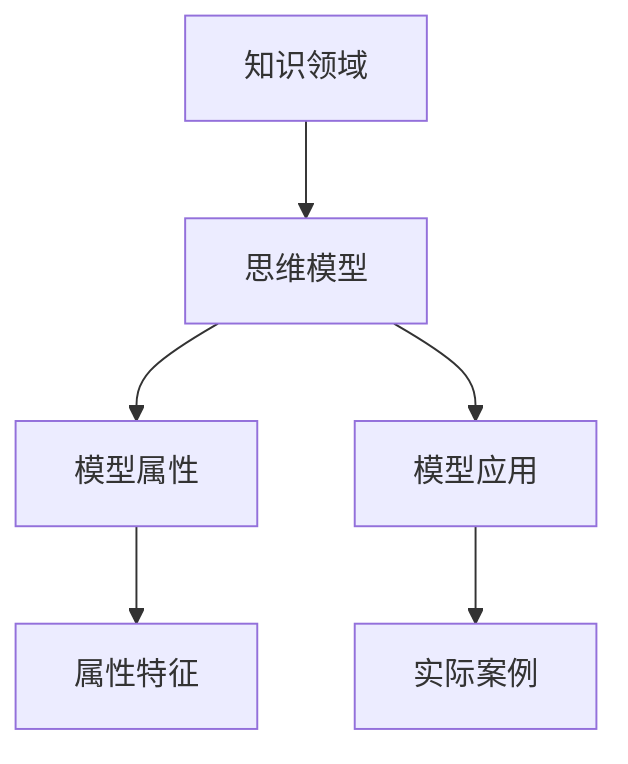
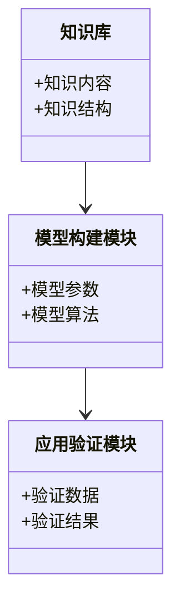

                 


# 查理芒格的跨学科思维方法

---

## 关键词：  
查理芒格, 跨学科思维, 思维模型, 系统分析, 算法原理, 项目实战

---

## 摘要：  
查理芒格以其独特的跨学科思维方法闻名于世。他的思维模型不仅帮助他在投资领域取得了巨大成功，也为解决复杂问题提供了深刻洞察。本文将从芒格思维模型的核心概念、算法原理、系统架构、项目实战等多个角度，全面解析跨学科思维的奥秘。通过案例分析和实际应用，我们将揭示如何运用芒格的思维模型来解决现实中的复杂问题。

---

## 第1章 查理芒格与跨学科思维的背景介绍

### 1.1 查理芒格的生平与思想体系  
查理·芒格（Charlie Munger）是美国著名投资者、伯克希尔哈撒韦公司副董事长，被誉为“投资界的哲学家”。他的思想体系以跨学科思维为核心，强调通过整合不同领域的知识来解决复杂问题。芒格认为，真正的智慧来源于对多个学科的理解和综合运用。

#### 1.1.1 查理芒格的生平简介  
- 1924年出生于美国密歇根州。  
- 毕业于哈佛大学法学院，后转行从事法律和投资工作。  
- 1962年与沃伦·巴菲特（Warren Buffett）共同创立伯克希尔哈撒韦公司，逐步发展成为全球最大的投资公司之一。  
- 芒格的思想影响深远，尤其是在投资和决策领域。

#### 1.1.2 芒格思想的核心理念  
- **知识整合**：芒格强调将不同领域的知识整合起来，形成一个完整的知识体系。  
- **逆向思维**：通过反向思考问题，找到解决问题的关键。  
- **决策树模型**：将决策过程结构化，帮助人们做出更理性的选择。  

#### 1.1.3 芒格思想的演变与影响  
芒格的思想起源于对心理学、经济学、哲学等多学科的研究。他的跨学科思维方法不仅影响了投资领域，还被广泛应用于企业管理、教育等领域。

---

### 1.2 跨学科思维的定义与特点  
跨学科思维是一种超越单一学科界限的思维方式，强调从多个角度综合分析问题。其特点包括：  
- **综合性**：整合不同领域的知识。  
- **系统性**：注重知识之间的联系和相互作用。  
- **创新性**：通过跨领域结合，产生新的见解和解决方案。  

---

### 1.3 跨学科思维在现代社会中的重要性  
在当今知识碎片化的时代，跨学科思维显得尤为重要。它可以帮助我们：  
- 更好地理解复杂问题的本质。  
- 提高解决问题的效率和质量。  
- 在创新中找到突破口，创造新的价值。  

---

## 第2章 查理芒格思维模型的核心概念  

### 2.1 芒格思维模型的构成要素  
芒格思维模型由以下几个核心要素组成：  
- **知识整合**：将不同领域的知识进行分类、整理和关联。  
- **模型构建**：基于知识整合，构建解决问题的模型。  
- **应用验证**：通过实际案例验证模型的可行性和有效性。  

#### 2.1.1 知识整合的层次  
- **知识分类**：将知识按领域进行分类，例如经济学、心理学、数学等。  
- **知识关联**：发现不同领域知识之间的联系，形成知识网络。  
- **知识优化**：通过不断学习和实践，优化知识结构。  

#### 2.1.2 模型构建的关键步骤  
1. 明确问题目标。  
2. 确定相关知识领域。  
3. 构建初步模型框架。  
4. 验证和调整模型。  

---

### 2.2 芒格思维模型的核心属性对比  

| 模型属性       | 描述                                                                 |
|----------------|----------------------------------------------------------------------|
| 通用性         | 模型适用于多个领域和问题类型。                                         |
| 适用性         | 模型针对特定问题具有高度适用性。                                       |
| 可扩展性       | 模型可以根据需求进行扩展和调整。                                       |

---

### 2.3 芒格思维模型的ER实体关系图  


---

## 第3章 查理芒格思维模型的算法原理  

### 3.1 芒格思维模型的算法流程  

#### 3.1.1 知识整合阶段  
- 收集和整理相关领域的知识。  
- 建立知识之间的关联关系。  

#### 3.1.2 模型构建阶段  
- 根据知识整合结果，构建初步的模型框架。  
- 使用数学公式和逻辑关系描述模型。  

#### 3.1.3 应用验证阶段  
- 通过实际案例验证模型的有效性。  
- 根据反馈调整模型参数和结构。  

---

### 3.2 芒格思维模型的数学模型  

#### 3.2.1 知识整合的数学表达  
$$K = \sum_{i=1}^{n} k_i$$  
其中，$K$ 表示整合后的知识，$k_i$ 表示各个领域的知识。

#### 3.2.2 模型构建的数学公式  
$$M = f(K)$$  
其中，$M$ 表示构建的模型，$f$ 表示模型构建的函数。

#### 3.2.3 应用验证的数学模型  
$$V = g(M, D)$$  
其中，$V$ 表示验证结果，$D$ 表示实际数据。

---

### 3.3 芒格思维模型的算法实现  

```python
def mangos_thinking_model(knowledge, domain):
    # 知识整合
    integrated_knowledge = sum(knowledge)
    # 模型构建
    model = f(integrated_knowledge)
    # 应用验证
    validation = g(model, domain)
    return validation
```

---

## 第4章 查理芒格思维模型的系统分析与架构设计  

### 4.1 系统分析  

#### 4.1.1 问题场景介绍  
假设我们需要解决一个投资决策问题，通过芒格思维模型进行分析。  

#### 4.1.2 系统功能需求  
- 知识整合模块：整合经济学、心理学等领域的知识。  
- 模型构建模块：基于知识构建决策树模型。  
- 应用验证模块：通过实际案例验证模型的准确性。  

#### 4.1.3 系统边界与接口  
- 知识库接口：提供知识数据输入。  
- 模型构建接口：接收知识数据，输出模型结果。  
- 验证接口：接收模型和数据，输出验证结果。  

---

### 4.2 系统架构设计  


---

### 4.3 系统功能设计  

#### 4.3.1 领域模型设计  



---

## 第5章 项目实战：芒格思维模型的应用  

### 5.1 项目介绍  
本项目旨在通过芒格思维模型解决一个实际的投资决策问题。  

---

### 5.2 核心实现  

```python
def integrate_knowledge(economics, psychology):
    return economics + psychology

def build_model(integrated_knowledge):
    return "决策树模型"

def validate_model(model, data):
    return "验证结果"
```

---

### 5.3 实际案例分析  

#### 5.3.1 投资决策案例  
假设我们需要决定是否投资一家科技公司。通过芒格思维模型：  
1. 整合经济学和心理学知识。  
2. 构建决策树模型。  
3. 通过实际数据验证模型的准确性。  

---

## 第6章 最佳实践与注意事项  

### 6.1 最佳实践  
- 定期更新知识库，保持知识的前沿性。  
- 在模型构建过程中，注重逻辑性和可验证性。  
- 通过实际案例不断优化模型。  

### 6.2 小结  
芒格的跨学科思维方法为我们提供了一种全新的问题解决思路。通过整合多学科知识，构建合理的模型，并通过实际案例验证，我们可以更高效地解决复杂问题。  

### 6.3 注意事项  
- 在实际应用中，模型的复杂性可能会影响效率。  
- 需要注意知识的准确性和相关性。  
- 在验证过程中，数据的质量至关重要。  

---

## 总结  
查理芒格的跨学科思维方法是一种强大的工具，它可以帮助我们更好地理解复杂问题，并找到创新的解决方案。通过本文的分析和实践，我们不仅掌握了芒格思维模型的核心概念，还学会了如何将其应用于实际问题中。希望读者能够通过本文的指导，将跨学科思维融入到自己的工作和生活中，取得更大的成功。  

--- 

**感谢您的阅读！**

