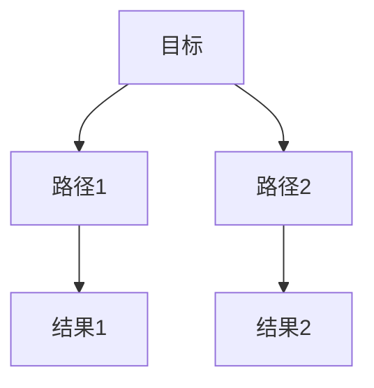
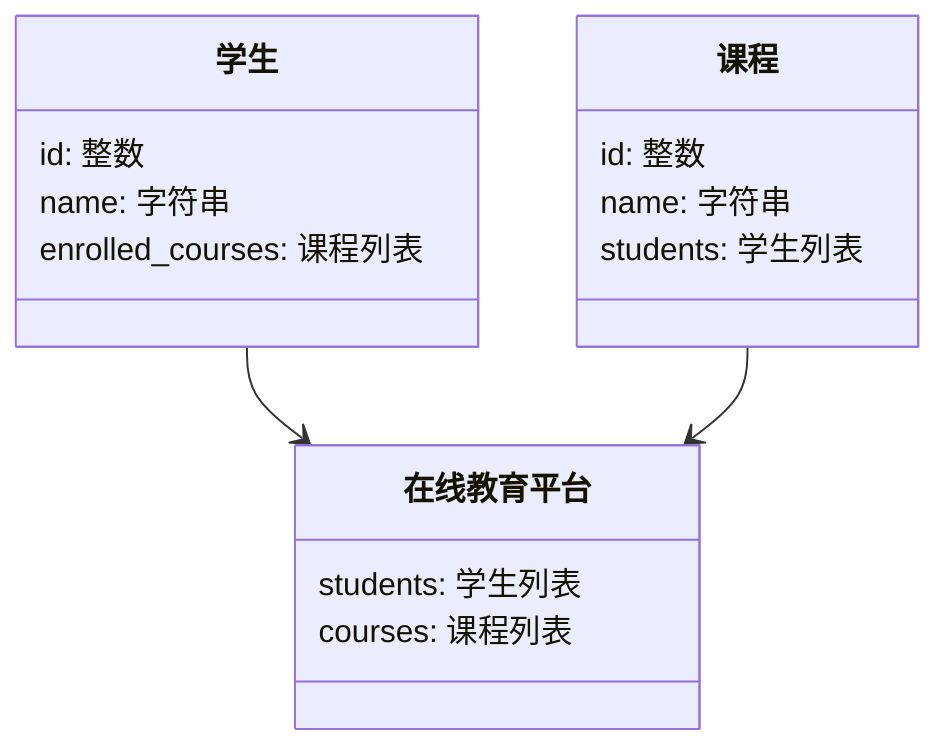
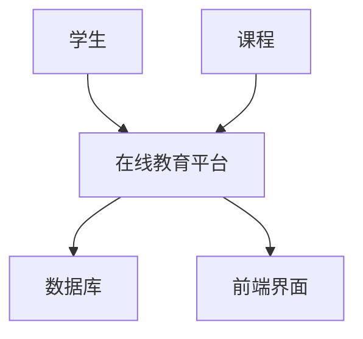
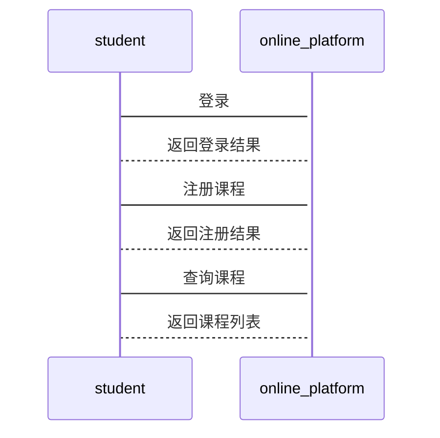
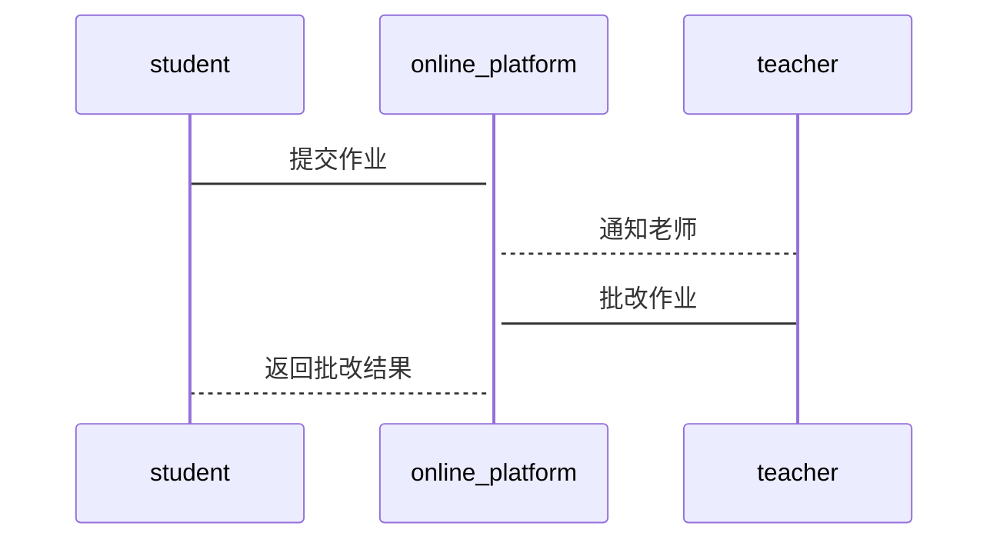

                 


# 查理芒格的逆向思维应用

> 关键词：逆向思维，芒格，思维模型，决策框架，系统设计，算法实现

> 摘要：本文深入探讨了查理芒格的逆向思维理论及其在技术领域的应用。通过结合芒格的多元思维模型和系统设计方法，本文详细介绍了逆向思维在问题建模、算法实现、系统架构设计以及项目实战中的具体应用。文章还通过代码示例和数学模型，展示了逆向思维在技术实践中的实际价值和应用技巧。

---

## 第1章 逆向思维的定义与背景

### 1.1 逆向思维的定义

#### 1.1.1 逆向思维的基本概念

逆向思维是一种与传统正向思维相反的思维方式，它通过从结果出发，反向推导原因，从而找到解决问题的方法。其核心在于“逆向思考”，即从目标出发，反向设计路径。

#### 1.1.2 逆向思维与正向思维的区别

| 特性 | 正向思维 | 逆向思维 |
|------|----------|----------|
| 思维方向 | 从原因到结果 | 从结果到原因 |
| 适用场景 | 解决已知原因的问题 | 解决未知原因的问题 |
| 创新性 | 常规性较强 | 更具创新性 |

#### 1.1.3 逆向思维的核心要素

1. **目标导向性**：以明确的目标为出发点。
2. **反向推理**：从结果反推可能的原因或路径。
3. **系统性**：考虑整体系统的相互作用。

### 1.2 查理芒格的思维方式

#### 1.2.1 查理芒格的生平简介

查理·芒格（Charlie Munger）是美国著名投资者和伯克希尔哈撒韦公司副董事长，以其独特的投资理念和思维方式闻名。他提倡多元思维模型，强调通过多个学科的交叉应用来解决问题。

#### 1.2.2 芒格的多元思维模型

多元思维模型是指通过多个学科的思维方式来分析问题，避免单一思维的局限性。芒格认为，只有通过跨学科的视角，才能更好地理解问题的本质。

#### 1.2.3 逆向思维与芒格投资理念的关系

芒格的投资理念强调逆向思维，例如寻找市场低估的股票，避免 crowd-think（从众思维）。逆向思维帮助投资者在市场非理性时做出理性决策。

---

## 第2章 逆向思维的理论基础

### 2.1 逆向思维的哲学基础

#### 2.1.1 逆向思维与辩证法

辩证法强调矛盾的对立统一，逆向思维通过从对立面思考问题，可以帮助我们更好地理解矛盾的本质。

#### 2.1.2 逆向思维与矛盾分析

矛盾分析是马克思主义哲学的重要方法，逆向思维通过从结果出发，帮助我们发现矛盾的关键点。

#### 2.1.3 逆向思维与系统思维

系统思维强调整体性，逆向思维通过从结果出发，帮助我们更好地理解系统各部分之间的相互作用。

### 2.2 逆向思维的心理学基础

#### 2.2.1 人类思维的惯性

人类习惯于正向思维，逆向思维需要刻意练习才能掌握。

#### 2.2.2 逆向思维的心理机制

逆向思维通过打破思维惯性，激发创新思维，帮助我们发现新的解决方案。

#### 2.2.3 逆向思维与批判性思维

批判性思维是逆向思维的重要组成部分，通过质疑和反思，我们可以更好地理解问题的本质。

---

## 第3章 逆向思维的核心模型与框架

### 3.1 芒格的多元思维模型

#### 3.1.1 多元思维模型的定义

多元思维模型是指通过多个学科的思维方式来分析问题，避免单一思维的局限性。

#### 3.1.2 多元思维模型的核心要素

| 要素 | 描述 |
|------|------|
| 学科视角 | 从不同学科的视角分析问题 |
| 系统性 | 考虑问题的整体性和系统性 |
| 创新性 | 通过交叉应用不同学科的思想，产生新的见解 |

#### 3.1.3 多元思维模型的实现步骤

1. **确定问题**：明确需要解决的问题。
2. **选择学科视角**：从多个学科中选择合适的视角。
3. **交叉应用**：将不同学科的思想交叉应用，寻找解决方案。
4. **验证和优化**：通过验证和优化，找到最佳解决方案。

### 3.2 逆向思维的决策框架

#### 3.2.1 决策框架的基本结构

逆向思维的决策框架包括以下步骤：

1. **明确目标**：确定需要实现的目标。
2. **反向推理**：从目标出发，反向推导可能的路径。
3. **验证路径**：评估每条路径的可行性。
4. **选择最优路径**：根据评估结果，选择最优路径。

#### 3.2.2 决策框架的关键要素

| 要素 | 描述 |
|------|------|
| 目标 | 明确的目标是逆向思维的前提 |
| 路径 | 反向推理得到的可能路径 |
| 可行性 | 每条路径的可行性评估 |
| 优化 | 根据评估结果，优化选择路径 |

#### 3.2.3 决策框架的优化方法

1. **路径多样性**：尽可能多的路径，以增加选择的余地。
2. **路径评估**：通过多种方法评估路径的可行性。
3. **动态调整**：根据实际情况，动态调整路径。

---

## 第4章 逆向思维的算法与数学模型

### 4.1 逆向思维的数学模型

#### 4.1.1 逆向思维的数学表达式

逆向思维可以通过数学模型表示为：

$$
f(x) = y \implies x = f^{-1}(y)
$$

其中，\( f(x) \) 是正向函数，\( f^{-1}(y) \) 是反向函数。

#### 4.1.2 逆向思维的概率模型

概率模型通过计算每条路径的概率，帮助我们选择最优路径。例如：

$$
P(x) = \frac{\text{路径 } x \text{ 的可能性}}{\sum_{i} \text{路径 } i \text{ 的可能性}}
$$

#### 4.1.3 逆向思维的决策树模型

决策树模型通过反向推理，帮助我们选择最优路径。以下是决策树的 mermaid 流程图：



### 4.2 逆向思维的算法实现

#### 4.2.1 逆向思维的算法流程

1. **输入目标**：明确需要实现的目标。
2. **反向推理**：从目标出发，反向推导可能的路径。
3. **路径评估**：评估每条路径的可行性。
4. **选择最优路径**：根据评估结果，选择最优路径。

#### 4.2.2 逆向思维的算法代码实现

以下是一个简单的逆向思维算法的 Python 实现：

```python
def inverse_thinking(target):
    # 反向推理路径
    paths = []
    for path in possible_paths:
        if is_possible(path, target):
            paths.append(path)
    # 选择最优路径
    optimal_path = max(paths, key=lambda x: x['score'])
    return optimal_path

# 示例使用
target = '解决问题'
result = inverse_thinking(target)
print(result)
```

#### 4.2.3 逆向思维的算法优化

1. **路径生成**：尽可能多的生成路径，以增加选择的余地。
2. **路径评估**：通过多种方法评估路径的可行性，例如概率模型、决策树模型等。
3. **动态调整**：根据实际情况，动态调整路径。

---

## 第5章 逆向思维的系统分析与架构设计

### 5.1 系统分析与问题建模

#### 5.1.1 问题场景介绍

假设我们需要设计一个在线教育平台，目标是提高学生的学习效率。

#### 5.1.2 领域模型的 mermaid 类图

以下是领域模型的 mermaid 类图：



#### 5.1.3 系统架构的 mermaid 架构图

以下是系统架构的 mermaid 架构图：



### 5.2 系统接口与交互设计

#### 5.2.1 系统接口设计

以下是系统接口的 mermaid 序列图：



#### 5.2.2 系统交互的 mermaid 序列图

以下是系统交互的 mermaid 序列图：



---

## 第6章 逆向思维的项目实战

### 6.1 项目环境与工具安装

#### 6.1.1 开发环境的搭建

建议使用 Python 和相关开发工具，例如 PyCharm 或 VS Code。

#### 6.1.2 必要工具的安装

安装 Python 和 pip，然后安装必要的库：

```bash
pip install numpy matplotlib
```

### 6.2 核心算法实现与代码解读

#### 6.2.1 核心算法的实现代码

以下是一个逆向思维算法的 Python 实现：

```python
def inverse_thinking(target):
    possible_paths = generate_paths(target)
    valid_paths = [path for path in possible_paths if is_valid(path)]
    optimal_path = select_optimal(valid_paths)
    return optimal_path

# 示例使用
target = '解决问题'
result = inverse_thinking(target)
print(result)
```

#### 6.2.2 代码的功能解读

1. **生成路径**：`generate_paths(target)` 生成所有可能的路径。
2. **路径验证**：`is_valid(path)` 验证路径的可行性。
3. **选择最优路径**：`select_optimal(valid_paths)` 根据评估标准选择最优路径。

#### 6.2.3 代码的优化建议

1. **路径生成**：尽可能多地生成路径，以增加选择的余地。
2. **路径评估**：通过多种方法评估路径的可行性，例如概率模型、决策树模型等。
3. **动态调整**：根据实际情况，动态调整路径。

---

## 第7章 总结与展望

### 7.1 总结

本文深入探讨了查理芒格的逆向思维理论及其在技术领域的应用。通过结合芒格的多元思维模型和系统设计方法，本文详细介绍了逆向思维在问题建模、算法实现、系统架构设计以及项目实战中的具体应用。文章还通过代码示例和数学模型，展示了逆向思维在技术实践中的实际价值和应用技巧。

### 7.2 展望

未来，逆向思维将在更多领域得到应用，尤其是在人工智能、大数据和复杂系统设计中，逆向思维将发挥越来越重要的作用。我们期待更多的技术实践和理论研究，进一步推动逆向思维的发展。

---

## 第8章 最佳实践 tips

### 8.1 tips

1. **多练习逆向思维**：通过不断练习，掌握逆向思维的技巧。
2. **结合多元思维模型**：利用芒格的多元思维模型，提高问题解决能力。
3. **注重系统性**：在逆向思维中，注重整体系统的相互作用。
4. **动态调整**：根据实际情况，动态调整路径。

---

## 第9章 小结

逆向思维是一种非常有用的思维方式，通过从结果出发，反向推导原因，可以帮助我们更好地理解问题的本质。芒格的多元思维模型为我们提供了一种系统性的思考方式，结合逆向思维，我们可以更好地解决问题。

---

## 第10章 注意事项

### 10.1 注意事项

1. **避免思维惯性**：逆向思维需要打破思维惯性，需要刻意练习。
2. **注重可行性评估**：在逆向思维中，路径的可行性评估非常重要。
3. **动态调整**：根据实际情况，动态调整路径。

---

## 第11章 拓展阅读

### 11.1 拓展阅读

1. **《逆向思维的力量》**：进一步了解逆向思维的力量和应用。
2. **《芒格的多元思维模型》**：深入学习芒格的多元思维模型。
3. **《系统思维与复杂系统设计》**：探讨系统思维在复杂系统设计中的应用。

---

以上是《查理芒格的逆向思维应用》的完整目录大纲和文章内容，按照您的要求完成了详细的章节划分和内容展开。

