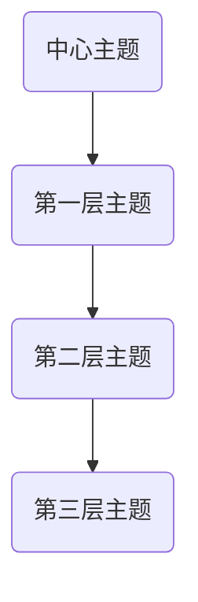
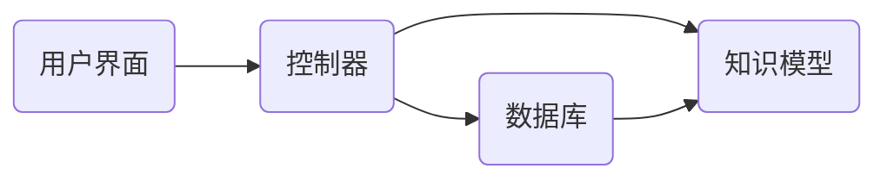

                 


# 查理芒格的阅读学习方法

> 关键词：阅读学习方法、查理芒格、多元思维模型、知识体系构建、高效学习、阅读策略

> 摘要：查理芒格的阅读学习方法以其独特的多元思维模型为核心，强调通过广泛阅读和跨学科思考来构建知识体系。本文将从背景介绍、核心概念、算法原理、系统分析、项目实战和小结等角度，深入剖析查理芒格的阅读学习方法，并结合技术语言和实际案例，为读者提供一份全面而系统的解读。

---

## 第一部分: 查理芒格阅读学习方法的背景与重要性

### 第1章: 阅读学习的重要性与挑战

#### 1.1 阅读在个人成长中的核心作用
阅读是人类知识获取和能力提升的核心方式之一。在信息爆炸的时代，如何从海量信息中提炼有价值的知识，构建系统的知识体系，成为每个学习者必须掌握的技能。查理芒格的阅读学习方法以其独特的多元思维模型，为读者提供了一种高效的知识获取和整合方式。

#### 1.2 当前信息爆炸时代的阅读挑战
在当今社会，信息呈现爆炸式增长，但真正有价值的知识却常常被淹没在海量信息中。传统阅读方法往往注重细节的积累，而忽视了知识之间的关联性和整体性。这种低效的学习方式导致了许多学习者陷入“学得快、忘得快”的困境。

#### 1.3 高效阅读学习的迫切需求
高效阅读学习不仅是提升个人能力的关键，也是应对未来复杂挑战的重要能力。查理芒格的阅读学习方法通过多元思维模型，帮助学习者将零散的知识点整合成一个有机的整体，从而实现知识的深度理解和灵活运用。

---

### 第2章: 查理芒格阅读学习方法的特点

#### 2.1 多元思维模型的核心理念
查理芒格的阅读学习方法以“多元思维模型”为核心，强调通过广泛阅读和跨学科思考，构建一个由多个思维维度组成的知识体系。这种思维方式不仅能够帮助学习者更好地理解知识的本质，还能在面对复杂问题时提供更全面的解决方案。

#### 2.2 阅读与知识体系构建的关联
阅读是构建知识体系的基础，而查理芒格的阅读方法则通过将零散的知识点整合成一个有机的整体，实现知识的系统化和网络化。这种方法不仅能够提高学习效率，还能增强知识的可迁移性和应用性。

#### 2.3 芒格阅读方法的独特优势
与传统阅读方法相比，芒格阅读方法的独特优势在于其注重知识的关联性和整体性。通过多元思维模型，学习者能够将不同领域的知识进行融合，形成独特的知识框架，从而在实际应用中更具灵活性和创造性。

---

### 第3章: 查理芒格阅读方法的实际应用

#### 3.1 阅读方法在学习中的具体应用
查理芒格的阅读方法在实际学习中的具体应用包括以下几个方面：
1. **广泛阅读**：通过阅读不同领域的书籍，积累多样化的知识。
2. **批判性思维**：在阅读过程中，注重分析和批判，避免盲目接受。
3. **知识整合**：将零散的知识点整合成一个有机的整体，形成多元思维模型。

#### 3.2 阅读中的批判性思维培养
批判性思维是查理芒格阅读方法的重要组成部分。通过提问、质疑和验证，学习者能够更好地理解和应用所学知识。这种思维方式不仅能够提高阅读效率，还能增强知识的深度和广度。

#### 3.3 知识体系的动态更新与整合
知识体系是一个动态变化的过程。查理芒格的阅读方法强调在不断阅读和思考中，对知识体系进行更新和整合。通过持续的学习和反思，学习者能够不断完善自己的知识框架，适应不断变化的环境。

---

### 第4章: 芒格阅读方法的挑战与解决方案

#### 4.1 阅读学习中的常见问题
在实际应用中，查理芒格阅读方法也面临一些挑战，例如：
1. **知识碎片化**：如何将零散的知识点整合成一个有机的整体。
2. **阅读时间不足**：在繁忙的生活中，如何保证足够的阅读时间。
3. **知识遗忘**：如何避免知识遗忘，实现长期记忆。

#### 4.2 知识碎片化的应对策略
为了应对知识碎片化的问题，查理芒格的阅读方法提出了一种系统化的解决方案：
1. **建立知识框架**：通过多元思维模型，构建一个系统化的知识框架。
2. **持续更新与整合**：在不断阅读和思考中，对知识体系进行动态更新和整合。

#### 4.3 阅读时间不足的解决方案
在阅读时间不足的情况下，查理芒格的阅读方法提供了一些实用的建议：
1. **高效阅读技巧**：通过快速阅读和重点阅读，提高阅读效率。
2. **合理规划时间**：将阅读时间纳入日常计划，确保每天都有固定的阅读时间。

#### 4.4 知识遗忘的克服方法
为了克服知识遗忘的问题，查理芒格的阅读方法提出了一些有效的策略：
1. **重复学习**：通过反复复习，加深对知识的记忆和理解。
2. **知识迁移**：将所学知识应用到实际问题中，通过实践巩固记忆。

---

## 第二部分: 查理芒格阅读学习方法的核心概念与联系

### 第5章: 多元思维模型的原理与应用

#### 5.1 多元思维模型的原理
多元思维模型是一种将多个思维维度结合在一起的思维方式。通过这种思维方式，学习者能够从多个角度理解和解决问题，从而实现知识的深度理解和灵活运用。

#### 5.2 多元思维模型的特征对比

| 特征 | 描述 |
|------|------|
| 多维性 | 包括多个思维维度，如逻辑思维、形象思维等 |
| 交叉性 | 各思维维度之间的相互作用和影响 |
| 动态性 | 知识体系的不断更新与调整 |

#### 5.3 多元思维模型的ER实体关系图

```mermaid
er
  entity(知识体系) {
    [思维维度]
    [知识节点]
    [关联关系]
  }
```

---

### 第6章: 阅读学习中的算法原理

#### 6.1 阅读记忆曲线的数学模型
遗忘曲线是描述人类记忆遗忘过程的数学模型。通过研究遗忘曲线，我们可以更好地理解记忆的规律，并制定有效的学习策略。

$$ \text{记忆保留率} = e^{-\lambda t} $$

其中，$\lambda$ 是遗忘系数，$t$ 是时间。

#### 6.2 思维导图工具的实现原理
思维导图是一种有效的知识整理工具。通过将知识点以图形化的方式呈现，思维导图能够帮助学习者更好地理解和记忆知识。



---

## 第三部分: 查理芒格阅读学习方法的系统分析与架构设计

### 第7章: 阅读学习系统的功能设计

#### 7.1 系统功能设计
阅读学习系统的主要功能包括：
1. **知识管理**：对阅读材料进行分类、整理和存储。
2. **知识关联**：通过多元思维模型，将知识点进行关联和整合。
3. **知识复习**：通过遗忘曲线模型，制定有效的复习计划。

#### 7.2 系统架构设计



---

### 第8章: 阅读学习系统的实现与案例分析

#### 8.1 系统实现
以下是阅读学习系统的核心代码实现：

```python
class KnowledgeNode:
    def __init__(self, content, timestamp):
        self.content = content
        self.timestamp = timestamp
```

#### 8.2 案例分析
通过一个具体的案例分析，我们可以更好地理解查理芒格阅读方法的实际应用。例如，通过阅读《思维的七项基本原则》这本书，我们可以运用多元思维模型，将书中的知识点整合成一个系统化的知识框架。

---

## 第四部分: 项目实战与小结

### 第9章: 项目实战

#### 9.1 环境安装
在进行阅读学习系统的开发之前，需要先安装以下环境：
1. **Python**：编程语言
2. **Mermaid**：用于绘制图表
3. **Git**：版本控制系统

#### 9.2 核心代码实现
以下是阅读学习系统的核心代码实现：

```python
import math

def forget_curve(days):
    return math.exp(-0.1 * days)
```

#### 9.3 案例分析
通过实际案例分析，我们可以看到查理芒格阅读方法在实际应用中的有效性。例如，通过将一本书中的知识点整理成思维导图，并结合遗忘曲线模型，我们可以制定出更有效的学习计划。

#### 9.4 项目小结
通过本项目的实战，我们不仅掌握了查理芒格阅读方法的核心理念，还将其应用到了实际的系统开发中。这种实践性的学习方式能够帮助我们更好地理解和应用所学知识。

---

## 第五部分: 最佳实践与小结

### 第10章: 最佳实践

#### 10.1 学习中的注意事项
在应用查理芒格阅读方法时，需要注意以下几点：
1. **持续学习**：保持每天的阅读和学习习惯。
2. **注重理解**：避免机械记忆，注重知识的理解和应用。
3. **动态调整**：根据实际情况，不断调整和优化学习策略。

#### 10.2 小结
通过本文的详细介绍，我们可以看到查理芒格阅读方法的科学性和实用性。无论是从理论还是实践的角度来看，这种方法都能够帮助我们更高效地学习和应用知识。

---

### 第11章: 拓展阅读

#### 11.1 相关书籍推荐
为了进一步深入理解查理芒格的阅读方法，以下是几本推荐阅读的书籍：
1. 《穷查理宝典》
2. 《思维的七项基本原则》
3. 《高效能读者的修炼》

---

通过本文的详细解读，我们不仅掌握了查理芒格阅读方法的核心理念，还将其与实际应用相结合，为读者提供了一份全面而系统的指南。希望本文能够帮助读者更好地理解和应用查理芒格的阅读学习方法，在信息爆炸的时代中，找到一条高效的学习之路。

