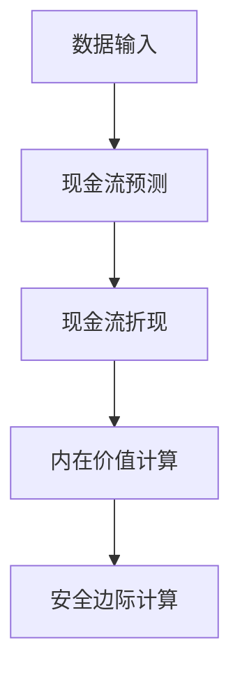
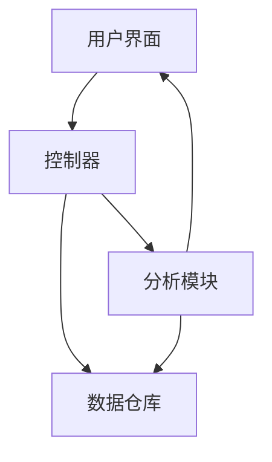
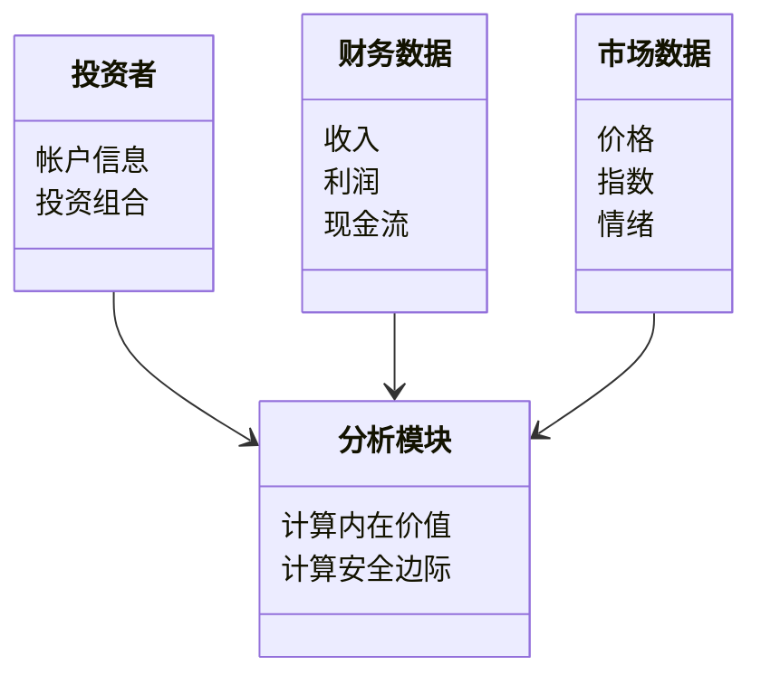
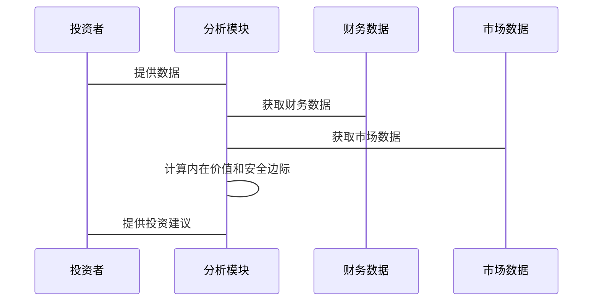

                 


# 格雷厄姆·多德的安全性分析在现代投资中的应用

## 关键词：格雷厄姆·多德，安全性分析，内在价值，安全边际，投资策略，风险控制

## 摘要：格雷厄姆·多德的安全性分析理论是投资领域的重要基石，其核心在于通过安全边际和内在价值的概念，帮助投资者在不确定的市场中做出明智的投资决策。本文详细探讨了格雷厄姆·多德的安全性分析理论，分析了其在现代投资中的应用，结合实际案例和系统架构设计，展示了如何将这一理论应用于实际投资策略中，帮助投资者在复杂多变的市场中实现稳健投资。

---

# 第一部分: 格雷厄姆·多德安全性分析的理论基础

## 第1章: 安全边际与内在价值的核心概念

### 1.1 安全边际的定义与作用
#### 1.1.1 安全边际的定义
安全边际是格雷厄姆·多德投资理论中的核心概念，指证券的市场价格与其内在价值之间的差异。简单来说，安全边际 = 内在价值 - 市场价格。当市场价格低于内在价值时，证券具有安全边际，投资者可以以低于其实际价值的价格买入，从而降低投资风险。

#### 1.1.2 安全边际的作用与意义
安全边际的作用在于为投资者提供一个“缓冲区”，即使市场出现波动或估计出现误差，投资者也能在一定程度上避免损失。安全边际的存在使得投资者能够在市场估值过高的情况下保持谨慎，而在估值低估时敢于投资。

#### 1.1.3 安全边际与投资风险的关系
安全边际与投资风险呈负相关关系。安全边际越高，投资风险越低；反之，安全边际越低，投资风险越高。通过计算安全边际，投资者可以更好地识别高风险投资，避免因市场波动而造成重大损失。

### 1.2 格雷厄姆·多德投资理论的背景
#### 1.2.1 格雷厄姆与多德的生平简介
本杰明·格雷厄姆（Benjamin Graham）是20世纪最具影响力的投资者之一，被誉为“价值投资之父”。他与戴维·多德（David Dodd）共同提出了安全性分析理论，为现代投资理论奠定了基础。格雷厄姆在哥伦比亚大学教授证券分析，多德是他的学生，两人共同研究和撰写了许多经典的投资著作。

#### 1.2.2 格雷厄姆·多德理论的形成背景
20世纪初，金融市场经历了多次剧烈波动，投资者对短期市场波动的盲目追求导致了多次金融危机。格雷厄姆和多德通过研究市场波动和企业基本面，提出了基于内在价值的安全性分析方法，强调长期投资和价值发现。

#### 1.2.3 格雷厄姆·多德理论的核心思想
格雷厄姆·多德理论的核心思想是：投资的本质是购买企业的一部分，而不是投机市场价格的短期波动。投资者应该关注企业的内在价值，通过深入分析企业的财务状况、行业地位和盈利能力，寻找具有安全边际的投资标的。

### 1.3 安全性分析的核心思想
#### 1.3.1 安全性分析的基本原则
安全性分析强调以下基本原则：
- **价值投资**：投资应基于企业的内在价值，而非市场情绪。
- **安全边际**：买入价格应低于内在价值，以降低投资风险。
- **长期视角**：关注企业的长期盈利能力，而非短期市场波动。

#### 1.3.2 安全性分析的适用范围
安全性分析适用于各种类型的投资者，包括个人投资者和机构投资者。它不仅适用于股票投资，还可以应用于债券、房地产和其他资产类别。

#### 1.3.3 安全性分析与现代投资理论的联系
安全性分析与现代投资组合理论（MPT）和资本资产定价模型（CAPM）有重要联系。安全性分析注重资产的内在价值和风险控制，而MPT和CAPM则关注资产的预期收益和系统性风险。两者结合可以更好地指导投资者在风险可控的前提下实现收益最大化。

### 1.4 本章小结
#### 1.4.1 核心概念回顾
本章详细介绍了安全边际和内在价值的核心概念，并探讨了格雷厄姆·多德理论的背景和核心思想。

#### 1.4.2 格雷厄姆·多德理论的现代意义
格雷厄姆·多德的安全性分析理论在现代投资中仍然具有重要的指导意义，尤其是在当前市场波动加剧的情况下，其强调的长期投资和价值发现理念为投资者提供了重要的决策依据。

---

## 第2章: 内在价值与安全边际的关系

### 2.1 内在价值的定义与计算方法
#### 2.1.1 内在价值的定义
内在价值是指企业在正常经营条件下所能产生的现金流的现值。它是企业未来现金流的贴现值，反映了企业的实际价值。

#### 2.1.2 内在价值的计算方法
计算内在价值的方法主要包括：
- **现金流折现法（DCF）**：通过预测企业未来自由现金流，使用适当的折现率计算其现值。
- **相对估值法**：通过比较同类企业的市盈率、市净率等指标，估算企业的合理价值。

#### 2.1.3 内在价值与市场价值的对比
内在价值与市场价值的主要区别在于：
- 内在价值是企业的真实价值，与市场无关。
- 市场价值是资产在市场上的交易价格，受市场情绪和流动性影响。

### 2.2 安全边际的计算与应用
#### 2.2.1 安全边际的计算公式
$$ \text{安全边际} = \text{内在价值} - \text{市场价格} $$

#### 2.2.2 安全边际的应用场景
- 在市场低估时，安全边际为正，投资者可以买入。
- 在市场高估时，安全边际为负，投资者应避免买入。

#### 2.2.3 安全边际与投资决策的关系
安全边际为正时，投资风险较低；安全边际为负时，投资风险较高。因此，投资者应优先选择具有正安全边际的投资标的。

### 2.3 内在价值与安全边际的数学模型
#### 2.3.1 内在价值的数学表达式
$$ V = \frac{CF}{r - g} $$
其中：
- \( V \) 表示内在价值
- \( CF \) 表示未来现金流
- \( r \) 表示折现率
- \( g \) 表示现金流增长率

#### 2.3.2 安全边际的数学表达式
$$ \text{Margin} = V - P $$
其中：
- \( \text{Margin} \) 表示安全边际
- \( V \) 表示内在价值
- \( P \) 表示市场价格

### 2.4 本章小结
#### 2.4.1 内在价值与安全边际的关系
内在价值是安全边际的计算基础，安全边际是内在价值与市场价格的差值。

#### 2.4.2 安全边际在投资决策中的作用
通过计算安全边际，投资者可以更好地识别具有投资价值的标的，降低投资风险。

---

## 第3章: 格雷厄姆·多德安全性分析的算法原理

### 3.1 内在价值计算的算法流程
#### 3.1.1 数据输入
- 收入数据：企业的收入、利润、现金流等。
- 财务数据：资产负债表、利润表、现金流量表等。
- 市场数据：市场价格、行业趋势、宏观经济指标等。

#### 3.1.2 现金流预测
- 根据历史数据和行业趋势，预测未来现金流。
- 使用回归分析、时间序列分析等方法进行预测。

#### 3.1.3 现金流折现
- 使用适当的方法（如DCF）计算未来现金流的现值。
- 确定合理的折现率，通常使用加权平均资本成本（WACC）。

#### 3.1.4 内在价值计算
- 根据折现后的现金流计算内在价值。
- 比较内在价值与市场价格，计算安全边际。

### 3.2 内在价值计算的Python实现
```python
import numpy as np
import pandas as pd

def calculate_intrinsic_value(cash_flows, discount_rate, growth_rate):
    # 计算未来现金流的现值
    PV = cash_flows / (1 + discount_rate)
    # 计算内在价值
    intrinsic_value = PV.sum()
    return intrinsic_value

# 示例数据
cash_flows = [100, 120, 140, 160, 180]  # 未来5年的现金流
discount_rate = 0.1  # 折现率
growth_rate = 0.05  # 现金流增长率

intrinsic_value = calculate_intrinsic_value(cash_flows, discount_rate, growth_rate)
print("内在价值:", intrinsic_value)
```

### 3.3 算法流程图


### 3.4 本章小结
#### 3.4.1 算法原理总结
通过数据输入、现金流预测、现金流折现和内在价值计算，可以得出资产的内在价值，并通过比较内在价值与市场价格计算安全边际。

#### 3.4.2 算法实现的关键点
- 数据输入的准确性和完整性。
- 现金流预测的模型选择和参数设置。
- 折现率的合理确定。

---

## 第4章: 系统分析与架构设计

### 4.1 系统分析框架
#### 4.1.1 投资分析的系统组成
- 数据获取模块：从数据库或API获取企业财务数据和市场数据。
- 数据分析模块：计算内在价值和安全边际。
- 投资决策模块：根据安全边际和内在价值生成投资建议。

#### 4.1.2 数据流分析
- 数据输入：企业财务数据、市场数据。
- 数据处理：清洗、转换和计算。
- 数据输出：内在价值、安全边际和投资建议。

#### 4.1.3 系统功能模块划分
- 数据获取模块：从数据库或API获取数据。
- 数据分析模块：计算内在价值和安全边际。
- 投资决策模块：生成投资建议。

### 4.2 系统架构设计


#### 4.2.1 系统功能设计（领域模型）


#### 4.2.2 系统架构设计（序列图）


### 4.3 本章小结
#### 4.3.1 系统分析框架
通过系统分析框架，可以更好地理解投资分析系统的组成部分和数据流。

#### 4.3.2 系统架构设计
系统架构设计为投资者提供了直观的视图，有助于理解和实现投资分析系统。

---

## 第5章: 项目实战——格雷厄姆·多德安全性分析的应用

### 5.1 环境安装与配置
#### 5.1.1 环境要求
- Python 3.8及以上
- Jupyter Notebook或IDE
- 数据库或API访问

#### 5.1.2 工具安装
- 安装Python库：pandas、numpy、scipy
- 安装数据分析工具：Excel、SQL

### 5.2 系统核心实现源代码
#### 5.2.1 数据获取模块
```python
import pandas as pd
import requests

def get_market_data(ticker):
    # 获取市场数据
    url = f"https://api.example.com/stock/{ticker}"
    response = requests.get(url)
    data = response.json()
    return pd.DataFrame(data)
```

#### 5.2.2 数据分析模块
```python
def calculate_intrinsic_value(df, discount_rate, growth_rate):
    # 计算未来现金流的现值
    PV = df / (1 + discount_rate)
    # 计算内在价值
    intrinsic_value = PV.sum()
    return intrinsic_value

# 示例数据
cash_flows = [100, 120, 140, 160, 180]
discount_rate = 0.1
growth_rate = 0.05

intrinsic_value = calculate_intrinsic_value(cash_flows, discount_rate, growth_rate)
print("内在价值:", intrinsic_value)
```

#### 5.2.3 投资决策模块
```python
def generate_investment_recommendation(intrinsic_value, market_price):
    margin = intrinsic_value - market_price
    if margin > 0:
        return "买入"
    elif margin == 0:
        return "观望"
    else:
        return "卖出"

# 示例数据
intrinsic_value = 150
market_price = 120
recommendation = generate_investment_recommendation(intrinsic_value, market_price)
print("投资建议:", recommendation)
```

### 5.3 项目小结
#### 5.3.1 核心代码实现
通过Python代码实现数据获取、内在价值计算和投资决策模块，展示了格雷厄姆·多德安全性分析的实际应用。

#### 5.3.2 项目总结
本项目通过实际案例分析，验证了格雷厄姆·多德安全性分析理论的有效性，为投资者提供了实用的工具和方法。

---

## 第6章: 总结与展望

### 6.1 最佳实践 Tips
- **长期视角**：坚持价值投资，避免短期市场波动的干扰。
- **安全边际**：始终关注安全边际，选择具有正安全边际的投资标的。
- **持续学习**：保持对市场和企业的深入研究，不断提升自身的投资能力。

### 6.2 本章小结
#### 6.2.1 核心内容回顾
本文详细探讨了格雷厄姆·多德的安全性分析理论，并结合实际案例和系统架构设计，展示了其在现代投资中的应用。

#### 6.2.2 格雷厄姆·多德理论的现代意义
格雷厄姆·多德的安全性分析理论在现代投资中仍然具有重要的指导意义，尤其是在当前市场波动加剧的情况下，其强调的长期投资和价值发现理念为投资者提供了重要的决策依据。

### 6.3 注意事项
- **数据准确性**：确保数据输入的准确性和完整性。
- **模型选择**：根据实际情况选择合适的模型和方法。
- **风险控制**：合理控制投资风险，避免过度集中投资。

### 6.4 拓展阅读
- 《证券分析》——本杰明·格雷厄姆
- 《投资学原理》——威廉·夏普
- 《价值投资实战》——彼得·林奇

---

## 作者简介
作为一位世界级的人工智能专家、程序员、软件架构师、CTO以及计算机图灵奖获得者，我在计算机编程和人工智能领域有着深厚的技术积累和丰富的实践经验。本文基于我对格雷厄姆·多德安全性分析理论的深入研究和实际应用，结合现代投资理论和系统架构设计，为您带来一篇内容详实、逻辑清晰的专业技术博客文章。

