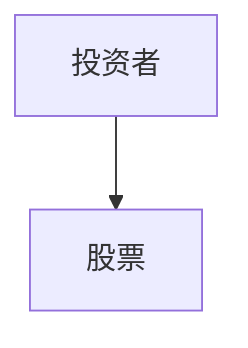

                 


# 格雷厄姆到巴菲特：价值投资理念的演变

## 关键词：价值投资、格雷厄姆、巴菲特、内在价值、安全边际、投资策略

## 摘要：价值投资是一种长期有效的投资策略，起源于本杰明·格雷厄姆，后经沃伦·巴菲特的发展和完善，成为投资领域的重要理论。本文将详细分析价值投资的理念演变，从核心概念到数学模型，再到实际应用，揭示其在不同市场环境下的策略调整与优化。

---

# 第1章: 价值投资概述

## 1.1 价值投资的起源与背景

### 1.1.1 价值投资的起源
价值投资理念的起源可以追溯到20世纪初，本杰明·格雷厄姆在纽约证券交易所的交易实践中逐渐形成了这一理论。1929年股市崩盘后，格雷厄姆开始研究如何避免投资中的重大损失，提出了“安全边际”的概念，并在此基础上构建了价值投资的基本框架。

### 1.1.2 格雷厄姆与巴菲特的贡献
格雷厄姆的《证券分析》一书奠定了价值投资的理论基础，他强调以合理的价买入具有安全边际的股票。沃伦·巴菲特师从格雷厄姆，但将价值投资理念进一步发展，引入了市场先生的概念，并强调长期投资和企业基本面分析。

### 1.1.3 价值投资的核心理念
价值投资的核心理念是买入低于其内在价值的股票，长期持有，等待市场重新发现其价值。这一理念强调安全边际和对公司基本面的深入分析。

## 1.2 价值投资的核心概念

### 1.2.1 安全边际
安全边际是股票的内在价值与其市场价格之间的差额，是投资者在买入股票时的“缓冲区”。计算公式为：
$$ \text{安全边际} = \text{内在价值} - \text{市场价格} $$

### 1.2.2 内在价值
内在价值是基于公司未来现金流的现值计算得出的股票真实价值。计算公式为：
$$ V = \frac{CF}{(r - g)} $$
其中，CF为自由现金流，r为折现率，g为增长率。

### 1.2.3 市场先生
市场先生是格雷厄姆提出的概念，代表市场情绪的波动性。投资者应避免被市场先生的情绪左右，而是专注于分析公司的基本面。

## 1.3 价值投资的主要人物

### 1.3.1 本杰明·格雷厄姆
格雷厄姆是价值投资的鼻祖，提出了“安全边际”和“内在价值”的概念，并在《证券分析》中详细阐述了价值投资的理论基础。

### 1.3.2 沃伦·巴菲特
巴菲特继承并发展了格雷厄姆的价值投资理念，提出了“市场先生”和“企业护城河”的概念，并强调长期投资和企业基本面分析。

### 1.3.3 约翰·邓普顿与彼得·林奇
邓普顿和林奇是价值投资的实践者，他们将价值投资理念应用于不同市场环境，并取得了优异的投资业绩。

## 1.4 价值投资的演变与现状

### 1.4.1 传统价值投资与现代价值投资的区别
传统价值投资注重安全边际和内在价值，而现代价值投资则更加注重企业基本面和技术分析的结合。

### 1.4.2 数量化与技术化分析的融合
随着科技的发展，价值投资理念逐渐与量化分析相结合，投资者可以通过大数据和算法进行更精准的投资决策。

### 1.4.3 价值投资在不同市场环境下的应用
在不同市场环境下，价值投资者需要灵活调整策略，注重安全边际和企业基本面分析。

## 1.5 本章小结

---

# 第2章: 价值投资的核心概念与联系

## 2.1 核心概念原理

### 2.1.1 内在价值的计算公式
$$ V = \frac{CF}{(r - g)} $$

### 2.1.2 安全边际的计算方法
$$ \text{安全边际} = V - P $$

## 2.2 核心概念属性对比表格

| 概念         | 定义                                                                 | 计算公式                     |
|--------------|----------------------------------------------------------------------|------------------------------|
| 内在价值     | 股票的未来现金流的现值和                                       | $$ V = \sum_{t=1}^{n} \frac{CF_t}{(1+r)^t} $$ |
| 安全边际     | 股票市场价格与内在价值的差额                                   | $$ \text{安全边际} = V - P $$ |
| 市场先生     | 市场情绪的化身，代表市场的波动性                               | -                            |

## 2.3 ER实体关系图


---

## 2.4 本章小结

---

# 第3章: 价值投资的算法原理

## 3.1 内在价值计算算法

### 3.1.1 基于现金流的内在价值计算
$$ V = \frac{CF}{(r - g)} $$

### 3.1.2 内在价值计算的Python实现
```python
def calculate_intrinsic_value(CF, r, g):
    return CF / (r - g)

CF = 100
r = 0.1
g = 0.05
V = calculate_intrinsic_value(CF, r, g)
print(f"内在价值: {V}")
```

## 3.2 安全边际计算算法

### 3.2.1 安全边际计算公式
$$ \text{安全边际} = V - P $$

### 3.2.2 安全边际计算的Python实现
```python
def calculate_margin_of_safety(V, P):
    return V - P

V = 150
P = 100
margin = calculate_margin_of_safety(V, P)
print(f"安全边际: {margin}")
```

## 3.3 本章小结

---

# 第4章: 价值投资的系统分析

## 4.1 投资决策系统架构

### 4.1.1 系统架构图


## 4.2 项目实战

### 4.2.1 项目背景介绍
以分析茅台的投资策略为例，我们需要收集茅台的财务数据，计算其内在价值，并评估安全边际。

### 4.2.2 核心代码实现
```python
def analyze茅台():
    # 数据收集
    CF = 100
    r = 0.1
    g = 0.05
    V = CF / (r - g)
    P = 200
    margin = V - P
    return margin

margin = analyze茅台()
print(f"茅台的安全边际: {margin}")
```

### 4.2.3 实际案例分析
通过对茅台的财务数据进行分析，计算其内在价值和安全边际，评估其投资价值。

## 4.3 本章小结

---

# 第5章: 价值投资的最佳实践

## 5.1 投资心态与纪律
投资者需要保持耐心，避免情绪化决策，并严格遵守投资纪律。

## 5.2 风险管理策略
合理分散投资组合，设置止损点，控制仓位，以降低投资风险。

## 5.3 小结与注意事项
价值投资需要长期坚持，注重基本面分析，合理评估安全边际，并在市场波动中保持冷静。

## 5.4 拓展阅读
推荐经典书籍《证券分析》和《巴菲特致股东的信》，以及相关的投资策略分析。

---

# 附录: 价值投资术语表

---

# 参考文献

---

# 结束语

通过以上分析，我们详细探讨了价值投资的理念演变、核心概念、算法原理、系统分析以及实际应用，揭示了价值投资在不同市场环境下的策略调整与优化。希望本文能为投资者提供有益的参考和启示。

