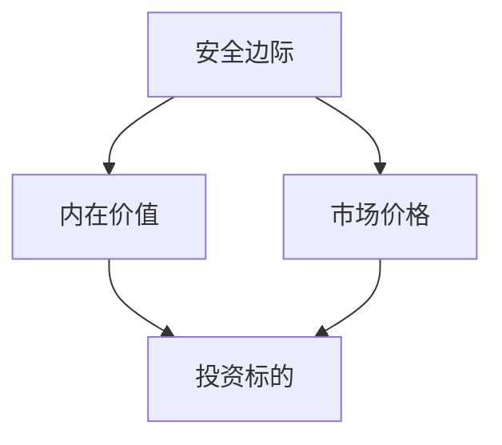
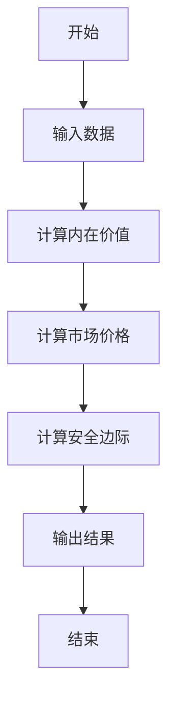
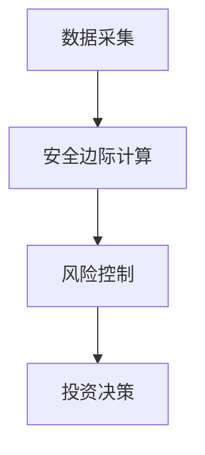

                 


# 《格雷厄姆安全边际概念在市场剧烈波动中的应用》

> 关键词：安全边际，格雷厄姆，价值投资，市场波动，投资策略，风险管理

> 摘要：  
本文章深入探讨了格雷厄姆提出的“安全边际”概念在市场剧烈波动中的应用。通过理论分析、数学建模、系统设计和实际案例，详细讲解了安全边际的定义、计算方法、与市场波动的关系，以及在投资决策中的应用策略。文章结合技术语言和投资实践，为读者提供了一套完整的基于安全边际的投资方法论，帮助投资者在市场波动中降低风险、提高收益。

---

## 第一部分：安全边际概念的背景与核心原理

### 第1章：安全边际概念的起源与发展

#### 1.1 格雷厄姆投资理论的起源
- **1.1.1 价值投资的起源与核心思想**  
  价值投资是一种基于对资产内在价值评估的投资策略，其核心在于寻找市场价格低于内在价值的资产。本杰明·格雷厄姆是价值投资的鼻祖，他提出了“安全边际”概念，为投资者提供了在市场波动中规避风险的方法。

- **1.1.2 格雷厄姆对安全边际的定义**  
  格雷厄姆认为，安全边际是市场价格与资产内在价值之间的差距。这种差距越大，投资的安全性越高。他强调，投资者应该在市场价格远低于内在价值时买入，以确保在市场波动中不会遭受重大损失。

- **1.1.3 安全边际在投资中的重要性**  
  安全边际是价值投资的核心原则之一。它不仅提供了风险控制的手段，还为投资者在市场恐慌时提供了买入的机会。通过安全边际，投资者可以在市场波动中保持理性，避免被情绪左右。

#### 1.2 安全边际的核心概念与属性
- **1.2.1 安全边际的定义与特征**  
  安全边际 = 内在价值 - 市场价格  
  特征：  
  - **稳定性**：安全边际在市场波动中能够提供缓冲空间。  
  - **可计算性**：通过公式可以量化计算。  
  - **防御性**：在市场下跌时，安全边际能够减少损失。

- **1.2.2 安全边际与内在价值的关系**  
  内在价值是资产的真正价值，与市场价格无关。安全边际是内在价值与市场价格之间的差额，反映了资产的“折扣”程度。当市场价格低于内在价值时，安全边际为正，投资具有安全性。

- **1.2.3 安全边际的计算方法与应用场景**  
  计算方法：  
  $$ \text{安全边际} = \text{内在价值} - \text{市场价格} $$  
  应用场景：  
  - 在市场低迷时，寻找安全边际较高的资产。  
  - 在市场繁荣时，避免买入价格过高的资产。  

#### 1.3 安全边际与市场波动的关系
- **1.3.1 市场波动的周期性与非理性**  
  市场波动通常是周期性的，投资者需要在波动中保持理性。市场的非理性行为会导致价格偏离内在价值，为安全边际的运用提供了机会。

- **1.3.2 安全边际在市场波动中的作用**  
  安全边际能够帮助投资者在市场波动中降低风险。当市场价格下跌时，安全边际能够缓冲损失；当市场价格上涨时，安全边际能够增加收益。

- **1.3.3 安全边际与风险控制的结合**  
  通过安全边际，投资者可以在市场波动中制定合理的买卖策略。例如，在市场价格低于内在价值时买入，在市场价格接近内在价值时卖出。

---

## 第2章：安全边际的核心概念与联系

### 2.1 核心概念原理
- **2.1.1 内在价值与市场价值的关系**  
  内在价值是资产的真实价值，而市场价格是市场参与者行为的反映。两者的差异即为安全边际。

- **2.1.2 安全边际的数学模型与公式**  
  $$ \text{安全边际} = \text{内在价值} - \text{市场价格} $$  
  内在价值的计算公式为：  
  $$ \text{内在价值} = \frac{\text{预期收益}}{\text{折现率}} $$  

- **2.1.3 安全边际与投资回报的关联**  
  安全边际越大，投资回报的潜力越高。通过安全边际，投资者可以在市场波动中获得更高的收益。

### 2.2 核心概念属性特征对比表
| 特性         | 内在价值       | 市场价格       | 安全边际       |
|--------------|----------------|----------------|----------------|
| 计算依据     | 资产的真实价值 | 市场供需关系   | 两者的差额     |
| 变化规律     | 相对稳定       | 波动性大       | 随市场价格波动 |
| 影响因素     | 资产的盈利能力 | 市场情绪       | 内在价值与市场价格 |

### 2.3 实体关系图（ER图）


---

## 第3章：安全边际的数学模型与算法原理

### 3.1 数学模型
- **3.1.1 内在价值计算公式**  
  $$ V = \frac{E}{k} $$  
  其中，\( V \) 为内在价值，\( E \) 为预期收益，\( k \) 为折现率。

- **3.1.2 安全边际计算公式**  
  $$ \text{安全边际} = V - P $$  
  其中，\( V \) 为内在价值，\( P \) 为市场价格。

### 3.2 算法流程图


### 3.3 代码实现
```python
def calculate_margin_of_safety(intrinsic_value, market_price):
    return intrinsic_value - market_price

# 示例
iv = 100
mp = 80
mos = calculate_margin_of_safety(iv, mp)
print(f"安全边际为: {mos}")
```

---

## 第4章：安全边际在市场剧烈波动中的应用

### 4.1 市场波动下的安全边际策略
- **4.1.1 基于安全边际的买入策略**  
  投资者应该在市场价格低于内在价值时买入，特别是在市场恐慌时，安全边际较大，投资风险较低。

- **4.1.2 市场波动中的止损与止盈机制**  
  通过设置止损点和止盈点，投资者可以控制风险。安全边际可以帮助确定合理的止损点和止盈点。

- **4.1.3 安全边际与风险控制的结合**  
  在市场波动中，安全边际能够帮助投资者制定合理的买卖策略，避免过度交易和情绪化决策。

### 4.2 安全边际在投资组合中的应用
- **4.2.1 投资组合的构建**  
  投资者可以通过计算多个资产的安全边际，构建一个多样化投资组合，分散风险。

- **4.2.2 安全边际在资产配置中的作用**  
  安全边际可以帮助投资者在资产配置中选择具有较高安全边际的资产，提高投资组合的稳定性。

### 4.3 实际案例分析
- **案例：2020年新冠疫情市场波动中的安全边际应用**  
  在2020年新冠疫情爆发期间，市场恐慌导致许多资产价格大幅下跌，安全边际显著增加。投资者可以通过计算安全边际，选择具有较高安全边际的资产进行投资。

---

## 第5章：基于安全边际的投资系统设计

### 5.1 系统功能设计
- **5.1.1 系统架构**  
  系统包括数据采集、安全边际计算、风险控制和投资决策模块。

- **5.1.2 系统功能模块**  
  - 数据采集模块：采集资产的市场价格和内在价值数据。  
  - 安全边际计算模块：计算安全边际。  
  - 风险控制模块：制定止损和止盈策略。  
  - 投资决策模块：根据安全边际和风险控制结果，制定投资策略。

### 5.2 系统架构图


### 5.3 系统接口设计
- **API接口**  
  - 输入：资产的市场价格和内在价值数据。  
  - 输出：安全边际和投资建议。

---

## 第6章：基于安全边际的投资实战

### 6.1 环境安装
- **Python环境安装**  
  安装Python和必要的库（如pandas、numpy）。

### 6.2 系统核心实现
- **代码实现**  
  ```python
  def calculate_margin_of_safety(intrinsic_value, market_price):
      return intrinsic_value - market_price

  # 示例
  iv = 100
  mp = 80
  mos = calculate_margin_of_safety(iv, mp)
  print(f"安全边际为: {mos}")
  ```

### 6.3 实际案例分析
- **案例分析：股票投资中的安全边际应用**  
  通过计算股票的内在价值和市场价格，确定安全边际，制定买入和卖出策略。

### 6.4 投资策略优化
- **动态调整策略**  
  根据市场波动，动态调整安全边际和投资组合。

---

## 第7章：总结与展望

### 7.1 总结
- **核心内容回顾**  
  安全边际是价值投资的核心原则之一。通过计算安全边际，投资者可以在市场波动中降低风险，提高收益。

- **实际应用总结**  
  在市场波动中，安全边际可以帮助投资者制定合理的买卖策略，避免情绪化决策。

### 7.2 展望
- **未来研究方向**  
  结合人工智能技术，优化安全边际的计算方法，提高投资决策的准确性。

- **最佳实践 Tips**  
  - 在市场波动中，始终关注安全边际。  
  - 分散投资，降低风险。  
  - 定期评估投资组合，调整安全边际。  

---

## 参考文献
- 格雷厄姆，本杰明. 《证券分析》  
- 巴菲特，沃伦. 《巴菲特致股东的信》  
- 纳西姆·尼古拉斯·塔勒布. 《反脆弱》  

---

通过以上结构，我们系统地探讨了格雷厄姆安全边际概念在市场剧烈波动中的应用，从理论到实践，为投资者提供了一套完整的投资方法论。希望读者能够通过本文的理解，在市场波动中做出更加明智的投资决策。

