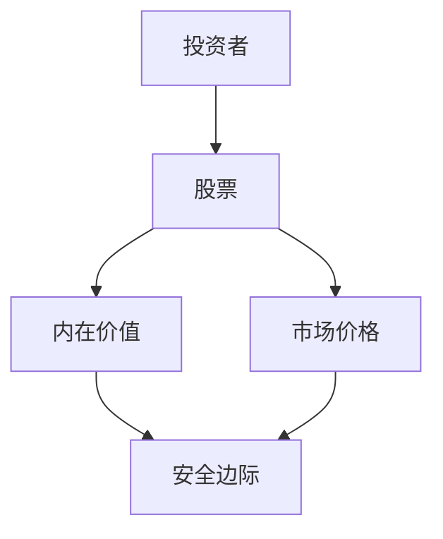

                 

# 《格雷厄姆安全边际概念在特价股票选择中的应用》

## 关键词：安全边际、格雷厄姆、特价股票、价值投资、股票估值、投资策略

## 摘要：  
本文深入探讨了本杰明·格雷厄姆提出的“安全边际”概念在特价股票选择中的应用。通过分析安全边际的定义、原理及其在股票估值中的作用，结合实际案例和数学模型，展示了如何利用安全边际来降低投资风险，选择具有长期稳定收益的特价股票。文章从理论基础到实际操作，系统性地介绍了安全边际的应用方法，为投资者提供了实用的指导。

---

# 第一部分：安全边际概念的背景与基础

## 第1章：安全边际的起源与发展

### 1.1 格雷厄姆投资理论的起源

#### 1.1.1 本杰明·格雷厄姆的生平简介  
本杰明·格雷厄姆（Benjamin Graham）是20世纪最著名的投资理论家之一，被誉为“价值投资之父”。他出生于1894年，曾在纽约证券交易所工作，并在1920年代开始系统性地研究投资理论。他的思想深刻影响了后来的投资者，包括沃伦·巴菲特。

#### 1.1.2 安全边际概念的提出背景  
在20世纪20年代至30年代，格雷厄姆通过分析市场的波动性和股票估值，提出了一种以安全边际为核心的投资策略。他认为，市场的波动性使得股票价格经常偏离其内在价值，而安全边际正是利用这种偏离来寻找被低估的投资机会。

#### 1.1.3 格雷厄姆投资理论的核心思想  
格雷厄姆的投资理论强调以低于内在价值的价格买入股票，通过安全边际来降低投资风险。他认为，投资的本质是购买企业的一部分，而非单纯地参与市场交易。

---

### 1.2 安全边际的定义与内涵

#### 1.2.1 安全边际的定义  
安全边际是指股票的市场价格与其内在价值之间的差异。具体来说，当市场价格低于内在价值时，两者之间的差额即为安全边际。安全边际越大，投资的风险越小，潜在的收益越高。

#### 1.2.2 安全边际的核心要素  
1. **内在价值**：股票的真实价值，基于企业的盈利能力、资产状况和行业地位等因素计算得出。
2. **市场价格**：股票在市场上的交易价格。
3. **安全边际宽度**：市场价格与内在价值之间的差距，通常以百分比表示。

#### 1.2.3 安全边际与投资风险的关系  
当市场价格远低于内在价值时，安全边际较大，投资风险较低，且潜在收益较高。相反，当市场价格接近或超过内在价值时，安全边际较小，投资风险增加。

---

### 1.3 安全边际在股票选择中的应用

#### 1.3.1 安全边际在股票筛选中的重要性  
通过计算股票的安全边际，投资者可以筛选出那些市场价格显著低于内在价值的股票，从而降低投资风险。

#### 1.3.2 安全边际与股票估值的关系  
安全边际是股票估值的重要组成部分。通过分析安全边际，投资者可以判断股票是否被市场低估，从而做出投资决策。

#### 1.3.3 格雷厄姆与巴菲特的安全边际理念对比  
尽管巴菲特的投资理念与格雷厄姆有所不同，但他也高度重视安全边际。巴菲特认为，安全边际是保护投资者免受市场波动影响的重要工具。

---

## 第2章：安全边际的核心概念与数学模型

### 2.1 核心概念原理

#### 2.1.1 内在价值的计算方法  
内在价值是股票的真实价值，通常通过企业的盈利能力和资产状况来计算。以下是常见的内在价值计算方法：

1. **格雷厄姆的估值模型**  
   内在价值 = （净利润 + 平均收益）/ 合理市盈率  
   其中，合理市盈率通常取15倍左右。

2. **市净率法**  
   内在价值 = 净资产 × 合理市净率

#### 2.1.2 安全边际的宽度计算  
安全边际宽度 = （内在价值 - 市场价格）/ 内在价值 × 100%  

例如，如果某股票的内在价值为10元，市场价格为8元，那么安全边际宽度为（10-8）/10 ×100% = 20%。

#### 2.1.3 安全边际与股票价格的关系  
安全边际越大，股票的市场价格越低于内在价值，投资风险越小，潜在收益越高。

---

### 2.2 核心概念属性对比表格

| 概念       | 定义                                                                 | 计算方法                     | 影响因素                     |
|------------|----------------------------------------------------------------------|------------------------------|------------------------------|
| 内在价值   | 股票的真实价值，基于企业盈利能力和资产状况计算                 | 净利润 + 平均收益 / 合理市盈率 | 盈利能力、资产状况、行业地位 |
| 市场价格   | 股票在市场上的交易价格                                             | 市场供需关系                 | 市场情绪、宏观经济、行业趋势 |
| 安全边际   | 市场价格与内在价值之间的差异                                     | （内在价值 - 市场价格）/ 内在价值 × 100% | 内在价值、市场价格             |

---

### 2.3 ER实体关系图

---

## 第3章：安全边际的数学模型与公式

### 3.1 内在价值的计算公式

$$ \text{内在价值} = \frac{\text{净利润} + \text{平均收益}}{\text{合理市盈率}} $$

其中，合理市盈率通常取15倍左右。

### 3.2 安全边际的计算公式

$$ \text{安全边际} = \frac{\text{内在价值} - \text{市场价格}}{\text{内在价值}} \times 100\% $$

例如，某股票的内在价值为10元，市场价格为8元，则：

$$ \text{安全边际} = \frac{10 - 8}{10} \times 100\% = 20\% $$

---

## 第4章：安全边际在股票选择中的实际应用

### 4.1 实际案例分析

假设我们选择一只股票，其财务数据如下：

- 净利润：100万元
- 平均收益：50万元
- 合理市盈率：15倍
- 市场价格：8元/股

首先，计算内在价值：

$$ \text{内在价值} = \frac{100 + 50}{15} = 10 \text{元/股} $$

然后，计算安全边际：

$$ \text{安全边际} = \frac{10 - 8}{10} \times 100\% = 20\% $$

由于安全边际为20%，远大于10%，该股票具有较高的投资价值。

---

## 第5章：安全边际的应用优势与注意事项

### 5.1 应用优势

1. **降低投资风险**：通过安全边际，投资者可以避免因市场波动而遭受较大损失。
2. **提高投资收益**：选择具有较大安全边际的股票，通常具有较高的潜在收益。
3. **长期投资策略**：安全边际适用于长期投资，尤其是价值投资。

### 5.2 注意事项

1. **市场波动**：即使安全边际较大，市场波动仍可能对股票价格造成短期冲击。
2. **数据质量**：内在价值的计算依赖于财务数据的准确性，因此需要选择可靠的财务报表。
3. **行业风险**：不同行业的股票具有不同的风险特征，需综合考虑行业前景。

---

## 第6章：总结与展望

### 6.1 总结

本文详细介绍了格雷厄姆安全边际概念在特价股票选择中的应用，通过数学模型和实际案例，展示了如何利用安全边际来降低投资风险，选择具有长期稳定收益的股票。

### 6.2 展望

随着市场的不断发展，安全边际的应用也需要与时俱进。未来，投资者可以通过大数据和人工智能技术，进一步优化安全边际的计算方法，提高投资决策的准确性。

---

通过本文的分析，读者可以更好地理解安全边际的概念，并在实际投资中灵活运用这一策略，从而实现稳健的投资收益。

