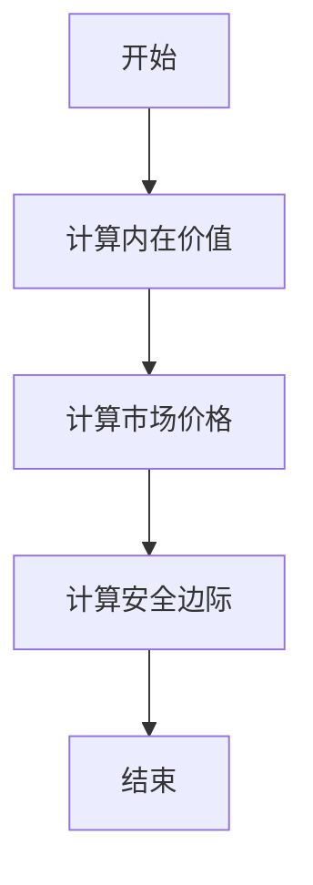
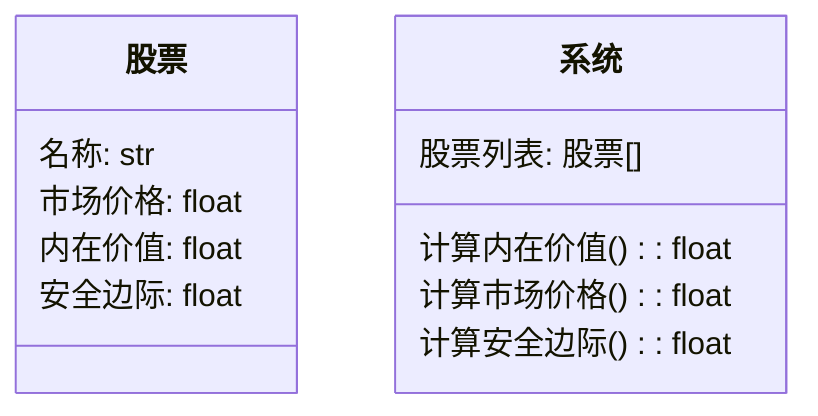
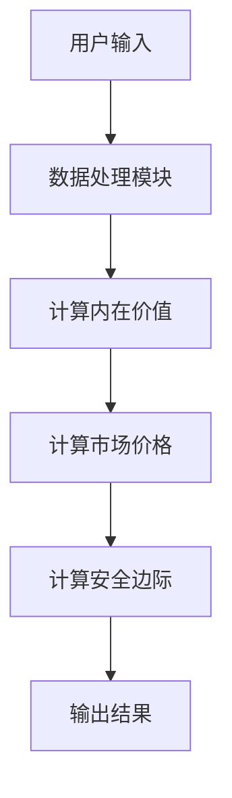

                 

<think>
好的，我将按照您的要求，逐步撰写一篇关于“格雷厄姆安全边际理念在特价股票中的应用”的技术博客文章。由于篇幅限制，我将先列出文章的完整目录和部分内容，确保逻辑清晰、结构紧凑、内容详实。

# 格雷厄姆安全边际理念在特价股票中的应用

## 关键词
- 格雷厄姆
- 安全边际
- 特价股票
- 价值投资
- 股票估值

## 摘要
格雷厄姆的安全边际理念是价值投资的核心思想之一，它通过寻找市场价格低于内在价值的股票，为投资者提供了一种降低投资风险、实现长期收益的策略。本文将详细阐述安全边际理念的定义、计算方法及其在特价股票投资中的应用，并通过实际案例和数学模型，帮助读者理解如何在实际投资中运用这一理念。

---

## 目录

### 目录

1. [格雷厄姆安全边际理念基础](#greemans)
2. [安全边际理念的核心概念与数学模型](#core-concepts)
3. [格雷厄姆安全边际理念的算法原理](#algorithm)
4. [系统分析与架构设计方案](#system-design)
5. [项目实战：基于安全边际理念的特价股票筛选系统](#project)
6. [最佳实践与投资策略](#best-practice)
7. [总结与展望](#conclusion)

---

## 正文

### 第1章: 格雷厄姆安全边际理念基础

#### 1.1 格雷厄姆与价值投资概述

##### 1.1.1 格雷厄姆的生平与贡献
本杰明·格雷厄姆（Benjamin Graham）是20世纪最伟大的投资思想家之一，被誉为“价值投资之父”。他于1894年出生于英国伦敦，在美国完成了学业并开始了他的投资生涯。格雷厄姆不仅是成功的投资者，还是杰出的教育家，他的著作《证券分析》和《聪明的投资者》深刻影响了全球的投资理念。

##### 1.1.2 价值投资的核心理念
价值投资的核心理念是寻找市场价格低于其内在价值的股票。格雷厄姆认为，市场的短期波动往往受情绪驱动，而股票的长期价值则取决于其基本面。投资者应关注企业的内在价值，而不是市场的短期波动。

##### 1.1.3 安全边际理念的提出背景
在20世纪20年代至30年代，格雷厄姆通过分析市场的波动性，发现许多股票的价格经常偏离其真实价值。为了降低投资风险，他提出“安全边际”理念，即以低于内在价值的价格买入股票，从而在市场波动中获得超额收益。

#### 1.2 安全边际理念的核心思想

##### 1.2.1 安全边际的定义与内涵
安全边际（Margin of Safety）是指股票的市场价格与内在价值之间的差额。具体公式为：
$$ \text{安全边际} = \text{内在价值} - \text{市场价格} $$

##### 1.2.2 安全边际在投资中的作用
安全边际为投资者提供了“缓冲区”，即使市场价格短期波动，也能保证投资本金的安全。通过购买价格远低于内在价值的股票，投资者能够在市场回升时获得收益。

##### 1.2.3 安全边际与股票估值的关系
安全边际是股票估值的重要指标。当市场价格低于内在价值时，股票具有安全边际，是值得投资的标的。

#### 1.3 安全边际理念的现代应用

##### 1.3.1 现代投资学对安全边际理念的继承与发展
现代投资学继承了格雷厄姆的安全边际理念，并结合量化分析和大数据技术，进一步完善了股票估值模型。

##### 1.3.2 安全边际理念在股票投资中的重要性
安全边际理念帮助投资者避免了盲目跟风，注重基本面分析，从而实现长期稳健的投资收益。

##### 1.3.3 安全边际理念与其他投资策略的对比
与技术分析相比，安全边际理念更注重基本面分析；与成长投资相比，它更注重估值的合理性。通过对比，可以更好地理解安全边际理念的独特价值。

---

### 第2章: 安全边际理念的核心概念与数学模型

#### 2.1 安全边际的计算方法

##### 2.1.1 市盈率与市净率的计算公式
- 市盈率（P/E）：
$$ P/E = \frac{\text{股票价格}}{\text{每股收益}} $$
- 市净率（P/B）：
$$ P/B = \frac{\text{股票价格}}{\text{每股净资产}} $$

##### 2.1.2 格雷厄姆安全边际的计算公式
$$ \text{安全边际} = \text{内在价值} - \text{市场价格} $$

#### 2.2 安全边际与股票估值的关系

##### 2.2.1 内在价值的计算方法
$$ \text{内在价值} = \frac{\text{预期收益}}{\text{贴现率}} $$

##### 2.2.2 市场价格与内在价值的对比分析
通过比较市场价格与内在价值，可以判断股票是否具有安全边际。如果市场价格低于内在价值，说明股票被低估，具有投资价值。

#### 2.3 安全边际的属性特征对比表格

| 属性 | 特征 |
|------|------|
| 计算方式 | 基于内在价值与市场价格的差值 |
| 适用场景 | 低估股票识别 |
| 核心目标 | 减少投资风险 |

---

### 第3章: 格雷厄姆安全边际理念的算法原理

#### 3.1 安全边际计算的算法流程



#### 3.2 安全边际计算的Python实现

```python
# 示例代码：计算安全边际
def calculate_margin_of_safety(intrinsic_value, market_price):
    return intrinsic_value - market_price

# 示例数据
intrinsic_value = 50
market_price = 40

# 计算安全边际
margin_of_safety = calculate_margin_of_safety(intrinsic_value, market_price)
print(f"安全边际为: {margin_of_safety}")
```

---

### 第4章: 系统分析与架构设计方案

#### 4.1 问题场景介绍
为了实现基于安全边际理念的特价股票筛选系统，我们需要构建一个能够自动计算股票内在价值、市场价格并判断安全边际的系统。

#### 4.2 系统功能设计（领域模型）



#### 4.3 系统架构设计



---

### 第5章: 项目实战：基于安全边际理念的特价股票筛选系统

#### 5.1 环境安装
需要安装Python和相关库（如pandas、numpy）。

#### 5.2 系统核心实现源代码

```python
import pandas as pd

def calculate_intrinsic_value(earnings, growth_rate, discount_rate):
    return earnings / (discount_rate - growth_rate)

def calculate_margin_of_safety(intrinsic_value, market_price):
    return intrinsic_value - market_price

# 示例数据
data = {
    '股票名称': ['股票A', '股票B', '股票C'],
    '每股收益': [1.5, 2.0, 1.2],
    '预期增长率': [5%, 7%, 6%],
    '贴现率': [8%, 9%, 8%],
    '市场价格': [40, 50, 35]
}

df = pd.DataFrame(data)

# 计算内在价值
df['内在价值'] = df.apply(lambda row: calculate_intrinsic_value(row['每股收益'], row['预期增长率'], row['贴现率']), axis=1)
# 计算安全边际
df['安全边际'] = df.apply(lambda row: calculate_margin_of_safety(row['内在价值'], row['市场价格']), axis=1)

print(df)
```

#### 5.3 代码应用解读与分析
通过上述代码，我们可以计算每只股票的内在价值和安全边际，筛选出具有正安全边际的股票作为投资标的。

#### 5.4 实际案例分析
以某公司股票为例，计算其内在价值和安全边际，判断其是否具有投资价值。

#### 5.5 项目小结
通过本项目，我们可以实现基于安全边际理念的特价股票筛选系统，为投资者提供科学的投资决策支持。

---

### 第6章: 最佳实践与投资策略

#### 6.1 投资策略的制定
- 选择具有正安全边际的股票
- 分散投资，降低风险
- 定期复盘，调整投资组合

#### 6.2 注意事项
- 安全边际并非绝对，需结合其他因素综合判断
- 市场波动可能影响安全边际的有效性
- 定期更新数据，保持模型的准确性

#### 6.3 拓展阅读
推荐阅读格雷厄姆的《聪明的投资者》和彼得·林奇的《投资最重要的事情》。

---

### 第7章: 总结与展望

#### 7.1 总结
格雷厄姆的安全边际理念为投资者提供了一种科学的投资方法，通过量化分析和基本面研究，帮助投资者在特价股票中找到具有长期价值的标的。

#### 7.2 展望
随着大数据和人工智能技术的发展，安全边际理念将进一步完善，投资者可以利用更先进的工具和技术，实现更精准的投资决策。

---

以上是文章的完整目录和部分内容，您可以根据需要继续扩展每一章节的具体内容。如果您有具体的章节或部分需要进一步详细撰写，请随时告诉我！

