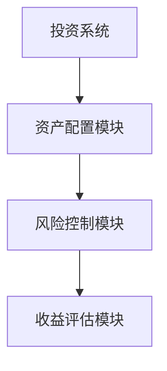
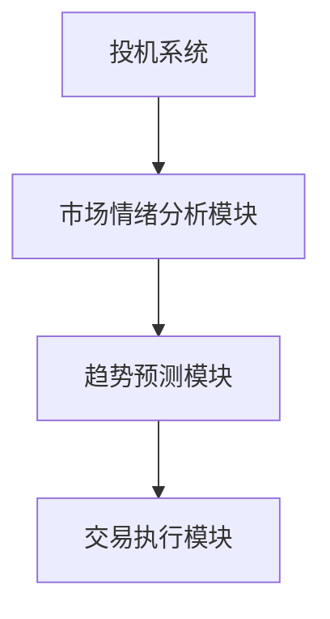

                 

# 格雷厄姆对投机与投资的区分

> 关键词：格雷厄姆，投资，投机，内在价值，安全边际，市场情绪，风险管理

> 摘要：本文深入探讨了格雷厄姆对投资与投机的区分，分析了两者的核心逻辑、数学模型、系统架构以及实际案例，帮助读者理解投资与投机的本质区别，并掌握如何在实际操作中应用这些概念。

---

## 第一部分: 格雷厄姆对投机与投资的区分概述

### 第1章: 投资与投机的基本概念

#### 1.1 格雷厄姆的背景与投资哲学

格雷厄姆（Benjamin Graham）是20世纪最著名的价值投资者之一，被誉为“价值投资之父”。他的投资哲学的核心是寻找那些市场价格低于其内在价值的股票，并长期持有，以获得稳定的收益。他的思想深刻影响了沃伦·巴菲特等投资者。

#### 1.2 投资与投机的定义

- **投资**：投资是指通过购买资产（如股票、债券、房地产等），以期获得长期稳定的收益。投资注重资产的内在价值，强调基本面分析和风险控制。
- **投机**：投机是指通过预测市场价格的短期波动，以期在短时间内获得收益。投机依赖市场情绪和趋势分析，风险较高。

### 1.3 投资与投机的主要区别

| **方面** | **投资** | **投机** |
|----------|----------|----------|
| 时间跨度 | 长期     | 短期     |
| 风险     | 较低     | 较高     |
| 收益来源 | 内在价值 | 市场波动 |
| 分析方法 | 基本面分析 | 技术分析和情绪分析 |

---

## 第2章: 投资与投机的核心逻辑

### 2.1 投资的核心逻辑

#### 2.1.1 内在价值理论

格雷厄姆提出，任何资产都有一个内在价值，这个价值可以通过基本面分析来估算。例如，股票的内在价值可以通过公司的盈利能力、资产质量等因素来计算。

- **公式**：$$ V = \frac{E}{k} $$
  其中，\( V \) 是内在价值，\( E \) 是预期收益，\( k \) 是折现率。

#### 2.1.2 安全边际

为了降低风险，格雷厄姆建议投资者以低于内在价值的价格购买资产，这个差额就是“安全边际”。

- **公式**：$$ \text{安全边际} = V - P $$
  其中，\( V \) 是内在价值，\( P \) 是市场价格。

#### 2.1.3 风险控制

投资的核心逻辑之一是通过分散投资和风险控制来降低整体风险。例如，投资者可以通过投资多个行业的股票来分散行业风险。

### 2.2 投机的核心逻辑

#### 2.2.1 市场情绪驱动

投机依赖于市场情绪的变化。当市场情绪乐观时，资产价格可能被推高；当情绪悲观时，价格可能被压低。

#### 2.2.2 短期波动与趋势预测

投机者关注市场的短期波动和趋势，通过预测这些变化来获利。例如，技术分析中的均线和形态分析常用于投机交易。

#### 2.2.3 风险收益比

由于投机的高风险，投机者需要在短期内获得较高的收益以弥补潜在的损失。

---

## 第3章: 投资与投机的数学模型与公式

### 3.1 投资的数学模型

#### 3.1.1 内在价值计算

$$ V = \frac{E}{k} $$
其中，\( E \) 是预期收益，\( k \) 是折现率。

#### 3.1.2 安全边际计算

$$ \text{安全边际} = V - P $$

### 3.2 投机的数学模型

#### 3.2.1 市场情绪指数模型

$$ S = \alpha \cdot M + \beta \cdot V $$
其中，\( S \) 是市场情绪指数，\( M \) 是市场消息，\( V \) 是市场波动性。

---

## 第4章: 投资与投机的系统架构设计

### 4.1 投资系统的架构设计

#### 4.1.1 功能模块

### 4.2 投机系统的架构设计

#### 4.2.1 功能模块

---

## 第5章: 投资与投机的项目实战

### 5.1 投资项目的实战分析

#### 5.1.1 项目背景

假设我们有一个100万美元的投资组合，目标是通过长期投资实现年化收益8%。

#### 5.1.2 投资策略

1. 选择具有稳定盈利能力和良好财务状况的公司。
2. 计算每只股票的内在价值，并确保以合理的价格购买。
3. 分散投资，避免过度集中。

#### 5.1.3 结果分析

经过5年的投资，组合的年化收益接近目标，且波动性较低。

### 5.2 投机项目的实战分析

#### 5.2.1 项目背景

假设我们有一个10万美元的投机组合，目标是通过短期交易实现月化收益5%。

#### 5.2.2 投机策略

1. 使用技术分析预测短期趋势。
2. 根据市场情绪调整仓位。
3. 设置止损和止盈点。

#### 5.2.3 结果分析

投机组合的收益波动较大，但部分月份收益超过目标，部分月份则可能亏损。

---

## 第6章: 投资与投机的最佳实践

### 6.1 投资的注意事项

1. 长期投资，避免频繁交易。
2. 重视安全边际，避免过度乐观。
3. 分散投资，降低风险。

### 6.2 投机的注意事项

1. 短期操作，严格控制风险。
2. 保持理性，避免情绪化决策。
3. 设置止损，及时止损。

### 6.3 总结

投资与投机的本质区别在于时间跨度和风险收益比。投资适合追求长期稳健收益的投资者，而投机适合能够承受高风险且具备市场敏感性的交易者。

---

通过本文的分析，我们可以更好地理解格雷厄姆的投资哲学，并在实际操作中根据自己的风险承受能力和投资目标选择合适的投资策略。

