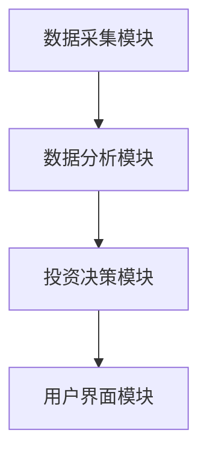
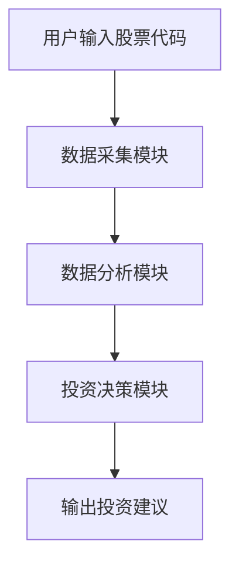

                 


```markdown
# 格雷厄姆、巴菲特、费雪和约翰伯格的投资理念比较

> 关键词：价值投资，成长股投资，指数投资，巴菲特，格雷厄姆，费雪，约翰伯格

> 摘要：本文通过比较分析格雷厄姆、巴菲特、费雪和约翰伯格四位投资大师的投资理念，探讨它们的核心思想、策略差异以及实际应用中的优劣。结合技术语言的逻辑分析，本文将从背景、理论、策略、系统架构等多维度展开，为读者提供深入的理解和实践指导。

---

# 第一部分: 投资理念的背景与概述

## 第1章: 投资理念的背景与概述

### 1.1 投资理念的演变

#### 1.1.1 传统投资理念的局限性
- 传统投资过于依赖市场短期波动，忽视长期价值。
- 投资者容易受到情绪影响，导致决策失误。

#### 1.1.2 现代投资理念的兴起
- 现代投资理念强调长期价值和风险管理。
- 技术分析与基本面分析的结合成为主流。

#### 1.1.3 格雷厄姆、巴菲特、费雪和约翰伯格的贡献
- 格雷厄姆：价值投资之父，奠定了现代价值投资的基础。
- 巴菲特：将格雷厄姆的价值投资理念与费雪的成长股理念结合。
- 费雪：提出成长股投资理论，强调公司成长性。
- 约翰伯格：指数投资的倡导者，简化投资流程。

### 1.2 投资理念的核心概念

#### 1.2.1 投资的基本定义与分类
- 投资：通过购买资产获取未来收益的行为。
- 分类：价值投资、成长投资、指数投资等。

#### 1.2.2 格雷厄姆的价值投资理念
- 核心思想：买入低于内在价值的股票，长期持有。
- 安全边际：买入价格与内在价值的差距，确保投资的安全性。

#### 1.2.3 费雪的成长股投资理念
- 核心思想：投资于具有持续增长潜力的公司。
- 十倍股：费雪提出“十倍股”概念，寻找具有长期增长潜力的股票。

#### 1.2.4 巴菲特的综合投资策略
- 结合格雷厄姆的安全边际和费雪的成长股理念。
- 强调公司护城河和长期竞争优势。

#### 1.2.5 约翰伯格的指数投资理念
- 核心思想：通过投资指数基金，分散风险，获得市场平均收益。
- 简化投资：避免个股选择，降低交易成本。

### 1.3 本章小结
本章从投资理念的演变出发，介绍了格雷厄姆、巴菲特、费雪和约翰伯格的核心思想，为后续的比较分析奠定基础。

---

# 第二部分: 格雷厄姆、巴菲特、费雪和约翰伯格的投资理念

## 第2章: 格雷厄姆的价值投资理念

### 2.1 格雷厄姆的生平与投资背景

#### 2.1.1 格雷厄姆的教育与职业经历
- 格雷厄姆是20世纪初著名的投资家和学者，著有《聪明的投资者》。

#### 2.1.2 《聪明的投资者》的核心思想
- 价值投资的核心：买入低于内在价值的股票，长期持有。

### 2.2 格雷厄姆的价值投资策略

#### 2.2.1 安全边际的概念
- 安全边际 = 内在价值 - 市场价格。
- 通过安全边际确保投资的安全性。

#### 2.2.2 股票内在价值的计算方法
- 内在价值 = 股息率 + 贴现率。
- 通过基本面分析计算股票的内在价值。

#### 2.2.3 低市盈率与高股息率的投资策略
- 低市盈率：避免高估的股票。
- 高股息率：寻找稳定的收益来源。

### 2.3 格雷厄姆的成功案例与局限性

#### 2.3.1 格雷厄姆的经典投资案例
- 通过购买低市盈率股票实现长期收益。

#### 2.3.2 格雷厄姆策略的适用场景与局限性
- 适用场景：市场估值较低时。
- 局限性：在高增长市场中可能错失机会。

## 第3章: 巴菲特的投资理念

### 3.1 巴菲特的生平与投资背景

#### 3.1.1 巴菲特的教育与职业经历
- 巴菲特师从格雷厄姆，继承并发展了他的价值投资理念。

#### 3.1.2 巴菲特与格雷厄姆的关系
- 巴菲特将格雷厄姆的安全边际理念与费雪的成长股理念结合。

### 3.2 巴菲特的价值投资与成长股投资结合策略

#### 3.2.1 巴菲特的“护城河”概念
- 护城河：公司竞争优势的来源，如品牌、技术、成本优势等。

#### 3.2.2 巴菲特的长期投资理念
- 长期持有优质股票，避免频繁交易。

#### 3.2.3 巴菲特的股票筛选标准
- 公司具有强大的护城河。
- 管理层诚实可靠。
- 股价低于内在价值。

### 3.3 巴菲特的成功案例与局限性

#### 3.3.1 巴菲特的经典投资案例
- 投资可口可乐、IBM等公司，实现长期收益。

#### 3.3.2 巴菲特策略的适用场景与局限性
- 适用场景：市场中存在具有强大护城河的公司。
- 局限性：在市场波动较大时，可能需要调整策略。

## 第4章: 费雪的成长股投资理念

### 4.1 费雪的生平与投资背景

#### 4.1.1 费雪的教育与职业经历
- 费雪是20世纪中期著名的成长股投资者，著有《股票作手回忆录》。

#### 4.1.2 费雪的投资理念与《股票作手回忆录》
- 费雪提出“十倍股”概念，寻找具有长期增长潜力的股票。

### 4.2 费雪的成长股投资策略

#### 4.2.1 成长股的定义与特征
- 成长股：具有持续增长潜力的公司股票。
- 特征：高市盈率、高增长速度。

#### 4.2.2 费雪的“十倍股”概念
- 十倍股：具有长期增长潜力的股票，能够在10年内增长10倍。

#### 4.2.3 股票筛选标准
- 公司具有持续增长的潜力。
- 管理层具有良好的管理能力。

### 4.3 费雪的成功案例与局限性

#### 4.3.1 费雪的经典投资案例
- 投资苹果公司，实现长期增长。

#### 4.3.2 费雪策略的适用场景与局限性
- 适用场景：市场中有高增长潜力的公司。
- 局限性：在市场波动较大时，可能面临较高的风险。

## 第5章: 约翰伯格的指数投资理念

### 5.1 约翰伯格的生平与投资背景

#### 5.1.1 约翰伯格的教育与职业经历
- 约翰伯格是指数投资的倡导者，创立了先锋集团。

#### 5.1.2 约翰伯格的投资理念
- 索普法则：通过分散投资降低风险。
- 指数投资：投资市场指数基金，获得市场平均收益。

### 5.2 约翰伯格的指数投资策略

#### 5.2.1 指数投资的核心思想
- 投资指数基金，分散风险，获得市场平均收益。

#### 5.2.2 索普法则的数学模型
- 索普法则：投资比例 = 最小方差组合。
- 数学公式：$$ w = \frac{r_p}{\sigma_p^2} $$

#### 5.2.3 约翰伯格的指数投资策略
- 通过投资指数基金，分散投资风险，降低交易成本。

### 5.3 约翰伯格的成功案例与局限性

#### 5.3.1 约翰伯格的经典投资案例
- 投资标普500指数基金，长期获得市场平均收益。

#### 5.3.2 约翰伯格策略的适用场景与局限性
- 适用场景：市场波动较大时，指数投资能够分散风险。
- 局限性：无法超越市场平均收益。

---

# 第三部分: 投资理念的比较与应用

## 第6章: 格雷厄姆、巴菲特、费雪和约翰伯格的投资理念比较

### 6.1 格雷厄姆与巴菲特的比较

#### 6.1.1 核心思想的异同
- 相同点：都强调安全边际和长期投资。
- 不同点：格雷厄姆更注重股票的内在价值，巴菲特更注重公司的护城河。

#### 6.1.2 投资策略的优劣
- 格雷厄姆：适合市场估值较低时，风险较低。
- 巴菲特：适合市场中有优质公司时，收益潜力更大。

### 6.2 费雪与约翰伯格的比较

#### 6.2.1 核心思想的异同
- 相同点：都注重长期投资。
- 不同点：费雪注重成长股，约翰伯格注重指数投资。

#### 6.2.2 投资策略的优劣
- 费雪：适合市场中有高增长潜力的公司，收益潜力更大。
- 约翰伯格：适合市场波动较大时，风险分散。

### 6.3 各种投资理念的综合分析

#### 6.3.1 各种投资理念的有效性
- 价值投资：在市场低估时表现较好。
- 成长投资：在市场高估时可能面临风险。
- 指数投资：适合长期稳健的投资者。

#### 6.3.2 不同市场的适用性
- 牛市：成长股投资表现较好。
- 熊市：价值投资和指数投资表现较好。

## 第7章: 投资理念的系统架构与实现

### 7.1 系统架构设计

#### 7.1.1 系统功能需求
- 数据采集：股票价格、财务数据等。
- 数据分析：计算内在价值、市盈率等指标。
- 投资决策：根据不同投资理念生成投资建议。

#### 7.1.2 系统架构图


### 7.2 系统实现

#### 7.2.1 环境安装
- Python 3.8以上版本
- 数据分析库：Pandas、NumPy
- 可视化库：Matplotlib
- 数据获取库：Yahoo Finance API

#### 7.2.2 核心代码实现

```python
import pandas as pd
import numpy as np

# 获取股票数据
def get_stock_data(ticker):
    # 从Yahoo Finance获取数据
    data = pd.DataFrame()
    return data

# 计算内在价值
def calculate_intrinsic_value(data, growth_rate):
    return data['每股收益'] * (1 + growth_rate) / data['股息率']

# 根据不同投资理念生成投资建议
def generate_investment_recommendation(data, growth_rate):
    # 价值投资：格雷厄姆
    if data['市盈率'] < 15:
        return "买入"
    # 成长投资：费雪
    elif data['净利润增长率'] > 20:
        return "买入"
    # 指数投资：约翰伯格
    else:
        return "持有"

# 主函数
def main():
    ticker = "AAPL"
    data = get_stock_data(ticker)
    recommendation = generate_investment_recommendation(data, 0.1)
    print(f"投资建议：{recommendation}")

if __name__ == "__main__":
    main()
```

#### 7.2.3 系统交互流程图


## 第8章: 项目实战与案例分析

### 8.1 项目实战

#### 8.1.1 环境安装
- 安装Python和必要的库
- 安装Yahoo Finance API

#### 8.1.2 核心代码实现
- 数据采集模块：获取股票数据
- 数据分析模块：计算内在价值、市盈率等指标
- 投资决策模块：根据不同投资理念生成投资建议

#### 8.1.3 投资组合优化
- 使用数学模型优化投资组合
- 计算风险与收益的平衡点

### 8.2 案例分析

#### 8.2.1 格雷厄姆策略的案例分析
- 选择一只低市盈率股票，计算内在价值，决定是否买入。

#### 8.2.2 费雪策略的案例分析
- 选择一只高增长潜力的股票，计算净利润增长率，决定是否买入。

#### 8.2.3 约翰伯格策略的案例分析
- 投资指数基金，计算长期收益与风险。

---

# 第四部分: 总结与展望

## 第9章: 总结与展望

### 9.1 总结
- 格雷厄姆的价值投资理念适合市场低估时的长期投资。
- 费雪的成长股投资理念适合市场高估时的高增长投资。
- 约翰伯格的指数投资理念适合稳健的长期投资。

### 9.2 展望
- 不同投资理念的结合：可以根据市场环境动态调整投资策略。
- 未来投资理念的发展：随着技术的进步，更多智能化的投资工具将被开发出来。

### 9.3 最佳实践 Tips
- 根据市场环境选择合适的投资理念。
- 定期调整投资组合，分散风险。
- 长期投资，避免频繁交易。

---

# 附录: 参考文献与扩展阅读

- 《聪明的投资者》——格雷厄姆
- 《股票作手回忆录》——费雪
- 《巴菲特致股东的信》——巴菲特
- 《指数投资策略》——约翰伯格
- Python数据分析库：Pandas、NumPy、Matplotlib
- Yahoo Finance API

---

# 结语

通过比较分析格雷厄姆、巴菲特、费雪和约翰伯格的投资理念，我们可以更好地理解不同投资策略的优劣，从而根据市场环境和个人风险偏好选择合适的投资策略。同时，结合技术语言的逻辑分析，本文为读者提供了从理论到实践的全面指导。
```

