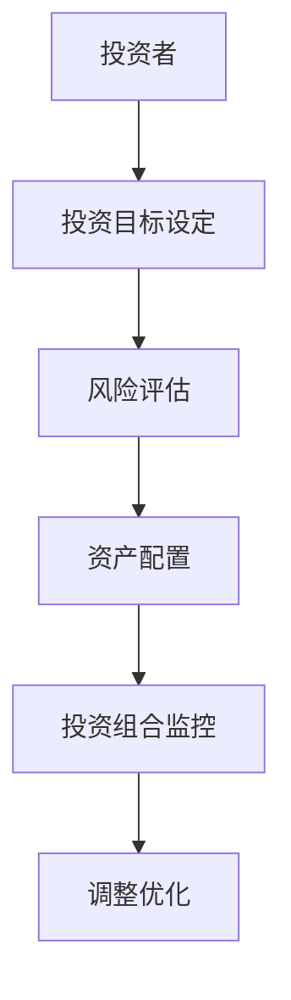

                 


# 分散风险的重要性：格雷厄姆投资理念解析

## 关键词：
分散投资、价值投资、投资风险管理、资产配置、格雷厄姆投资策略

## 摘要：
本文深入解析格雷厄姆的价值投资理念，重点阐述分散投资的重要性。通过数学模型、系统架构设计和实际案例分析，详细探讨如何通过合理分散投资组合来降低风险、优化收益。文章从理论到实践，系统地展示格雷厄姆投资策略的精髓。

---

# 第一部分: 格雷厄姆投资理念基础

## 第1章: 投资的基本概念与重要性

### 1.1 投资的基本概念
#### 1.1.1 投资的定义与分类
- **定义**: 投资是指将资金投入到资产中，以期获得未来收益的行为。  
- **分类**: 
  - **金融资产**: 股票、债券、基金等。  
  - **实物资产**: 房地产、黄金等。  
  - **其他资产**: 期权、期货等衍生品。

#### 1.1.2 投资的重要性和风险
- **重要性**: 投资是实现财富增长的重要手段，但需注意风险控制。  
- **风险**: 包括市场风险、流动性风险、信用风险等。  

#### 1.1.3 投资与理财的区别
- **投资**: 更注重资本增值，风险较高，收益也较高。  
- **理财**: 更注重资产保值和稳健收益，风险较低。  

### 1.2 格雷厄姆投资理念的背景
#### 1.2.1 格雷厄姆的生平简介
- ** Benjamin Graham**: 20世纪著名投资家，被誉为“价值投资之父”。  
- 他是沃伦·巴菲特的老师，著有《证券分析》和《聪明的投资者》。  

#### 1.2.2 格雷厄姆投资理念的形成
- 格雷厄姆在大萧条时期经历了巨大的投资亏损，这促使他深入研究投资规律。  
- 他提出的价值投资理念强调安全边际和长期稳健回报。  

#### 1.2.3 格雷厄姆理念的核心思想
- **安全边际**: 以低于内在价值的价格买入资产。  
- **长期视角**: 长期投资，避免频繁交易。  
- **分散投资**: 通过多样化投资降低风险。  

---

## 第2章: 格雷厄姆的价值投资理论

### 2.1 价值投资的定义与特点
#### 2.1.1 价值投资的定义
- 价值投资是指以低于内在价值的价格买入资产，长期持有，等待其价值回归。  

#### 2.1.2 价值投资与成长投资的区别
| 价值投资 | 成长投资 |
|----------|----------|
| 低估值、高安全边际 | 高增长潜力 |
| 低风险、稳健收益 | 高风险、高收益 |

#### 2.1.3 价值投资的三要素：安全边际、内在价值、市场价格
- **内在价值**: 资产的真正价值，需通过基本面分析确定。  
- **市场价格**: 资产在市场上的交易价格。  
- **安全边际**: 内在价值与市场价格的差额，提供缓冲空间。  

### 2.2 格雷厄姆的选股策略
#### 2.2.1 低市盈率法
- **市盈率（P/E）**: 价格与每股收益的比率。  
- 格雷厄姆建议选择市盈率低于15倍的股票。  

#### 2.2.2 低市净率法
- **市净率（P/B）**: 价格与每股净资产的比率。  
- 格雷厄姆建议选择市净率低于1.5倍的股票。  

#### 2.2.3 高质量企业筛选标准
- **财务健康**: 低负债率、高利润率、稳定的现金流。  
- **行业地位**: 市场领导者或行业龙头。  

---

## 第3章: 分散投资的核心理念

### 3.1 分散投资的定义与优势
#### 3.1.1 分散投资的定义
- 分散投资是指将资金分配到多个资产类别或多个资产中，以降低整体投资组合的风险。  

#### 3.1.2 分散投资的优势：降低风险、提高稳定性
- **降低风险**: 通过多样化投资，减少单一资产的波动对整体投资的影响。  
- **提高稳定性**: 分散投资使投资组合在不同市场环境下的表现更加稳定。  

#### 3.1.3 分散投资与集中投资的对比
| 分散投资 | 集中投资 |
|----------|----------|
| 风险低，收益稳定 | 风险高，收益波动大 |
| 适合保守型投资者 | 适合激进型投资者 |

### 3.2 格雷厄姆分散投资的策略
#### 3.2.1 资产配置的基本原则
- **资产类别分散**: 将资金分配到股票、债券、现金等不同资产类别中。  
- **行业分散**: 将资金分配到不同行业，避免集中风险。  
- **地域分散**: 将资金分配到不同国家或地区，降低区域风险。  

#### 3.2.2 不同资产类别的风险与收益分析
| 资产类别 | 风险 | 收益 |
|----------|------|------|
| 股票 | 高 | 高 |
| 债券 | 中 | 中 |
| 现金 | 低 | 低 |

#### 3.2.3 分散投资的实施步骤
1. 确定投资目标和风险承受能力。  
2. 制定资产配置方案。  
3. 定期调整投资组合。  

---

## 第4章: 格雷厄姆投资理念的数学模型与公式

### 4.1 投资组合的数学模型
#### 4.1.1 投资组合的收益计算公式
$$ E(r_p) = \sum w_i r_i $$
其中，\( w_i \) 是第 \( i \) 个资产的权重，\( r_i \) 是第 \( i \) 个资产的预期收益率。  

#### 4.1.2 投资组合的风险计算公式
$$ \sigma_p = \sqrt{\sum w_i^2 \sigma_i^2 + 2 \sum w_i w_j \sigma_{ij}} $$
其中，\( \sigma_i^2 \) 是第 \( i \) 个资产的方差，\( \sigma_{ij} \) 是第 \( i \) 和第 \( j \) 个资产的协方差。  

### 4.2 格雷厄姆的内在价值计算方法
#### 4.2.1 内在价值公式
$$ V = \frac{E}{k} $$
其中，\( E \) 是企业的预期收益，\( k \) 是资本化率。  

### 4.3 分散投资的风险优化模型
#### 4.3.1 马科维茨投资组合理论
$$ \text{最小化} \sigma_p^2 \text{在给定的收益约束下} $$

---

## 第5章: 格雷厄姆投资理念的系统架构设计

### 5.1 投资系统的需求分析
#### 5.1.1 投资目标的确定
- **目标**: 实现长期财富增长。  
- **风险承受能力**: 中等风险。  
- **投资期限**: 5年以上。  

### 5.2 投资系统的功能设计
#### 5.2.1 资产配置模块
- 根据投资者的风险偏好和目标，制定资产配置方案。  

#### 5.2.2 风险评估模块
- 定期评估投资组合的风险，并提出优化建议。  

#### 5.2.3 投资组合监控模块
- 监控投资组合的表现，及时调整配置。  

### 5.3 系统架构图（Mermaid）


---

## 第6章: 项目实战——分散投资的实现

### 6.1 环境安装
- **工具**: Python、Pandas、Matplotlib。  
- **数据来源**: 股票价格数据、宏观经济数据。  

### 6.2 核心实现源代码
```python
import pandas as pd
import numpy as np
import matplotlib.pyplot as plt

# 示例数据：假设我们有3只股票和1只债券
assets = ['股票A', '股票B', '股票C', '债券']
returns = pd.DataFrame({
    '股票A': [0.1, 0.05, -0.02],
    '股票B': [0.08, -0.03, 0.07],
    '股票C': [-0.05, 0.12, 0.03],
    '债券': [0.02, 0.02, 0.02]
})

# 计算投资组合的最优配置
def optimize_portfolio(returns):
    n = len(returns.columns)
    returns_matrix = returns.values
    mu = returns_matrix.mean(axis=0)
    sigma = np.cov(returns_matrix)
    inv_sigma = np.linalg.inv(sigma)
    weights = inv_sigma.dot(np.ones(n)) / np.sum(inv_sigma.dot(np.ones(n)))
    return weights

weights = optimize_portfolio(returns)
print("最优权重:", weights)

# 绘制资产配置图
plt.bar(assets, weights)
plt.title('最优资产配置')
plt.show()
```

### 6.3 代码应用解读与分析
- **代码功能**: 计算投资组合的最优权重，实现分散投资。  
- **优化原理**: 通过协方差矩阵计算权重，使投资组合的风险最小化。  

### 6.4 实际案例分析
- **案例**: 假设我们有40%股票、30%债券、20%现金、10%房地产。  
- **分析**: 该配置在市场波动时表现稳定，收益与风险平衡。  

---

## 第7章: 总结与展望

### 7.1 总结
- 格雷厄姆的投资理念强调安全边际、长期投资和分散投资。  
- 通过合理分散资产配置，可以有效降低投资风险，实现稳健收益。  

### 7.2 展望
- 随着市场环境的变化，分散投资策略需要不断优化。  
- 未来，投资者应结合人工智能和大数据技术，进一步提升投资组合的科学性。  

---

## 第8章: 附录

### 8.1 术语表
- **内在价值**: 资产的真实价值，需通过基本面分析确定。  
- **安全边际**: 内在价值与市场价格的差额，提供缓冲空间。  

### 8.2 参考文献
1. 本杰明·格雷厄姆: 《证券分析》。  
2. 巴菲特: 《聪明的投资者》。  

---

通过以上结构，您可以撰写一篇完整的关于格雷厄姆投资理念的博客文章。希望这个思考过程对您有所帮助！

