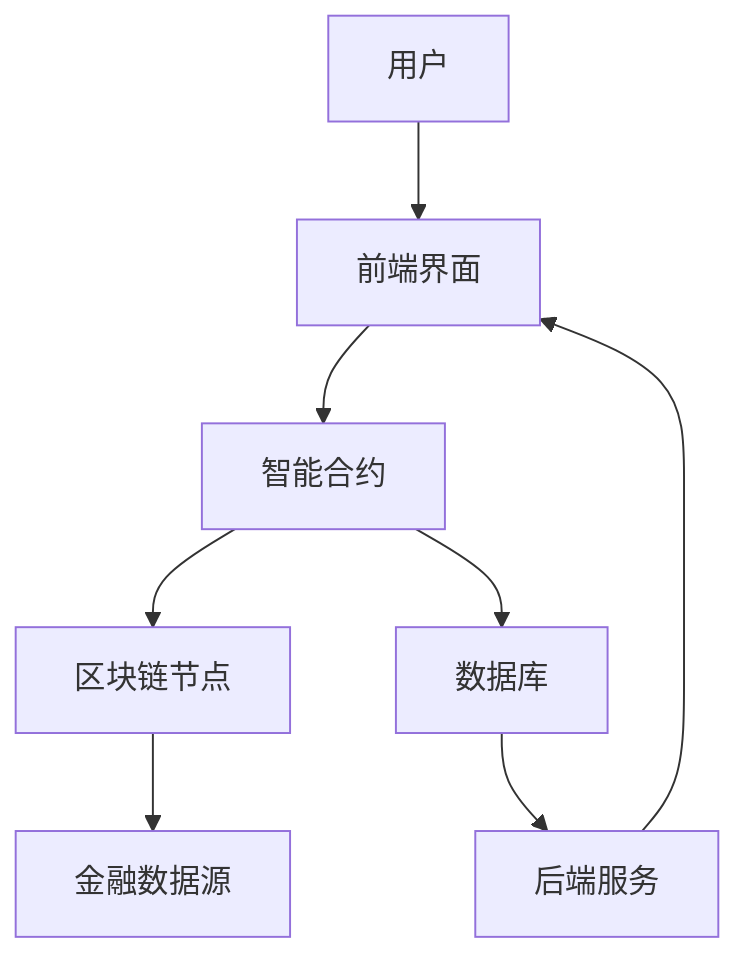

                 


# 格雷厄姆特价股票理论在代币化证券中的运用

## 关键词：格雷厄姆理论，代币化证券，价值投资，区块链，智能合约

## 摘要：格雷厄姆的价值投资理论，特别是其特价股票理念，在现代金融环境中通过代币化证券的应用得到了新的诠释。本文将详细探讨格雷厄姆理论的核心概念，分析其在代币化证券中的应用潜力，结合实际案例和系统架构设计，展示如何将这一经典投资理论与区块链技术相结合，以实现更高效、更透明的证券交易。文章还涵盖了算法实现、系统设计和项目实战，为读者提供全面的指导和见解。

---

## 第一部分: 格雷厄姆特价股票理论与代币化证券概述

### 第1章: 格雷厄姆投资理论的核心概念

#### 1.1 价值投资的定义与核心思想
价值投资是一种以基本面分析为基础的投资策略，旨在通过识别市场低估的资产，长期持有以实现资本增值。其核心思想是关注企业的内在价值，而非市场的短期波动。

#### 1.2 特价股票的定义与特征
特价股票是指市场价格低于其内在价值的股票。格雷厄姆认为，这类股票提供了安全边际，即市场价格与内在价值之间的差额，为投资者提供了足够的安全空间，以抵御市场的不确定性和波动性。

#### 1.3 安全边际的概念与重要性
安全边际是格雷厄姆理论中的核心概念，指的是市场价格与内在价值之间的差额。通过购买市场价格低于内在价值的股票，投资者能够在市场波动时降低风险，确保投资的安全性。

### 第2章: 代币化证券的基本概念与优势

#### 2.1 代币化证券的定义与分类
代币化证券是将传统金融资产（如股票、债券）转化为数字代币，利用区块链技术进行发行、转让和结算。其分类包括股权代币、债券代币和其他金融工具代币。

#### 2.2 代币化证券的核心优势
- **高效性**：区块链技术降低了交易成本和时间，提高了交易效率。
- **透明性**：区块链的去中心化特性确保了交易的透明性和可追溯性。
- **可编程性**：智能合约的应用使得金融工具的自动化管理成为可能。

#### 2.3 代币化证券的挑战与风险
- **技术风险**：区块链的安全性和稳定性是关键挑战。
- **法律风险**：代币化证券的监管框架尚不完善，存在法律不确定性。
- **市场风险**：价格波动和流动性问题可能影响投资价值。

---

## 第二部分: 格雷厄姆理论与代币化证券的结合

### 第3章: 格雷厄姆理论在代币化证券中的核心概念

#### 3.1 格雷厄姆理论的核心概念与代币化证券的对应关系
- **内在价值**：代币化证券的内在价值可以通过企业的基本面分析来评估。
- **安全边际**：通过比较代币价格与内在价值，寻找被低估的代币化证券。

#### 3.2 格雷厄姆理论与代币化证券的对比分析
| 核心概念         | 格雷厄姆理论                         | 代币化证券                         |
|------------------|------------------------------------|------------------------------------|
| 内在价值         | 企业未来现金流的折现值             | 数字资产的市场价值与企业基本面       |
| 安全边际         | 市场价格与内在价值的差额             | 代币价格与评估价值的差额             |
| 投资策略         | 买入并持有特价股票                 | 识别低估代币，长期持有               |

---

### 第4章: 格雷厄姆模型在代币化证券中的算法实现

#### 4.1 内在价值计算的数学模型
$$ V = \frac{CF}{(1 + r)^n} $$
其中，V是内在价值，CF是未来现金流，r是折现率，n是时间期限。

#### 4.2 基于格雷厄姆模型的代币化证券筛选算法
1. 计算目标企业的内在价值。
2. 比较代币的市场价格与内在价值。
3. 选择市场价格低于内在价值的代币进行投资。

#### 4.3 算法实现的Python代码
```python
import pandas as pd

def calculate_intrinsic_value(enterprise_data):
    # 假设enterprise_data包含未来现金流和折现率
    cf = enterprise_data['future_cash_flow']
    r = enterprise_data['discount_rate']
    n = enterprise_data['time_horizon']
    
    intrinsic_value = sum(cf / (1 + r)**i for i in range(n))
    return intrinsic_value

def graham_strategy(dataframe):
    dataframe['intrinsic_value'] = dataframe.apply(calculate_intrinsic_value, axis=1)
    dataframe['undervalued'] = dataframe['price'] < dataframe['intrinsic_value']
    return dataframe[dataframe['undervalued']]

# 示例数据
data = {
    'price': [50, 60, 70],
    'future_cash_flow': [100, 120, 150],
    'discount_rate': [0.08, 0.08, 0.08],
    'time_horizon': [5, 5, 5]
}
df = pd.DataFrame(data)
result = graham_strategy(df)
print(result)
```

---

### 第5章: 代币化证券平台的系统架构设计

#### 5.1 系统功能设计
- **用户界面**：提供代币筛选、价格查询、投资建议等功能。
- **智能合约**：用于代币的发行、转让和结算。
- **数据接口**：与区块链网络和其他金融数据源对接。

#### 5.2 系统架构图


#### 5.3 接口设计
- **API Endpoint**: `/api/graham_analysis`
- **Input**: 代币地址和相关数据
- **Output**: 分析结果和投资建议

---

### 第6章: 项目实战与案例分析

#### 6.1 环境安装
```bash
pip install eth-abi eth-account web3 pandas
```

#### 6.2 核心代码实现
```python
from web3 import Web3, HTTPProvider

# 初始化区块链连接
w3 = Web3(HTTPProvider('http://localhost:8545'))

# 智能合约地址和ABI
contract_address = '0x...'
contract_abi = '[...]'

# 连接智能合约
contract = w3.eth.contract(address=contract_address, abi=contract_abi)

# 查询代币价格
price = contract.functions.getTokenPrice().call()
print(price)
```

#### 6.3 案例分析
通过分析某代币的价格与内在价值，验证格雷厄姆策略的有效性。

---

### 第7章: 最佳实践与小结

#### 7.1 投资策略建议
- 确保代币化证券的透明性和合规性。
- 结合格雷厄姆模型和区块链技术，提高投资效率和安全性。

#### 7.2 注意事项
- 代币化证券的市场波动较大，需谨慎操作。
- 关注监管动态，确保投资活动的合法性。

#### 7.3 未来展望
随着区块链技术的成熟和监管框架的完善，格雷厄姆理论在代币化证券中的应用将更加广泛和深入。

---

通过以上内容，我们详细探讨了格雷厄姆特价股票理论在代币化证券中的应用，从理论基础到实际操作，为投资者提供了全面的指导和见解。希望本文能够帮助读者更好地理解和应用这一经典投资理论，抓住数字时代下的投资机遇。

