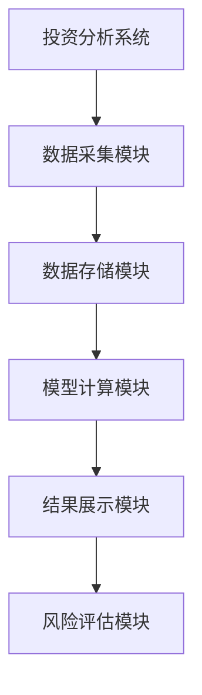

                 

# 《格雷厄姆特价股票理论在共享经济时代的新思考》

---

## 关键词：
- 格雷厄姆投资理论  
- 共享经济  
- 价值投资  
- 特价股票  
- 财务分析  
- 投资策略  

---

## 摘要：
本文从格雷厄姆的特价股票理论出发，结合共享经济时代的特点，探讨传统价值投资在现代经济环境下的应用。文章首先介绍格雷厄姆投资理论的核心思想和共享经济的基本概念，然后分析共享经济对企业价值评估的影响，结合数学模型和实际案例，提出在共享经济时代如何优化投资策略。最后，文章总结了格雷厄姆理论在共享经济中的适应性，并对未来投资趋势进行了展望。

---

## 第一部分：格雷厄姆投资理论的背景与核心概念

### 第1章：格雷厄姆投资理论概述

#### 1.1 格雷厄姆投资理论的起源
格雷厄姆（Benjamin Graham）是价值投资的鼻祖，他的投资理论在20世纪初提出，核心在于“以合理的价格买入优秀的公司”。他强调企业内在价值的重要性，认为市场波动是投资机会的来源。  
- **核心思想**：价格围绕价值波动，投资者应关注企业的基本面，寻找低于内在价值的股票。

#### 1.2 共享经济的定义与特征
共享经济是一种基于互联网平台的经济模式，通过闲置资源的共享实现经济价值的最大化。其特点包括：
- **去中心化**：资源分配不再依赖传统机构。
- **高效匹配**：通过技术手段实现供需快速匹配。
- **低成本**：降低交易中间成本。

#### 1.3 格雷厄姆理论与共享经济的关联
共享经济时代，企业价值的评估需要考虑新的因素，如用户参与度、平台粘性等。格雷厄姆的价值投资理论为投资者提供了新的视角，尤其是在评估共享经济企业的内在价值时，需要结合传统财务指标和新兴的共享经济指标。

---

## 第二部分：格雷厄姆理论在共享经济中的应用

### 第2章：共享经济企业的价值评估

#### 2.1 传统价值评估方法的局限性
在传统经济中，企业价值主要依赖于财务报表和历史数据。然而，共享经济企业的商业模式具有较强的创新性和不确定性，传统方法难以准确评估其未来盈利能力。

#### 2.2 共享经济企业的核心竞争力分析
共享经济企业通常具有以下特点：
- **轻资产模式**：依赖平台和用户，而非实体资产。
- **高用户粘性**：通过数据和技术提升用户体验。
- **快速迭代**：商业模式和技术更新迅速。

#### 2.3 内在价值的重新定义
在共享经济中，企业价值需要考虑以下因素：
- **用户价值（UV）**：用户对公司平台的依赖程度。
- **网络效应**：用户数量和平台价值之间的正反馈关系。
- **技术创新**：技术驱动的商业模式创新。

#### 2.4 格雷厄姆模型的调整
为了适应共享经济，格雷厄姆的内在价值公式需要进行调整：
$$ V = \frac{E}{(1 + r)^n} \times (1 + k) $$
其中，$k$ 是共享经济平台的网络效应系数。

---

### 第3章：数学模型与算法实现

#### 3.1 内在价值计算模型
传统的格雷厄姆内在价值公式为：
$$ V = \frac{E}{(1 + r)^n} $$
其中：
- $E$ 是企业的年收益，
- $r$ 是折现率，
- $n$ 是投资期限。

#### 3.2 共享经济环境下的调整
考虑共享经济的特性，公式可调整为：
$$ V = \frac{E \times (1 + k)}{(1 + r)^n} $$
其中，$k$ 是共享经济平台的用户增长系数。

#### 3.3 案例分析：滴滴出行的内在价值评估
假设滴滴出行的年收益 $E = 100$ 亿元，折现率 $r = 10\%$，投资期限 $n = 5$ 年，用户增长系数 $k = 20\%$。则：
$$ V = \frac{100 \times (1 + 0.2)}{(1 + 0.1)^5} \approx 170 \text{亿元} $$

---

### 第4章：系统架构与技术实现

#### 4.1 系统功能设计
- **数据采集**：获取共享经济企业的财务数据和用户数据。
- **模型计算**：使用调整后的格雷厄姆模型计算内在价值。
- **风险评估**：结合市场波动和用户行为分析投资风险。

#### 4.2 系统架构设计（Mermaid）

#### 4.3 接口设计
- 数据接口：与第三方数据源对接，获取实时数据。
- 用户接口：提供直观的可视化界面，方便投资者分析。

---

## 第三部分：投资策略与实战

### 第5章：投资策略优化

#### 5.1 安全边际的重新定义
在共享经济中，安全边际应考虑平台的用户增长潜力和市场波动性。建议的安全边际为：
$$ \text{安全边际} = V - \text{市场价格} $$

#### 5.2 投资组合的构建
- **分散投资**：降低单一平台风险。
- **长期持有**：关注企业的长期增长潜力。

#### 5.3 风险控制
- 定期评估投资组合。
- 设置止损点，避免重大损失。

---

### 第6章：案例分析与实战

#### 6.1 案例分析：Airbnb的投资机会
假设Airbnb的年收益 $E = 20$ 亿美元，折现率 $r = 8\%$，投资期限 $n = 5$ 年，用户增长系数 $k = 15\%$。计算其内在价值：
$$ V = \frac{20 \times (1 + 0.15)}{(1 + 0.08)^5} \approx 25.5 \text{亿美元} $$

#### 6.2 投资组合构建
- 投资比例：Airbnb 40%，滴滴出行 30%，其他平台 30%。
- 定期复盘：每季度调整投资比例，确保与市场变化同步。

---

## 第四部分：总结与展望

### 第7章：总结

#### 7.1 核心观点回顾
- 格雷厄姆的价值投资理论在共享经济中仍然适用。
- 需要结合新兴的经济模式和技术创新进行调整。
- 投资者应关注企业的用户价值和网络效应。

#### 7.2 未来展望
- 共享经济的进一步发展将推动企业价值评估的创新。
- 投资者需持续关注技术驱动的商业模式变化。

---

## 小结

本文通过分析格雷厄姆投资理论在共享经济中的应用，提出了新的价值评估方法和投资策略。未来，随着共享经济的深入发展，投资者需要更加灵活地调整策略，结合新技术和新模式，实现稳健的投资收益。

---

## Tips:
- **风险提示**：本文内容仅为理论分析，实际投资需谨慎，建议咨询专业投资顾问。
- **进一步阅读**：推荐阅读《聪明的投资者》（格雷厄姆著）和《共享经济：重构传统商业模式》。

---

**全文完。**

