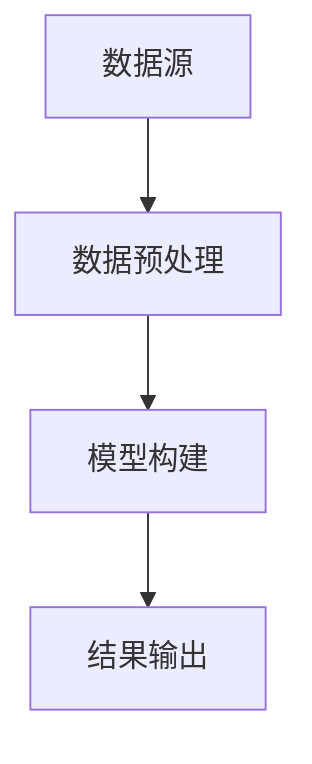

                 

# 《格雷厄姆特价股票理论在共享经济时代的新思考》

## 关键词：格雷厄姆特价股票理论、共享经济、投资策略、股票估值、经济模式

## 摘要：本文探讨了格雷厄姆特价股票理论在共享经济时代的应用与演变，分析了传统投资理论在现代经济环境中的挑战，并提出了适应共享经济的新投资策略和系统架构。通过案例分析和系统设计，本文为投资者提供了新的视角和实践指南。

---

## 第一部分：引言

### 第1章：格雷厄姆特价股票理论的背景与现状

#### 1.1 格雷厄姆特价股票理论的起源

格雷厄姆特价股票理论由 Benjamin Graham 提出，强调通过基本面分析寻找被低估的股票。其核心是寻找市场价格低于内在价值的股票，主要关注市盈率、市净率等指标。

#### 1.2 共享经济时代的投资新挑战

共享经济改变了传统经济模式，影响了企业的估值方式。投资者需要重新评估共享经济平台的商业模式、用户依赖性和资产流动性，这些因素对传统估值指标提出了挑战。

#### 1.3 本书的研究意义与目标

本文旨在探讨格雷厄姆理论在共享经济中的适用性，分析其优缺点，并提出新的投资策略。通过系统设计和案例分析，帮助投资者在新时代中有效应用这一理论。

---

## 第二部分：格雷厄姆特价股票理论的核心概念

### 第2章：特价股票理论的定义与特点

#### 2.1 格雷厄姆投资理念的核心要素

- **内在价值**：股票的真实价值，基于企业财务状况和未来现金流。
- **市场价值**：市场价格受市场情绪影响，可能偏离内在价值。
- **安全边际**：投资时考虑市场价格与内在价值的差距，降低风险。

#### 2.2 特价股票的筛选标准与评估指标

- **市盈率（P/E）**：股价与每股收益的比率。
- **市净率（P/B）**：股价与每股净资产的比率。
- **股息率**：股息与股价的比率。

#### 2.3 理论在传统投资中的应用案例

以某传统企业为例，通过分析其市盈率和市净率，发现其市场价格低于内在价值，从而判断为特价股票。

---

## 第三部分：共享经济时代对特价股票理论的影响

### 第3章：共享经济模式与投资环境的变化

#### 3.1 共享经济对传统经济模式的冲击

共享经济平台依赖用户和数据，传统企业资产和负债结构发生变化，影响其估值方式。

#### 3.2 共享经济时代下的资产流动性分析

共享经济模式下的资产流动性更高，企业需要更灵活的资本结构和更高的运营效率。

#### 3.3 投资者行为的变化与新机遇

投资者需要考虑共享经济平台的用户依赖性和数据价值，寻找新的投资机会。

---

## 第四部分：格雷厄姆特价股票理论在共享经济中的新发展

### 第4章：共享经济时代特价股票的新特征

#### 4.1 共享经济模式下的企业估值模型

结合共享经济特点，调整传统估值模型，引入用户增长、数据价值等因素。

#### 4.2 特价股票评估指标的调整与优化

- **用户依赖性**：平台依赖用户的数量和活跃度。
- **数据资产价值**：数据在平台中的价值影响企业估值。
- **运营效率**：平台的运营效率和成本控制能力。

#### 4.3 共享经济时代下的投资策略创新

- **动态调整**：根据市场变化动态调整估值模型。
- **数据驱动决策**：利用大数据分析用户行为和市场趋势。

---

## 第五部分：系统分析与架构设计

### 第5章：基于共享经济的特价股票分析系统

#### 5.1 系统功能需求分析

- **数据收集**：获取企业财务数据和市场数据。
- **模型构建**：建立适应共享经济的估值模型。
- **结果输出**：生成投资建议和风险评估。

#### 5.2 系统架构设计（Mermaid图）

#### 5.3 数据流与模块划分

- 数据预处理模块：清洗和转换数据。
- 模型构建模块：训练和优化模型。
- 结果输出模块：生成报告和可视化。

---

## 第六部分：项目实战与案例分析

### 第6章：共享经济平台的股票价值分析

#### 6.1 案例选择与数据收集

选择滴滴和Airbnb作为案例，收集其财务数据和市场数据。

#### 6.2 投资模型的构建与实现

基于用户增长和数据价值，构建新的估值模型。

#### 6.3 案例分析与结果解读

分析滴滴和Airbnb的股票价值，评估模型的有效性。

---

## 第七部分：总结与展望

### 第7章：格雷厄姆特价股票理论的未来思考

#### 7.1 理论在共享经济中的应用总结

总结理论在共享经济中的应用，指出其优缺点。

#### 7.2 投资者面临的挑战与建议

投资者需关注数据价值和用户依赖性，灵活调整投资策略。

#### 7.3 未来研究方向与发展趋势

未来研究可聚焦于数据驱动的估值模型和动态调整策略。

---

## 附录

### 附录A：相关术语表

列出本文中使用的术语及其定义。

### 附录B：参考文献与拓展阅读

列出参考文献和推荐的拓展阅读材料。

### 附录C：系统设计源代码

提供系统设计的相关代码片段。

### 附录D：数学模型与公式

详细列出本文中使用的数学模型和公式，使用LaTeX格式。

---

通过以上分析和撰写，本文系统地探讨了格雷厄姆特价股票理论在共享经济时代的新思考，结合理论分析和实际案例，为投资者提供了新的视角和实践指南。

