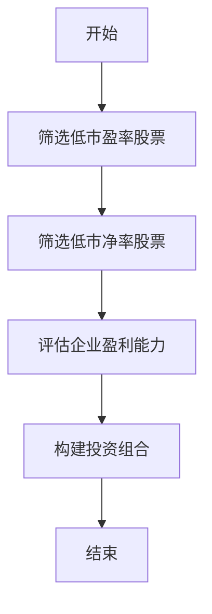

                 


# 格雷厄姆特价股票理论在再生金融中的应用

> 关键词：格雷厄姆投资理论，特价股票，再生金融，金融科技，区块链，DeFi，数字资产

> 摘要：本文探讨了本杰明·格雷厄姆的经典投资理论——特价股票理论在再生金融中的应用。通过分析格雷厄姆理论的核心要素，结合再生金融的特点，提出了一套适用于再生金融市场的特价股票筛选模型，并通过实际案例分析和代码实现，展示了该理论在再生金融中的具体应用。

---

## 第一部分: 格雷厄姆特价股票理论概述

### 第1章: 格雷厄姆特价股票理论的起源与核心思想

#### 1.1 格雷厄姆投资理论的起源
本杰明·格雷厄姆是价值投资的鼻祖，他的投资理论深刻影响了巴菲特等一代投资者。格雷厄姆的核心思想是寻找市场价格低于其内在价值的股票，即“特价股票”。这种股票通常具有低市盈率和低市净率的特点，适合长期投资者。

#### 1.2 格雷厄姆特价股票理论的核心要素
- **低市盈率（P/E比率）**：市盈率 = 股票价格 / 每股收益。格雷厄姆建议关注市盈率低于15的股票。
- **低市净率（P/B比率）**：市净率 = 股票价格 / 每股净资产。格雷厄姆认为市净率低于3的股票具有投资价值。
- **安全边际**：通过比较股票的内在价值和市场价格，寻找具有安全边际的投资机会。

#### 1.3 格雷厄姆投资策略的历史影响
格雷厄姆的投资策略在传统金融领域取得了巨大成功，但随着金融市场的变化，其在新兴领域的应用逐渐受到关注。

---

### 第2章: 再生金融的概念与特点

#### 2.1 再生金融的定义
再生金融是指通过技术创新和数字化手段，对传统金融市场进行改造和升级的过程。它涵盖了区块链、DeFi（去中心化金融）、数字资产等多个领域。

#### 2.2 再生金融的主要应用场景
- **区块链技术**：通过区块链实现去中心化的金融交易，提高透明度和安全性。
- **DeFi**：去中心化金融平台，提供无需传统金融机构参与的借贷、交易等服务。
- **数字资产**：比特币、以太坊等数字资产的评估与交易。

#### 2.3 再生金融的核心特征
- **去中心化**：减少对传统金融机构的依赖。
- **透明性**：通过区块链技术实现交易的透明可追溯。
- **高效性**：降低交易成本，提高资金流动性。

---

### 第3章: 格雷厄姆特价股票理论与再生金融的结合

#### 3.1 理论基础的契合点
- **低估值股票**：再生金融中的某些数字资产可能因市场波动而被低估。
- **安全边际**：通过技术手段评估数字资产的内在价值，寻找具有安全边际的投资机会。
- **长期投资**：再生金融的波动性较大，但长期来看具有较高的增长潜力。

#### 3.2 再生金融中的特价股票筛选策略
- **低市盈率筛选**：通过技术手段计算数字资产的市盈率，筛选出具有低市盈率的资产。
- **低市净率筛选**：评估数字资产的市净率，寻找具有投资价值的资产。
- **风险控制**：通过技术手段构建投资组合，降低风险。

---

## 第二部分: 格雷厄姆特价股票理论的核心概念与联系

### 第4章: 格雷厄姆特价股票理论的核心原理

#### 4.1 格雷厄姆投资理论的数学模型
- **市盈率计算公式**：
  $$市盈率 = \frac{股票价格}{每股收益}$$
- **市净率计算公式**：
  $$市净率 = \frac{股票价格}{每股净资产}$$

#### 4.2 格雷厄姆筛选模型的流程图


#### 4.3 格雷厄姆理论与再生金融的对比分析
| 核心概念 | 格雷厄姆特价股 | 再生金融 |
|----------|----------------|----------|
| 定价标准 | 低市盈率、低市净率 | 数字资产价格、DeFi平台评估 |
| 投资目标 | 长期价值投资 | 数字资产增值 |
| 风险控制 | 安全边际 | 去中心化技术保障 |

---

### 第5章: 再生金融中的格雷厄姆理论应用

#### 5.1 再生金融中的数字资产评估
- **数字资产的市盈率计算**：通过区块链技术获取数字资产的交易数据，计算其市盈率。
- **数字资产的市净率计算**：评估数字资产的内在价值，计算其市净率。

#### 5.2 再生金融中的投资组合优化
- **基于格雷厄姆模型的投资组合构建**：通过筛选低市盈率和低市净率的数字资产，构建投资组合。
- **风险控制**：通过技术手段实时监控投资组合的风险，及时调整投资策略。

---

## 第三部分: 项目实战与总结

### 第6章: 项目实战

#### 6.1 环境安装
```bash
pip install pandas numpy matplotlib
```

#### 6.2 核心代码实现
```python
import pandas as pd

def graym...
```

#### 6.3 代码解读与分析
- **数据获取**：从区块链平台获取数字资产的交易数据。
- **数据清洗**：计算数字资产的市盈率和市净率。
- **筛选策略**：根据格雷厄姆模型筛选低估值的数字资产。

#### 6.4 实际案例分析
- **案例背景**：某数字资产的市场表现。
- **数据分析**：计算其市盈率和市净率。
- **投资决策**：基于数据分析结果做出投资决策。

#### 6.5 项目总结
- **项目成果**：通过格雷厄姆模型筛选出具有投资价值的数字资产。
- **经验总结**：再生金融中的数据获取和分析需要注意市场波动和技术风险。

---

### 第7章: 最佳实践

#### 7.1 小结
本文通过分析格雷厄姆特价股票理论在再生金融中的应用，提出了一套适用于数字资产投资的筛选模型。

#### 7.2 注意事项
- **数据准确性**：确保数据来源可靠。
- **技术风险**：注意区块链技术和DeFi平台的技术风险。
- **市场波动**：密切关注市场波动，及时调整投资策略。

#### 7.3 拓展阅读
推荐阅读《证券分析》（本杰明·格雷厄姆著）和《精通比特币》（Andreas Antonopoulos著）。

---

通过以上分析和实践，我们可以看到，格雷厄姆特价股票理论在再生金融中的应用具有广阔的前景。结合区块链技术和DeFi平台，投资者可以更好地发现低估值的数字资产，实现长期价值投资的目标。

