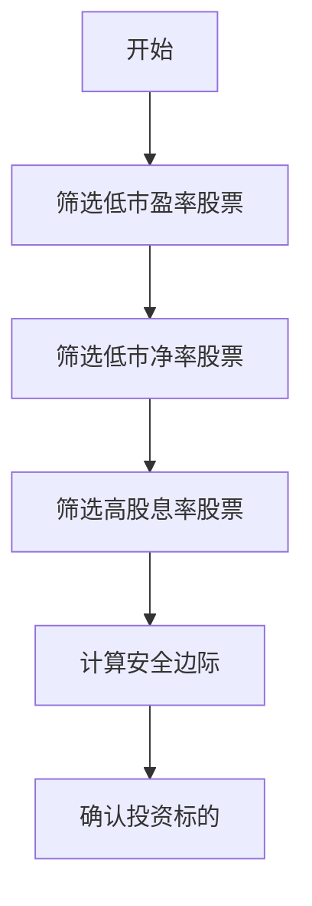
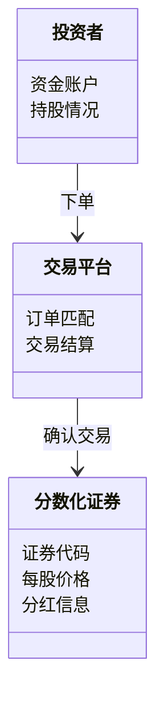
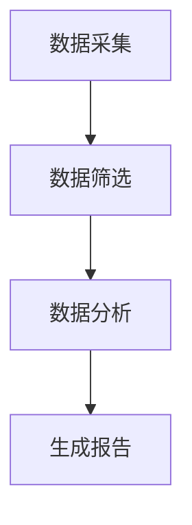
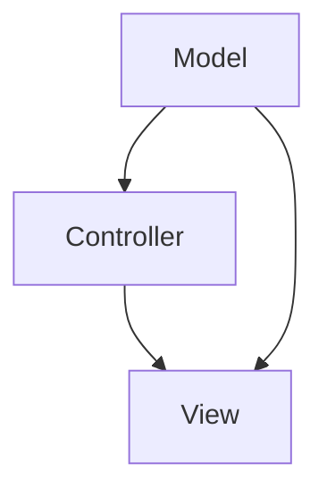
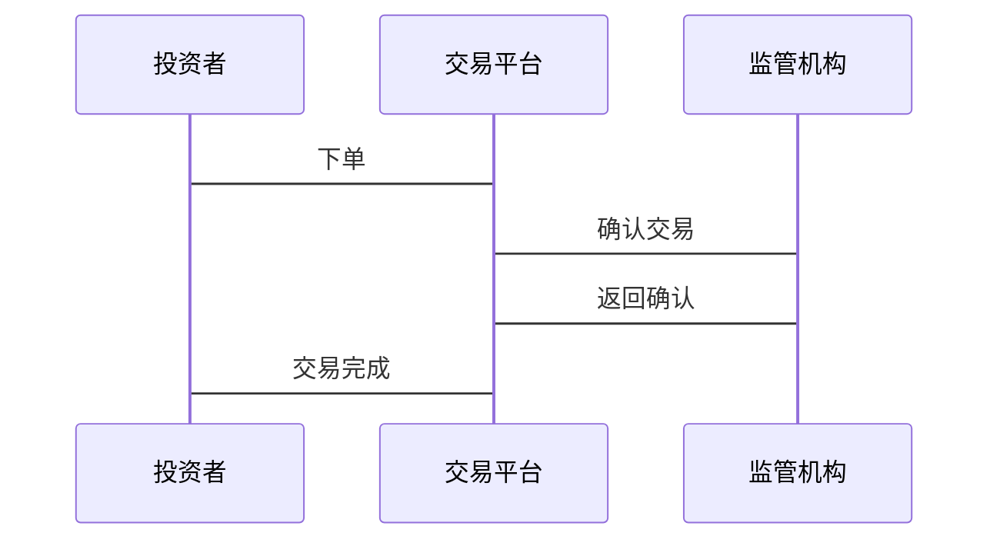

                 


```markdown
# 格雷厄姆特价股票理论在分数化所有权证券中的运用

## 关键词：格雷厄姆理论, 价值投资, 分数化所有权, 证券分析, 投资策略, 量化分析, 风险管理

## 摘要：本文系统地探讨了格雷厄姆特价股票理论在分数化所有权证券中的应用。首先介绍了证券市场的发展和格雷厄姆理论的背景，分析了分数化所有权证券的定义、特点及其与传统证券的区别。接着，详细阐述了格雷厄姆理论的核心概念，包括选股标准、安全边际和内在价值，并通过对比分析，探讨了这些理论如何在分数化所有权证券中得以应用。随后，从算法原理的角度，结合具体选股模型，通过Python代码实现，详细讲解了格雷厄姆理论的数学模型和量化分析方法。最后，通过系统架构设计和实际案例分析，展示了如何在分数化所有权证券市场中应用格雷厄姆理论，并总结了投资策略的最佳实践和风险管理要点。

# 第1章: 格雷厄姆特价股票理论的背景与核心概念

## 1.1 证券市场的发展与格雷厄姆理论的起源

### 1.1.1 证券市场的基本概念与发展历程
证券市场是投资者进行股票、债券等金融资产交易的场所，经历了从早期的实体交易所到现代电子化交易的演变。证券市场的功能包括资金筹集、价格发现和风险管理。随着科技的进步，尤其是互联网和大数据技术的发展，证券市场的交易方式和分析工具也在不断进步。

### 1.1.2 格雷厄姆与价值投资的起源
 Benjamin Graham是20世纪初著名的投资家和教授，被誉为“价值投资之父”。他的投资理念强调安全边际和内在价值，主张以低于内在价值的价格买入优质股票，长期持有，获得稳定的收益。格雷厄姆的学生包括Warren Buffett等著名投资者，他的理论对现代投资策略产生了深远影响。

### 1.1.3 格雷厄姆理论的核心思想与特点
 格雷厄姆理论的核心在于寻找被市场低估的股票，通过分析公司的财务状况、市场地位和未来前景，评估其内在价值，从而找到具有安全边际的投资标的。其特点是注重基本面分析，强调长期投资和风险管理，避免短期波动的干扰。

## 1.2 分数化所有权证券的定义与特点

### 1.2.1 分数化所有权证券的定义
 分数化所有权证券指的是将传统证券（如股票）拆分成更小的单位，投资者可以通过购买部分份额来获得该证券的权益。这种模式降低了投资者的进入门槛，使得小额资金也能参与证券市场。

### 1.2.2 分数化所有权证券与传统证券的区别
 主要区别包括：
 - 交易单位：分数化证券以更小的单位进行交易，如每股分成100股，投资者可以购买其中的一部分。
 - 资本门槛：传统证券需要较大的资金才能买入一股，而分数化证券允许投资者以更小的资金参与。
 - 交易灵活性：分数化证券可以更灵活地调整持仓，适合小额投资者。

### 1.2.3 分数化所有权证券的市场现状与发展趋势
 当前，随着技术的进步，越来越多的平台开始提供分数化证券交易服务。投资者可以通过这些平台购买部分股票，享受分红和资本增值。这种模式尤其适合新兴市场和小额投资者。

## 1.3 格雷厄姆理论与分数化所有权证券的结合

### 1.3.1 格雷厄姆理论在分数化所有权证券中的应用背景
 格雷厄姆理论强调的是寻找被低估的股票，而分数化所有权证券提供了更小的交易单位，使得投资者可以更灵活地应用该理论。对于小额投资者来说，分数化证券提供了更多的投资机会，同时也使得格雷厄姆的选股标准更易于实施。

### 1.3.2 分数化所有权证券如何满足格雷厄姆理论的要求
 分数化证券的特点，如低门槛和高灵活性，使得投资者可以更容易地按照格雷厄姆的标准筛选股票。同时，分数化证券的市场流动性较好，能够满足格雷厄姆理论中对安全边际的要求。

### 1.3.3 格雷厄姆理论在分数化所有权证券中的潜在价值
 格雷厄姆理论通过系统的分析方法，帮助投资者在分数化证券市场中找到具有长期投资价值的标的，避免短期波动带来的风险，实现稳健的投资回报。

## 1.4 本章小结

### 1.4.1 格雷厄姆理论的核心要点
 - 价值投资：寻找被市场低估的股票。
 - 安全边际：买入价格低于内在价值。
 - 长期持有：避免频繁交易。

### 1.4.2 分数化所有权证券的基本概念与特点
 - 小额投资：降低进入门槛。
 - 灵活交易：适合小额投资者。
 - 多样性：提供更多投资机会。

### 1.4.3 两者的结合对投资策略的影响
 - 优化投资组合：通过分数化证券实现多样化投资。
 - 风险管理：利用格雷厄姆理论降低投资风险。
 - 提高收益：通过长期价值投资获得稳定收益。

# 第2章: 格雷厄姆特价股票理论的核心概念与联系

## 2.1 格雷厄姆理论的核心概念

### 2.1.1 格雷厄姆的选股标准
 格雷厄姆的选股标准主要包括：
 - 低市盈率：市盈率低于市场平均水平。
 - 低市净率：市净率低于行业平均水平。
 - 高股息率：股息率较高，且股息支付稳定。

### 2.1.2 格雷厄姆的安全边际概念
 安全边际是指买入价格与内在价值之间的差额，确保即使市场价格波动，投资者也能获得正收益。安全边际的存在为投资者提供了风险缓冲。

### 2.1.3 格雷厄姆的内在价值计算方法
 内在价值是通过分析公司的财务状况、市场地位和未来前景，综合评估其实际价值。格雷厄姆通常采用市盈率和市净率等指标来估算内在价值。

## 2.2 分数化所有权证券的核心概念

### 2.2.1 分数化所有权证券的市场结构
 分数化所有权证券市场由多个参与者构成，包括投资者、交易平台和监管机构。投资者通过交易平台购买部分股票，平台负责撮合交易和结算。

### 2.2.2 分数化所有权证券的交易机制
 分数化证券的交易机制包括订单匹配、价格撮合和结算流程。投资者可以以部分份额的形式买卖股票，交易过程与传统证券类似，但单位更小。

### 2.2.3 分数化所有权证券的风险与收益分析
 分数化证券的风险包括市场波动、流动性风险和平台风险。收益方面，投资者可以通过资本增值和分红收益获得回报，但整体收益受市场影响较大。

## 2.3 格雷厄姆理论与分数化所有权证券的联系

### 2.3.1 格雷厄姆理论在分数化所有权证券中的应用领域
 格雷厄姆理论适用于所有类型的证券市场，包括分数化所有权证券。其选股标准和价值评估方法在分数化市场中同样有效。

### 2.3.2 分数化所有权证券如何影响格雷厄姆理论的实施
 分数化证券的灵活性和低门槛使得格雷厄姆理论更容易实施，投资者可以更方便地按照格雷厄姆的标准筛选和持有股票。

### 2.3.3 两者的结合对投资策略的优化作用
 通过结合分数化所有权证券，格雷厄姆理论的投资策略更加灵活和高效，投资者能够更好地实现资产配置和风险管理。

## 2.4 核心概念对比与ER实体关系图

### 2.4.1 核心概念对比表

| 概念              | 格雷厄姆理论                   | 分数化所有权证券               |
|-------------------|-------------------------------|------------------------------|
| 核心目标          | 寻找被低估的股票               | 提供小额投资机会               |
| 投资策略          | 价值投资，长期持有             | 灵活交易，风险控制             |
| 风险管理          | 安全边际，避免过度波动         | 分散投资，降低风险             |
| 适用场景          | 传统证券市场                   | 分数化证券市场                 |

### 2.4.2 ER实体关系图
```mermaid
erd
    左右方向
    投资者 ----(拥有)----> 分数化证券
    分数化证券 ----(属于)----> 公司股票
    投资者 ----(通过)----> 交易平台
    交易平台 ----(监管)----> 监管机构
```
# 第3章: 格雷厄姆理论在分数化证券中的算法原理

## 3.1 算法原理概述

### 3.1.1 算法概述
 格雷厄姆理论的选股算法基于基本面分析，通过筛选低市盈率、低市净率和高股息率的股票，找到具有安全边际的投资标的。

### 3.1.2 格雷厄姆选股模型
 使用Gurufocus模型作为选股算法，该模型基于格雷厄姆的选股标准，结合现代数据分析技术，筛选出符合条件的股票。

### 3.1.3 选股模型的流程


## 3.2 算法实现与代码解读

### 3.2.1 环境安装
 需要安装Python和相关库，如pandas、numpy和scrapy。

### 3.2.2 核心代码实现
```python
import pandas as pd
import numpy as np

# 定义筛选条件
def graham_screen(df):
    # 筛选低市盈率股票，市盈率<20
    df = df[df['PE'] < 20]
    # 筛选低市净率股票，市净率<2
    df = df[df['PB'] < 2]
    # 筛选高股息率股票，股息率>2%
    df = df[df['Dividend Yield'] > 0.02]
    return df

# 调用筛选函数
stocks = pd.read_csv('stock_data.csv')
selected_stocks = graham_screen(stocks)
print(selected_stocks)
```

### 3.2.3 代码解读
 1. 导入必要的库：pandas用于数据处理，numpy用于数组操作。
 2. 定义筛选函数：graham_screen函数根据市盈率、市净率和股息率筛选符合条件的股票。
 3. 读取数据：从CSV文件读取股票数据。
 4. 调用筛选函数：筛选符合条件的股票并输出结果。

## 3.3 算法原理的数学模型与公式

### 3.3.1 市盈率计算公式
 市盈率 = 股价 / 每股收益（EPS）

### 3.3.2 市净率计算公式
 市净率 = 股价 / 每股净资产（BPS）

### 3.3.3 股息率计算公式
 股息率 = 每股股息（DPS） / 股价

## 3.4 算法实现中的注意事项

### 3.4.1 数据来源与处理
 确保数据的准确性和完整性，及时更新数据。

### 3.4.2 筛选条件的调整
 根据市场情况调整筛选条件，如市盈率和市净率的阈值。

### 3.4.3 风险管理
 设置止损和止盈点，避免过度亏损。

# 第4章: 分数化证券分析系统架构设计

## 4.1 系统功能设计

### 4.1.1 领域模型设计


### 4.1.2 系统功能模块
 系统包括数据采集、筛选、分析和报告生成四个模块，每个模块负责不同的功能。

### 4.1.3 功能流程


## 4.2 系统架构设计

### 4.2.1 系统架构
 使用MVC模式，分为模型、视图和控制器三个部分。模型负责数据处理，视图负责用户界面，控制器负责流程控制。

### 4.2.2 系统架构图


## 4.3 系统接口设计

### 4.3.1 数据接口
 API接口用于数据的采集和传输，采用RESTful API设计。

### 4.3.2 用户接口
 提供友好的用户界面，方便投资者进行下单和查看持仓。

## 4.4 系统交互设计

### 4.4.1 系统交互流程


## 4.5 系统实现注意事项

### 4.5.1 数据安全
 确保用户数据和交易数据的安全，防止数据泄露和篡改。

### 4.5.2 系统稳定性
 设计高效的服务器架构，确保系统的稳定运行。

### 4.5.3 用户体验
 提供简洁直观的用户界面，提升用户体验。

# 第5章: 分数化证券分析系统实现与案例分析

## 5.1 环境安装

### 5.1.1 安装Python
 下载并安装Python 3.x，确保环境配置正确。

### 5.1.2 安装相关库
 使用pip安装pandas、numpy和scrapy等库。

## 5.2 核心代码实现

### 5.2.1 筛选函数实现
```python
def graham_screen(df):
    df = df[df['PE'] < 20]
    df = df[df['PB'] < 2]
    df = df[df['Dividend Yield'] > 0.02]
    return df
```

### 5.2.2 数据获取与分析
```python
import pandas as pd
import requests

# 获取股票数据
url = 'https://api.example.com/stocks'
response = requests.get(url)
data = response.json()
df = pd.DataFrame(data)

# 应用筛选函数
selected = graham_screen(df)
print(selected)
```

## 5.3 案例分析

### 5.3.1 分数化证券市场分析
 选取某分数化证券市场，分析其交易数据，筛选出符合格雷厄姆标准的股票。

### 5.3.2 投资组合优化
 根据筛选结果，构建投资组合，分析其风险和收益。

### 5.3.3 实际案例解读
 以具体股票为例，展示如何应用格雷厄姆理论进行筛选和投资。

## 5.4 系统实现的注意事项

### 5.4.1 数据准确性
 确保数据来源可靠，避免错误数据影响筛选结果。

### 5.4.2 系统稳定性
 设计高效的算法，避免系统崩溃和数据丢失。

### 5.4.3 用户教育
 提供足够的用户教育，帮助投资者理解理论和系统使用方法。

# 第6章: 格雷厄姆理论在分数化证券中的最佳实践

## 6.1 投资策略优化

### 6.1.1 资产配置
 根据市场情况调整资产配置，分散投资风险。

### 6.1.2 风险管理
 设置止损和止盈点，控制投资风险。

## 6.2 系统优化建议

### 6.2.1 数据更新频率
 根据市场变化调整数据更新频率，保持数据的实时性。

### 6.2.2 系统性能优化
 优化算法和数据库设计，提高系统的运行效率。

## 6.3 投资者教育与培训

### 6.3.1 理论培训
 提供格雷厄姆理论的系统培训，帮助投资者理解理论核心。

### 6.3.2 实战演练
 通过模拟交易和案例分析，提升投资者的实战能力。

## 6.4 小结

### 6.4.1 核心要点总结
 - 理论与实践结合，优化投资策略。
 - 系统设计与实现，确保数据准确和系统稳定。
 - 投资者教育，提升整体投资水平。

### 6.4.2 风险提示
 - 市场波动风险：分数化证券市场波动较大，需谨慎操作。
 - 信息滞后风险：数据可能存在延迟，影响决策准确性。
 - 平台风险：选择可靠的交易平台，避免平台问题影响投资。

### 6.4.3 进一步阅读与学习
 建议阅读格雷厄姆的原著《 Intelligent Investor》，深入理解价值投资的精髓。

# 第7章: 结论与展望

## 7.1 结论

### 7.1.1 核心观点总结
 通过系统的分析和实践，证明格雷厄姆理论在分数化所有权证券中的应用是可行且有效的。投资者可以通过该理论筛选出具有长期投资价值的股票，实现稳健的投资回报。

### 7.1.2 研究成果的意义
 本文的研究为小额投资者提供了新的投资思路，帮助他们在分数化证券市场中实现价值投资，降低投资风险。

## 7.2 未来展望

### 7.2.1 理论研究
 进一步研究格雷厄姆理论的扩展应用，探索其在其他金融产品中的适用性。

### 7.2.2 实践应用
 开发更多基于格雷厄姆理论的分析工具，帮助投资者更好地实施价值投资策略。

### 7.2.3 技术创新
 利用大数据和人工智能技术，提升数据分析的效率和准确性，为投资者提供更精确的投资决策支持。

# 参考文献

（此处列出相关的书籍、论文和网站资源）

# 附录

## 附录A: 格雷厄姆选股模型代码

```python
def graham_screen(df):
    df = df[df['PE'] < 20]
    df = df[df['PB'] < 2]
    df = df[df['Dividend Yield'] > 0.02]
    return df
```

## 附录B: 系统架构图


## 附录C: 系统交互流程图


## 附录D: 核心概念对比表

| 概念              | 格雷厄姆理论                   | 分数化所有权证券               |
|-------------------|-------------------------------|------------------------------|
| 核心目标          | 寻找被低估的股票               | 提供小额投资机会               |
| 投资策略          | 价值投资，长期持有             | 灵活交易，风险控制             |
| 风险管理          | 安全边际，避免过度波动         | 分散投资，降低风险             |
| 适用场景          | 传统证券市场                   | 分数化证券市场                 |
```

# 结束语

通过本文的系统分析和实践，我们展示了格雷厄姆理论在分数化所有权证券中的应用潜力。未来，随着技术的进步和市场的成熟，这一理论将在更多领域发挥重要作用，为投资者创造更大的价值。
```

