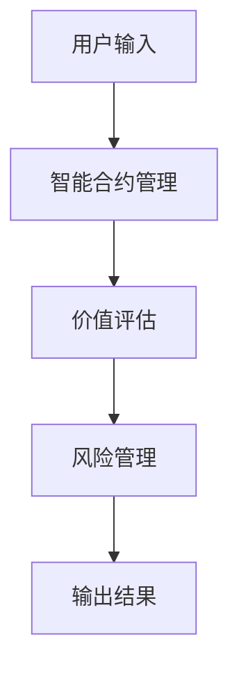

                 


# 《格雷厄姆特价股票理论在去中心化自治协议(DAP)时代的新思考》

---

## 关键词：格雷厄姆投资理论、去中心化自治协议、DAP、DeFi、智能合约、价值评估、风险管理

---

## 摘要

本文探讨了格雷厄姆特价股票理论在去中心化自治协议（DAP）时代的适用性与创新。DAP的兴起为金融投资带来了新的可能性，但同时也带来了新的挑战。通过分析DAP的特点及其与传统金融市场的差异，本文结合格雷厄姆的价值投资理念，提出了在DAP环境下如何优化投资策略、评估价值、管理风险的具体方法。同时，本文还结合数学模型和系统架构设计，详细探讨了DAP环境下的投资策略优化和风险管理问题，为投资者提供了实用的指导。

---

## 第1章 引言

### 1.1 DAP的基本概念

DAP（Decentralized Autonomous Protocol）是一种基于区块链技术的去中心化自治协议。它通过智能合约自动执行预设规则，无需依赖中心化机构。DAP的核心特点包括去中心化、透明性、不可篡改性和自动化执行。

#### 1.1.1 DAP与传统金融市场的区别

- **去中心化**：DAP没有中心化的管理机构，所有操作通过智能合约自动完成。
- **透明性**：所有交易记录在区块链上，公开可查。
- **自动化**：DAP通过智能合约实现自动化的交易和结算。

### 1.2 格雷厄姆投资理论的背景

格雷厄姆是价值投资的鼻祖，他提出的“安全边际”和“内在价值”理论在传统股票投资中被广泛采用。然而，DAP时代的到来对这些理论提出了新的挑战，同时也带来了新的机遇。

---

## 第2章 格雷厄姆投资理论的核心要素

### 2.1 格雷厄姆的核心投资理念

格雷厄姆认为，投资的本质是寻找“安全边际”，即股票的市场价格低于其内在价值时，投资具有较高的安全边际。

#### 2.1.1 格雷厄姆的内在价值公式

$$ V = \frac{E}{k} $$

其中，$V$ 是内在价值，$E$ 是企业的盈利能力，$k$ 是折现率。

### 2.2 格雷厄姆的安全边际概念

安全边际是市场价格与内在价值之间的差异。格雷厄姆认为，安全边际越大，投资风险越小。

$$ S = V - P $$

其中，$S$ 是安全边际，$P$ 是市场价格。

### 2.3 格雷厄姆的长期投资策略

格雷厄姆强调长期投资的重要性，认为短期市场波动不应该影响长期投资决策。

---

## 第3章 DAP环境下的投资策略

### 3.1 DAP环境下的价值评估

在DAP环境下，价值评估需要考虑以下因素：

1. **智能合约的安全性**：智能合约的代码需要经过严格的审计。
2. **项目团队的可信度**：团队背景和过往业绩是重要的考量因素。
3. **市场需求**：DAP项目的市场需求决定了其长期价值。

#### 3.1.1 DAP项目的价值评估模型

$$ V_{DAP} = \alpha \times S + \beta \times T + \gamma \times M $$

其中，$\alpha$、$\beta$、$\gamma$ 是权重系数，$S$ 是智能合约的安全性，$T$ 是团队可信度，$M$ 是市场需求。

### 3.2 DAP环境下的风险管理

在DAP环境下，风险管理需要考虑以下方面：

1. **智能合约漏洞**：智能合约的漏洞可能导致重大损失。
2. **市场波动**：DAP项目的市场价格波动较大。
3. **政策风险**：政策监管的变化可能对DAP项目产生重大影响。

#### 3.2.1 风险管理模型

$$ R = \sum_{i=1}^{n} w_i \times r_i $$

其中，$R$ 是总体风险，$w_i$ 是风险因素的权重，$r_i$ 是风险因素的风险值。

---

## 第4章 DAP环境下的投资策略优化

### 4.1 DAP环境下的投资组合优化

在DAP环境下，投资组合优化需要考虑多样化的资产配置。

#### 4.1.1 投资组合优化模型

$$ \min_{w} w^T \Sigma w $$

$$ \text{s.t.} \quad \mathbb{E}[r] \geq R_{\text{min}} $$

其中，$w$ 是权重向量，$\Sigma$ 是协方差矩阵，$\mathbb{E}[r]$ 是预期收益，$R_{\text{min}}$ 是最低预期收益。

### 4.2 DAP环境下的动态价值评估

在DAP环境下，价值评估需要动态调整模型参数。

#### 4.2.1 动态价值评估模型

$$ V_{\text{动态}} = \frac{E_{\text{动态}}}{k_{\text{动态}}} $$

其中，$E_{\text{动态}}$ 是动态盈利能力，$k_{\text{动态}}$ 是动态折现率。

---

## 第5章 DAP环境下的系统架构设计

### 5.1 系统功能设计

#### 5.1.1 系统功能模块

1. **智能合约管理模块**：管理智能合约的部署和执行。
2. **价值评估模块**：根据DAP项目的特点进行价值评估。
3. **风险管理模块**：实时监控风险并提供预警。

#### 5.1.2 系统功能流程图



### 5.2 系统架构设计

#### 5.2.1 系统架构图

```mermaid
graph LR
    Client --> API Gateway
    API Gateway --> Blockchain Node
    Blockchain Node --> Smart Contract
    Smart Contract --> Data Storage
```

### 5.3 系统接口设计

#### 5.3.1 接口设计

1. **智能合约接口**：用于智能合约的部署和执行。
2. **价值评估接口**：用于DAP项目的价值评估。
3. **风险管理接口**：用于实时风险监控。

---

## 第6章 项目实战

### 6.1 环境安装

#### 6.1.1 安装区块链环境

```bash
npm install -g ethereumjs-testrpc
```

#### 6.1.2 安装智能合约开发工具

```bash
npm install -g solidity-compiler
```

### 6.2 核心代码实现

#### 6.2.1 智能合约代码

```solidity
// SPDX-License-Identifier: MIT
pragma solidity ^0.8.0;

contract DAPProtocol {
    function calculateValue(uint256 price, uint256 intrinsicValue) external pure returns (uint256) {
        return intrinsicValue - price;
    }
}
```

#### 6.2.2 价值评估代码

```python
def calculate_value(intrinsic_value, price):
    return intrinsic_value - price

# 示例
intrinsic_value = 100
price = 80
print(calculate_value(intrinsic_value, price))  # 输出：20
```

### 6.3 案例分析

#### 6.3.1 案例一：智能合约漏洞修复

假设有一个智能合约存在漏洞，需要修复以下问题：

1. **漏洞描述**：智能合约的转账功能存在漏洞，可能导致资金损失。
2. **修复方案**：增加多重签名机制。

#### 6.3.2 案例二：市场波动应对

假设DAP项目市场价格波动较大，需要采取以下措施：

1. **增加流动性**：通过流动性挖矿增加市场流动性。
2. **调整智能合约参数**：根据市场波动调整智能合约的参数。

---

## 第7章 总结

### 7.1 本章小结

本文结合格雷厄姆投资理论和DAP的特点，提出了DAP环境下的投资策略优化和风险管理方法。通过数学模型和系统架构设计，本文为投资者提供了实用的指导。

### 7.2 投资建议

1. **长期投资**：坚持长期投资，避免短期市场波动的影响。
2. **风险管理**：建立完善的风险管理体系，降低投资风险。
3. **技术创新**：关注DAP技术的创新和发展，抓住投资机会。

### 7.3 未来展望

随着DAP技术的不断发展，DAP环境下的投资理论和实践将更加完善。未来，我们需要进一步研究DAP环境下的投资策略优化和风险管理问题，为投资者提供更全面的指导。

---

## 参考文献

1. 格雷厄姆，本杰明. 《证券分析》.
2. 以太坊智能合约开发指南.
3. 去中心化自治组织（DAO）白皮书.

---

**全文完**

