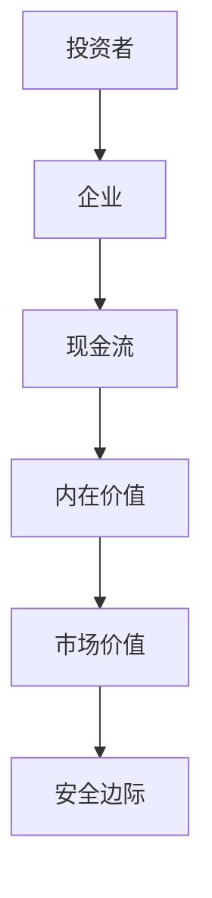
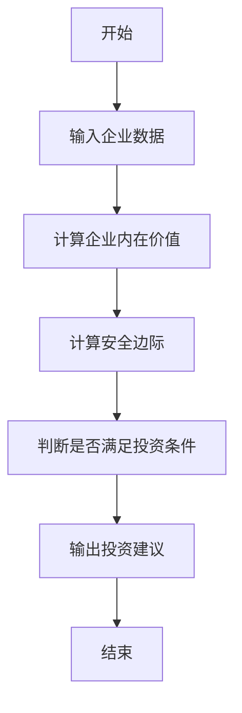
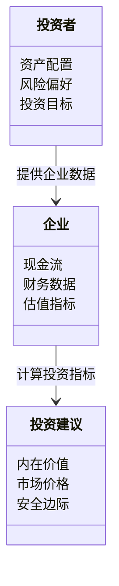

                 


# 格雷厄姆特价股票理论在家族企业投资中的应用

> 关键词：格雷厄姆投资理论，特价股票，家族企业，价值投资，内在价值

> 摘要：本文深入探讨了格雷厄姆特价股票理论在家族企业投资中的应用，结合了投资理论与家族企业的特性，通过系统分析和实际案例，展示了如何利用格雷厄姆的价值投资理念构建稳健的家族企业投资策略。

---

## 第一部分：背景介绍

### 第1章：格雷厄姆特价股票理论概述

#### 1.1 格雷厄姆投资理论的起源与核心思想

- **1.1.1 价值投资的鼻祖——本杰明·格雷厄姆**
  - 格雷厄姆是价值投资的奠基人，其理论强调以低于内在价值的价格购买优质资产。
  - 他的投资理念注重安全边际和长期稳健回报，而非短期市场波动。

- **1.1.2 格雷厄姆投资理论的核心理念**
  - 投资的本质是购买企业的一部分，而非参与市场赌博。
  - 通过分析企业的基本面，寻找具有安全边际的投资标的。

- **1.1.3 特价股票的定义与特征**
  - 特价股票是指市场价格低于其内在价值的股票。
  - 具备基本面稳定、估值被市场低估的特点。

#### 1.2 格雷厄姆特价股票理论的数学模型

- **1.2.1 企业内在价值的计算公式**
  $$ V = \sum_{t=1}^{n} \frac{CF_t}{(1 + r)^t} $$
  其中，$V$ 表示企业内在价值，$CF_t$ 表示第 $t$ 年的现金流，$r$ 表示折现率，$n$ 表示预测期数。

- **1.2.2 安全边际的计算与应用**
  $$ Margin\ of\ Safety = V_{market} - V_{intrinsic} $$
  其中，$V_{market}$ 是市场价格，$V_{intrinsic}$ 是内在价值。

#### 1.3 理论与实践的结合

- **1.3.1 格雷厄姆理论在投资中的应用**
  - 通过分析企业的财务数据，识别具有安全边际的投资机会。
  - 构建多元化投资组合，降低风险。

- **1.3.2 特价股票的筛选标准**
  - 低市盈率（P/E）、低市净率（P/B）。
  - 高股息率，稳定的现金流。

- **1.3.3 投资组合的构建与管理**
  - 定期评估投资组合，调整持仓。
  - 长期持有，避免频繁交易。

### 第2章：格雷厄姆特价股票理论的核心概念与联系

#### 2.1 核心概念原理

- **2.1.1 价值投资的核心要素**
  - 内在价值：企业未来现金流的现值。
  - 市场价值：市场价格，受市场情绪影响。

- **2.1.2 内在价值与市场价值的对比**
  - 内在价值是企业的真正价值，市场价值是波动的价格。
  - 通过比较两者，找到低估的投资机会。

- **2.1.3 安全边际的计算与应用**
  - 安全边际提供了一种缓冲，确保即使估值有误，也能获得正收益。
  - 安全边际越大，投资风险越小。

#### 2.2 核心概念属性特征对比表格

| 概念       | 属性特征                     |
|------------|------------------------------|
| 内在价值   | 企业未来现金流的现值         |
| 市场价值   | 当前市场价格，受情绪影响较大   |
| 安全边际   | 内在价值与市场价值的差额     |

#### 2.3 ER实体关系图



### 第3章：格雷厄姆特价股票理论的算法原理

#### 3.1 算法原理流程图



#### 3.2 企业内在价值计算公式

$$ V = \sum_{t=1}^{n} \frac{CF_t}{(1 + r)^t} $$

#### 3.3 安全边际计算公式

$$ Margin\ of\ Safety = V_{market} - V_{intrinsic} $$

#### 3.4 举例说明

假设某企业预测未来5年的现金流分别为100万、120万、150万、180万、200万，折现率为8%。

计算内在价值：

$$ V = \frac{100}{1.08} + \frac{120}{1.08^2} + \frac{150}{1.08^3} + \frac{180}{1.08^4} + \frac{200}{1.08^5} $$

假设市场价格为800万，计算安全边际：

$$ Margin\ of\ Safety = 800 - V $$

---

## 第二部分：系统分析与架构设计

### 第4章：系统分析与架构设计方案

#### 4.1 问题场景介绍

- 家族企业投资需要考虑传承、治理和财务稳健性。
- 格雷厄姆理论可以帮助家族企业寻找低估的投资机会，实现长期稳健的收益。

#### 4.2 项目介绍

- 本项目旨在将格雷厄姆特价股票理论应用于家族企业投资中。
- 构建一个基于内在价值和安全边际的投资框架。

#### 4.3 系统功能设计（领域模型）



#### 4.4 系统架构设计


---

## 第三部分：项目实战

### 第5章：项目实战

#### 5.1 环境安装

- 安装Python和相关库（如numpy、pandas）。
- 使用Jupyter Notebook进行数据分析。

#### 5.2 系统核心实现源代码

```python
import numpy as np
import pandas as pd

def calculate_intrinsic_value(cash_flows, discount_rate):
    return np.npv(discount_rate, cash_flows)

def calculate_margin_of_safety(market_price, intrinsic_value):
    return market_price - intrinsic_value

# 示例数据
cash_flows = [100, 120, 150, 180, 200]
discount_rate = 0.08
market_price = 800

intrinsic_value = calculate_intrinsic_value(cash_flows, discount_rate)
margin_of_safety = calculate_margin_of_safety(market_price, intrinsic_value)

print(f"内在价值: {intrinsic_value}")
print(f"安全边际: {margin_of_safety}")
```

#### 5.3 代码应用解读与分析

- 使用Python计算内在价值和安全边际。
- 通过具体数据展示格雷厄姆理论的实际应用。

#### 5.4 实际案例分析

- 某家族企业通过分析多个企业，找到具有安全边际的投资标的。
- 长期持有，实现资产稳健增长。

#### 5.5 项目小结

- 成功将格雷厄姆理论应用于家族企业投资中。
- 通过系统化的分析和实践，实现稳健的投资回报。

---

## 第四部分：总结与展望

### 第6章：总结与展望

#### 6.1 最佳实践 tips

- 定期评估投资组合，调整持仓。
- 长期持有，避免短期波动影响。

#### 6.2 小结

- 格雷厄姆特价股票理论为家族企业投资提供了有效的工具。
- 通过系统化的分析和实践，家族企业可以实现稳健的财富增长。

#### 6.3 注意事项

- 需要结合企业的实际情况，灵活调整投资策略。
- 保持对市场的敏感性，及时应对变化。

#### 6.4 拓展阅读

- 格雷厄姆的《 Intelligent Investor》。
- 其他价值投资经典书籍。

---

通过以上步骤，我们可以清晰地看到格雷厄姆特价股票理论在家族企业投资中的应用，从理论到实践，再到实际案例，层层递进，帮助读者全面理解如何将格雷厄姆的价值投资理念应用于家族企业投资中。

