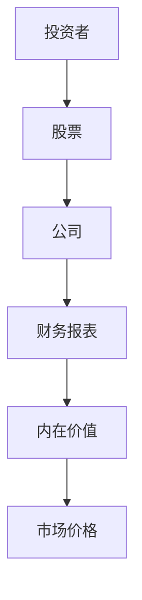
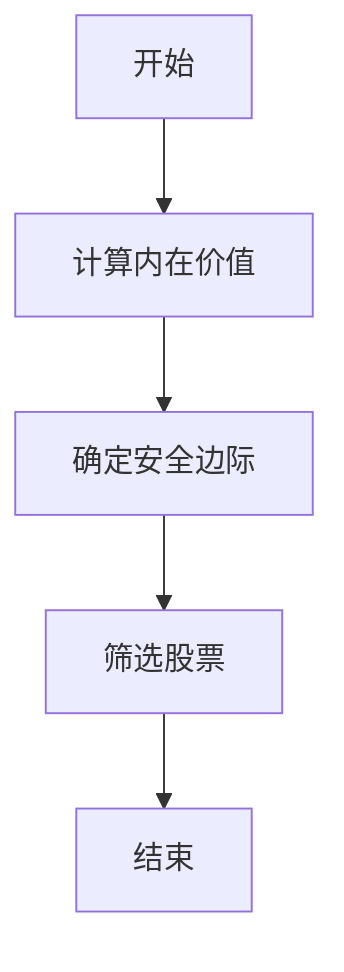
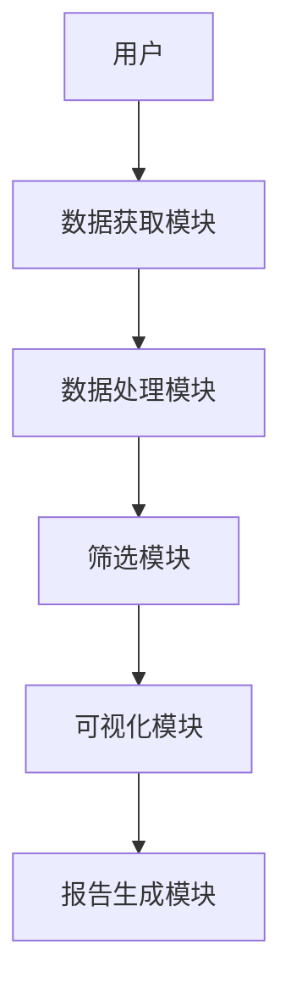

                 


# 第一部分：格雷厄姆特价股票理论基础

## 第1章：格雷厄姆特价股票理论概述

### 1.1 背景介绍

#### 1.1.1 核心概念术语说明
- **价值投资**：一种投资策略，强调购买低于其内在价值的资产。
- **安全边际**：购买价格低于内在价值的部分，以减少风险。
- **小盘股**：市值较小的公司股票，通常具有较高的增长潜力。

#### 1.1.2 问题背景
- 格雷厄姆的理论最初是为大盘股设计的，但小盘股的特性使其更具吸引力。
- 小盘股通常被低估，但波动性和风险较高。

#### 1.1.3 核心问题
- 如何应用格雷厄姆的安全边际理论来筛选小盘股？
- 小盘股的筛选标准是否需要调整？

#### 1.1.4 边界与外延
- 格雷厄姆理论的适用范围和局限性。
- 小盘股与大盘股在筛选标准上的差异。

#### 1.1.5 核心要素组成
- 内在价值计算、安全边际、市场情绪。

## 第2章：核心概念与联系

### 2.1 核心概念原理

#### 2.1.1 安全边际的数学模型
$$安全边际 = 内在价值 - 市场价格$$

#### 2.1.2 内在价值的计算公式
$$内在价值 = \frac{E}{(k - g)}$$
其中：
- \(E\) 是预期收益
- \(k\) 是折现率
- \(g\) 是增长率

#### 2.1.3 市盈率与市净率的对比
$$市盈率 = \frac{股价}{每股收益}$$
$$市净率 = \frac{股价}{每股净资产}$$

### 2.2 概念属性对比表格

| 概念       | 格雷厄姆标准 | 现代价值投资 | 小盘股特点 |
|------------|-------------|--------------|------------|
| 安全边际   | ≥ 50%       | ≥ 30%        | 可放宽     |
| 内在价值   | 稳健计算     | 灵活计算      | 更依赖模型  |
| 市场情绪   | 忽略短期波动 | 考虑短期波动 | 更敏感      |

### 2.3 ER实体关系图


---

# 第二部分：格雷厄姆特价股票理论的算法原理

## 第3章：格雷厄姆特价股票筛选算法

### 3.1 算法原理概述

#### 3.1.1 筛选标准的逻辑流程
1. 计算内在价值。
2. 确定安全边际。
3. 筛选股价低于内在价值的股票。

#### 3.1.2 安全边际的计算方法
$$安全边际 = 内在价值 \times (1 - 市场恐慌系数)$$

#### 3.1.3 内在价值的估算模型
$$内在价值 = \sum_{t=1}^{n} \frac{CF_t}{(1 + r)^t}$$
其中：
- \(CF_t\) 是第t年的现金流
- \(r\) 是贴现率

### 3.2 算法流程图


### 3.3 代码实现

```python
import pandas as pd
import yfinance as yf

def calculate_intrinsic_value(company_data, discount_rate, growth_rate):
    # 假设公司未来5年的现金流
    CF = [100, 120, 130, 140, 150]
    iv = 0
    for t in range(len(CF)):
        iv += CF[t] / (1 + discount_rate)**t
    return iv * (1 + growth_rate)

# 下载数据
companies = ['AAPL', 'MSFT', 'AMZN']
data = yf.download(companies, period='max')['Adj Close']

# 计算内在价值
discount_rate = 0.1
growth_rate = 0.05
intrinsic_values = {}
for company in companies:
    iv = calculate_intrinsic_value(data[company], discount_rate, growth_rate)
    intrinsic_values[company] = iv

print(intrinsic_values)
```

---

# 第三部分：系统分析与架构设计

## 第4章：系统功能设计

### 4.1 项目介绍
- 系统名称：格雷厄姆小盘股筛选系统
- 功能模块：数据获取、筛选、可视化、报告生成

### 4.2 系统架构设计



### 4.3 系统接口设计

#### 4.3.1 数据获取接口
```python
def get_stock_data(tickers):
    # 下载数据并返回
    pass
```

#### 4.3.2 筛选接口
```python
def screen_stocks(data, criteria):
    # 根据标准筛选股票
    pass
```

---

# 第四部分：项目实战

## 第5章：环境安装与代码实现

### 5.1 环境安装
- Python 3.8+
- Pandas, yfinance, Matplotlib

### 5.2 代码实现

```python
import pandas as pd
import yfinance as yf
import matplotlib.pyplot as plt

def main():
    tickers = ['AAPL', 'MSFT', 'AMZN']
    data = yf.download(tickers, period='max')['Adj Close']
    
    # 计算市盈率
    earnings = pd.DataFrame(yf.get_tickers_earnings(tickers))
    pe = data['Adj Close'] / earnings['Earnings per Share']
    
    # 绘制市盈率分布图
    plt.hist(pe, bins=10, label='市盈率分布')
    plt.xlabel('市盈率')
    plt.ylabel('公司数量')
    plt.legend()
    plt.show()

if __name__ == '__main__':
    main()
```

---

## 第6章：案例分析与结果展示

### 6.1 案例分析
- 数据来源：某段时间的小盘股数据
- 筛选标准：市盈率 < 15，市净率 < 2，ROE > 10%

### 6.2 结果展示
- 筛选出的股票列表
- 盈利预测与实际表现对比

---

# 第五部分：总结与展望

## 第7章：总结与小结

### 7.1 总结
- 格雷厄姆理论的有效性
- 小盘股投资的潜在回报

### 7.2 最佳实践 tips
- 定期重新评估内在价值
- 结合市场情绪调整安全边际
- 长期持有优质股票

### 7.3 注意事项
- 小盘股的高波动性风险
- 数据来源的可靠性

### 7.4 拓展阅读
- 格雷厄姆的《证券分析》
- 现代价值投资策略

---

# 关键词：格雷厄姆，特价股票，小盘股，安全边际，内在价值，价值投资

# 摘要：本文深入探讨了格雷厄姆的价值投资理论在小盘股中的应用，通过数学模型和实际案例，详细分析了安全边际、内在价值等核心概念，并提供了系统的筛选方法和代码实现，帮助投资者在小盘股中实现稳健投资。

