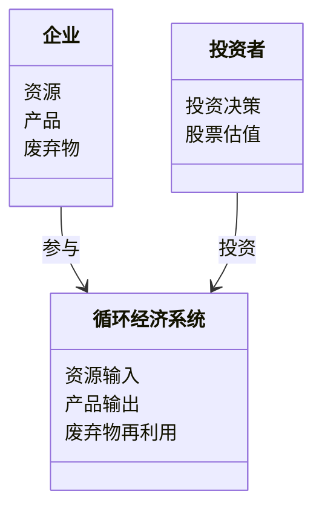
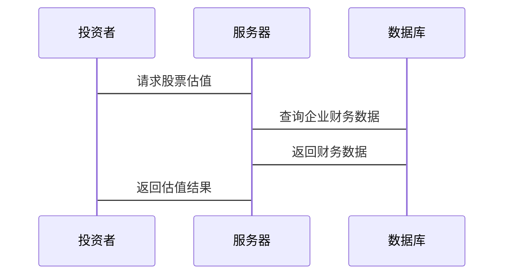

                 


# 《格雷厄姆特价股票理论在循环经济产业中的应用》

> 关键词：格雷厄姆投资理论、循环经济、股票估值、价值投资、投资策略

> 摘要：本文系统地探讨了格雷厄姆特价股票理论在循环经济产业中的应用，从理论基础到实际案例，详细分析了如何利用格雷厄姆的投资理念来评估和选择循环经济产业中的投资标的。文章结合了循环经济的基本概念、格雷厄姆理论的核心思想，通过财务分析、估值模型、投资策略等多个维度，深入剖析了两者结合的可行性与优势，并通过具体案例展示了实际应用过程。

---

# 第一部分: 格雷厄姆特价股票理论与循环经济产业概述

## 第1章: 格雷厄姆投资理论的核心概念

### 1.1 格雷厄姆投资理论的核心概念

#### 1.1.1 价值投资的基本原理
价值投资是一种以内在价值为核心的投资策略，强调以低于内在价值的价格购买优质资产。格雷厄姆在《 Intelligent Investor 》中提出的“安全边际”概念，即买入价格远低于内在价值，是价值投资的核心思想。

#### 1.1.2 特价股票的定义与特征
格雷厄姆认为，特价股票是指市场价格远低于其内在价值的股票。这类股票通常具有以下特征：
- 市盈率低
- 市净率低
- 股息率高
- 公司基本面稳定

#### 1.1.3 格雷厄姆投资策略的现代应用
尽管格雷厄姆的投资理论提出于20世纪，但其核心思想在现代投资实践中仍然具有重要价值。例如，巴菲特、彼得·林奇等投资大师都深受格雷厄姆思想的影响。

---

## 第2章: 循环经济产业的基本概念

### 2.1 循环经济的定义与特征

#### 2.1.1 循环经济的定义
循环经济是以资源高效利用和循环利用为核心，以“减量化、再利用、再循环”为原则的经济模式。与传统线性经济（资源→产品→废弃物）不同，循环经济强调“资源→产品→再生资源”的闭环模式。

#### 2.1.2 循环经济的核心特征
- 资源高效利用
- 废弃物减量化
- 产品生命周期延长
- 产业协同与资源共享

#### 2.1.3 循环经济与传统经济的区别
| 特性 | 循环经济 | 传统经济 |
|------|----------|----------|
| 资源利用 | 高效循环 | 一次消耗 |
| 废弃物处理 | 再生利用 | 排放或填埋 |
| 产业链 | 闭环模式 | 线性模式 |

---

## 第3章: 格雷厄姆理论与循环经济产业的结合

### 3.1 循环经济产业中的投资机会

#### 3.1.1 循环经济企业的价值评估
循环经济企业的价值不仅体现在其当前的盈利能力，还体现在其资源利用效率和长期的可持续发展潜力。例如，一家专注于废弃物回收利用的企业，其未来的资源成本优势可能成为其核心竞争力。

#### 3.1.2 循环经济产业的市场潜力
随着全球资源短缺和环境问题的加剧，循环经济产业的市场潜力巨大。例如，新能源汽车的电池回收、塑料替代材料的研发等都是极具潜力的领域。

#### 3.1.3 格雷厄姆理论在循环经济中的适用性
循环经济产业中许多企业由于市场认知不足或行业波动较大，其市场价格可能远低于其内在价值。这正是格雷厄姆理论的用武之地。

---

### 3.2 格雷厄姆理论与循环经济产业的契合点

#### 3.2.1 价值低估的识别
循环经济产业中的许多企业由于市场认知不足或行业波动较大，其市场价格可能远低于其内在价值。这正是格雷厄姆理论的用武之地。

#### 3.2.2 循环经济企业的财务指标分析
循环经济企业的财务指标分析需要重点关注以下几点：
- 资产负债表：关注企业的应收账款、存货和无形资产
- 利润表：关注企业的主营业务收入、净利润和研发投入
- 现金流量表：关注企业的经营活动现金流和投资活动现金流

#### 3.2.3 投资决策的优化
通过格雷厄姆理论，投资者可以更好地识别循环经济产业中的价值低估企业，并制定科学的投资策略。例如，选择具有高安全边际、低市盈率、低市净率的循环经济企业进行投资。

---

# 第二部分: 格雷厄姆特价股票理论在循环经济产业中的应用

## 第4章: 循环经济企业的财务分析与估值

### 4.1 循环经济企业的财务指标分析

#### 4.1.1 资产负债表分析
- 流动资产：关注应收账款和存货的质量
- 非流动资产：关注固定资产的折旧和无形资产的 amortization
- 负债：关注企业的短期负债和长期负债的偿付能力

#### 4.1.2 利润表分析
- 主营业务收入：关注企业的核心业务收入是否稳定增长
- 净利润：关注企业的盈利能力是否健康
- 毛利率和净利率：关注企业的成本控制能力

#### 4.1.3 现金流量表分析
- 经营活动现金流：关注企业的经营活动是否产生正向现金流
- 投资活动现金流：关注企业的资本支出是否合理
- 筹资活动现金流：关注企业的融资能力

---

### 4.2 格雷厄姆估值模型在循环经济中的应用

#### 4.2.1 市盈率与市净率分析
- 市盈率（P/E）= 股价 / 每股收益
- 市净率（P/B）= 股价 / 每股净资产
- 通过比较 P/E 和 P/B 与行业平均水平，判断企业是否被低估。

#### 4.2.2 内在价值的计算
格雷厄姆的内在价值公式：
$$
\text{内在价值} = \text{每股收益} \times (8.5 + 2.7 \times \text{增长率})
$$
其中，增长率基于企业的历史增长率和行业平均水平。

#### 4.2.3 股票安全边际的确定
安全边际 = 内在价值 - 市场价格
$$
\text{安全边际} = \text{内在价值} - \text{市场价格}
$$

---

## 第5章: 循环经济产业中的投资策略

### 5.1 格雷厄姆投资策略的优化

#### 5.1.1 价值投资的长期视角
- 长期持有优质资产
- 避免短期市场波动的干扰

#### 5.1.2 投资组合的构建与管理
- 选择具有高安全边际的循环经济企业
- 分散投资以降低风险

#### 5.1.3 风险控制与收益平衡
- 设置止损点
- 定期评估投资组合的绩效

---

### 5.2 循环经济产业中的投资组合管理

#### 5.2.1 行业选择与权重分配
- 优先选择具有高成长潜力的行业，如新能源、环保科技等
- 根据行业风险和收益潜力进行权重分配

#### 5.2.2 股票筛选的标准与流程
1. 筛选具有低市盈率、低市净率的企业
2. 分析企业的财务报表，评估其盈利能力
3. 选择具有高安全边际的股票
4. 定期复盘和调整投资组合

---

## 第6章: 格雷厄姆理论在循环经济产业中的案例分析

### 6.1 典型循环经济企业的分析

#### 6.1.1 企业背景
以一家专注于废弃物回收利用的上市公司为例，假设其股票代码为 XYZ。

#### 6.1.2 财务分析
- 每股收益（EPS）= 2元
- 每股净资产（BPS）= 10元
- 市盈率（P/E）= 10
- 市净率（P/B）= 2

#### 6.1.3 格雷厄姆估值模型的应用
根据格雷厄姆公式：
$$
\text{内在价值} = 2 \times (8.5 + 2.7 \times 5\% ) = 2 \times (8.5 + 0.135) = 2 \times 8.635 = 17.27
$$
假设市场价格为 15元，则安全边际为：
$$
\text{安全边际} = 17.27 - 15 = 2.27
$$
这表明该股票具有较高的投资价值。

---

# 第三部分: 系统分析与架构设计

## 第7章: 循环经济产业的系统架构设计

### 7.1 问题场景介绍
循环经济产业的系统架构设计需要考虑企业的资源利用效率、生产过程的闭环管理以及与上下游企业的协同合作。

### 7.2 系统功能设计

#### 7.2.1 领域模型（mermaid 类图）


### 7.3 系统架构设计（mermaid 架构图）


### 7.4 系统接口设计
- 投资者端接口：股票筛选、估值计算、投资建议
- 企业端接口：资源利用效率、生产数据、财务数据

### 7.5 系统交互（mermaid 序列图）


---

# 第四部分: 项目实战

## 第8章: 环境安装与系统实现

### 8.1 环境安装
- 安装 Python 和相关库（pandas、numpy、scipy）
- 安装 Mermaid 图形库

### 8.2 核心代码实现

#### 8.2.1 数据预处理
```python
import pandas as pd
import numpy as np

# 假设 data 是包含企业财务数据的 DataFrame
data = pd.read_csv('企业数据.csv')
data = data.dropna()
data = data[ data['市盈率'] < data['市盈率'].mean() ]
```

#### 8.2.2 股票估值模型
```python
def greaham_valuation(equals, book_value, growth_rate):
    return equals * (8.5 + 2.7 * growth_rate)
```

#### 8.2.3 投资组合管理
```python
import matplotlib.pyplot as plt

# 绘制市盈率和市净率分布图
plt.scatter(data['市盈率'], data['市净率'], alpha=0.5)
plt.xlabel('市盈率')
plt.ylabel('市净率')
plt.title('股票估值分布图')
plt.show()
```

---

## 第9章: 实际案例分析与结果解读

### 9.1 案例分析
以 XYZ 公司为例，其财务数据如下：
- 每股收益（EPS）= 2元
- 每股净资产（BPS）= 10元
- 市盈率（P/E）= 10
- 市净率（P/B）= 2

根据格雷厄姆估值模型：
$$
\text{内在价值} = 2 \times (8.5 + 2.7 \times 5\% ) = 17.27
$$
市场价格为 15元，安全边际为 2.27元。

---

## 第10章: 最佳实践与小结

### 10.1 最佳实践
- 选择具有高安全边际的循环经济企业
- 长期持有优质资产
- 定期复盘和调整投资组合

### 10.2 小结
格雷厄姆特价股票理论在循环经济产业中的应用不仅能够帮助投资者发现价值低估的企业，还能通过系统的财务分析和估值模型，提高投资决策的科学性。未来，随着循环经济产业的进一步发展，格雷厄姆理论的应用潜力将更加显著。

### 10.3 注意事项
- 投资者需要具备扎实的财务分析能力
- 需要结合行业特点进行投资决策
- 定期跟踪企业的财务状况和市场环境

### 10.4 拓展阅读
- 《 Intelligent Investor 》——本杰明·格雷厄姆
- 《投资学原理》——查理·埃斯莱曼

---

# 结语

通过本文的系统分析，我们不仅了解了格雷厄姆特价股票理论的基本原理，还探讨了其在循环经济产业中的实际应用。希望本文能够为投资者提供有价值的参考，帮助他们在循环经济产业中找到更多投资机会。

