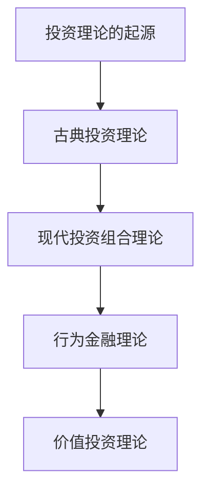
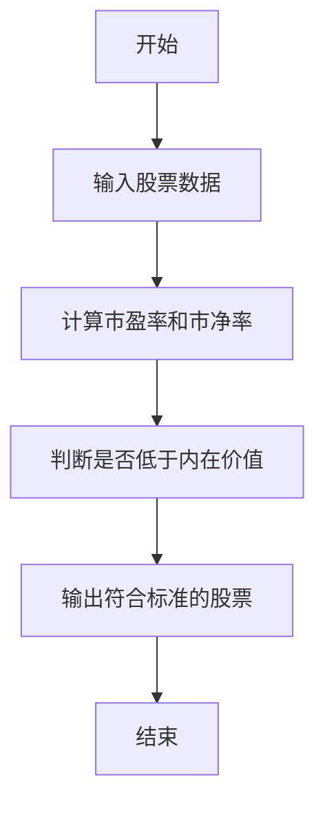
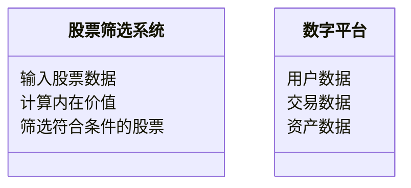

                 


# 格雷厄姆特价股票理论在数字平台协同经济产业中的应用

## 关键词：格雷厄姆投资理论，数字平台，协同经济，股票筛选模型，价值投资

## 摘要：  
本文探讨了格雷厄姆特价股票理论在数字平台协同经济产业中的应用。通过分析格雷厄姆价值投资的核心理念，结合数字平台协同经济的商业模式，提出了将特价股票筛选模型应用于协同经济产业的方法。文章详细介绍了格雷厄姆投资理论的背景、核心概念、筛选模型，并结合实际案例分析了其在数字平台协同经济中的应用。通过系统分析与架构设计，提出了基于格雷厄姆理论的协同经济产业投资策略，为投资者提供了新的视角和方法。

---

## 第一章: 格雷厄姆投资理论的背景与核心概念

### 1.1 投资理论的演变历程



### 1.2 格雷厄姆的价值投资理念

#### 核心概念：
- **内在价值**：股票的真正价值是其未来现金流的现值。
- **安全边际**：购买价格低于内在价值，以降低投资风险。

### 1.3 格雷厄姆投资理论的数学模型

#### 格雷厄姆计算公式：
$$ V = \frac{P}{E} + \frac{P}{B} + \frac{P}{(E + B)} $$
其中，V为股票的内在价值，P为当前股价，E为每股盈余，B为每股账面价值。

### 1.4 现代化投资理论对格雷厄姆理论的继承与创新

#### 对比表格：
| 核心概念       | 格雷厄姆理论                     | 现代投资理论                     |
|----------------|---------------------------------|----------------------------------|
| 投资目标       | 寻找被低估的股票                | 多元化投资以降低风险             |
| 分析方法       | 基于基本面分析                  | 基于概率和统计分析               |
| 风险管理       | 安全边际                        | 标准差、夏普比率等                |

---

## 第二章: 格雷厄姆特价股票筛选模型

### 2.1 格雷厄姆筛选模型的数学实现

#### 算法流程图：


#### Python实现代码：
```python
import pandas as pd

def graham_screen(stock_data):
    # 计算内在价值
    stock_data['V'] = stock_data['P'] / stock_data['E'] + stock_data['P'] / stock_data['B'] + stock_data['P'] / (stock_data['E'] + stock_data['B'])
    # 筛选条件：股价 < 内在价值且市盈率 < 15
    filtered = stock_data[(stock_data['P'] < stock_data['V']) & (stock_data['PE'] < 15)]
    return filtered

# 示例数据
data = {
    'P': [50, 30, 40],
    'E': [10, 5, 8],
    'B': [15, 10, 12],
    'PE': [10, 12, 8]
}
stock_data = pd.DataFrame(data)
print(graham_screen(stock_data))
```

---

## 第三章: 数字平台协同经济产业分析

### 3.1 协同经济的定义与商业模式

#### 协同经济的核心特征：
- 资源共享
- 平台撮合
- 多方利益最大化

#### 模式对比：
| 模式类型       | 定义                             | 优缺点                         |
|----------------|---------------------------------|--------------------------------|
| 共享经济       | 闲置资源的共享                   | 高效但依赖平台信任             |
| 平台经济       | 第三方平台撮合交易               | 规模效应显著，但平台成本高       |

---

## 第四章: 格雷厄姆理论在协同经济中的应用

### 4.1 协同经济产业的筛选标准

#### 筛选模型的改进：
$$ V_{\text{new}} = \frac{P}{E} + \frac{P}{B} + \frac{P}{(E + B)} + \frac{P}{N} $$
其中，N为协同经济平台的用户数量。

### 4.2 投资策略的设计

#### 优先考虑因素：
- 平台的用户增长率
- 闲置资源的利用效率
- 平台的盈利能力

---

## 第五章: 系统分析与架构设计

### 5.1 系统功能设计

#### 领域模型：


---

## 第六章: 项目实战

### 6.1 环境安装与数据准备

#### 环境要求：
- Python 3.8+
- Pandas库
- Matplotlib库

### 6.2 核心代码实现

#### 实现代码：
```python
import pandas as pd
import matplotlib.pyplot as plt

# 数据准备
data = {
    '股票代码': ['A', 'B', 'C'],
    '股价': [50, 30, 40],
    '每股盈余': [10, 5, 8],
    '每股账面价值': [15, 10, 12],
    '市盈率': [10, 12, 8]
}
df = pd.DataFrame(data)

# 计算内在价值
df['内在价值'] = df['股价'] / df['每股盈余'] + df['股价'] / df['每股账面价值'] + df['股价'] / (df['每股盈余'] + df['每股账面价值'])

# 筛选符合标准的股票
筛选标准：股价 < 内在价值 且 市盈率 < 15
符合标准的股票 = df[(df['股价'] < df['内在价值']) & (df['市盈率'] < 15)]

# 可视化结果
符合标准的股票.plot(kind='bar', x='股票代码', y='股价')
plt.title('符合格雷厄姆筛选标准的股票')
plt.show()
```

---

## 第七章: 结论与展望

### 7.1 结论

通过将格雷厄姆价值投资理论应用于数字平台协同经济产业，我们能够更有效地筛选出具有投资价值的企业。这种结合不仅提高了投资决策的科学性，也为数字平台的可持续发展提供了新的思路。

### 7.2 未来展望

随着数字化技术的不断进步，协同经济产业将更加繁荣。未来的研究可以进一步优化筛选模型，结合人工智能技术，提升投资决策的效率和准确性。

### 7.3 注意事项

- **数据质量**：确保输入数据的准确性和完整性。
- **模型适用性**：根据具体产业特点调整筛选模型。
- **风险管理**：注重分散投资，降低单一投资风险。

### 7.4 拓展阅读

- 格雷厄姆《聪明的投资者》
- 现代投资组合理论的相关书籍
- 协同经济领域的最新研究

