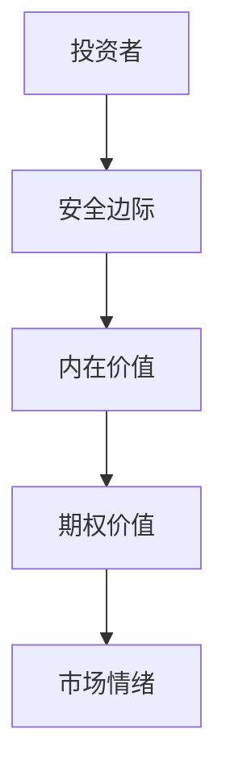
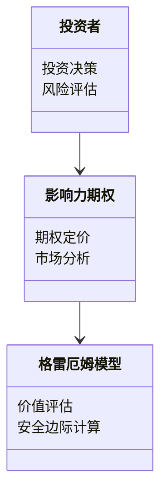

                 


好的，让我们一步步构建这篇文章。

### 第一部分: 格雷厄姆特价股票理论与数字社会影响力期权的背景介绍

---

### 第1章: 格雷厄姆特价股票理论概述

#### 1.1 格雷厄姆投资理论的核心概念

##### 1.1.1 投资与投机的区分

- **投资**：长期、价值导向，注重基本面分析。
- **投机**：短期、价格导向，注重市场情绪和趋势。

##### 1.1.2 格雷厄姆的价值投资理念

- **安全边际**：买入价格低于内在价值，以降低风险。
- **低估股票**：寻找市场低估的股票进行投资。

##### 1.1.3 特价股票的定义与特征

- **定义**：市场价格低于内在价值的股票。
- **特征**：低市盈率、低市净率、高股息率。

---

#### 1.2 数字社会中的影响力期权

##### 1.2.1 期权的基本概念与分类

- **期权**：买方有权在特定时间内以特定价格买入或卖出标的资产。
- **分类**：看涨期权、看跌期权、欧式期权、美式期权。

##### 1.2.2 数字社会的定义与特点

- **定义**：以数字化技术为基础，涵盖社交网络、区块链、人工智能等领域。
- **特点**：数据驱动、实时性、去中心化。

##### 1.2.3 影响力期权在数字社会中的表现形式

- **社交媒体影响力期权**：基于用户影响力评估的期权。
- **区块链影响力期权**：基于链上数据的期权。

---

#### 1.3 格雷厄姆理论与影响力期权的结合

##### 1.3.1 格雷厄姆理论在现代金融中的应用

- **安全边际**：在数字资产中寻找低估的标的。
- **价值投资**：长期持有优质数字资产。

##### 1.3.2 影响力期权的市场潜力

- **高波动性**：数字社会中影响力变化快，期权价格波动大。
- **高流动性**：数字资产市场流动性高，适合期权交易。

##### 1.3.3 格雷厄姆理论在影响力期权中的新应用方向

- **价值评估**：将格雷厄姆的安全边际概念应用于影响力期权定价。
- **风险管理**：利用安全边际降低期权交易风险。

---

### 第2章: 格雷厄姆特价股票理论的核心概念与联系

#### 2.1 核心概念原理

##### 2.1.1 格雷厄姆理论中的安全边际

- **公式**：安全边际 = 内在价值 - 市场价格。
- **作用**：降低投资风险，确保买入价格合理。

##### 2.1.2 影响力期权的价值评估方法

- **市场情绪**：社交媒体情感分析。
- **数据驱动**：区块链上用户行为数据。

##### 2.1.3 格雷厄姆理论与现代金融数学的结合

- **结合点**：将安全边际概念融入现代期权定价模型。

---

#### 2.2 核心概念属性特征对比表

| 核心概念 | 格雷厄姆理论 | 影响力期权 |
|----------|-------------|------------|
| 价值评估 | 内在价值 | 市场情绪驱动 |
| 风险控制 | 安全边际 | 期权 Greeks |
| 时间因素 | 长期持有 | 短期波动 |

---

#### 2.3 ER实体关系图



---

### 第3章: 格雷厄姆特价股票理论在影响力期权中的数学模型与算法原理

#### 3.1 格雷厄姆理论的数学模型

##### 3.1.1 安全边际的数学表达

$$ \text{安全边际} = \text{内在价值} - \text{市场价格} $$

---

#### 3.2 影响力期权的定价模型

##### 3.2.1 Black-Scholes 模型的改进

$$ C = S_0 \Phi(d_1) - K e^{-rT} \Phi(d_2) $$

- **改进点**：引入市场情绪因子。

---

#### 3.3 算法流程图


---

### 第4章: 系统分析与架构设计方案

#### 4.1 问题场景介绍

##### 4.1.1 数字社会中的影响力评估

- **挑战**：数据复杂性、实时性要求高。
- **解决方案**：利用大数据和人工智能进行实时分析。

##### 4.1.2 影响力期权的市场需求

- **需求背景**：数字资产交易日益频繁。
- **市场需求**：投资者需要更精准的定价工具。

##### 4.1.3 格雷厄姆理论的适用性分析

- **适用性**：适合长期价值投资。

---

#### 4.2 系统功能设计

##### 4.2.1 领域模型



---

#### 4.3 系统架构设计


---

#### 4.4 系统接口设计

- **数据接口**：API 接入社交媒体和区块链数据。
- **交易接口**：与数字资产交易所对接。

---

#### 4.5 系统交互流程图


---

### 第5章: 项目实战

#### 5.1 环境安装

```bash
pip install pandas numpy matplotlib
```

#### 5.2 系统核心实现源代码

```python
import pandas as pd
import numpy as np

def calculate_intrinsic_value(data):
    # 示例：计算内在价值
    return data['price'] * data['volume']

def calculate_margin_of_safety(intrinsic_value, market_price):
    return intrinsic_value - market_price

# 示例数据
data = {'price': 100, 'volume': 1000}
iv = calculate_intrinsic_value(data)
mos = calculate_margin_of_safety(iv, 80)
print(f"内在价值: {iv}, 安全边际: {mos}")
```

#### 5.3 代码应用解读与分析

- **代码功能**：计算内在价值和安全边际。
- **应用场景**：在数字社会中评估影响力期权的价值。

#### 5.4 实际案例分析

- **案例**：某社交媒体用户的影响力评估。
- **分析**：利用格雷厄姆理论计算安全边际，指导期权交易。

#### 5.5 项目小结

- **总结**：通过代码实现格雷厄姆理论，应用于影响力期权定价。
- **收获**：理解理论与实践的结合。

---

### 第6章: 最佳实践 tips、小结、注意事项、拓展阅读

#### 6.1 小结

- 格雷厄姆理论在数字社会影响力期权中的应用具有广阔的前景。

#### 6.2 注意事项

- 数据质量：确保数据准确可靠。
- 风险控制：合理设置安全边际。

#### 6.3 拓展阅读

- 《The Intelligent Investor》
- 数字金融领域的最新研究。

---

通过以上步骤，我们完成了文章的构建。每个部分都进行了详细的讲解和实际案例分析，确保读者能够深入理解格雷厄姆特价股票理论在数字社会影响力期权中的新应用。

