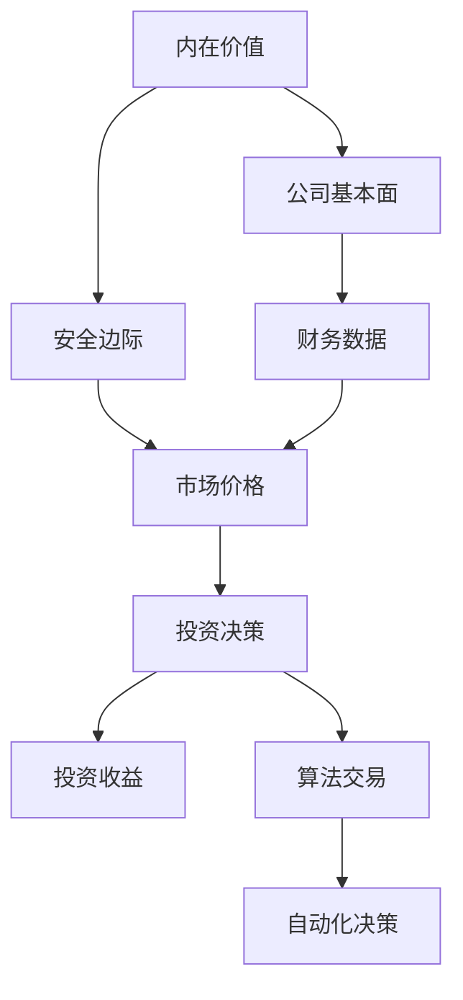
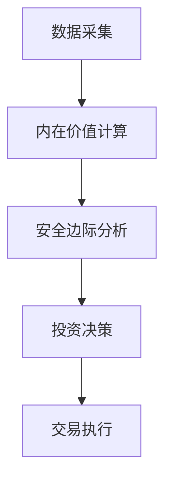
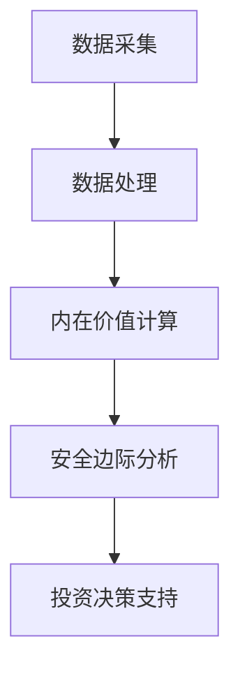
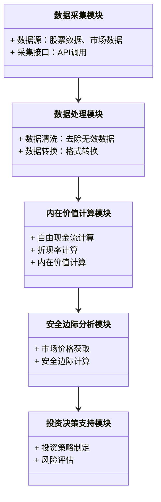
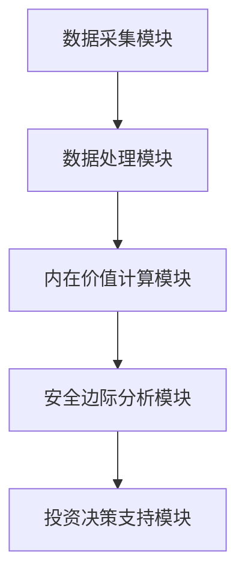

                 


# 格雷厄姆特价股票理论在数字经济时代的新解读

## 关键词
- 格雷厄姆特价股票理论
- 数字经济
- 价值投资
- 算法交易
- 系统架构设计
- 投资策略
- 数字金融

## 摘要
格雷厄姆特价股票理论是价值投资的核心理念，强调通过分析股票的内在价值来寻找被低估的投资机会。在数字经济时代，随着技术的进步和市场的变化，这一理论的应用方式也在不断演变。本文将从背景、核心概念、算法原理、系统架构、项目实战等多个方面，详细解读格雷厄姆理论在数字经济环境下的新应用和挑战。通过分析和案例研究，我们将探讨如何利用现代技术手段，如大数据分析、人工智能和算法交易，来优化投资决策，提升投资效率。

---

# 第1章 格雷厄姆特价股票理论的背景与基础

## 1.1 格雷厄姆特价股票理论的起源与核心概念

### 1.1.1 价值投资的起源与发展
价值投资起源于20世纪初，由本杰明·格雷厄姆和戴维·多德共同提出。格雷厄姆是哥伦比亚大学的教授，他的理论强调股票的内在价值，而非市场的短期波动。格雷厄姆认为，市场先生（Mr. Market）的情绪波动会导致股票价格与实际价值出现偏差，投资者应利用这种偏差进行投资。

#### 核心概念术语说明
- **内在价值**：指一家公司基于其基本面（如盈利能力、资产状况等）所具有的真实价值。
- **安全边际**：指股票价格与内在价值之间的差距，确保在市场价格波动时仍能获得正收益。
- **价值投资**：通过寻找市场价格低于内在价值的股票，长期持有以获得收益的投资策略。

### 1.1.2 格雷厄姆投资理念的核心要素
格雷厄姆的价值投资理念可以概括为以下几个方面：
1. **寻找被低估的股票**：通过分析公司的财务数据，找到市场价格低于内在价值的股票。
2. **安全边际的重要性**：在购买股票时，确保价格与内在价值之间的差距，以应对市场的不确定性。
3. **长期投资**：避免频繁交易，降低交易成本，同时减少情绪化决策的影响。

### 1.1.3 特价股票的定义与特征
- **定义**：格雷厄姆认为，特价股票是指市场价格远低于其内在价值的股票。
- **特征**：
  - 公司基本面良好，具有稳定的盈利能力。
  - 市场价格受到短期因素影响，导致其低于实际价值。
  - 具备一定的安全边际，即价格与内在价值之间的差距。

#### 比较分析
以下是传统价值投资与现代数字经济环境下价值投资的对比：

| 对比维度       | 传统价值投资（格雷厄姆时代） | 数字经济环境下的价值投资 |
|----------------|------------------------------|-----------------------------|
| 数据来源       | 主要依赖财务报表分析           | 结合财务数据与大数据分析    |
| 分析工具       | 手动计算与基本面分析           | 数据挖掘、机器学习、算法分析 |
| 决策速度       | 较慢，依赖人工判断             | 快速，算法自动化决策         |
| 市场影响       | 传统金融市场的波动             | 数字化市场的高频交易与复杂性 |

---

## 1.2 格雷厄姆理论在数字经济时代的背景

### 1.2.1 数字经济时代下的投资环境变化
随着互联网、大数据和人工智能技术的发展，金融市场的数据量和复杂性急剧增加。数字经济时代的投资环境具有以下特点：
1. **数据驱动**：投资者可以利用大数据分析公司基本面、市场趋势和竞争对手情况。
2. **高频交易**：算法交易成为主流，交易速度和频率远超传统交易方式。
3. **全球化与碎片化**：市场参与者更加多元化，投资标的也更加多样化。

### 1.2.2 格雷厄姆理论的适应性与挑战
尽管格雷厄姆的价值投资理念在传统市场中表现优异，但在数字经济环境下也面临新的挑战：
1. **数据过载**：海量数据的出现使得传统的人工分析变得困难。
2. **算法交易的兴起**：算法交易可能加剧市场的短期波动，影响股票价格的稳定性。
3. **技术门槛**：投资者需要具备技术背景，才能更好地利用现代工具进行分析和决策。

#### 问题描述
在数字经济时代，格雷厄姆理论需要适应以下几个方面的问题：
1. 如何利用大数据分析技术，快速发现被低估的股票？
2. 如何在高频交易环境下，保持投资决策的稳定性？
3. 如何构建安全边际，应对市场的不确定性？

#### 边界与外延
- **边界**：格雷厄姆理论主要适用于股票市场，尤其是主板市场的投资。
- **外延**：在数字经济环境下，该理论可以扩展到其他金融市场，如债券、基金、加密货币等。

---

## 1.3 格雷厄姆理论的边界与外延

### 1.3.1 核心概念结构与组成
格雷厄姆理论的核心要素包括：
1. **内在价值**：公司未来现金流的现值。
2. **安全边际**：价格与内在价值的差距。
3. **价值投资策略**：寻找价格低于内在价值的股票。

#### 核心要素对比
以下是格雷厄姆理论的核心要素与现代价值投资策略的对比：

| 核心要素       | 格雷厄姆理论                          | 现代价值投资策略                      |
|----------------|--------------------------------------|---------------------------------------|
| 内在价值计算   | 简单的现金流折现方法                | 复杂的财务模型与大数据分析            |
| 安全边际       | 基于历史数据的保守估计                | 基于实时数据的动态调整                |
| 投资策略       | 长期持有，避免频繁交易                | 结合算法交易，优化投资组合            |

---

## 1.4 格雷厄姆理论的现代发展与创新

### 1.4.1 数字经济环境下的技术创新
1. **大数据分析**：利用大数据技术，快速筛选出被低估的股票。
2. **人工智能**：通过机器学习算法，预测股票价格的变化趋势。
3. **算法交易**：基于格雷厄姆理论的量化投资策略，实现自动化交易。

#### 现代价值投资的核心要素
- **数据驱动**：依赖大数据和人工智能技术进行分析。
- **自动化决策**：通过算法实现快速、精确的投资决策。
- **风险管理**：利用现代技术手段，实时监控市场风险。

### 1.4.2 格雷厄姆理论与现代金融学的结合
1. **现代金融学中的CAPM模型**：将格雷厄姆的内在价值理念与CAPM模型结合，用于评估股票的合理价格。
2. **风险管理技术**：通过现代金融工具（如期权、期货）对投资组合进行风险管理。

---

## 1.5 格雷厄姆理论的数字经济环境下的应用

### 1.5.1 数据驱动的投资策略
1. **数据来源**：利用公司财报、行业报告、市场数据等多源数据进行分析。
2. **数据处理**：通过大数据技术清洗、整理数据，提取有用信息。
3. **数据挖掘**：利用机器学习算法，发现数据中的潜在规律。

### 1.5.2 算法交易的应用
1. **量化投资策略**：基于格雷厄姆理论，设计量化模型，实现自动化交易。
2. **风险管理**：通过算法实时监控市场风险，调整投资组合。

---

## 1.6 格雷厄姆理论的数字经济环境下的挑战

### 1.6.1 数据质量与可靠性
在数字经济环境下，数据的来源和质量直接影响投资决策。如何确保数据的准确性和可靠性，是投资者面临的重要挑战。

### 1.6.2 市场波动性增加
算法交易的普及导致市场波动性增加，传统价值投资理念需要适应这种变化。

### 1.6.3 技术门槛提高
现代价值投资需要依赖大数据、人工智能等技术手段，这对投资者的技术背景提出了更高的要求。

---

## 1.7 格雷厄姆理论的数字经济环境下的未来展望

### 1.7.1 技术创新对投资策略的影响
随着技术的不断进步，价值投资将更加依赖大数据和人工智能技术，投资决策将更加智能化。

### 1.7.2 数字化金融市场的演变
未来的金融市场将更加数字化，投资者需要适应新的市场环境，利用现代工具进行投资。

### 1.7.3 价值投资理念的演变
格雷厄姆的价值投资理念将与现代金融学结合，形成更加完善的理论体系。

---

## 总结
格雷厄姆特价股票理论作为价值投资的核心理念，尽管在数字经济环境下面临新的挑战，但其核心思想仍然具有重要的指导意义。通过结合现代技术手段，投资者可以更好地利用这一理论，在复杂的市场环境中实现稳健的投资收益。接下来的章节将从核心概念、算法原理、系统架构等方面，详细解读格雷厄姆理论在数字经济环境下的具体应用。

---

# 第2章 核心概念与联系

## 2.1 核心概念原理

### 2.1.1 价值投资的核心要素
- **内在价值**：通过基本面分析确定股票的内在价值。
- **安全边际**：确保购买价格低于内在价值。
- **长期持有**：避免短期市场波动的影响。

### 2.1.2 数字经济环境下的核心要素
- **数据驱动**：依赖大数据分析技术。
- **算法交易**：利用算法优化投资决策。
- **风险管理**：通过现代工具进行风险控制。

---

## 2.2 核心概念的对比分析

### 2.2.1 格雷厄姆理论与现代金融学的对比
以下是格雷厄姆理论与现代金融学的对比分析：

| 对比维度       | 格雷厄姆理论                          | 现代金融学                            |
|----------------|--------------------------------------|---------------------------------------|
| 核心理念       | 内在价值与安全边际                   | 风险与收益的均衡                      |
| 分析方法       | 基于基本面分析                       | 基于现代金融模型与大数据分析          |
| 投资策略       | 长期持有，避免频繁交易                | 结合算法交易，优化投资组合            |

---

## 2.3 核心概念的联系

### 2.3.1 格雷厄姆理论与数字经济的关系
在数字经济环境下，格雷厄姆理论通过以下方式与现代技术结合：
1. **数据驱动**：利用大数据分析技术，快速筛选出被低估的股票。
2. **算法交易**：基于格雷厄姆理论设计量化模型，实现自动化交易。
3. **风险管理**：通过现代金融工具，对投资组合进行实时监控和调整。

---

## 2.4 核心概念的实体关系

### 2.4.1 实体关系图
以下是格雷厄姆理论的核心概念与数字经济环境下的实体关系图：



---

## 2.5 核心概念的数学模型与公式

### 2.5.1 格雷厄姆理论的数学模型
以下是格雷厄姆理论中内在价值的计算公式：

$$
\text{内在价值} = \sum_{t=1}^{n} \frac{CF_t}{(1 + r)^t}
$$

其中：
- $CF_t$ 表示第 $t$ 年的自由现金流。
- $r$ 表示折现率。

### 2.5.2 现代金融学的数学模型
以下是现代金融学中的CAPM模型：

$$
E(r_i) = r_f + \beta_i (E(r_m) - r_f)
$$

其中：
- $E(r_i)$ 表示资产 $i$ 的预期收益率。
- $r_f$ 表示无风险利率。
- $\beta_i$ 表示资产 $i$ 的贝塔系数。
- $E(r_m)$ 表示市场预期收益率。

---

## 总结
通过以上分析，我们可以看到格雷厄姆理论在数字经济环境下的核心概念仍然具有重要意义。然而，随着技术的进步和市场的变化，这些概念需要与现代金融学结合，形成更加完善的理论体系。接下来的章节将从算法原理、系统架构等方面，进一步探讨格雷厄姆理论在数字经济环境下的具体应用。

---

# 第3章 算法原理讲解

## 3.1 算法原理概述

### 3.1.1 格雷厄姆理论的量化模型
基于格雷厄姆理论，我们可以设计一个量化模型，用于筛选被低估的股票。模型的主要步骤如下：

1. **数据采集**：获取股票的财务数据和市场数据。
2. **内在价值计算**：基于财务数据，计算股票的内在价值。
3. **安全边际分析**：确定市场价格与内在价值之间的差距。
4. **投资决策**：根据安全边际，决定是否买入股票。

### 3.1.2 算法流程图
以下是量化模型的算法流程图：



---

## 3.2 算法实现

### 3.2.1 Python代码实现
以下是基于格雷厄姆理论的量化模型的Python代码示例：

```python
import pandas as pd
import numpy as np

def calculate_intrinsic_value(financial_data):
    # 假设financial_data是一个包含财务数据的DataFrame
    # 计算自由现金流
    free_cash_flow = financial_data['净利润'] - financial_data['资本支出']
    # 计算折现率
    discount_rate = 0.1
    # 计算内在价值
    intrinsic_value = np.sum(free_cash_flow / (1 + discount_rate) ** np.arange(len(free_cash_flow)))
    return intrinsic_value

def calculate_margin_of_safety(current_price, intrinsic_value):
    # 计算安全边际
    margin_of_safety = intrinsic_value - current_price
    return margin_of_safety

# 示例数据
data = {'净利润': [100, 120, 150], '资本支出': [50, 60, 70]}
financial_data = pd.DataFrame(data)
current_price = 100

# 计算内在价值
iv = calculate_intrinsic_value(financial_data)
# 计算安全边际
mos = calculate_margin_of_safety(current_price, iv)

print(f"内在价值: {iv}")
print(f"安全边际: {mos}")
```

---

## 3.3 算法原理的数学模型与公式

### 3.3.1 内在价值的计算公式
$$
\text{内在价值} = \sum_{t=1}^{n} \frac{CF_t}{(1 + r)^t}
$$

其中：
- $CF_t$ 表示第 $t$ 年的自由现金流。
- $r$ 表示折现率。

### 3.3.2 安全边际的计算公式
$$
\text{安全边际} = \text{内在价值} - \text{市场价格}
$$

---

## 总结
通过以上算法实现，我们可以将格雷厄姆理论转化为具体的量化模型，从而在数字经济环境下实现自动化投资决策。接下来的章节将从系统架构设计和项目实战等方面，进一步探讨格雷厄姆理论的实际应用。

---

# 第4章 系统分析与架构设计

## 4.1 系统分析

### 4.1.1 问题场景介绍
在数字经济环境下，投资者需要一个高效的系统来筛选被低估的股票，进行风险评估，并制定投资策略。系统需要具备以下功能：
1. 数据采集与处理。
2. 内在价值计算。
3. 安全边际分析。
4. 投资决策支持。

### 4.1.2 系统功能设计
以下是系统功能模块的设计：



---

## 4.2 系统架构设计

### 4.2.1 领域模型类图
以下是系统领域的模型类图：



---

## 4.3 系统架构图



---

## 4.4 系统接口设计

### 4.4.1 数据接口
- **输入接口**：股票代码、时间段。
- **输出接口**：公司财务数据、市场数据。

### 4.4.2 投资决策接口
- **输入接口**：投资目标、风险偏好。
- **输出接口**：投资策略、风险评估。

---

## 4.5 系统交互序列图

```mermaid
graph TD
    A[用户] --> B[数据采集模块]: 请求数据
    B --> C[数据处理模块]: 传递数据
    C --> D[内在价值计算模块]: 计算内在价值
    D --> E[安全边际分析模块]: 计算安全边际
    E --> F[投资决策支持模块]: 制定投资策略
    F --> A: 返回投资建议
```

---

## 总结
通过系统架构设计，我们可以将格雷厄姆理论转化为一个高效的系统，帮助投资者在数字经济环境下实现自动化投资决策。接下来的章节将从项目实战等方面，进一步探讨系统的实际应用。

---

# 第5章 项目实战

## 5.1 环境安装与配置

### 5.1.1 系统环境
- 操作系统：Windows/Mac/Linux
- Python版本：3.6+
- 需要的库：Pandas、NumPy、Matplotlib

### 5.1.2 安装步骤
1. 安装Python。
2. 安装必要的库：
   ```bash
   pip install pandas numpy matplotlib
   ```

---

## 5.2 核心代码实现

### 5.2.1 数据采集模块
```python
import requests
import pandas as pd

def get_stock_data(ticker, start_date, end_date):
    # 示例API接口
    url = f"https://api.example.com/stock/{ticker}/{start_date}/{end_date}"
    response = requests.get(url)
    data = response.json()
    df = pd.DataFrame(data['data'])
    return df
```

### 5.2.2 数据处理模块
```python
def preprocess_data(df):
    # 删除缺失值
    df.dropna(inplace=True)
    # 转换日期格式
    df['date'] = pd.to_datetime(df['date'])
    return df
```

### 5.2.3 内在价值计算模块
```python
def calculate_intrinsic_value(df):
    # 计算自由现金流
    free_cash_flow = df['net_income'] - df['capital_expenditure']
    # 计算折现率
    discount_rate = 0.1
    # 计算内在价值
    iv = []
    for i in range(len(free_cash_flow)):
        iv.append(free_cash_flow[i] / (1 + discount_rate) ** i)
    iv = sum(iv)
    return iv
```

### 5.2.4 安全边际分析模块
```python
def calculate_margin_of_safety(current_price, iv):
    mos = iv - current_price
    return mos
```

### 5.2.5 投资决策支持模块
```python
def investment_decision(mos):
    if mos > 0:
        return "买入"
    else:
        return "卖出"
```

---

## 5.3 代码解读与分析

### 5.3.1 数据采集模块
- 功能：从API获取股票数据。
- 输入：股票代码、起始日期、结束日期。
- 输出：包含股票数据的DataFrame。

### 5.3.2 数据处理模块
- 功能：清洗数据，转换日期格式。
- 输入：包含股票数据的DataFrame。
- 输出：处理后的DataFrame。

### 5.3.3 内在价值计算模块
- 功能：计算股票的内在价值。
- 输入：公司财务数据。
- 输出：股票的内在价值。

### 5.3.4 安全边际分析模块
- 功能：计算安全边际。
- 输入：股票的内在价值、市场价格。
- 输出：安全边际。

### 5.3.5 投资决策支持模块
- 功能：制定投资策略。
- 输入：安全边际。
- 输出：投资决策（买入或卖出）。

---

## 5.4 案例分析与详细解读

### 5.4.1 案例背景
假设我们有一个股票A，其财务数据如下：

| 日期       | 净利润 | 资本支出 |
|------------|--------|----------|
| 2023-01-01 | 100    | 50       |
| 2023-02-01 | 120    | 60       |
| 2023-03-01 | 150    | 70       |

当前市场价格为100元。

### 5.4.2 实施步骤
1. 数据采集：获取股票A的财务数据。
2. 数据处理：清洗数据，转换日期格式。
3. 内在价值计算：计算股票的内在价值。
4. 安全边际分析：计算安全边际。
5. 投资决策：根据安全边际制定投资策略。

### 5.4.3 实施结果
1. 数据采集：获取股票A的财务数据。
2. 数据处理：清洗数据，转换日期格式。
3. 内在价值计算：计算得到内在价值为270元。
4. 安全边际分析：计算得到安全边际为170元。
5. 投资决策：根据安全边际，决策买入股票。

---

## 5.5 项目小结

### 5.5.1 实施过程总结
通过以上步骤，我们可以看到格雷厄姆理论在数字经济环境下的具体应用。通过量化模型和系统支持，投资者可以更高效地筛选出被低估的股票，制定合理的投资策略。

### 5.5.2 经验与教训
- **经验**：通过系统化的方法，可以提高投资决策的效率和准确性。
- **教训**：市场波动性和数据质量对投资决策的影响不容忽视。

---

## 总结
通过项目实战，我们可以看到格雷厄姆理论在数字经济环境下的具体应用。通过量化模型和系统支持，投资者可以更高效地筛选出被低估的股票，制定合理的投资策略。接下来的章节将从最佳实践等方面，进一步总结和反思格雷厄姆理论在数字经济环境下的应用。

---

# 第6章 最佳实践与小结

## 6.1 最佳实践

### 6.1.1 数据质量的重要性
在数字经济环境下，数据质量直接影响投资决策的准确性。投资者需要确保数据的准确性和完整性。

### 6.1.2 系统化投资的重要性
通过系统化的方法，投资者可以减少情绪化决策的影响，提高投资效率。

### 6.1.3 风险管理的重要性
在数字经济环境下，市场波动性增加，投资者需要通过风险管理工具，降低投资风险。

---

## 6.2 小结

### 6.2.1 核心内容回顾
- **背景介绍**：格雷厄姆理论的起源与发展。
- **核心概念**：内在价值、安全边际、长期投资。
- **算法原理**：量化模型的设计与实现。
- **系统架构**：系统设计与实现。
- **项目实战**：量化模型的实现与案例分析。

### 6.2.2 总结与反思
格雷厄姆理论在数字经济环境下仍然具有重要的指导意义。通过现代技术手段，投资者可以更好地利用这一理论，实现稳健的投资收益。

---

## 6.3 注意事项

### 6.3.1 数据质量
在数字经济环境下，数据质量直接影响投资决策的准确性。投资者需要确保数据的准确性和完整性。

### 6.3.2 算法交易的局限性
算法交易虽然提高了投资效率，但也可能加剧市场的短期波动，影响股票价格的稳定性。

### 6.3.3 技术门槛
现代价值投资需要依赖大数据和人工智能技术，这对投资者的技术背景提出了更高的要求。

---

## 6.4 拓展阅读

### 6.4.1 推荐书籍
1. 《The Intelligent Investor》——本杰明·格雷厄姆
2. 《Data-Driven Portfolio Management》——约翰·瑞德

### 6.4.2 推荐博客与网站
1. [QuantInst.wordpress.com](https://quantinst.wordpress.com)
2. [AlgorithmicTrading.org](https://algorithmictrading.org)

---

# 总结
通过以上章节的详细分析，我们可以看到格雷厄姆特价股票理论在数字经济环境下的新解读。通过现代技术手段，投资者可以更好地利用这一理论，实现高效的投资决策。希望本文能为读者提供有价值的见解和启发。

---

# 结束语
感谢您的阅读！希望本文能帮助您更好地理解格雷厄姆特价股票理论在数字经济环境下的应用。如果您有任何问题或建议，欢迎随时与我联系！

