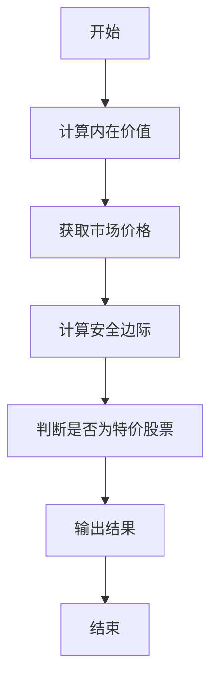
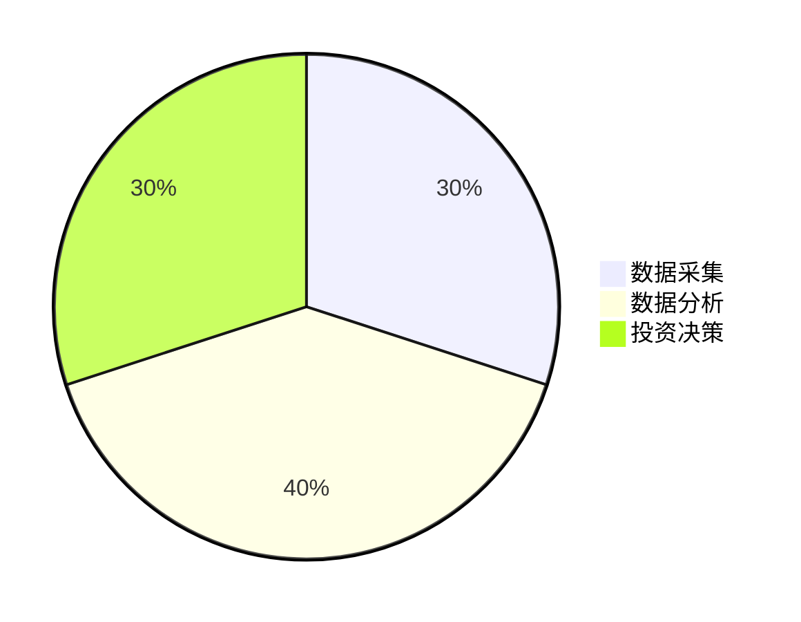

                 


# 《格雷厄姆特价股票理论在新兴产业中的应用》

---

## 关键词：
- 格雷厄姆投资理论
- 特价股票
- 新兴产业
- 价值投资
- 安全边际
- 市场分析

---

## 摘要：
本文深入探讨了格雷厄姆特价股票理论在新兴产业中的应用。通过结合经典价值投资理念与现代新兴产业的特点，分析了如何在新兴产业中识别和投资于具有长期增长潜力的特价股票。文章从理论基础、数学模型、系统架构设计到实际案例分析，全面解析了格雷厄姆理论在新兴产业中的适用性，为投资者提供了实用的指导和启示。

---

# 第1章: 格雷厄姆特价股票理论概述

## 1.1 格雷厄姆投资理论的核心概念

### 1.1.1 价值投资的基本原理
价值投资的核心理念是购买低于其内在价值的资产。格雷厄姆提出，市场的短期波动性可能导致股票价格偏离其真实价值，投资者应寻找市场价格低于内在价值的股票。

### 1.1.2 特价股票的定义与特征
特价股票是指市场价格显著低于其内在价值的股票。其特征包括：
- **低估性**：市场价格低于内在价值。
- **稳定性**：公司财务状况稳健，具备持续盈利能力。
- **成长性**：公司具备一定的成长潜力。

### 1.1.3 格雷厄姆投资策略的核心要素
1. **安全边际**：购买价格低于内在价值，确保投资的安全性。
2. **长期视角**：关注公司的长期价值，而非短期市场波动。
3. **基本面分析**：通过财务数据评估公司的内在价值。

---

## 1.2 格雷厄姆安全边际概念

### 1.2.1 安全边际的定义
安全边际是指市场价格与内在价值之间的差额。公式表示为：
$$
\text{安全边际} = \text{内在价值} - \text{市场价格}
$$

### 1.2.2 安全边际的计算方法
1. **内在价值计算**：通过DCF模型、市盈率等方法评估。
2. **市场价格获取**：通过市场数据获取股票当前价格。
3. **安全边际计算**：比较内在价值与市场价格，计算差额。

### 1.2.3 安全边际在投资决策中的作用
安全边际是投资者规避市场波动风险的重要工具。通过确保安全边际的存在，投资者能够降低短期市场波动对公司投资组合的影响。

---

## 1.3 格雷厄姆投资哲学与现代应用

### 1.3.1 价值投资的长期视角
格雷厄姆强调长期投资的重要性。他认为，短期市场波动不应影响投资者的决策，而应关注公司的长期价值。

### 1.3.2 格雷厄姆理论的现代演变
随着市场的变化，价值投资理论不断发展。现代投资者结合技术分析和基本面分析，进一步优化投资策略。

### 1.3.3 理论在新兴产业中的适用性探讨
新兴产业的高成长性和不确定性为格雷厄姆理论提供了新的应用场景。通过识别新兴产业中的特价股票，投资者能够抓住增长机遇。

---

# 第2章: 新兴产业的特点与投资机会

## 2.1 新兴产业的定义与分类

### 2.1.1 新兴产业的界定标准
新兴产业通常是指那些具有较高增长潜力，且尚未完全成熟的行业。其界定标准包括：
- **技术创新驱动**：依赖新技术的应用。
- **市场潜力大**：具备较大的市场空间。
- **竞争格局未定**：行业格局尚未稳定。

### 2.1.2 主要新兴产业领域概述
1. **科技行业**：人工智能、大数据等领域。
2. **医疗行业**：生物技术、医疗器械等领域。
3. **新能源行业**：电动汽车、太阳能等领域。

### 2.1.3 新兴产业的周期性分析
新兴产业通常经历萌芽期、成长期、成熟期和衰退期。投资者应关注行业所处阶段，选择合适的进入时机。

---

## 2.2 新兴产业的投资价值评估

### 2.2.1 产业成长性分析
评估新兴产业的成长性时，应关注以下指标：
- **行业增长率**：行业的年均增长率。
- **技术创新速度**：技术进步对行业发展的推动作用。
- **政策支持力度**：政府政策对行业的支持程度。

### 2.2.2 市场容量与竞争格局
1. **市场容量**：行业的市场规模和增长潜力。
2. **竞争格局**：行业内主要竞争者及其市场份额。

### 2.2.3 新兴产业的风险与收益平衡
新兴产业的风险较高，但潜在收益也较大。投资者应通过充分的市场分析和风险评估，选择具备竞争优势的公司。

---

## 2.3 新兴产业中的特价股票识别

### 2.3.1 特价股票在新兴产业中的表现
在新兴产业中，特价股票通常具备以下特征：
- **低估值**：市场价格低于内在价值。
- **高成长性**：公司具备较高的增长潜力。
- **竞争优势**：公司在行业内具备竞争优势。

### 2.3.2 新兴产业中特价股票的筛选标准
1. **市盈率（P/E）**：市场价格与每股收益的比率。
2. **市净率（P/B）**：市场价格与每股净资产的比率。
3. **现金流**：公司经营活动产生的现金流。

### 2.3.3 特价股票在新兴产业中的投资策略
1. **选择低估公司**：寻找市场价格低于内在价值的公司。
2. **关注成长性**：选择具备高成长潜力的公司。
3. **分散投资**：通过分散投资降低风险。

---

# 第3章: 格雷厄姆理论与新兴产业的结合

## 3.1 格雷厄姆理论在新兴产业中的适用性

### 3.1.1 价值投资与新兴产业的契合点
新兴产业的高成长性和不确定性为价值投资提供了新的机会。通过识别新兴产业中的特价股票，投资者能够抓住行业增长的红利。

### 3.1.2 新兴产业中特价股票的特征
1. **低估值**：市场价格低于内在价值。
2. **高成长性**：公司具备较高的增长潜力。
3. **竞争优势**：公司在行业内具备竞争优势。

### 3.1.3 理论与实践的结合案例
以科技行业为例，分析某家技术创新型公司的投资价值。通过计算其内在价值和市场价格，判断其是否为特价股票。

---

## 3.2 新兴产业中的安全边际分析

### 3.2.1 新兴产业中的安全边际计算
通过DCF模型计算公司内在价值，再与市场价格进行比较，计算安全边际。

### 3.2.2 安全边际在新兴产业投资中的作用
安全边际是投资者规避市场波动风险的重要工具。通过确保安全边际的存在，投资者能够降低短期市场波动对公司投资组合的影响。

### 3.2.3 实际案例分析
以某家新能源公司为例，计算其内在价值和市场价格，判断其安全边际是否存在。

---

## 3.3 理论与实践的结合案例

### 3.3.1 科技行业案例
分析某家人工智能公司，计算其内在价值和市场价格，判断其是否为特价股票。

### 3.3.2 医疗行业案例
分析某家生物技术公司，计算其内在价值和市场价格，判断其是否为特价股票。

### 3.3.3 新能源行业案例
分析某家电动汽车公司，计算其内在价值和市场价格，判断其是否为特价股票。

---

# 第4章: 数学模型与公式

## 4.1 格雷厄姆安全边际计算公式

### 4.1.1 安全边际的计算方法
$$
\text{安全边际} = \text{内在价值} - \text{市场价格}
$$

### 4.1.2 格雷厄姆公式：$$\text{安全边际} = \text{内在价值} - \text{市场价格}$$

### 4.1.3 公式的实际应用案例
以某家科技公司为例，计算其内在价值和市场价格，判断其安全边际是否存在。

---

## 4.2 新兴产业中的估值模型

### 4.2.1 市盈率（P/E）模型
$$
\text{P/E} = \frac{\text{市场价格}}{\text{每股收益}}
$$

### 4.2.2 市净率（P/B）模型
$$
\text{P/B} = \frac{\text{市场价格}}{\text{每股净资产}}
$$

### 4.2.3 现金流折现模型（DCF）
$$
\text{内在价值} = \sum_{t=1}^{n} \frac{\text{现金流}}{(1 + r)^t} + \frac{\text{终值}}{(1 + r)^n}
$$

---

## 4.3 算法原理讲解

### 4.3.1 算法流程图


### 4.3.2 Python代码实现
```python
def calculate_intrinsic_value(enterprise_value, free_cash_flow):
    return enterprise_value + free_cash_flow

def calculate_market_price(stock_price):
    return stock_price

def calculate_margin_of_safety(intrinsic_value, market_price):
    return intrinsic_value - market_price

# 示例
enterprise_value = 1000
free_cash_flow = 500
stock_price = 700

intrinsic_value = calculate_intrinsic_value(enterprise_value, free_cash_flow)
market_price = calculate_market_price(stock_price)
margin_of_safety = calculate_margin_of_safety(intrinsic_value, market_price)

print(f"内在价值：{intrinsic_value}")
print(f"市场价格：{market_price}")
print(f"安全边际：{margin_of_safety}")
```

---

## 4.4 系统分析与架构设计

### 4.4.1 系统架构图


### 4.4.2 系统功能模块设计
1. **数据采集**：获取公司财务数据和市场数据。
2. **数据分析**：计算内在价值和市场价格，判断安全边际。
3. **投资决策**：根据安全边际判断是否为特价股票。

---

## 4.5 项目实战

### 4.5.1 环境安装与配置
1. **安装Python**：安装Python 3.8及以上版本。
2. **安装数据分析库**：安装Pandas、NumPy等库。
3. **获取数据**：从金融数据平台获取股票数据。

### 4.5.2 核心代码实现
```python
import pandas as pd

# 数据处理
data = pd.read_csv("stock_data.csv")
data['intrinsic_value'] = calculate_intrinsic_value(data['enterprise_value'], data['free_cash_flow'])
data['market_price'] = calculate_market_price(data['stock_price'])
data['margin_of_safety'] = calculate_margin_of_safety(data['intrinsic_value'], data['market_price'])

# 筛选特价股票
value_stocks = data[data['margin_of_safety'] > 0]
print(value_stocks.head())
```

### 4.5.3 案例分析
以某家科技公司为例，计算其内在价值和市场价格，判断其是否为特价股票。

---

## 5.1 最佳实践与总结

### 5.1.1 投资策略总结
1. **长期视角**：关注公司的长期价值。
2. **安全边际**：确保投资的安全性。
3. **风险管理**：分散投资，降低风险。

### 5.1.2 未来展望
随着技术的进步和市场的变化，格雷厄姆理论在新兴产业中的应用将更加广泛。投资者应不断学习和优化投资策略，抓住新兴行业的增长机遇。

---

## 5.2 小结与注意事项

### 5.2.1 小结
本文通过结合格雷厄姆特价股票理论与新兴产业的特点，分析了如何在新兴产业中识别和投资于具有长期增长潜力的特价股票。通过数学模型和实际案例分析，为投资者提供了实用的指导。

### 5.2.2 注意事项
1. **数据准确性**：确保数据来源可靠。
2. **模型适用性**：根据实际情况调整模型参数。
3. **市场变化**：关注市场动态，及时调整投资策略。

---

## 5.3 拓展阅读

### 5.3.1 推荐书籍
1. 《The Intelligent Investor》——本杰明·格雷厄姆
2. 《投资学原理》——威廉·夏普

### 5.3.2 在线资源
1. 网站：[格雷厄姆投资俱乐部](https://www.valueinvestorsclub.com)
2. 博客：[价值投资实践](https://www.valueinvestmentpractice.com)

---

# 结语
通过本文的分析，读者可以深入了解格雷厄姆特价股票理论在新兴产业中的应用。无论是从理论分析、数学模型，还是实际案例，本文都为投资者提供了详实的指导。希望本文能够帮助投资者在新兴产业中找到具有长期增长潜力的特价股票，实现稳健的投资收益。

