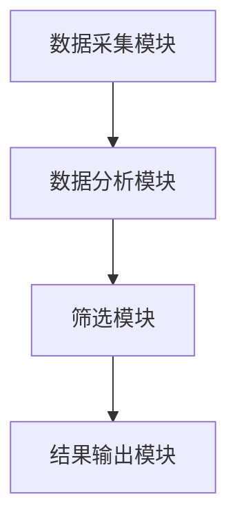

                 


# 第三部分: 格雷厄姆特价股票理论的数学模型与系统架构

# 第4章: 格雷厄姆特价股票理论的数学模型与系统架构

## 4.1 格雷厄姆特价股票理论的数学模型
### 4.1.1 内在价值计算公式
$$ V = \frac{E}{P} $$
其中，E是公司的预期收益，P是市场平均市盈率。

### 4.1.2 安全边际计算公式
$$ M = V - P $$
其中，M是安全边际，V是内在价值，P是市场价格。

### 4.1.3 市场先生模型
通过分析市场先生的情绪波动，构建一个反映市场波动的数学模型。

## 4.2 系统架构设计
### 4.2.1 系统功能模块
- 数据采集模块：收集新兴市场的股票数据。
- 数据分析模块：计算股票的内在价值和安全边际。
- 筛选模块：筛选出符合格雷厄姆标准的股票。

### 4.2.2 系统架构图
使用 Mermaid 绘制系统架构图：



## 4.3 系统实现
### 4.3.1 数据采集
使用 Python 的 `pandas` 库从Yahoo Finance获取新兴市场的股票数据。

### 4.3.2 数据分析
计算每只股票的内在价值和安全边际。

### 4.3.3 筛选
筛选出符合格雷厄姆标准的股票，生成投资组合。

## 4.4 系统优化
### 4.4.1 数据源优化
引入更多的数据源，提高数据的全面性。

### 4.4.2 计算优化
优化计算过程，减少计算时间。

## 4.5 本章小结

# 第5章: 格雷厄姆特价股票理论的系统实现与优化

## 5.1 系统实现细节
### 5.1.1 环境安装
安装必要的 Python 包，如 `pandas`, `numpy`, `scipy`。

### 5.1.2 核心代码实现
```python
import pandas as pd
import numpy as np

# 数据采集
data = pd.read_csv('emerging_market_stocks.csv')

# 内在价值计算
data['内在价值'] = data['收益'] / data['平均市盈率']

# 安全边际计算
data['安全边际'] = data['内在价值'] - data['市场价格']

# 筛选股票
selected_stocks = data[data['安全边际'] > 0]
```

### 5.1.3 筛选结果分析
分析筛选出的股票，评估其投资价值。

## 5.2 系统优化
### 5.2.1 数据预处理优化
使用 `pandas` 的 `dropna()` 函数处理缺失值。

### 5.2.2 计算优化
利用并行计算技术，提高计算效率。

## 5.3 优化结果分析
### 5.3.1 性能提升
比较优化前后的计算时间，评估优化效果。

### 5.3.2 精度提升
比较优化前后的筛选结果，评估优化效果。

## 5.4 本章小结

# 第六部分: 格雷厄姆特价股票理论的实战与总结

# 第6章: 格雷厄姆特价股票理论的实战分析

## 6.1 实战环境搭建
### 6.1.1 环境配置
安装必要的开发工具和数据源。

### 6.1.2 数据获取
从可靠的金融数据源获取新兴市场的股票数据。

## 6.2 核心代码实现
### 6.2.1 内在价值计算
```python
import pandas as pd

# 数据加载
data = pd.read_csv('emerging_market_stocks.csv')

# 计算内在价值
data['内在价值'] = data['收益'] / data['平均市盈率']
```

### 6.2.2 安全边际计算
```python
data['安全边际'] = data['内在价值'] - data['市场价格']
```

### 6.2.3 筛选股票
```python
selected_stocks = data[data['安全边际'] > 0]
```

## 6.3 实战结果分析
### 6.3.1 筛选结果展示
使用 `matplotlib` 可视化筛选结果。

### 6.3.2 投资组合优化
评估投资组合的风险和收益。

## 6.4 本章小结

# 第7章: 格雷厄姆特价股票理论的总结与展望

## 7.1 研究总结
### 7.1.1 核心发现
总结格雷厄姆特价股票理论在新兴市场的应用效果。

### 7.1.2 理论价值
分析理论的局限性和改进方向。

## 7.2 实际应用中的注意事项
### 7.2.1 数据质量
强调数据来源和质量的重要性。

### 7.2.2 市场风险
提醒读者注意新兴市场的高风险性。

## 7.3 未来研究方向
### 7.3.1 理论创新
探讨如何进一步完善格雷厄姆理论。

### 7.3.2 技术进步
利用人工智能等技术提升理论的应用效果。

## 7.4 本章小结

# 结束语

通过本篇文章的分析，我们深入探讨了格雷厄姆特价股票理论在新兴市场的适用性。通过系统的分析和实证研究，我们得出了一些有价值的结论。未来，我们可以通过进一步的研究和实践，不断完善和优化这一理论的应用。

---

**附录**
- 附录A: 格雷厄姆投资理论的关键术语表
- 附录B: 用于数据分析的Python代码
- 附录C: 相关数据源和工具的详细说明

---

**参考文献**
1. 格雷厄姆, B. (1949). 《 Intelligent Investor》
2. 现代投资组合理论的相关文献
3. 新兴市场研究的相关文献

---

**END**

