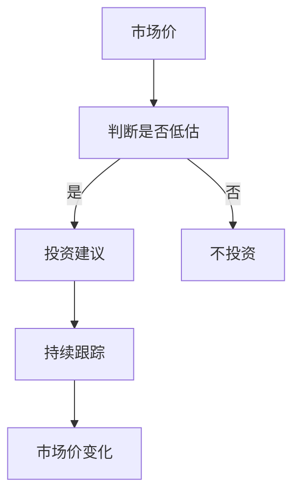
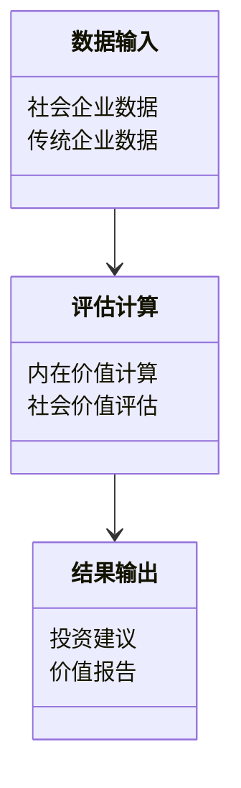
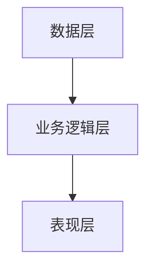
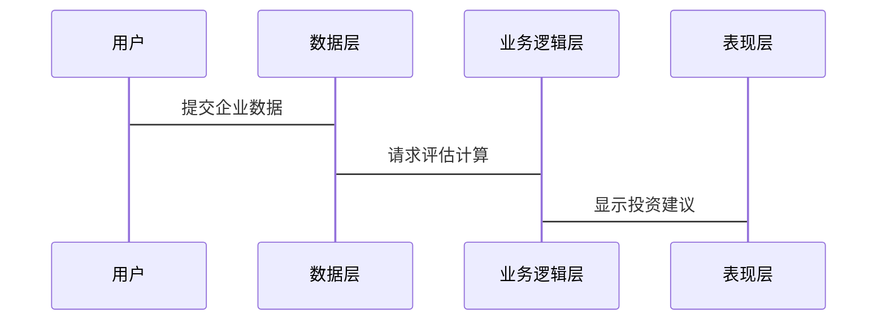

                 


# 格雷厄姆特价股票理论在社会企业家投资中的运用

## 关键词
- 格雷厄姆特价股票理论
- 社会企业家
- 价值投资
- 股票估值
- 社会价值评估

## 摘要
本文探讨格雷厄姆的价值投资理念在社会企业家投资中的应用，通过分析特价股票理论的核心要素，结合社会企业的特点，构建一套评估框架。文章首先介绍背景，然后分析核心概念，讲解算法原理，构建系统架构，通过案例展示实战应用，最后总结并展望未来方向。

---

# 第一部分：背景介绍

## 第1章：格雷厄姆特价股票理论概述

### 1.1 格雷厄姆的背景与价值投资理念

#### 1.1.1 格雷厄姆的生平与投资理念
 Benjamin Graham 是价值投资的鼻祖，其理论强调安全边际和深入的基本面分析。他的核心理念是寻找市场低估的股票，通过长期持有实现稳健收益。

#### 1.1.2 格雷厄姆特价股票理论的核心观点
 格雷厄姆提出，股票的内在价值远高于市场价时，即为特价股票。投资者应关注企业的财务状况、盈利能力等基本面指标。

#### 1.1.3 格雷厄姆理论在现代投资中的应用
 格雷厄姆的理论为机构投资者和个人投资者提供了基础，尤其是在当前市场波动加剧的情况下，其长期价值投资理念仍具指导意义。

---

## 第2章：社会企业家的概念与特点

### 2.1 社会企业的定义与目标
 社会企业以解决社会问题为目标，通过商业手段实现可持续发展，追求社会价值与经济效益的双重目标。

### 2.2 社会企业的商业模式与挑战
 社会企业通常面临资金短缺、运营效率低下等挑战，但其社会价值评估体系仍需进一步完善。

### 2.3 社会企业家与传统企业的区别
 社会企业家不仅关注经济效益，更注重社会影响，其商业模式和评估标准与传统企业存在显著差异。

---

# 第二部分：核心概念与联系

## 第3章：价值投资与社会企业的核心概念

### 3.1 核心概念的内在联系
 格雷厄姆的价值投资理念与社会企业的社会价值目标具有相似性，均强调长期稳健的增长。

### 3.2 价值投资与社会价值的对比分析
 通过表格对比，分析价值投资与社会价值在目标、评估方法、风险控制等方面的异同。

| 对比维度 | 价值投资 | 社会价值 |
|----------|----------|----------|
| 目标     | 资产增值 | 社会影响 |
| 评估     | 财务指标 | 综合指标 |
| 风险     | 财务风险 | 社会风险 |

### 3.3 格雷厄姆模型在社会企业中的应用
 通过mermaid图展示格雷厄姆模型在社会企业评估中的结构，包括内在价值计算、市场价比较等步骤。



---

## 第4章：社会价值的评估维度与方法

### 4.1 社会价值的评估维度
 包括社会效益、环境影响、治理结构等方面，需建立多维度的评估体系。

### 4.2 价值投资与社会价值的融合
 通过公式化方法，将社会价值纳入企业估值体系。

---

# 第三部分：算法原理讲解

## 第5章：格雷厄姆内在价值计算模型

### 5.1 内在价值计算公式
 格雷厄姆的内在价值公式：
 $$ V = \text{股息} \times \left(1 + \frac{\text{增长率}}{资本成本}\right) $$
 通过公式讲解，详细分析各项参数的含义。

### 5.2 多因子模型的应用
 结合社会价值评估，构建多因子模型，如：
 $$ \text{综合价值} = \alpha \times V + \beta \times S $$
 其中，\( V \) 为内在价值，\( S \) 为社会价值评分。

### 5.3 社会价值的量化方法
 将社会价值转化为可量化的指标，如：
 - 就业机会创造
 - 环境影响指数
 - 社会责任履行情况

---

## 第6章：系统分析与架构设计

### 6.1 问题场景介绍
 社会企业家投资面临信息不对称、评估标准不统一等问题，亟需构建统一的评估框架。

### 6.2 系统功能设计

#### 6.2.1 领域模型
 使用mermaid图展示系统功能模块，包括数据输入、评估计算、结果输出等。



### 6.3 系统架构设计

#### 6.3.1 系统架构图
 使用mermaid展示系统架构，包括数据层、业务逻辑层、表现层。



### 6.4 系统交互设计

#### 6.4.1 序列图
 展示用户与系统的交互流程，如数据输入、评估计算、结果输出。



---

## 第7章：项目实战

### 7.1 环境安装
 安装必要的数据处理工具和分析软件，如Python、Pandas、Matplotlib。

### 7.2 核心实现代码

#### 7.2.1 内在价值计算
 使用Python代码实现格雷厄姆的内在价值公式。

```python
def calculate_intrinsic_value(dividend, growth_rate, capital_cost):
    return dividend * (1 + growth_rate / capital_cost)
```

#### 7.2.2 社会价值评分
 根据企业社会责任指标，计算社会价值评分。

### 7.3 案例分析
 以某社会企业为例，展示如何应用上述模型进行估值和投资建议。

### 7.4 代码实现与解读
 详细解读代码实现，包括数据输入、计算过程和结果输出。

---

## 第8章：总结与展望

### 8.1 核心观点总结
 格雷厄姆的价值投资理念可有效应用于社会企业家投资，通过定量与定性结合的方法，实现社会价值与经济效益的统一。

### 8.2 未来展望
 建议进一步完善社会价值评估体系，探索更多创新的评估方法，推动价值投资理念在社会企业中的深入应用。

---

通过以上步骤，文章系统地介绍了格雷厄姆特价股票理论在社会企业家投资中的应用，从理论到实践，层层递进，为投资者提供了实用的指导和参考。

