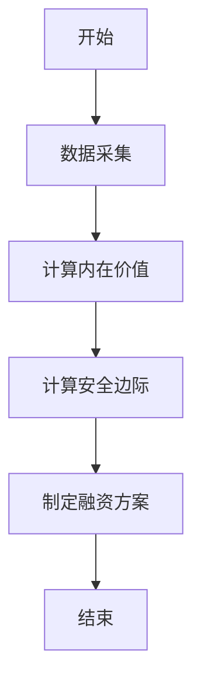

                 

# 《格雷厄姆特价股票理论在社会企业融资中的运用》

---

## 关键词：格雷厄姆投资理论，社会企业，股票融资，价值评估，安全边际

---

## 摘要：  
本文探讨了格雷厄姆特价股票理论在社会企业融资中的应用。通过结合社会企业的特殊需求和格雷厄姆的价值投资理念，本文提出了基于内在价值评估的融资策略，构建了数学模型，并设计了系统化的融资架构。文章还结合实际案例，展示了如何在社会企业融资中应用格雷厄姆理论，以实现融资收益与社会影响力的双重目标。

---

## 第一部分：格雷厄姆特价股票理论基础

### 第1章：格雷厄姆特价股票理论概述

#### 1.1 格雷厄姆投资理论的核心概念  
格雷厄姆是价值投资的鼻祖，其理论的核心在于寻找“特价股票”，即市场价格低于内在价值的股票。内在价值是基于企业基本面分析得出的股票真实价值，而安全边际则是内在价值与市场价格之间的差额，是投资决策的重要依据。

- **核心概念**：
  - 内在价值：$V = \frac{E}{k}$，其中$E$为企业的预期收益，$k$为折现率。
  - 安全边际：$Margin = V - P$，其中$P$为市场价格。

#### 1.2 格雷厄姆投资理论的数学模型  
格雷厄姆的理论可以通过以下数学模型进行分析：

- **内在价值计算公式**：
  $$V = \frac{E}{k}$$
  其中，$E$是企业的未来现金流，$k$是折现率。

- **安全边际计算公式**：
  $$Margin = V - P$$
  其中，$P$是当前市场价格。

#### 1.3 格雷厄姆投资理论的哲学基础  
格雷厄姆强调长期投资和安全边际的重要性，认为投资的本质是购买企业的一部分，而不是单纯的股票买卖。他主张在市场恐慌时寻找被低估的机会，并通过分散投资降低风险。

---

## 第二部分：社会企业融资的独特性

### 第2章：社会企业的定义与特点  

#### 2.1 社会企业的核心概念  
社会企业是以实现社会价值为目标的企业，其利润部分用于社会公益，部分用于企业运营。与传统企业相比，社会企业的财务目标与社会影响力并重。

- **社会企业的核心特征**：
  - 社会影响力：通过经营活动解决社会问题。
  - 财务可持续性：依赖于商业运作实现自我造血。
  - 透明度：需要公开社会影响力与财务表现。

#### 2.2 社会企业的融资需求  
社会企业的融资需求具有特殊性，其融资目标不仅是资金支持，还包括社会影响力的放大。

- **融资需求特点**：
  - 资金需求多元化：包括债务融资、股权融资和社会资本。
  - 融资目标双重性：既要实现财务回报，又要实现社会价值。
  - 融资渠道多样性：包括政府资助、社会资本和机构投资。

#### 2.3 社会企业的财务特征  
社会企业的财务表现与传统企业有所不同，其财务报表需要同时反映经济价值和社会价值。

- **财务表现对比表**：  
  | 指标         | 传统企业       | 社会企业       |
  |--------------|----------------|---------------|
  | 利润目标     | 最大化股东收益 | 平衡收益与社会影响力 |
  | 投资回报率   | 高             | 中等           |
  | 资金用途     | 业务扩展       | 社会公益+业务扩展 |

---

## 第三部分：格雷厄姆理论在社会企业融资中的应用框架

### 第3章：格雷厄姆理论与社会企业融资的结合  

#### 3.1 格雷厄姆理论在社会企业融资中的适用性  
格雷厄姆的理论在社会企业融资中具有重要价值，其核心在于通过价值评估找到被低估的社会企业，利用安全边际进行投资。

- **适用性分析**：
  - 社会企业的内在价值可以通过基本面分析计算。
  - 社会企业的安全边际可以通过市场价格与内在价值的差异确定。

#### 3.2 社会企业融资中的数学模型构建  
基于格雷厄姆理论，构建社会企业融资的数学模型：

- **社会企业内在价值公式**：
  $$V_s = \frac{E_s}{k_s}$$
  其中，$E_s$是社会企业的预期社会价值与经济价值之和，$k_s$是社会企业的折现率。

- **社会企业安全边际公式**：
  $$Margin_s = V_s - P_s$$
  其中，$P_s$是社会企业的市场价格。

#### 3.3 社会企业融资中的决策框架  
通过构建决策框架，投资者可以更好地识别具有社会价值和投资价值的社会企业。

- **决策步骤**：
  1. 确定社会企业的社会影响力。
  2. 计算社会企业的内在价值。
  3. 评估社会企业的安全边际。
  4. 制定投资组合。

---

## 第四部分：社会企业融资的系统分析与架构设计

### 第4章：社会企业融资系统的功能设计  

#### 4.1 系统功能模块划分  
为了实现社会企业融资的系统化，设计了以下功能模块：

- **模块划分**：
  - 数据采集模块：收集社会企业的财务数据和社会影响力数据。
  - 价值评估模块：计算社会企业的内在价值和安全边际。
  - 融资决策模块：基于评估结果制定融资方案。

#### 4.2 系统功能流程图  
以下是系统功能流程图：

---

## 总结  

格雷厄姆特价股票理论在社会企业融资中的应用，不仅为投资者提供了科学的决策工具，也为社会企业融资提供了新的思路。通过构建数学模型和系统化的融资架构，投资者可以在实现财务回报的同时，推动社会价值的实现。未来，随着社会企业的不断发展，格雷厄姆理论的应用将更加广泛和深入。

