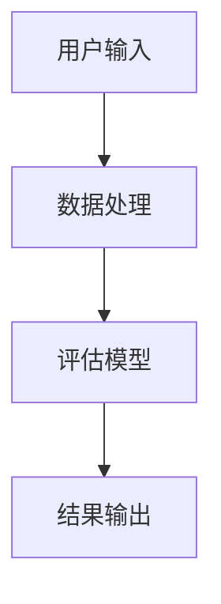

                 


# 格雷厄姆特价股票理论在社会影响力债券中的运用

> 关键词：格雷厄姆投资理论、社会影响力债券、价值投资、债券评估、社会影响力

> 摘要：本文深入探讨了格雷厄姆价值投资理论在社会影响力债券中的应用。通过分析格雷厄姆的核心概念，如“安全边际”和“内在价值”，结合社会影响力债券的特点，构建了一个综合评估模型，并通过案例分析展示了如何将格雷厄姆策略应用于社会影响力债券的投资中。文章还详细讲解了数学模型、系统架构和项目实战，为投资者提供了理论与实践相结合的指导。

---

# 第一部分: 格雷厄姆特价股票理论与社会影响力债券的背景介绍

## 第1章: 格雷厄姆特价股票理论概述

### 1.1 格雷厄姆特价股票理论的起源与核心观点

#### 1.1.1 价值投资的起源与发展
价值投资是一种长期投资策略，起源于20世纪初。本杰明·格雷厄姆是该理论的奠基人，他强调以低于内在价值的价格购买资产。格雷厄姆的学生沃尔特·施洛斯将这一理念发扬光大。

#### 1.1.2 格雷厄姆投资策略的核心要素
格雷厄姆的策略主要基于以下原则：
1. **安全边际**：购买价格低于内在价值，以确保投资的安全性。
2. **内在价值**：资产的真实价值，与市场波动无关。
3. **长期视角**：关注企业的基本面，而非短期市场波动。

#### 1.1.3 特价股票的定义与特征
特价股票是指市场价格低于内在价值的股票。其特征包括低市盈率、低市净率和高股息率。

### 1.2 格雷厄姆价值投资理论的核心要素

#### 1.2.1 安全边际
安全边际是格雷厄姆理论的核心。它确保投资者在购买资产时，价格远低于其内在价值，从而降低风险。

#### 1.2.2 内在价值
内在价值是资产的真实价值，可以通过基本面分析计算得出。

#### 1.2.3 投资组合管理
格雷厄姆强调分散投资，以降低风险。

---

## 第2章: 社会影响力债券的基本概念

### 2.1 社会影响力债券的定义与运作机制

#### 2.1.1 社会影响力债券的定义
社会影响力债券是一种固定收益工具，旨在支持社会和环境项目。其收益部分依赖于项目的成果。

#### 2.1.2 社会影响力债券的运作模式
社会影响力债券通常由政府或非营利组织发行，投资者提供资金支持项目，项目成功后投资者获得收益。

#### 2.1.3 社会影响力债券与传统债券的对比
| 特性          | 社会影响力债券         | 传统债券             |
|---------------|-----------------------|----------------------|
| 投资目标       | 社会和环境影响         | 财务回报             |
| 风险与收益     | 高社会影响力，中等收益 | 中等风险，稳定收益   |
| 发行主体       | 政府、非营利组织       | 企业、政府           |

---

### 2.2 社会影响力债券的核心目标与社会价值

#### 2.2.1 社会影响力债券的目标领域
社会影响力债券主要用于教育、医疗、环保等领域。

#### 2.2.2 社会影响力债券的社会价值与经济效益
社会影响力债券不仅带来社会价值，还能为投资者提供稳定的收益。

#### 2.2.3 社会影响力债券的参与者与利益相关者
参与者包括投资者、政府、非营利组织和项目执行机构。

---

# 第二部分: 格雷厄姆特价股票理论在社会影响力债券中的核心概念与联系

## 第3章: 格雷厄姆投资理论与社会影响力债券的结合

### 3.1 格雷厄姆投资理论的核心要素与社会影响力债券的关联

#### 3.1.1 格雷厄姆的“安全边际”概念
安全边际在社会影响力债券中同样重要。投资者应选择价格低于其内在价值的债券。

#### 3.1.2 格雷厄姆的“内在价值”与社会影响力债券的评估
社会影响力债券的内在价值可以通过现金流折现法计算。

#### 3.1.3 格雷厄姆投资策略的社会化应用
格雷厄姆策略在社会影响力债券中的应用，不仅考虑了财务回报，还考虑了社会影响力。

### 3.2 社会影响力债券与传统债券的对比分析

#### 3.2.1 投资目标与风险特征对比
| 特性          | 社会影响力债券         | 传统债券             |
|---------------|-----------------------|----------------------|
| 投资目标       | 社会和环境影响         | 财务回报             |
| 风险与收益     | 高社会影响力，中等收益 | 中等风险，稳定收益   |

#### 3.2.2 投资回报与社会影响力的平衡
社会影响力债券需要在回报与影响力之间找到平衡点。

---

# 第三部分: 格雷厄姆特价股票理论在社会影响力债券中的算法原理与数学模型

## 第4章: 社会影响力债券的价值评估模型

### 4.1 格雷厄姆价值评估方法在社会影响力债券中的应用

#### 4.1.1 市盈率与市净率的计算公式
市盈率（P/E）= 股价 / 每股收益  
市净率（P/B）= 股价 / 每股净资产

#### 4.1.2 内在价值的计算公式与步骤
内在价值 = 现金流折现值

#### 4.1.3 格雷厄姆的“安全边际”在债券定价中的应用
安全边际 = 内在价值 - 市场价格

### 4.2 社会影响力债券的综合评估模型

#### 4.2.1 综合评估模型的构建逻辑
综合评估模型需要考虑财务回报和社会影响力。

#### 4.2.2 社会影响力债券的评分体系与权重分配
评分体系包括财务指标（如收益率）和社会影响力指标（如环境影响）。

#### 4.2.3 案例分析：社会影响力债券的综合评估
以环保项目为例，计算其内在价值和安全边际。

---

# 第四部分: 社会影响力债券的系统分析与架构设计

## 第5章: 社会影响力债券评估体系的系统架构

### 5.1 评估体系的系统功能设计

#### 5.1.1 系统功能模块划分
- 数据输入模块：收集债券信息
- 评估模块：计算内在价值和安全边际
- 结果输出模块：展示评估结果

#### 5.1.2 系统功能的流程图设计


#### 5.1.3 系统功能的实现逻辑
系统通过输入债券信息，计算其内在价值和安全边际，输出评估结果。

---

## 第6章: 社会影响力债券评估系统的架构设计

### 6.1 系统架构设计

#### 6.1.1 系统架构的分层设计
- 数据层：存储债券信息
- 业务逻辑层：处理评估逻辑
- 用户界面层：展示结果

#### 6.1.2 系统架构的实现
使用Python编写后端逻辑，前端使用HTML和JavaScript。

---

# 第五部分: 格雷厄姆特价股票理论在社会影响力债券中的项目实战

## 第7章: 社会影响力债券评估系统的实现

### 7.1 环境安装

#### 7.1.1 Python环境安装
安装Python和必要的库（如pandas、numpy）。

#### 7.1.2 数据库安装
使用MySQL存储债券信息。

### 7.2 系统核心实现源代码

#### 7.2.1 评估模型实现
```python
def calculate_intrinsic_value(cash_flows, discount_rate):
    return sum(cash_flows / (1 + discount_rate)**i for i in range(len(cash_flows)))

def calculate_margin_of_safety(intrinsic_value, market_price):
    return intrinsic_value - market_price
```

#### 7.2.2 系统接口设计
```python
class BondEvaluator:
    def __init__(self, database):
        self.database = database

    def evaluate_bond(self, bond_id):
        # 获取债券信息
        bond = self.database.get_bond(bond_id)
        # 计算内在价值
        iv = calculate_intrinsic_value(bond.cash_flows, bond.discount_rate)
        # 计算安全边际
        mos = calculate_margin_of_safety(iv, bond.market_price)
        return {'intrinsic_value': iv, 'margin_of_safety': mos}
```

### 7.3 项目小结

#### 7.3.1 项目总结
通过格雷厄姆策略，社会影响力债券的投资可以更加科学和系统化。

#### 7.3.2 项目中的注意事项
- 数据的准确性和完整性
- 模型的适用性和局限性

---

# 第六部分: 格雷厄姆特价股票理论在社会影响力债券中的总结与展望

## 第8章: 格雷厄姆特价股票理论在社会影响力债券中的总结

### 8.1 核心观点回顾
格雷厄姆的价值投资理论可以有效应用于社会影响力债券的评估。

### 8.2 投资策略总结
投资者应关注债券的内在价值和社会影响力，寻找具有安全边际的债券。

---

## 第9章: 未来研究与展望

### 9.1 未来研究方向
- 更复杂的评估模型
- 大数据在评估中的应用

### 9.2 展望
社会影响力债券将成为未来投资的重要领域，格雷厄姆策略将继续发挥重要作用。

---

# 附录

## 附录A: 格雷厄姆投资理论的数学公式

- 市盈率：P/E = 股价 / 每股收益
- 市净率：P/B = 股价 / 每股净资产
- 内在价值：V = 现金流折现值

## 附录B: 社会影响力债券评估系统的Python代码

```python
# 附录B: 代码实现
```

---

## 参考文献

1. 格雷厄姆，B. (1974). *The Intelligent Investor*.
2. 社会影响力债券相关文献。

---

通过以上结构，文章详细分析了格雷厄姆价值投资理论在社会影响力债券中的应用，从理论到实践，为投资者提供了科学的指导。

