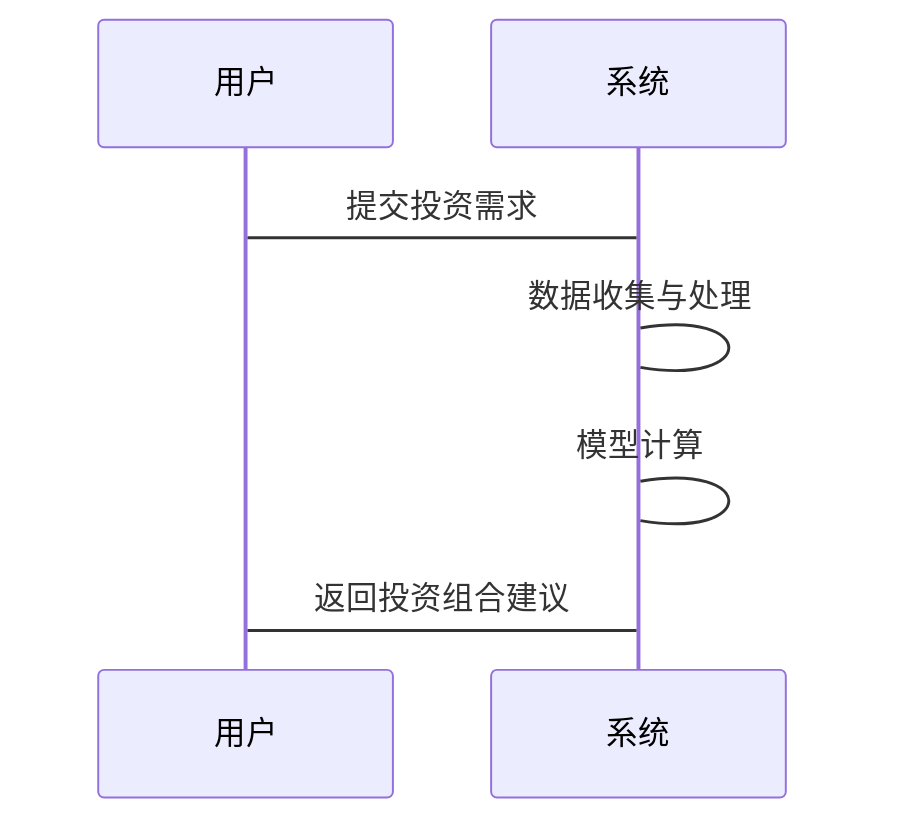

                 


# 《格雷厄姆特价股票理论在社会影响力投资中的新应用》

## 关键词：格雷厄姆特价股票理论，社会影响力投资，价值投资，影响力评估，投资策略

## 摘要：本文探讨了格雷厄姆特价股票理论如何应用于社会影响力投资，通过分析核心概念、算法原理和实际案例，展示了如何在追求财务回报的同时实现社会价值。文章结合了财务指标与社会影响指标，提出了创新的投资策略，为投资者提供了新的视角和方法。

---

### 目录

---

# 格雷厄姆特价股票理论在社会影响力投资中的新应用

## 1. 背景介绍

### 1.1 核心概念术语说明

| 概念               | 定义与描述                                         |
|--------------------|--------------------------------------------------|
| 格雷厄姆特价股票   | 具有低市盈率、低市净率的股票，通常被视为被低估的投资对象。 |
| 社会影响力投资     | 投资于能够带来积极社会影响的公司或项目，关注环境、社会和治理（ESG）因素。 |
| 影响力评估         | 对投资标的在社会、环境等方面产生的正面影响进行测量和评估。 |

### 1.2 问题背景与问题描述

传统投资主要关注财务回报，而社会影响力投资强调投资的社会价值。然而，如何在追求财务回报的同时实现社会目标，是当前投资者面临的重要挑战。

### 1.3 格雷厄姆理论与社会影响力投资的结合

通过结合格雷厄姆的低估值策略与影响力投资的目标，可以在筛选投资标的时同时考虑财务表现和社会贡献。

---

## 2. 核心概念与联系

### 2.1 核心概念的原理与特征

#### 2.1.1 格雷厄姆特价股票的核心属性

- **低市盈率（P/E）**：市盈率低于行业平均水平，表明股票价格被低估。
- **低市净率（P/B）**：市净率低于行业平均水平，表明资产价值被低估。

#### 2.1.2 社会影响力投资的核心属性

- **环境影响**：关注企业的环保表现，如碳排放、资源利用效率。
- **社会效益**：关注企业在社会公益、员工福利等方面的贡献。
- **治理结构**：关注企业治理的透明度和道德标准。

### 2.2 核心概念的ER实体关系图

```mermaid
erDiagram
    项目(项目ID, 项目名称, 项目目标) {
        --> 影响力评估(评估ID, 评估指标, 评估结果)
    }
    投资者(投资者ID, 投资者名称, 投资目标) {
        --> 项目(项目ID, 项目名称, 项目目标)
        --> 投资组合(组合ID, 组合名称, 组合策略)
    }
    投资组合(组合ID, 组合名称, 组合策略) {
        --> 股票(股票ID, 股票名称, 股票代码)
        --> 债券(债券ID, 债券名称, 债券类型)
    }
    股票(股票ID, 股票名称, 股票代码) {
        --> 企业(企业ID, 企业名称, 企业行业)
        --> 格雷厄姆指标(指标ID, 指标名称, 指标值)
    }
    企业(企业ID, 企业名称, 企业行业) {
        --> 影响力评估(评估ID, 评估指标, 评估结果)
    }
```

---

## 3. 格雷厄姆理论与社会影响力投资的结合

### 3.1 理论与社会影响力投资的结合方式

将格雷厄姆的低估值策略与影响力投资的ESG因素相结合，筛选出具有低估值且社会影响正面的标的。

### 3.2 算法原理

#### 3.2.1 综合评分模型

设计一个综合评分模型，将财务指标和社会影响指标进行加权评分，计算综合得分。

$$
\text{综合得分} = \alpha \times \text{财务指标得分} + \beta \times \text{社会影响指标得分}
$$

其中，$\alpha + \beta = 1$，$\alpha$ 和 $\beta$ 是权重系数，根据投资目标调整。

#### 3.2.2 算法实现步骤

1. **数据收集**：收集目标企业的财务数据和ESG数据。
2. **指标计算**：
   - 财务指标：市盈率（P/E）、市净率（P/B）。
   - 社会影响指标：碳排放强度、员工福利指数。
3. **标准化处理**：对各项指标进行标准化处理，消除量纲影响。
4. **评分计算**：根据公式计算综合得分。
5. **排序筛选**：按综合得分排序，选择得分高的企业作为投资标的。

---

## 4. 系统架构与实现

### 4.1 系统架构设计


### 4.2 系统交互设计



---

## 5. 项目实战

### 5.1 环保企业案例分析

以某环保科技公司为例，分析其是否符合格雷厄姆特价股票的条件，同时评估其社会影响力。

#### 5.1.1 企业筛选

- **市盈率（P/E）**：计算公式为 $P/E = \text{股价} / \text{每股收益}$。
- **市净率（P/B）**：计算公式为 $P/B = \text{股价} / \text{每股净资产}$。
- **影响力评估**：评估企业在环保技术开发、员工福利等方面的贡献。

#### 5.1.2 数据分析

- **财务数据**：假设该公司的P/E为15，行业平均为20；P/B为2，行业平均为3。
- **社会影响数据**：企业获得多项环保奖项，员工福利优于行业平均水平。

#### 5.1.3 投资建议

- **综合得分计算**：
  $$
  \text{综合得分} = 0.6 \times \text{财务指标得分} + 0.4 \times \text{社会影响指标得分}
  $$
  假设财务指标得分为0.8，社会影响指标得分为0.9，综合得分为 $0.6 \times 0.8 + 0.4 \times 0.9 = 0.48 + 0.36 = 0.84$，高于行业平均。

---

## 6. 总结与展望

### 6.1 总结

本文通过理论分析和案例研究，展示了格雷厄姆特价股票理论在社会影响力投资中的新应用，提出了结合财务指标和社会影响指标的综合评估模型。

### 6.2 展望

未来的研究可以进一步优化评估模型，引入更多影响因素，并探索其在不同投资领域的适用性。

---

## 7. 最佳实践 Tips

- **数据准确性**：确保数据来源可靠，避免偏差。
- **模型调整**：根据实际需求调整权重系数。
- **长期视角**：社会影响力投资需长期关注，耐心持有。

---

通过以上内容，本文为投资者提供了在社会影响力投资中应用格雷厄姆理论的系统方法，帮助他们在追求财务回报的同时，实现社会价值。

