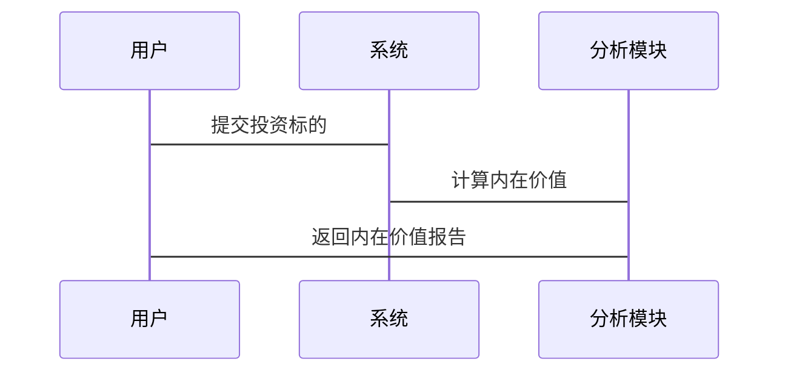

                 


# 《格雷厄姆特价股票理论在私募股权投资中的运用》

> 关键词：格雷厄姆，特价股票，私募股权，投资策略，价值评估

> 摘要：本文系统阐述了格雷厄姆的价值投资理论及其在私募股权投资中的应用。通过分析内在价值计算模型、选股标准和风险控制策略，结合实际案例，展示了如何在私募股权中应用格雷厄姆理论，实现长期稳定的收益。文章还探讨了理论的优缺点，提出了最佳实践建议，为投资者提供了宝贵的指导。

---

# 第1章: 格雷厄姆特价股票理论概述

## 1.1 格雷厄姆特价股票理论的核心概念

### 1.1.1 价值投资的基本原理
价值投资是一种长期投资策略，强调以低于内在价值的价格购买优质资产。格雷厄姆在《 Intelligent Investor》中提出，市场的短期波动不可预测，但长期趋势由内在价值决定。投资者应寻找市场价格低于内在价值的股票，长期持有以获得超额收益。

### 1.1.2 格雷厄姆的投资理念与方法
格雷厄姆强调安全边际和风险控制，主张以合理的价格投资具有稳定收益和良好财务状况的企业。他提出了多种选股标准，包括低市盈率、低市净率、高股息率等，以筛选出具有投资价值的股票。

### 1.1.3 特价股票的定义与特征
特价股票是指市场价格低于内在价值的股票。其特征包括：低市盈率、低市净率、高股息率、稳定的盈利能力、良好的财务状况等。这些特征使得特价股票具有较高的安全边际，适合长期投资。

## 1.2 私募股权投资的基本概念

### 1.2.1 私募股权的定义与特点
私募股权是指通过非公开市场进行的股权投资，投资者通常是机构或高净值个人。其特点包括：高回报潜力、高风险、较长的投资周期、较强的流动性风险、专业的管理团队等。

### 1.2.2 私募股权投资的流程与模式
私募股权投资流程包括：项目筛选、尽职调查、估值与定价、投资决策、投资后管理、退出机制等。私募股权模式主要包括：风险投资、成长资本、杠杆收购、PIPE投资等。

### 1.2.3 私募股权投资的市场现状与发展趋势
近年来，私募股权投资市场迅速发展，市场规模不断扩大。随着全球经济的不确定性增加，私募股权作为一种高回报、高风险的投资方式，受到越来越多投资者的关注。

## 1.3 格雷厄姆特价股票理论与私募股权投资的结合

### 1.3.1 价值投资在私募股权中的应用
格雷厄姆的价值投资理念在私募股权投资中具有重要的应用价值。私募股权投资者可以通过寻找具有潜在价值的公司，以低于其内在价值的价格进行投资，从而实现长期的超额收益。

### 1.3.2 私募股权投资中的特价股票筛选策略
在私募股权投资中，可以通过格雷厄姆的选股标准，筛选出具有低市盈率、低市净率、高股息率等特征的企业。同时，还需要结合企业的财务状况、行业地位、管理团队等因素，进行全面评估。

### 1.3.3 格雷厄姆理论对私募股权投资的启示
格雷厄姆的理论强调安全边际和长期投资，这对私募股权投资具有重要的启示。私募股权投资者应注重风险控制，避免盲目追求高风险高回报，而是以合理的价格投资于具有长期增长潜力的企业。

---

# 第2章: 格雷厄姆特价股票理论的核心模型与分析方法

## 2.1 格雷厄姆的内在价值计算模型

### 2.1.1 内在价值的定义与计算公式
内在价值是指一家企业在其持续经营中所能创造的现金流的现值。格雷厄姆的内在价值计算公式如下：
$$
\text{内在价值} = \frac{\text{未来现金流}}{\text{折现率}}
$$
其中，未来现金流可以通过对企业未来净利润的预测，并考虑资本支出和折旧等因素进行计算。

### 2.1.2 格雷厄姆的保守估计法
格雷厄姆的保守估计法强调在计算内在价值时，采用保守的假设。例如，可以将折现率提高一倍，或者将未来现金流预测值降低一半，以确保内在价值的计算具有较大的安全边际。

### 2.1.3 内在价值与市场价格的对比分析
通过比较内在价值与市场价格，可以判断一只股票是否为特价股票。如果市场价格远低于内在价值，则该股票具有较高的投资价值。

## 2.2 格雷厄姆的选股标准与指标

### 2.2.1 低市盈率与低市净率的选股标准
市盈率（P/E）和市净率（P/B）是衡量股票价值的重要指标。格雷厄姆建议投资者选择市盈率和市净率低于行业平均水平的股票，以确保投资的安全性。

$$
\text{市盈率} = \frac{\text{股价}}{\text{每股收益}}
$$
$$
\text{市净率} = \frac{\text{股价}}{\text{每股净资产}}
$$

### 2.2.2 股息率与盈利能力的分析指标
股息率（Dividend Yield）和盈利能力（如ROE、ROA）也是重要的选股指标。格雷厄姆建议选择股息率较高、盈利能力稳定的公司。

### 2.2.3 财务健康状况的评估方法
财务健康状况是评估企业价值的重要因素。格雷厄姆强调企业应具有较强的盈利能力、良好的财务状况和稳定的现金流。

## 2.3 格雷厄姆投资策略的优缺点分析

### 2.3.1 优势：长期稳定收益与风险控制
格雷厄姆的投资策略注重安全边际和风险控制，能够在长期为投资者带来稳定收益。

### 2.3.2 劣势：短期市场波动的应对挑战
格雷厄姆策略的缺点在于，短期内可能无法捕捉市场上涨的机会，尤其是在市场狂热时，价值股票可能表现不佳。

### 2.3.3 理论与实践的结合点
在实际投资中，格雷厄姆理论需要结合市场环境和企业具体情况灵活运用，才能达到最佳效果。

---

# 第3章: 私募股权投资中的价值评估与风险控制

## 3.1 私募股权投资中的价值评估模型

### 3.1.1 现金流折现法（DCF模型）
现金流折现法是一种常用的估值方法。通过预测企业未来现金流，并将其折现为现值，以确定企业的内在价值。

$$
\text{DCF模型} = \sum_{t=1}^{n} \frac{\text{现金流}_t}{(1 + r)^t} + \frac{\text{残值}}{(1 + r)^n}
$$
其中，$r$为折现率，$n$为投资期限。

### 3.1.2 可比公司分析法
可比公司分析法是通过比较同行业可比公司的估值指标（如EV/EBITDA、P/E等），来确定目标公司的合理估值。

### 3.1.3 股权自由现金流模型
股权自由现金流模型是DCF模型的一种变形，专注于企业的股权部分现金流。

$$
\text{股权自由现金流} = \text{净利润} - \text{折旧} - \text{资本支出}
$$

## 3.2 格雷厄姆理论在私募股权价值评估中的应用

### 3.2.1 内在价值计算的适用性分析
在私募股权投资中，格雷厄姆的内在价值计算模型可以用于评估目标企业的价值，尤其是在企业财务状况稳定、未来现金流可预测的情况下。

### 3.2.2 格雷厄姆选股标准的调整与优化
私募股权投资需要对格雷厄姆的选股标准进行调整，例如考虑企业的成长性、行业地位等因素，以适应私募股权投资的特点。

### 3.2.3 私募股权投资中的安全边际策略
在私募股权投资中，安全边际策略尤为重要。通过寻找市场价格远低于内在价值的企业，可以降低投资风险，提高投资回报。

## 3.3 私募股权投资中的风险控制策略

### 3.3.1 风险评估与分类
私募股权投资中的风险主要包括市场风险、流动性风险、信用风险等。投资者需要对这些风险进行分类和评估。

### 3.3.2 投资组合的风险分散策略
通过构建多元化投资组合，可以有效分散风险，降低投资组合的波动性。

### 3.3.3 退出机制与风险管理
私募股权的退出机制是投资风险管理的重要环节。合理的退出策略可以确保投资收益的最大化，同时降低投资风险。

---

# 第4章: 格雷厄姆特价股票理论的数学模型与算法实现

## 4.1 内在价值计算的数学模型

### 4.1.1 内在价值计算公式
$$
\text{内在价值} = \frac{\text{未来现金流}}{\text{折现率}}
$$

### 4.1.2 格雷厄姆保守估计法的数学表达
$$
\text{保守估计内在价值} = \frac{\text{未来现金流}}{2 \times \text{折现率}}
$$

## 4.2 价值评估的算法实现

### 4.2.1 DCF模型的实现步骤
1. 预测未来现金流。
2. 确定合适的折现率。
3. 计算未来现金流的现值。
4. 加上残值，得到企业价值。

### 4.2.2 可比公司分析法的算法流程
1. 收集同行业可比公司的估值数据。
2. 计算可比公司的平均估值指标。
3. 应用于目标公司，估算其合理估值。

### 4.2.3 股权自由现金流模型的计算公式
$$
\text{股权自由现金流} = \text{净利润} - \text{折旧} - \text{资本支出}
$$

## 4.3 格雷厄姆选股标准的量化分析

### 4.3.1 低市盈率筛选公式
$$
\text{市盈率} = \frac{\text{股价}}{\text{每股收益}}
$$

### 4.3.2 低市净率筛选公式
$$
\text{市净率} = \frac{\text{股价}}{\text{每股净资产}}
$$

### 4.3.3 股息率与盈利能力的分析指标
$$
\text{股息率} = \frac{\text{股息 per share}}{\text{股价}}
$$
$$
\text{ROE} = \frac{\text{净利润}}{\text{净资产}}
$$

---

# 第5章: 私募股权投资中的系统分析与架构设计

## 5.1 项目介绍

### 5.1.1 项目背景
本项目旨在将格雷厄姆的特价股票理论应用于私募股权投资，构建一个基于内在价值评估的投资系统。

### 5.1.2 项目目标
通过系统分析和架构设计，实现私募股权投资中的价值评估和风险控制。

## 5.2 系统功能设计

### 5.2.1 领域模型（mermaid 类图）


### 5.2.2 系统架构设计（mermaid 架构图）


## 5.3 系统接口设计

### 5.3.1 系统接口
1. 价值评估接口：用于计算内在价值。
2. 风险控制接口：用于评估投资风险。

## 5.4 系统交互设计（mermaid 序列图）



---

# 第6章: 项目实战

## 6.1 环境安装

### 6.1.1 Python 环境安装
安装Python和相关库（如pandas、numpy、scipy）。

## 6.2 系统核心实现源代码

### 6.2.1 内在价值计算代码
```python
import numpy as np

def calculate_intrinsic_value(fcf, discount_rate):
    return np.pv(discount_rate, range(len(fcf)), value=fcf, end_value=0)
```

### 6.2.2 可比公司分析代码
```python
def comparable_companies_analysis(target_company, comparable_companies):
    target_ratio = target_company['ratio']
    avg_ratio = np.mean([c['ratio'] for c in comparable_companies])
    target_intrinsic_value = target_company['market_value'] / avg_ratio
    return target_intrinsic_value
```

## 6.3 代码应用解读与分析

### 6.3.1 内在价值计算的实现
通过上述代码，可以计算目标公司的内在价值，从而判断其是否为特价股票。

### 6.3.2 可比公司分析的应用
通过分析同行业可比公司的估值指标，可以为目标公司的估值提供参考。

## 6.4 实际案例分析和详细讲解剖析

### 6.4.1 案例介绍
以某制造公司为例，假设其未来现金流为1000万元，折现率为8%。

### 6.4.2 计算内在价值
$$
\text{内在价值} = \frac{1000}{0.08} = 12500万元
$$

### 6.4.3 判断是否为特价股票
如果市场价格低于12500万元，则该股票具有投资价值。

## 6.5 项目小结

### 6.5.1 项目成果
成功构建了一个基于格雷厄姆理论的私募股权投资系统，能够实现内在价值计算和风险控制。

### 6.5.2 项目总结
通过本项目的实施，验证了格雷厄姆理论在私募股权投资中的有效性，为投资者提供了有力的工具。

---

# 第7章: 最佳实践 tips、小结、注意事项、拓展阅读

## 7.1 最佳实践 tips

### 7.1.1 价值投资的关键点
- 以合理的价格投资于具有长期增长潜力的企业。
- 注重安全边际，避免过度杠杆。

### 7.1.2 私募股权投资的注意事项
- 选择具有丰富经验的专业团队。
- 严格评估企业的财务状况和管理团队。

## 7.2 小结

### 7.2.1 核心内容回顾
本文系统阐述了格雷厄姆的特价股票理论及其在私募股权投资中的应用，展示了如何通过内在价值计算和风险控制实现长期稳定的收益。

## 7.3 注意事项

### 7.3.1 投资风险提示
- 市场风险：市场波动可能影响投资收益。
- 信用风险：企业财务状况不佳可能影响投资价值。

### 7.3.2 操作风险提示
- 数据准确性：确保输入数据的准确性和完整性。
- 模型假设：模型假设应符合实际情况。

## 7.4 拓展阅读

### 7.4.1 推荐书籍
- 《 Intelligent Investor》 - 本杰明·格雷厄姆
- 《私募股权基金投资》 - 陈凤超

### 7.4.2 推荐在线资源
- 格雷厄姆投资理论的相关网站和论坛。
- 私募股权行业研究报告。

---

# 结语

通过本文的系统分析和详细讲解，读者可以全面理解格雷厄姆特价股票理论在私募股权投资中的应用。从理论基础到实际操作，从数学模型到系统设计，本文为投资者提供了丰富的知识和实用的工具。希望本文能够为私募股权投资者提供有价值的参考，帮助他们在复杂多变的市场中找到成功的投资策略。

--- 

**感谢您的耐心阅读！**

