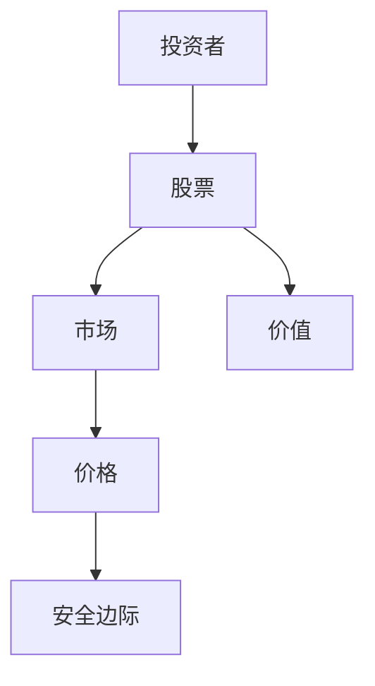
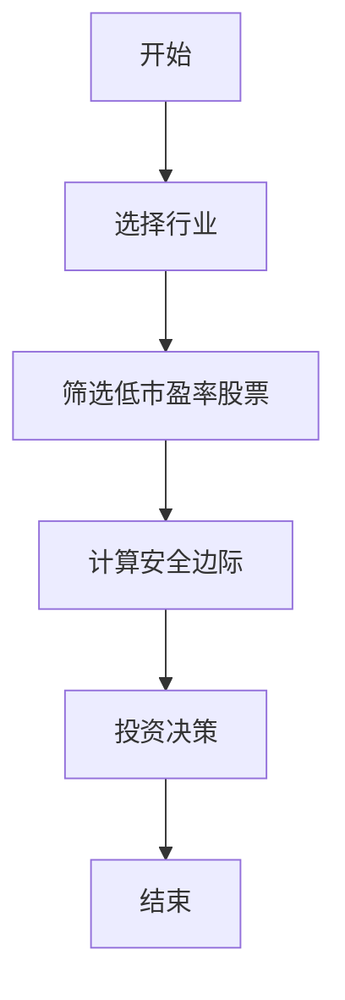
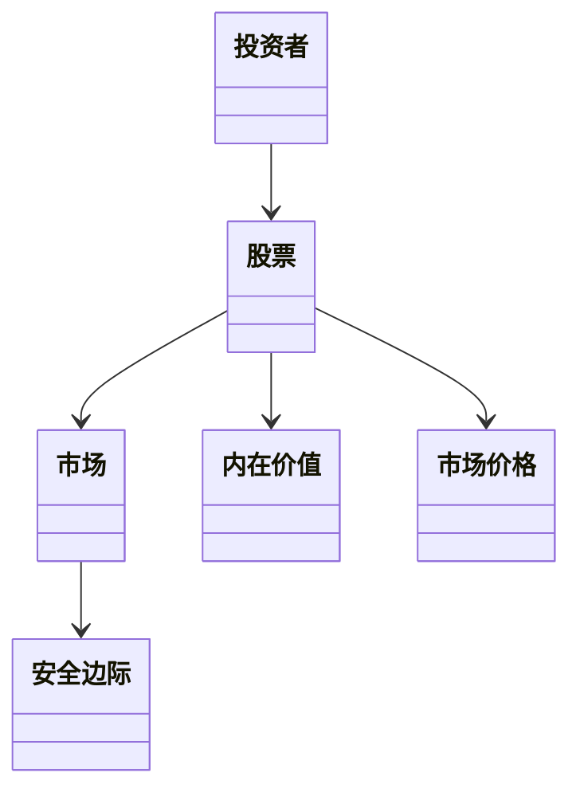
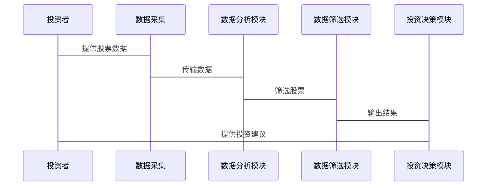

                 


# 格雷厄姆特价股票理论在风险投资中的运用

> **关键词**：价值投资、安全边际、低市盈率、内在价值、风险投资、股票筛选、投资策略

> **摘要**：本文详细探讨了本杰明·格雷厄姆的价值投资理论及其在风险投资中的应用。通过分析格雷厄姆特价股票理论的核心概念，如安全边际、低市盈率和低市净值率，结合实际案例和算法模型，展示了如何在现代投资环境中应用这些理论。文章还提供了基于Python的股票筛选代码，帮助读者理解并实践格雷厄姆的投资策略。

---

# 引言

本杰明·格雷厄姆是价值投资的鼻祖，他的理论奠定了现代投资学的基础。格雷厄姆特价股票理论强调寻找市场低估的股票，通过安全边际来降低投资风险。本文将从理论到实践，详细分析这一理论在风险投资中的应用，并结合代码示例，展示如何在实际操作中应用这些策略。

---

# 第1章: 价值投资与格雷厄姆理论概述

## 1.1 价值投资的起源与发展

### 1.1.1 投资学的起源与演变

投资学起源于对财富增长的追求，经历了从传统储蓄到现代金融工具的演变。20世纪初，本杰明·格雷厄姆和戴维德·多德提出了价值投资理论，强调股票的内在价值而非市场情绪。

### 1.1.2 本杰明·格雷厄姆的生平与贡献

格雷厄姆是哥伦比亚大学的教授，著有《证券分析》一书。他提出了“市场先生”的概念，强调市场情绪的波动性，并倡导以低于内在价值的价格买入股票。

### 1.1.3 价值投资的核心理念

价值投资的核心是寻找市场低估的股票，通过安全边际来降低投资风险。格雷厄姆认为，股票价格经常偏离其内在价值，投资者应利用这种偏差进行投资。

---

## 1.2 格雷厄姆特价股票理论的核心观点

### 1.2.1 特价股票的定义与特征

特价股票是指市场价格低于其内在价值的股票。这种股票通常具有低市盈率、低市净值率和高股息率的特点。

### 1.2.2 市场先生与投资者的心态

格雷厄姆将市场比作“市场先生”，市场先生的情绪波动会影响股票价格。投资者应避免受市场情绪的影响，而是关注股票的内在价值。

### 1.2.3 安全边际的概念与重要性

安全边际是股票的内在价值与市场价格之间的差额。通过购买具有足够安全边际的股票，投资者可以降低投资风险。

---

## 1.3 格雷厄姆投资策略的特点

### 1.3.1 低市盈率与低市净值率的选股标准

格雷厄姆建议投资者选择市盈率低于15倍、市净值率低于1.5倍的股票。

### 1.3.2 股票内在价值的评估方法

格雷厄姆提出了“可持久竞争优势”的概念，即企业应具备持续盈利的能力。

### 1.3.3 风险厌恶与长期投资策略

格雷厄姆倡导长期投资，避免频繁交易，并通过分散投资来降低风险。

---

# 第2章: 格雷厄姆特价股票理论的核心概念与联系

## 2.1 核心概念原理

### 2.1.1 价值与价格的定义与区别

- **价值**：股票的内在价值，包括资产、收益和股息等因素。
- **价格**：股票的市场交易价格，受市场情绪影响。

### 2.1.2 安全边际的数学模型

安全边际 = 内在价值 - 市场价格

### 2.1.3 内在价值的计算公式

$$
内在价值 = \frac{E}{k}
$$

其中，E是企业的预期收益，k是资本成本。

---

## 2.2 核心概念属性特征对比表格

| 概念         | 定义                                   | 属性特征                   |
|--------------|--------------------------------------|---------------------------|
| 价值         | 股票的内在价值                       | 稳定性、客观性             |
| 价格         | 市场交易价格                         | 波动性、情绪驱动           |
| 安全边际     | 价值与价格的差额                     | 风险控制、投资安全         |

---

## 2.3 ER实体关系图架构（Mermaid流程图）



---

# 第3章: 格雷厄姆特价股票筛选算法原理

## 3.1 算法原理概述

### 3.1.1 格雷厄姆筛选法的基本步骤

1. 筛选低市盈率股票：市盈率低于15倍。
2. 筛选低市净值率股票：市净值率低于1.5倍。
3. 计算安全边际：内在价值 - 市场价格。

### 3.1.2 低市盈率与低市净值率的量化标准

- 市盈率（P/E）= 股价 / 每股收益
- 市净值率（P/B）= 股价 / 每股净资产

### 3.1.3 安全边际的计算方法

$$
安全边际 = 内在价值 - 市场价格
$$

---

## 3.2 算法流程图（Mermaid）



---

## 3.3 Python代码实现

```python
import pandas as pd

def screen_cheap_stocks(data):
    data['P/E'] = data['股价'] / data['每股收益']
    data['P/B'] = data['股价'] / data['每股净资产']
    cheap_stocks = data[(data['P/E'] < 15) & (data['P/B'] < 1.5)]
    return cheap_stocks

# 示例数据
data = {
    '股票名称': ['股票1', '股票2', '股票3'],
    '股价': [10, 20, 30],
    '每股收益': [0.666, 1.333, 10],
    '每股净资产': [5, 10, 20]
}

df = pd.DataFrame(data)
result = screen_cheap_stocks(df)
print(result)
```

---

# 第4章: 系统分析与架构设计方案

## 4.1 问题场景介绍

本文构建了一个基于格雷厄姆理论的投资决策支持系统，用于筛选特价股票。

## 4.2 系统功能设计（领域模型Mermaid类图）



---

## 4.3 系统架构设计（Mermaid架构图）


---

## 4.4 系统接口设计

- 数据输入接口：接收股票数据
- 数据处理接口：计算市盈率和市净值率
- 决策输出接口：输出符合条件的股票列表

---

## 4.5 系统交互设计（Mermaid序列图）



---

# 第5章: 项目实战

## 5.1 环境安装

- 安装Python和相关库（pandas、numpy）

## 5.2 核心实现源代码

```python
import pandas as pd

def calculate_intrinsic_value(data):
    data['E'] = data['预期收益']
    data['k'] = data['资本成本']
    data['内在价值'] = data['E'] / data['k']
    return data

# 示例数据
data = {
    '股票名称': ['股票1', '股票2', '股票3'],
    '预期收益': [10, 15, 20],
    '资本成本': [0.1, 0.1, 0.1]
}

df = pd.DataFrame(data)
result = calculate_intrinsic_value(df)
print(result)
```

---

## 5.3 案例分析与结果解读

以某行业为例，筛选低市盈率和低市净值率的股票，计算其安全边际，并分析投资价值。

---

# 第6章: 最佳实践与总结

## 6.1 核心要点总结

- 价值投资的核心是寻找市场低估的股票。
- 安全边际是降低投资风险的重要工具。
- 格雷厄姆理论在实际投资中具有广泛的应用。

## 6.2 实践建议

- 长期投资，避免频繁交易。
- 分散投资，降低风险。
- 定期复盘，调整投资组合。

## 6.3 注意事项

- 市场环境的变化会影响股票价格。
- 需要结合宏观经济因素进行分析。

## 6.4 拓展阅读

- 《证券分析》（本杰明·格雷厄姆）
- 《价值投资实战手册》（李录）

---

# 结论

格雷厄姆特价股票理论为风险投资提供了重要的指导。通过安全边际的计算和低市盈率、低市净值率的选股标准，投资者可以在市场中找到具有潜力的股票。结合现代技术手段，如Python编程和数据分析，可以进一步提高投资决策的效率和准确性。

--- 

**（全文结束）**

