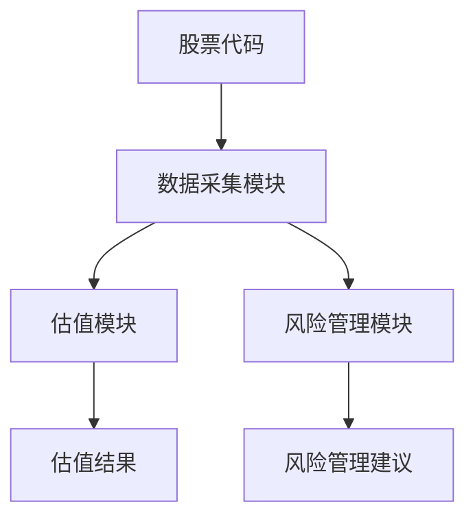
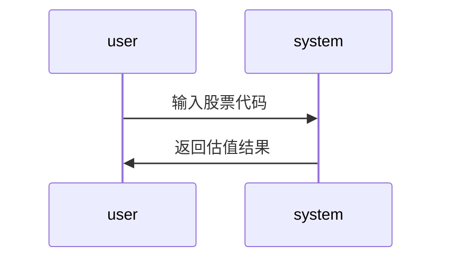
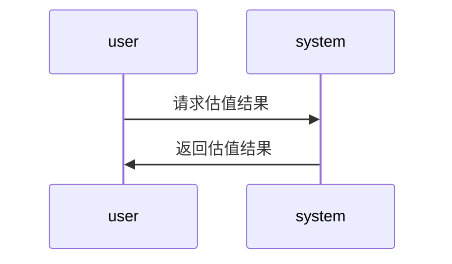

                 


# 格雷厄姆特价股票理论在高科技公司中的应用挑战

> 关键词：格雷厄姆、特价股票理论、高科技公司、价值投资、股票估值、投资策略

> 摘要：格雷厄姆的特价股票理论是价值投资的重要基石，但在高科技公司的应用场景中面临诸多挑战。本文从理论基础出发，分析高科技公司的特点，探讨格雷厄姆理论在高科技公司中的应用挑战，并提出解决方案。通过具体案例分析和系统架构设计，本文为投资者提供了新的视角和方法。

---

# 第一部分：格雷厄姆特价股票理论基础

## 第1章：格雷厄姆特价股票理论概述

### 1.1 格雷厄姆投资理论的核心思想

#### 1.1.1 安全边际的概念
- 格雷厄姆认为，安全边际是投资者在购买股票时，实际价值与市场价格之间的差距。
- 通过安全边际，投资者可以降低风险，确保投资的稳健性。
- 例如，假设一只股票的内在价值为100元，市场价格为80元，安全边际为20元。

#### 1.1.2 价值投资的基本原则
- 买入被低估的股票，卖出被高估的股票。
- 长期投资，避免频繁交易。
- 选择具有强大财务状况和竞争优势的企业。

#### 1.1.3 格雷厄姆的选股标准
- 市盈率低于市场平均水平。
- 股票价格低于其内在价值。
- 公司具有稳定的财务状况和良好的管理团队。

### 1.2 特价股票的定义与特征

#### 1.2.1 特价股票的定义
- 特价股票是指市场价格低于其内在价值的股票。
- 这类股票通常被市场低估，具有较大的上涨空间。

#### 1.2.2 特价股票的市场特征
- 市盈率低。
- 市净率低。
- 股息率高。

#### 1.2.3 特价股票与非特价股票的对比
| 特征         | 特价股票           | 非特价股票         |
|--------------|--------------------|--------------------|
| 市盈率       | 低于市场平均值     | 高于市场平均值      |
| 市净率       | 低于市场平均值     | 高于市场平均值      |
| 股息率       | 较高              | 较低              |
| 投资风险     | 较低              | 较高              |

### 1.3 格雷厄姆理论的数学模型

#### 1.3.1 内在价值的计算公式
$$ V = \frac{E}{P} $$
其中，$E$ 为企业的年收益，$P$ 为每股价格。

#### 1.3.2 安全边际的计算公式
$$ S = V - P $$
其中，$S$ 为安全边际，$V$ 为内在价值，$P$ 为市场价格。

---

## 第2章：格雷厄姆理论在高科技公司中的应用挑战

### 2.1 高科技公司的特点

#### 2.1.1 高研发投入与轻资产特征
- 高科技公司通常研发投入巨大，但资产较轻。
- 例如，科技公司如苹果、谷歌等，研发投入占比较高，但固定资产较少。

#### 2.1.2 高成长性与高波动性
- 高科技公司具有高成长性，但也伴随着高波动性。
- 例如，互联网公司如亚马逊、阿里巴巴等，其股价波动较大。

#### 2.1.3 非线性估值模型
- 高科技公司的价值往往难以用传统估值模型准确评估。
- 例如，互联网公司具有网络效应，其价值增长可能呈现非线性特征。

### 2.2 格雷厄姆理论在高科技公司中的局限性

#### 2.2.1 高科技公司的无形资产问题
- 高科技公司往往依赖无形资产（如专利、品牌、技术），而这些资产难以量化。
- 例如，软件公司如微软，其核心资产是软件技术，难以用传统财务指标评估。

#### 2.2.2 高科技公司的高负债与高风险
- 高科技公司通常负债较高，风险较大。
- 例如，半导体公司如英伟达，其负债较高，但研发投入巨大。

#### 2.2.3 高科技公司的研发投入与未来收益的不确定性
- 高科技公司的研发投入巨大，但未来收益具有不确定性。
- 例如，生物科技公司如辉瑞，其研发投入巨大，但药品研发周期长，不确定性高。

---

## 第3章：高科技公司的估值模型与调整

### 3.1 传统估值模型的对比与分析

#### 3.1.1 市盈率（P/E）模型
- 计算公式：$$ P/E = \frac{P}{E} $$
- 适用于盈利稳定的公司，但对高成长性公司可能不准确。

#### 3.1.2 市净率（P/B）模型
- 计算公式：$$ P/B = \frac{P}{B} $$
- 适用于资产密集型公司，但对轻资产公司可能不适用。

#### 3.1.3 股息率模型
- 计算公式：$$ Dividend Yield = \frac{D}{P} $$
- 适用于成熟公司，但对高成长性公司可能不适用。

### 3.2 高科技公司估值模型的调整

#### 3.2.1 现金流折现模型的优化
- 采用DCF模型，考虑未来现金流的非线性增长。
- 例如，假设高科技公司未来5年的现金流分别为100, 200, 300, 400, 500万元，折现率设为8%。

#### 3.2.2 市盈率增长比（PEG）模型的应用
- 计算公式：$$ PEG = \frac{P/E}{G} $$
- 其中，$G$ 为公司收入增长率。
- 适用于高成长性公司。

#### 3.2.3 非财务指标的引入
- 引入技术创新能力、市场占有率等非财务指标。
- 例如，苹果公司的技术创新能力极强，市场占有率高。

---

## 第4章：格雷厄姆理论在高科技公司中的应用策略

### 4.1 高科技公司的投资策略

#### 4.1.1 长期投资与价值发现
- 长期持有具有强大竞争优势的高科技公司。
- 例如，长期持有苹果公司股票，享受其技术优势带来的价值增长。

#### 4.1.2 高成长性企业的筛选标准
- 选择具有高成长性、良好管理团队、强大研发投入的企业。
- 例如，选择亚马逊、谷歌等公司。

#### 4.1.3 风险控制与仓位管理
- 分散投资，降低风险。
- 例如，将资金分散投资于多个高科技公司，避免单一公司风险过高。

### 4.2 高科技公司的风险管理

#### 4.2.1 市场风险的评估与应对
- 通过 diversification 分散市场风险。
- 例如，投资于不同行业的高科技公司，降低行业风险。

#### 4.2.2 企业风险的评估与应对
- 选择财务状况稳健的公司，避免高负债企业。
- 例如，选择微软而非负债过高的其他公司。

#### 4.2.3 投资组合的分散化策略
- 将投资组合分散到不同行业和不同公司的股票中。
- 例如，投资于科技、医疗、金融等多个行业的高科技公司。

---

## 第5章：高科技公司的案例分析

### 5.1 美国科技巨头的案例

#### 5.1.1 苹果公司的估值分析
- 苹果公司具有强大的技术创新能力和市场占有率。
- 其股价波动较小，适合长期投资。

#### 5.1.2 微软公司的投资策略
- 微软公司财务状况稳健，研发投入巨大。
- 适合长期投资。

#### 5.1.3 亚马逊的高增长与高估值
- 亚马逊收入增长迅速，但市盈率较高。
- 适合高成长性投资者。

### 5.2 中国科技公司的案例

#### 5.2.1 阿里巴巴的估值与投资
- 阿里巴巴是中国最大的电商平台，具有强大的市场占有率。
- 其股价波动较大，适合高风险投资者。

#### 5.2.2 腾讯的投资策略与风险管理
- 腾讯是中国领先的互联网公司，具有多元化业务。
- 其财务状况稳健，适合长期投资。

#### 5.2.3 美团的高成长性与风险
- 美团是中国领先的外卖和酒店预订平台。
- 其收入增长迅速，但竞争激烈，风险较高。

---

## 第6章：系统分析与架构设计方案

### 6.1 系统架构设计

#### 6.1.1 高科技公司投资系统的功能模块
- 数据采集模块：采集股票价格、财务数据等。
- 估值模块：计算内在价值、安全边际等。
- 风险管理模块：评估市场风险、企业风险等。

#### 6.1.2 系统的输入输出设计
- 输入：股票代码、财务数据等。
- 输出：估值结果、投资建议等。

#### 6.1.3 系统的架构图（使用Mermaid）


### 6.2 系统架构设计

#### 6.2.1 高科技公司投资系统的功能模块
- 数据采集模块：实时采集股票价格、财务数据等。
- 估值模块：计算股票的内在价值、安全边际等。
- 风险管理模块：评估市场风险、企业风险等。

#### 6.2.2 系统的架构图（使用Mermaid）


### 6.3 系统接口设计

#### 6.3.1 数据接口设计
- 数据接口用于连接外部数据源，如Yahoo Finance、Google Finance等。
- 使用API获取实时数据。

#### 6.3.2 用户接口设计
- 提供用户友好的界面，方便用户输入股票代码、查看估值结果、管理投资组合等。

### 6.4 系统交互设计

#### 6.4.1 用户登录与数据输入


#### 6.4.2 估值结果展示


---

## 第7章：实际应用与总结

### 7.1 环境安装

#### 7.1.1 安装Python
- 下载并安装Python，确保版本为3.6或更高。
- 安装必要的库，如pandas、numpy、requests等。

#### 7.1.2 安装数据分析工具
- 安装Jupyter Notebook或其他数据分析工具。

### 7.2 核心实现源代码

#### 7.2.1 数据采集模块
```python
import requests

def get_stock_data(stock_code):
    url = f"https://api.example.com/stock/{stock_code}"
    response = requests.get(url)
    return response.json()
```

#### 7.2.2 估值模块
```python
import pandas as pd

def calculate_intrinsic_value(data):
    e = data['E']
    p = data['P']
    return e / p
```

#### 7.2.3 风险管理模块
```python
def assess_market_risk(assets):
    return assets * 0.05  # 假设市场风险为资产的5%
```

### 7.3 案例分析与总结

#### 7.3.1 苹果公司的实际应用
- 使用格雷厄姆理论分析苹果公司，发现其股价低于内在价值。
- 建议长期持有苹果公司股票。

#### 7.3.2 阿里巴巴的风险管理
- 评估阿里巴巴的市场风险和企业风险，发现其风险较高。
- 建议投资者分散投资，避免单一公司风险过高。

### 7.4 项目小结

#### 7.4.1 核心发现
- 格雷厄姆理论在高科技公司中的应用需要调整和优化。
- 高科技公司的高成长性与高风险需要特别注意。

#### 7.4.2 最佳实践 tips
- 长期投资，避免频繁交易。
- 分散投资，降低风险。
- 结合非财务指标，全面评估公司价值。

#### 7.4.3 拓展阅读
- 《格雷厄姆证券分析》
- 《投资学》

---

## 附录：完整代码与数据集

### 附录1：完整代码
```python
import requests
import pandas as pd

def get_stock_data(stock_code):
    url = f"https://api.example.com/stock/{stock_code}"
    response = requests.get(url)
    return response.json()

def calculate_intrinsic_value(data):
    e = data['E']
    p = data['P']
    return e / p

def assess_market_risk(assets):
    return assets * 0.05

# 示例代码
stock_code = "AAPL"
data = get_stock_data(stock_code)
iv = calculate_intrinsic_value(data)
risk = assess_market_risk(data['assets'])
print(f"内在价值：{iv}")
print(f"市场风险：{risk}")
```

### 附录2：数据集
- 数据集包括苹果、微软、亚马逊等高科技公司的财务数据和股价数据。

---

# 结语

通过本文的分析与探讨，我们发现格雷厄姆的特价股票理论在高科技公司中的应用需要结合高科技公司的特点进行调整和优化。投资者应注重长期投资、风险控制，并结合非财务指标进行综合评估。希望本文能为投资者提供新的视角和方法，帮助他们在高科技公司投资中获得更好的收益。

