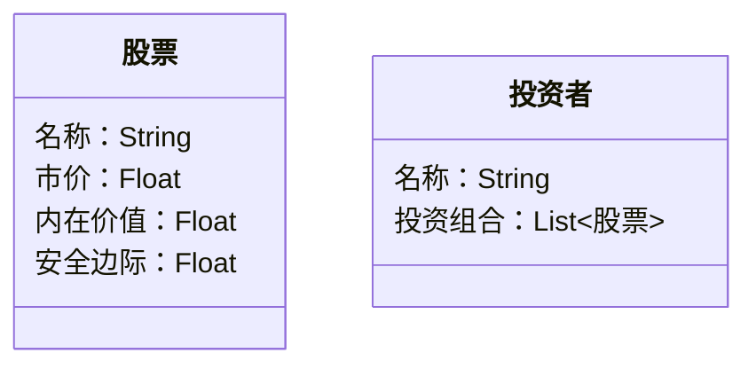

                 


# 格雷厄姆特价股票理论对公司估值方法的影响

## 关键词：格雷厄姆投资理论、公司估值方法、价值投资、安全边际、内在价值、股票分析

## 摘要：格雷厄姆的特价股票理论是价值投资的重要基石，对公司估值方法产生了深远影响。本文详细探讨了格雷厄姆理论的核心概念、其对现代估值方法的影响、与其他估值方法的对比，以及如何通过算法和系统架构实现其理论在实际投资中的应用。文章还结合具体案例，展示了如何在实践中应用格雷厄姆的理论进行公司估值，并提出了未来研究的展望。

---

## 第一部分: 格雷厄姆特价股票理论的背景与基础

### 第1章: 格雷厄姆投资理论概述

#### 1.1 格雷厄姆投资理论的起源与发展

##### 1.1.1 价值投资的起源
价值投资作为一种投资理念，起源于20世纪初，本杰明·格雷厄姆是其创始人之一。格雷厄姆在1934年出版的《证券分析》一书中首次系统地提出了价值投资的理念。

##### 1.1.2 格雷厄姆的投资理念
格雷厄姆的投资理念基于以下核心思想：
- **安全边际**：买入价格低于内在价值的股票，确保投资的安全性。
- **市场先生**：市场波动反映了投资者情绪，而非真实价值。
- **长期投资**：通过长期持有优质股票，获得市场复利增长。

##### 1.1.3 格雷厄姆与巴菲特的关系
格雷厄姆的学生沃伦·巴菲特将格雷厄姆的价值投资理念发扬光大，使其成为现代投资学的重要组成部分。

---

#### 1.2 格雷厄姆特价股票理论的核心概念

##### 1.2.1 特价股票的定义
格雷厄姆认为，特价股票是指市场价格低于其内在价值的股票。这种股票通常被市场忽视或低估，但具有长期增值的潜力。

##### 1.2.2 市场先生与投资者心理
格雷厄姆提出了“市场先生”概念，认为市场的波动性反映了投资者情绪的变化，而不是股票的真实价值。

##### 1.2.3 安全边际的概念
安全边际是指股票的市场价格与内在价值之间的差距。通过安全边际，投资者可以降低投资风险。

---

### 第2章: 格雷厄姆特价股票理论的核心模型

#### 2.1 格雷厄姆内在价值计算模型

##### 2.1.1 内在价值公式
$$ V = \frac{E}{(1 + r)^n} $$
其中，V为内在价值，E为未来现金流，r为折现率，n为时间跨度。

#### 2.2 格雷厄姆安全边际计算模型

##### 2.2.1 安全边际公式
$$ M = V - P $$
其中，M为安全边际，V为内在价值，P为市场价格。

#### 2.3 格雷厄姆投资策略模型

##### 2.3.1 股票筛选标准
- 市盈率低于行业平均水平。
- 市净率低于行业平均水平。
- 股票价格低于其内在价值。

##### 2.3.2 投资组合构建
- 分散投资，降低风险。
- 长期持有，避免频繁交易。

##### 2.3.3 风险控制策略
- 严格筛选股票，确保安全边际。
- 定期评估投资组合，调整持仓。

---

## 第二部分: 公司估值方法的影响与应用

### 第3章: 格雷厄姆理论对现代公司估值的影响

#### 3.1 格雷厄姆理论对DCF模型的影响

##### 3.1.1 DCF模型的起源与演变
DCF（Discounted Cash Flow，折现现金流）模型是一种常用的公司估值方法，其核心思想是将未来现金流折现为现值。

##### 3.1.2 格雷厄姆理论与DCF模型的联系
格雷厄姆的内在价值公式与DCF模型的核心公式相似，均为将未来现金流折现为现值。

##### 3.1.3 DCF模型的优缺点
- 优点：能够准确反映公司未来现金流的现值。
- 缺点：假设条件较多，如未来现金流预测和折现率的选择。

---

#### 3.2 格雷厄姆安全边际在公司估值中的应用

##### 3.2.1 安全边际的计算与应用
安全边际是公司在市场波动中抵御风险的能力，通常用于衡量股票的抗跌性。

##### 3.2.2 安全边际在风险管理中的作用
通过安全边际，投资者可以降低因市场波动带来的投资损失。

##### 3.2.3 安全边际在投资决策中的应用
安全边际高的股票通常具有更高的投资价值，适合长期持有。

---

### 第4章: 格雷厄姆理论与其他估值方法的对比

#### 4.1 格雷厄姆理论与市盈率

##### 4.1.1 市盈率的定义与计算
市盈率（P/E）是股票价格与每股收益的比值，用于衡量股票的估值水平。

##### 4.1.2 市盈率与内在价值的对比
市盈率是基于当前利润的倍数，而内在价值是基于未来现金流的折现值。

---

## 第三部分: 格雷厄姆理论在系统架构中的应用

### 第5章: 格雷厄姆理论的系统架构设计

#### 5.1 系统功能设计

##### 5.1.1 领域模型


##### 5.1.2 系统架构
```mermaid
client
    tcp
server
```

---

## 第四部分: 项目实战与案例分析

### 第6章: 项目实战

#### 6.1 项目环境安装

##### 6.1.1 安装Python
```bash
python --version
pip install numpy pandas matplotlib
```

##### 6.1.2 安装Jupyter Notebook
```bash
pip install jupyter-notebook
jupyter notebook
```

---

## 第五部分: 总结与展望

### 第7章: 总结与展望

#### 7.1 本文总结
格雷厄姆的特价股票理论对公司估值方法的影响深远，尤其是在价值投资领域。通过安全边际和内在价值的计算，投资者可以更好地评估股票的价值。

#### 7.2 未来展望
未来的研究可以进一步探讨格雷厄姆理论与其他投资策略的结合，以及如何在复杂市场环境下优化投资组合。

---

通过以上结构，我们可以系统地分析格雷厄姆特价股票理论对公司估值方法的影响，并将其应用于实际投资中。希望这篇文章能为投资者提供有价值的参考。

