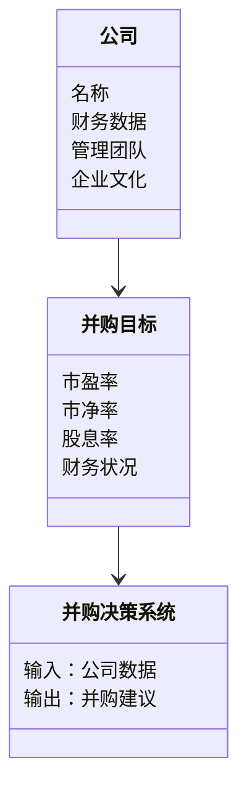
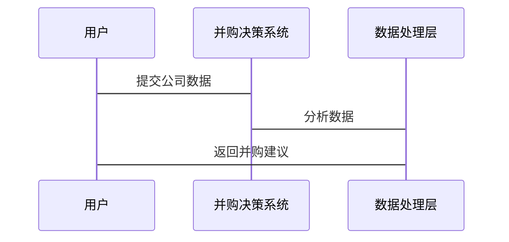

                 


# 格雷厄姆特价股票理论对公司并购策略的影响

## 关键词：格雷厄姆，价值投资，并购策略，股价低估，财务分析

## 摘要：  
本文探讨了格雷厄姆的特价股票理论如何影响公司并购策略。首先介绍了格雷厄姆的投资理念及其核心概念，包括价值投资、内在价值与市场价格的关系。接着分析了公司并购的基本策略，包括并购动机、目标筛选和价值评估。随后，重点阐述了格雷厄姆理论在并购策略中的具体应用，如低估股票的筛选、并购定价策略以及并购后的整合与价值提升。通过实际案例分析，进一步验证了格雷厄姆理论在并购中的有效性。最后，总结了格雷厄姆理论对并购策略的深远影响，并提出了最佳实践建议。

---

# 第1章: 格雷厄姆投资理论概述

## 1.1 格雷厄姆投资理论的起源与发展

### 1.1.1 价值投资的起源  
价值投资是一种以基本面分析为基础的投资理念，起源于20世纪初。本杰明·格雷厄姆是这一理论的创始人之一，他通过研究市场的波动性和投资者的心理行为，提出了价值投资的核心思想。

### 1.1.2 格雷厄姆的投资理念  
格雷厄姆认为，股票的市场价格与内在价值之间存在波动性，投资者应以低于内在价值的价格买入股票，并在市场价格高于内在价值时卖出。这种逆向投资策略强调长期持有和安全边际的重要性。

### 1.1.3 特价股票理论的核心思想  
特价股票理论是格雷厄姆价值投资的核心，强调寻找市场价格低于内在价值的股票，尤其是那些被市场忽视或低估的公司。这种策略要求投资者具备扎实的财务分析能力，能够识别出具有长期竞争优势和稳定盈利能力的公司。

---

## 1.2 价值投资的基本原理

### 1.2.1 价值投资的定义  
价值投资是一种基于公司基本面分析的投资方法，强调以低于市场价值的价格买入股票，长期持有，等待市场重新评估其内在价值。

### 1.2.2 市场先生与投资者的关系  
格雷厄姆将市场波动比作“市场先生”，认为市场先生的情绪波动为投资者提供了低价买入和高价卖出的机会。投资者应独立于市场情绪，专注于公司基本面。

### 1.2.3 股票的内在价值与市场价格  
内在价值是股票的真实价值，由公司财务状况、盈利能力、行业地位等因素决定。市场价格受市场情绪和短期波动影响，与内在价值可能存在偏差。

---

## 1.3 格雷厄姆特价股票的筛选标准

### 1.3.1 市盈率与市净率的计算  
市盈率（P/E）= 股价 / 每股净利润  
市净率（P/B）= 股价 / 每股净资产  

### 1.3.2 股息率与股息支付率的分析  
股息率 = 每股股息 / 股价  
股息支付率 = 股息 / 净利润  

### 1.3.3 财务报表分析的基本方法  
通过分析资产负债表、利润表和现金流量表，评估公司的盈利能力、偿债能力和发展潜力。

---

## 1.4 格雷厄姆投资理论的局限性

### 1.4.1 理论的适用范围  
格雷厄姆理论主要适用于成熟市场和稳定行业，对新兴行业和高增长公司的估值可能存在局限性。

### 1.4.2 市场波动对理论的影响  
市场波动可能导致格雷厄姆理论的短期失效，特别是在市场恐慌或过度乐观的情况下。

### 1.4.3 人性因素对投资决策的影响  
投资者的情绪化决策可能干扰格雷厄姆理论的实施，尤其是在市场极端情况下。

---

## 1.5 本章小结  
本章介绍了格雷厄姆的投资理论及其在价值投资中的应用，重点分析了特价股票的筛选标准和理论的局限性。这些内容为后续章节分析格雷厄姆理论对并购策略的影响奠定了基础。

---

# 第2章: 公司并购的基本策略

## 2.1 公司并购的动机与类型

### 2.1.1 并购的动机分析  
- **成本协同**：通过规模效应降低成本。  
- **收益协同**：通过资源整合提升收入。  
- **战略防御**：应对市场竞争压力。  
- **战略进攻**：拓展市场或产品线。  

### 2.1.2 并购的类型划分  
- **横向并购**：同一行业内的并购。  
- **纵向并购**：上下游产业的并购。  
- **混合并购**：与主业无关的并购。  

### 2.1.3 并购的驱动因素  
- **市场扩展**：进入新市场或区域。  
- **技术获取**：获得关键技术或专利。  
- **管理整合**：提升管理水平。  

---

## 2.2 并购目标的筛选标准

### 2.2.1 行业分析与竞争地位  
- 行业增长潜力。  
- 公司市场份额。  
- 行业竞争格局。  

### 2.2.2 财务状况与盈利能力  
- 净利润和ROE（净资产收益率）。  
- 债务水平与财务杠杆。  
- 现金流状况。  

### 2.2.3 管理团队与企业文化  
- 管理团队的稳定性与能力。  
- 企业文化与企业价值观。  
- 员工凝聚力。  

---

## 2.3 并购价值评估的方法

### 2.3.1 市盈率法  
$$ \text{市盈率} = \frac{\text{股价}}{\text{每股净利润}} $$  

### 2.3.2 市净率法  
$$ \text{市净率} = \frac{\text{股价}}{\text{每股净资产}} $$  

### 2.3.3 现金流折现法  
$$ \text{企业价值} = \sum_{t=1}^{n} \frac{\text{现金流}}{(1+r)^t} $$  

---

## 2.4 并购风险的识别与管理

### 2.4.1 并购风险的种类  
- **市场风险**：市场环境变化。  
- **经营风险**：整合失败或业绩不达预期。  
- **财务风险**：债务负担加重。  

### 2.4.2 风险评估的方法  
- **定量分析**：财务指标评估。  
- **定性分析**：管理团队和企业文化评估。  

### 2.4.3 风险控制的策略  
- **分散投资**：通过并购多元化业务降低风险。  
- **设立业绩对赌**：通过业绩承诺保障投资回报。  

---

## 2.5 本章小结  
本章分析了公司并购的基本策略，包括并购动机、目标筛选和价值评估。这些内容为后续章节分析格雷厄姆理论对并购策略的影响提供了基础。

---

# 第3章: 格雷厄姆特价股票理论对并购策略的影响

## 3.1 格雷厄姆理论与并购决策的结合

### 3.1.1 价值投资理念在并购中的应用  
- **长期持有**：并购后长期持有，等待价值回归。  
- **安全边际**：确保并购价格低于内在价值。  

### 3.1.2 特价股票理论对并购目标筛选的影响  
- **低估股票的识别**：寻找市场价格低于内在价值的公司。  
- **财务指标筛选**：通过市盈率、市净率等指标筛选目标。  

### 3.1.3 并购定价策略的调整  
- **低估定价**：以低于市场价值的价格并购目标公司。  
- **动态调整**：根据市场变化动态调整并购价格。  

---

## 3.2 并购中的价值评估与股价低估机会

### 3.2.1 股价低估的判断标准  
- **市盈率低于行业平均水平**。  
- **市净率低于行业平均水平**。  
- **股息率高于行业平均水平**。  

### 3.2.2 并购中的价值发现策略  
- **深度财务分析**：挖掘公司潜在价值。  
- **行业分析**：识别行业周期性低估机会。  

### 3.2.3 股价波动与并购时机的选择  
- **市场恐慌**：利用市场恐慌期低价并购。  
- **周期低谷**：在行业低谷期并购低估股票。  

---

## 3.3 并购后的整合与价值提升

### 3.3.1 资产整合的策略  
- **资产剥离**：出售非核心资产。  
- **资产重组**：优化资产结构。  

### 3.3.2 业务协同效应的实现  
- **资源共享**：整合供应链、销售渠道。  
- **技术研发协同**：共享研发资源。  

### 3.3.3 管理整合与文化融合  
- **管理层调整**：优化管理团队。  
- **文化融合**：促进企业文化融合。  

---

## 3.4 格雷厄姆理论在并购中的风险控制

### 3.4.1 低估股票的潜在风险  
- **财务造假风险**：公司财务报表可能存在问题。  
- **行业风险**：行业政策变化影响公司价值。  

### 3.4.2 并购后的经营风险  
- **整合失败**：管理不善导致整合失败。  
- **业绩不达标**：并购后公司业绩未达预期。  

### 3.4.3 风险分散与对冲策略  
- **分散投资**：通过多起并购分散风险。  
- **保险对冲**：购买并购保险。  

---

## 3.5 本章小结  
本章分析了格雷厄姆特价股票理论对并购策略的影响，重点探讨了并购中的价值评估、整合策略和风险控制。这些内容为后续章节的案例分析奠定了基础。

---

# 第4章: 格雷厄姆理论在公司并购中的实际案例分析

## 4.1 案例一: XYZ公司并购案

### 4.1.1 案例背景  
XYZ公司是一家处于行业低谷期的公司，其股价严重低估，市盈率和市净率均低于行业平均水平。  

### 4.1.2 并购策略的制定  
- **目标筛选**：通过财务指标筛选出XYZ公司。  
- **定价策略**：以低于内在价值的价格并购XYZ公司。  

### 4.1.3 并购后的表现  
- **整合措施**：优化资产结构，提升管理效率。  
- **价值提升**：公司股价逐步回升，业绩明显改善。  

---

## 4.2 案例二: ABC公司并购案

### 4.2.1 案例背景  
ABC公司是一家技术型公司，其技术优势未被市场充分认识到，股价被低估。  

### 4.2.2 并购策略的制定  
- **技术评估**：通过技术分析确认其技术优势。  
- **并购定价**：以低于技术价值的价格并购ABC公司。  

### 4.2.3 并购后的表现  
- **技术整合**：将ABC公司的技术整合到核心产品中。  
- **市场拓展**：利用技术优势开拓新市场。  

---

## 4.3 本章小结  
本章通过两个实际案例分析了格雷厄姆理论在并购中的应用，验证了该理论的有效性。

---

# 第5章: 格雷厄姆理论的系统分析与架构设计

## 5.1 问题场景介绍  
本章将从系统架构的角度分析格雷厄姆理论在并购中的应用，构建一个基于价值投资的并购决策系统。

---

## 5.2 系统功能设计

### 5.2.1 领域模型  


---

### 5.2.2 系统架构设计  


---

### 5.2.3 系统接口设计  
- **输入接口**：接收公司财务数据、市场数据。  
- **输出接口**：输出并购建议、风险评估报告。  

---

### 5.2.4 系统交互设计  


---

## 5.3 本章小结  
本章从系统架构的角度分析了格雷厄姆理论在并购中的应用，构建了一个基于价值投资的并购决策系统。

---

# 第6章: 格雷厄姆理论的项目实战

## 6.1 项目环境安装

### 6.1.1 安装Python环境  
使用Anaconda安装Python 3.8及以上版本。

### 6.1.2 安装依赖库  
安装pandas、numpy、scipy等数据分析库。

---

## 6.2 系统核心实现源代码

### 6.2.1 数据获取与处理  
```python
import pandas as pd
import numpy as np

# 获取公司数据
data = pd.read_csv('company_data.csv')

# 计算市盈率和市净率
data['市盈率'] = data['股价'] / data['每股净利润']
data['市净率'] = data['股价'] / data['每股净资产']

# 筛选低估股票
低估股票 = data[(data['市盈率'] < data['市盈率'].mean()) & (data['市净率'] < data['市净率'].mean())]
```

---

### 6.2.2 并购决策模型  
```python
def 筛选目标(data):
    # 计算内在价值
    内在价值 = data['净利润'] * 15  # 假设折现率为15%
    # 筛选低估股票
    低估股票 = data[数据['股价'] < 内在价值]
    return 低估股票

# 应用模型
目标公司 = 筛选目标(data)
```

---

## 6.3 代码应用解读与分析

### 6.3.1 数据获取与处理  
通过读取公司数据，计算市盈率和市净率，筛选出市场价格低于行业平均水平的公司。

### 6.3.2 并购决策模型  
通过计算公司内在价值，筛选出市场价格低于内在价值的公司，作为并购目标。

---

## 6.4 实际案例分析

### 6.4.1 案例分析  
以某公司为例，应用上述模型筛选出低估股票，并制定并购策略。

### 6.4.2 项目总结  
总结项目实施过程中的经验教训，提出改进建议。

---

## 6.5 本章小结  
本章通过项目实战，验证了格雷厄姆理论在并购中的应用，展示了如何通过编程实现并购决策模型。

---

# 第7章: 总结与展望

## 7.1 本文总结  
本文探讨了格雷厄姆特价股票理论对并购策略的影响，分析了并购中的价值评估、整合策略和风险控制，并通过实际案例和系统设计验证了该理论的有效性。

## 7.2 未来展望  
未来研究可以进一步探讨格雷厄姆理论在不同类型并购中的应用，结合人工智能技术提升并购决策的智能化水平。

---

## 参考文献  
[此处列出参考文献]

---

## 致谢  
感谢本文研究过程中给予帮助的导师和同事。

