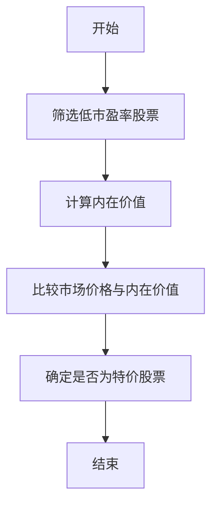
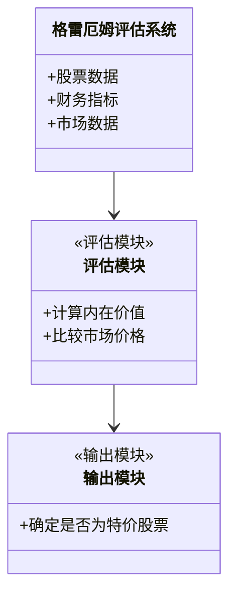
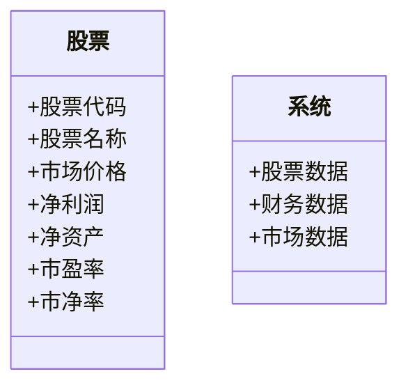
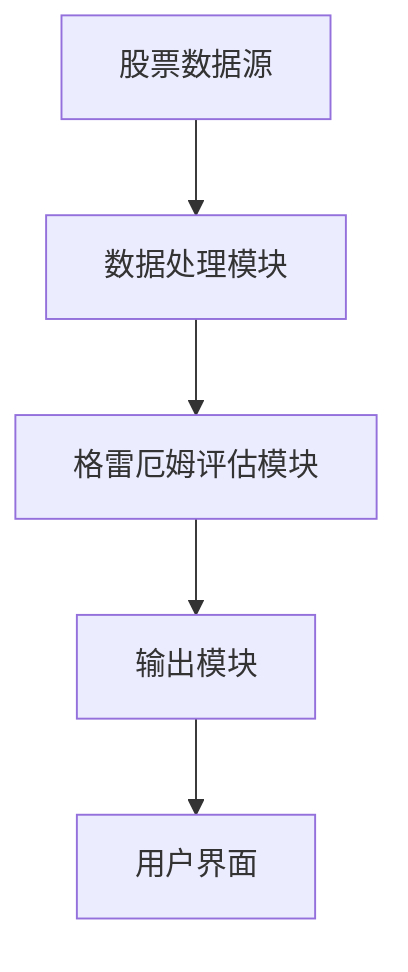

                 


# 格雷厄姆特价股票理论对公司数字化生态战略的影响

## 关键词：
- 格雷厄姆投资理论
- 特价股票
- 数字化生态战略
- 价值投资
- 系统架构设计
- 数字化转型

## 摘要：
本文深入探讨格雷厄姆特价股票理论的核心概念、数学模型及其实现算法，并结合数字化生态战略的背景，分析其对公司投资决策和价值创造的影响。通过系统架构设计、项目实战案例和最佳实践分享，本文旨在为技术与商业决策者提供一种新的视角，理解如何将价值投资理念融入数字化生态系统中，实现企业长期价值最大化。

---

# 第一部分: 格雷厄姆特价股票理论的背景与核心概念

## 第1章: 格雷厄姆特价股票理论概述

### 1.1 格雷厄姆投资理论的起源与演变

#### 1.1.1 价值投资的起源
- **背景**：20世纪初，本杰明·格雷厄姆（Benjamin Graham）提出价值投资理论，强调以低于内在价值的价格买入股票。
- **演变**：格雷厄姆的学生彼得·林奇（Peter Lynch）和沃伦·巴菲特（Warren Buffett）继承并发展了这一理论，使其成为投资领域的经典。

#### 1.1.2 格雷厄姆投资理念的核心思想
- **核心思想**：买入被市场低估的股票，长期持有，等待市场重新评估其价值。
- **安全边际**：以低于内在价值的价格买入股票，确保投资的安全性。

#### 1.1.3 特价股票理论的提出与发展
- **提出**：格雷厄姆在《聪明的投资者》中首次系统阐述了特价股票理论。
- **发展**：该理论经过时间验证，在全球范围内被广泛应用于投资实践。

---

### 1.2 格雷厄姆特价股票理论的核心概念

#### 1.2.1 什么是特价股票
- **定义**：市场价格低于内在价值的股票。
- **特征**：通常具有较高的股息率、较低的市盈率和市净率。

#### 1.2.2 特价股票的识别标准
- **市盈率（P/E）**：市场价格与每股收益的比率，低于行业平均水平。
- **市净率（P/B）**：市场价格与每股净资产的比率，低于1。
- **股息率**：股息与股价的比率，高于行业平均水平。

#### 1.2.3 特价股票与市场周期的关系
- **熊市**：市场恐慌时，许多股票被低估，成为特价股票。
- **牛市**：市场过热时，许多股票被高估，特价股票稀缺。

---

## 第2章: 特价股票理论的数学模型与分析工具

### 2.1 格雷厄姆投资模型的数学公式

#### 2.1.1 格雷厄姆的内在价值计算公式
$$ V = \frac{E}{4.41} $$
- **公式说明**：$V$ 表示股票的内在价值，$E$ 表示过去7年平均净利润。
- **应用**：通过计算股票的内在价值，确定其是否为特价股票。

#### 2.1.2 特价股票筛选的算法流程



---

### 2.2 企业价值评估的系统架构



---

## 第3章: 特价股票理论在数字化生态中的应用

### 3.1 数字化生态战略的核心要素

#### 3.1.1 数字化转型的定义
- **定义**：通过数字技术的应用，优化企业运营模式、业务模式和价值模式。
- **目标**：提升企业效率、创新能力和市场竞争力。

#### 3.1.2 数字化生态系统的构成
- **系统构成**：包括数据层、业务层、技术层和用户层。
- **核心要素**：数据驱动、技术创新、业务整合和组织变革。

#### 3.1.3 数字化战略与公司价值的关系
- **关系**：数字化战略通过提升效率和创新，增加公司价值。
- **挑战**：如何将格雷厄姆的理论融入数字化战略，实现长期价值。

---

### 3.2 格雷厄姆理论与数字化战略的结合

#### 3.2.1 数字化转型中的价值投资理念
- **理念**：通过数字化手段，发现被市场低估的资产和机会。
- **实践**：利用大数据和人工智能技术，优化股票筛选过程。

#### 3.2.2 数字化生态中的投资组合管理
- **目标**：通过数字化工具，优化投资组合，降低风险。
- **方法**：结合格雷厄姆的筛选标准，构建多维度的投资模型。

---

## 第4章: 数字化生态中的系统分析与架构设计

### 4.1 系统分析与需求定义

#### 4.1.1 问题场景介绍
- **场景**：如何利用格雷厄姆理论，构建一个数字化的股票筛选系统。
- **目标**：开发一个高效、准确的股票筛选工具。

#### 4.1.2 项目介绍
- **项目名称**：格雷厄姆数字化股票筛选系统。
- **项目目标**：实现基于格雷厄姆理论的股票筛选功能。

---

### 4.2 系统功能设计

#### 4.2.1 领域模型设计



---

### 4.3 系统架构设计



---

### 4.4 系统接口设计

#### 4.4.1 API接口定义
- **输入**：股票代码。
- **输出**：是否为特价股票。

#### 4.4.2 接口实现
- **Python代码示例**：
```python
def is_special_stock(stock_code):
    # 获取股票数据
    data = get_stock_data(stock_code)
    # 计算内在价值
    intrinsic_value = data['净利润'] / 4.41
    # 比较市场价格与内在价值
    return data['市场价格'] < intrinsic_value
```

---

## 第5章: 项目实战与案例分析

### 5.1 环境安装与数据获取

#### 5.1.1 环境安装
- **工具**：Python、Pandas、Matplotlib。
- **安装命令**：
```bash
pip install pandas matplotlib
```

#### 5.1.2 数据获取
- **数据来源**：股票数据可以从Yahoo Finance获取。

---

### 5.2 核心实现与代码解读

#### 5.2.1 股票数据处理
```python
import pandas as pd

# 获取股票数据
data = pd.read_csv('stock_data.csv')
# 计算内在价值
data['内在价值'] = data['净利润'] / 4.41
# 筛选特价股票
data['是否特价'] = data['市场价格'] < data['内在价值']
```

---

### 5.3 案例分析与结果解读

#### 5.3.1 案例分析
- **案例背景**：假设我们有10只股票，其中3只是特价股票。
- **结果解读**：通过格雷厄姆理论筛选出的特价股票，具有较高的投资价值。

---

## 第6章: 总结、最佳实践与未来展望

### 6.1 总结
- **核心观点**：格雷厄姆理论为数字化生态战略提供了新的视角，通过技术手段实现价值投资。
- **重要性**：数字化工具的引入，使得价值投资更加高效和精准。

---

### 6.2 最佳实践 tips

- **小结**：在数字化转型中，结合格雷厄姆的理论，可以提升投资决策的效率和准确性。
- **注意事项**：市场变化快，需持续更新数据和模型。
- **拓展阅读**：推荐阅读《聪明的投资者》和《价值投资实战》。

---

### 6.3 未来展望
- **技术发展**：人工智能和大数据技术将进一步提升股票筛选的效率和准确性。
- **应用场景**：格雷厄姆理论将被更多应用于量化投资和智能投顾领域。

---

## 结语

通过本文的分析与实践，我们深刻体会到格雷厄姆特价股票理论在数字化生态战略中的巨大潜力。未来，随着技术的不断进步，价值投资的理念将与数字化技术更加深度融合，为企业创造更大的价值。

