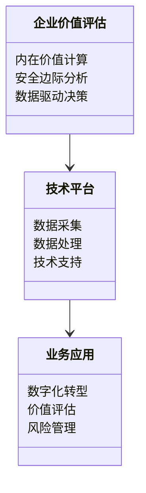
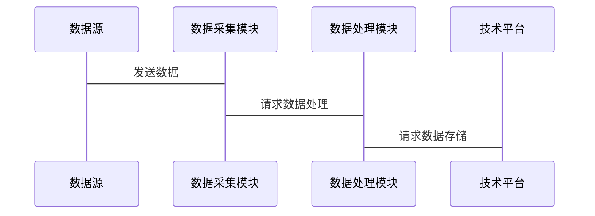
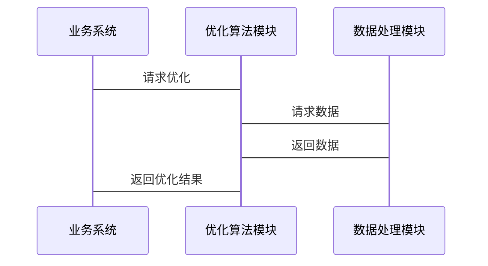

                 


# 格雷厄姆特价股票理论对公司数字化转型策略的影响

## 关键词：格雷厄姆特价股票理论、数字化转型、价值投资、企业转型、数字技术

## 摘要：本文探讨了格雷厄姆的价值投资理论如何影响企业的数字化转型策略。通过分析特价股票理论的核心概念与数字化转型的内在联系，本文提出了将价值投资的逻辑应用于数字时代的企业转型中的方法。文章结合数学模型和系统架构，详细阐述了如何在数字化转型中应用格雷厄姆的理论，并通过具体案例展示了其在实际中的应用效果。最终，本文总结了数字化转型中的最佳实践和未来趋势。

---

# 第一部分：格雷厄姆特价股票理论与数字化转型的背景

## 第1章：格雷厄姆特价股票理论概述

### 1.1 格雷厄姆投资理论的核心思想

#### 1.1.1 价值投资的基本概念
价值投资是一种以低于内在价值的价格购买优质资产的投资策略。格雷厄姆强调，投资者应关注企业的基本面，寻找市场低估的股票。

#### 1.1.2 特价股票的定义与特征
特价股票是指市场价格低于其内在价值的股票。其特征包括低市盈率、低市净率、高股息率等。

#### 1.1.3 格雷厄姆投资策略的历史影响
格雷厄姆的理论奠定了价值投资的基础，影响了巴菲特等投资者，并在现代投资理论中占据重要地位。

### 1.2 数字化转型的定义与趋势

#### 1.2.1 数字化转型的定义
数字化转型是指利用数字技术（如大数据、人工智能、云计算等）重塑业务模式、流程和文化，以实现业务创新和效率提升。

#### 1.2.2 数字化转型的核心驱动力
数字化转型的核心驱动力包括技术创新、数据驱动和组织变革。

#### 1.2.3 数字化转型对企业的影响
数字化转型可以帮助企业实现业务优化、成本降低、竞争力提升，并推动商业模式的创新。

## 第2章：格雷厄姆理论与数字化转型的内在联系

### 2.1 格雷厄姆理论在现代投资中的应用

#### 2.1.1 格雷厄姆理论的现代发展
现代价值投资在格雷厄姆理论的基础上，结合了新的金融工具和市场环境。

#### 2.1.2 数字化转型对企业价值的影响
数字化转型通过提升效率、创造新收入来源等方式，影响企业的内在价值。

#### 2.1.3 格雷厄姆理论与企业数字化转型的契合点
格雷厄姆的“安全边际”概念与数字化转型中的风险管理相契合。

### 2.2 数字化转型中的价值评估

#### 2.2.1 企业数字化转型的评估维度
企业数字化转型的评估维度包括技术投入、数据质量、组织能力等。

#### 2.2.2 格雷厄姆理论在数字化转型中的应用框架
将格雷厄姆的内在价值评估方法应用于数字化转型中的企业价值评估。

#### 2.2.3 数字化转型中的风险与机会评估
通过格雷厄姆理论，识别数字化转型中的风险和机会，制定相应的投资策略。

---

# 第二部分：格雷厄姆特价股票理论的核心概念与数字化转型的关系

## 第3章：格雷厄姆理论的核心概念分析

### 3.1 格雷厄姆理论的核心要素

#### 3.1.1 安全边际
安全边际是指市场价格低于内在价值的部分，用于降低投资风险。

#### 3.1.2 内在价值
内在价值是企业未来现金流的现值，是价值投资的核心。

#### 3.1.3 市场先生
市场先生是格雷厄姆用来描述市场波动的比喻，强调投资者应独立于市场波动做出决策。

### 3.2 格雷厄姆理论的数学模型

#### 3.2.1 内在价值计算公式
$$ V = \sum_{t=1}^{n} \frac{CF_t}{(1+r)^t} $$
其中，$V$ 是内在价值，$CF_t$ 是第 $t$ 年的现金流，$r$ 是折现率。

#### 3.2.2 安全边际的计算方法
安全边际 = 内在价值 - 市场价格

#### 3.2.3 市场波动与投资机会的关系
市场波动为投资者提供了以低价买入优质资产的机会。

### 3.3 格雷厄姆理论的系统架构

#### 3.3.1 核心业务流程的数字化重构
- 数据驱动的决策流程
- 技术创新与业务融合
- 数字化转型中的组织变革

#### 3.3.2 数字化转型中的技术架构
- 数据采集与处理
- 技术平台的构建
- 业务应用的开发

---

## 第4章：数字化转型中的核心概念与系统架构

### 4.1 数字化转型的核心要素

#### 4.1.1 数据驱动的决策
通过数据分析优化业务流程。

#### 4.1.2 技术创新与业务融合
将技术创新与业务需求相结合，推动业务模式创新。

#### 4.1.3 数字化转型中的组织变革
包括组织结构、文化、人员技能等方面的调整。

### 4.2 数字化转型的系统架构

#### 4.2.1 数字化转型的系统模型
- 业务层：数字化业务流程
- 技术层：数字化平台
- 数据层：数据采集与分析

#### 4.2.2 核心业务流程的数字化重构
- 业务流程优化
- 数据驱动的决策支持
- 业务与技术的协同

#### 4.2.3 数字化转型中的技术架构
- 数据采集与处理
- 技术平台的构建
- 业务应用的开发

---

# 第三部分：格雷厄姆理论与数字化转型的算法与系统分析

## 第5章：格雷厄姆理论的数学模型与算法

### 5.1 内在价值计算的数学模型

#### 5.1.1 内在价值计算公式
$$ V = \sum_{t=1}^{n} \frac{CF_t}{(1+r)^t} $$

#### 5.1.2 财务指标的权重分配
根据企业所处行业和特点，确定各项财务指标的权重。

#### 5.1.3 内在价值与市场价格的关系
通过比较内在价值与市场价格，判断是否为投资机会。

### 5.2 数字化转型中的算法应用

#### 5.2.1 数据驱动的预测模型
使用机器学习算法预测企业数字化转型的潜力。

#### 5.2.2 业务流程优化的算法
通过优化算法，提升业务流程效率。

#### 5.2.3 数字化转型中的机器学习应用
- 数据清洗与特征提取
- 模型训练与优化
- 模型部署与应用

---

## 第6章：数字化转型的系统分析与架构设计方案

### 6.1 数字化转型的系统模型

#### 6.1.1 系统功能设计
- 数据采集与处理
- 技术平台构建
- 业务应用开发

#### 6.1.2 领域模型（Mermaid 类图）


#### 6.1.3 系统架构设计（Mermaid 架构图）


### 6.2 系统接口设计与交互（Mermaid 序列图）

#### 6.2.1 数据采集接口


#### 6.2.2 业务流程优化接口


---

# 第四部分：项目实战与最佳实践

## 第7章：项目实战

### 7.1 项目背景与目标

#### 7.1.1 项目背景
某制造企业希望通过数字化转型提升效率和竞争力。

#### 7.1.2 项目目标
- 实现业务流程数字化
- 提高数据驱动决策能力
- 优化组织结构

### 7.2 系统核心实现

#### 7.2.1 环境安装
- 数据库：MySQL
- 开发工具：PyCharm
- 语言：Python

#### 7.2.2 核心代码实现（Python）
```python
def calculate_intrinsic_value(cf, r):
    return sum(cf_t / (1 + r)**t for t, cf_t in enumerate(cf))
```

#### 7.2.3 代码应用解读与分析
- `cf` 是未来现金流列表
- `r` 是折现率
- 返回企业内在价值

### 7.3 实际案例分析

#### 7.3.1 案例分析
通过案例分析，验证格雷厄姆理论在数字化转型中的应用效果。

#### 7.3.2 结果分析
- 数字化转型提升了企业价值
- 格雷厄姆理论提供了有效的评估工具

### 7.4 项目小结

#### 7.4.1 项目成果
- 成功实现数字化转型
- 提高了企业价值评估的准确性

#### 7.4.2 经验总结
- 格雷厄姆理论在数字化转型中的应用具有广阔前景
- 数据驱动的决策是关键

---

## 第8章：最佳实践、小结与注意事项

### 8.1 最佳实践

#### 8.1.1 格雷厄姆理论的应用
- 重视内在价值评估
- 确保数据质量
- 风险管理

#### 8.1.2 数字化转型的实施
- 技术与业务的协同
- 数据驱动的决策
- 组织变革

### 8.2 小结

#### 8.2.1 核心观点回顾
格雷厄姆理论为数字化转型提供了有效的价值评估工具。

#### 8.2.2 总结
数字化转型与格雷厄姆理论的结合，为企业提供了新的发展机遇。

### 8.3 注意事项

#### 8.3.1 数据质量
确保数据的准确性和完整性。

#### 8.3.2 风险管理
重视数字化转型中的风险管理。

#### 8.3.3 持续优化
持续优化数字化转型策略，适应市场变化。

---

## 第9章：拓展阅读与未来展望

### 9.1 拓展阅读

#### 9.1.1 格雷厄姆经典著作
- 《证券分析》
- 《聪明的投资者》

#### 9.1.2 数字化转型相关书籍
- 《数字化转型：技术与组织的重塑》
- 《数据驱动的决策》

### 9.2 未来展望

#### 9.2.1 格雷厄姆理论的未来发展
- 结合人工智能技术
- 应用于更多领域

#### 9.2.2 数字化转型的趋势
- 更加智能化
- 更加数据驱动

#### 9.2.3 结合两者的研究方向
- 数字化转型中的价值评估
- 数据驱动的优化算法

---

# 结语

格雷厄姆特价股票理论为数字化转型提供了丰富的理论支持和实践指导。通过将价值投资的逻辑应用于数字化转型中，企业可以更好地评估转型价值、优化业务流程、降低风险。未来，随着技术的不断发展，格雷厄姆理论与数字化转型的结合将更加紧密，为企业创造更大的价值。

