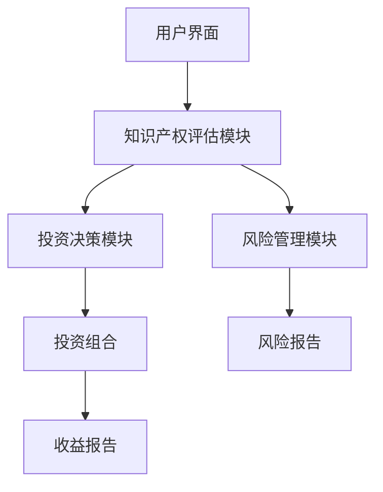
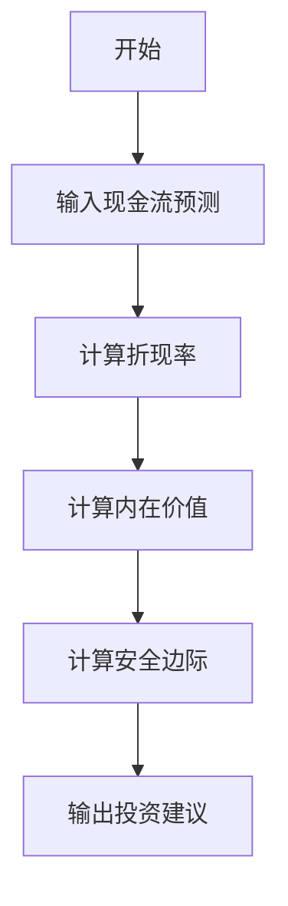

                 


# 格雷厄姆特价股票理论对公司数字知识产权货币化战略的影响

> 关键词：格雷厄姆投资理论、数字知识产权、价值投资、货币化战略、内在价值、安全边际、知识产权评估

> 摘要：本文探讨了本杰明·格雷厄姆的价值投资理论如何影响数字知识产权的货币化策略。通过分析格雷厄姆的内在价值评估方法和安全边际概念，本文揭示了这些理论在数字知识产权货币化中的潜在应用，并提出了基于格雷厄姆理论的数字知识产权评估模型和投资策略。结合实际案例，本文详细阐述了如何在数字化时代利用格雷厄姆的投资智慧实现知识产权的高效货币化。

---

## 第1章：格雷厄姆投资理论的核心概念

### 1.1 格雷厄姆投资理论的起源与核心观点

格雷厄姆是价值投资的鼻祖，他的理论强调以低于内在价值的价格购买资产，从而在市场波动中实现长期收益。以下是格雷厄姆理论的核心观点：

- **内在价值**：资产的真实价值是由其未来现金流的现值决定的，而不是市场报价。
- **安全边际**：以低于内在价值的价格购买资产，以降低投资风险。
- **长期投资**：关注企业的基本面，而非短期市场波动。

### 1.2 格雷厄姆理论在数字知识产权中的潜在应用

数字知识产权（如软件、专利、版权等）的评估需要考虑其未来收益潜力。格雷厄姆的内在价值评估方法可以为数字知识产权的货币化提供新的视角。

---

## 第2章：数字知识产权的基本概念与货币化方式

### 2.1 数字知识产权的定义与特征

数字知识产权是指在数字环境下产生的知识产权，包括软件、数据、算法、音乐、视频等内容。其主要特征包括：

- **无形性**：数字知识产权通常表现为数据或代码，没有物理形态。
- **可复制性**：数字内容易于复制和传播，但这也带来了盗版和侵权的风险。
- **高价值性**：优质数字知识产权的价值可能远超其初始成本。

### 2.2 数字知识产权的货币化方式

数字知识产权的货币化可以通过多种方式实现，包括：

- **直接销售**：通过订阅、许可或单次销售将知识产权转化为收入。
- **广告与增值服务**：通过免费提供基础服务，吸引用户付费使用高级功能。
- **数据变现**：利用用户数据进行精准营销或数据交易。

---

## 第3章：格雷厄姆理论与数字知识产权的价值评估

### 3.1 格雷厄姆理论中的内在价值评估

格雷厄姆的内在价值评估方法强调以下几点：

- **现金流分析**：通过预测未来的现金流，计算资产的现值。
- **安全边际**：购买价格应低于内在价值的一定比例，以降低风险。

### 3.2 数字知识产权的内在价值评估模型

以下是基于格雷厄姆理论的数字知识产权价值评估模型：

1. **现金流预测**：预测知识产权在未来几年内的预期现金流。
2. **折现率确定**：根据市场利率和风险偏好确定折现率。
3. **内在价值计算**：将未来现金流折现，得到资产的内在价值。
4. **安全边际分析**：将当前市场价格与内在价值进行比较，确定投资的安全边际。

---

## 第4章：数字知识产权货币化战略的系统分析与设计

### 4.1 数字知识产权货币化系统的功能设计

数字知识产权货币化系统需要实现以下功能：

- **知识产权评估模块**：基于格雷厄姆理论对知识产权进行价值评估。
- **投资决策模块**：根据评估结果制定投资策略。
- **风险管理模块**：监控市场波动和风险，调整投资组合。

### 4.2 系统架构设计

以下是数字知识产权货币化系统的架构设计：



---

## 第5章：数字知识产权货币化战略的算法实现

### 5.1 基于格雷厄姆理论的算法流程

以下是基于格雷厄姆理论的数字知识产权评估算法流程：



### 5.2 Python代码实现

以下是Python代码示例：

```python
def calculate_intrinsic_value(cash_flows, discount_rate):
    """
    计算资产的内在价值
    """
    intrinsic_value = sum(cash_flow / (1 + discount_rate) ** i for i, cash_flow in enumerate(cash_flows))
    return intrinsic_value

# 示例数据
cash_flows = [100, 200, 300, 400]
discount_rate = 0.1

intrinsic_value = calculate_intrinsic_value(cash_flows, discount_rate)
print(f"内在价值：{intrinsic_value}")
```

---

## 第6章：数字知识产权货币化战略的案例分析

### 6.1 案例背景介绍

某科技公司拥有一项创新的软件专利，计划通过货币化实现收益。以下是格雷厄姆理论在该案例中的应用：

1. **现金流预测**：预测未来5年的现金流分别为100万、200万、300万、400万、500万。
2. **折现率**：假设市场利率为10%。
3. **内在价值计算**：
   $$\text{内在价值} = \frac{100}{1.1} + \frac{200}{1.1^2} + \frac{300}{1.1^3} + \frac{400}{1.1^4} + \frac{500}{1.1^5}$$
4. **安全边际分析**：假设市场价格为400万，安全边际为20%。

---

## 第7章：总结与展望

### 7.1 总结

本文探讨了格雷厄姆投资理论在数字知识产权货币化中的应用，提出了基于内在价值评估和安全边际分析的数字知识产权评估模型。通过案例分析，验证了该模型的有效性。

### 7.2 展望

未来的研究可以进一步探索数字知识产权的动态评估方法，结合人工智能技术提高评估的准确性和实时性。同时，可以研究如何在不同行业和应用场景中推广这一理论。

---

通过以上分析，我们可以看到格雷厄姆投资理论为数字知识产权的货币化提供了新的思路和方法。在数字化时代，如何将传统投资理论与新兴技术结合，是实现知识产权高效货币化的关键。

