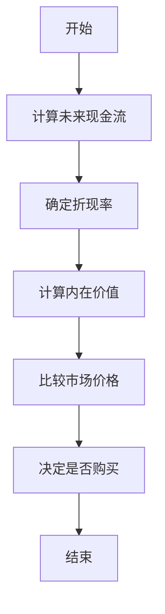
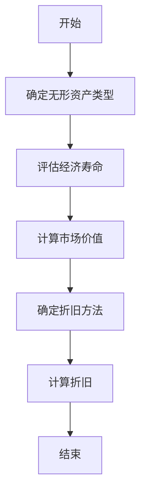
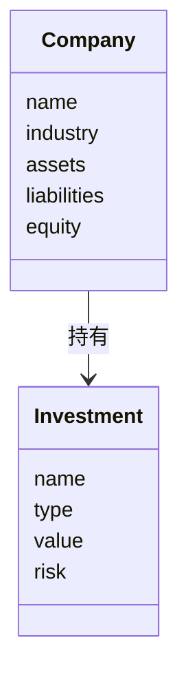
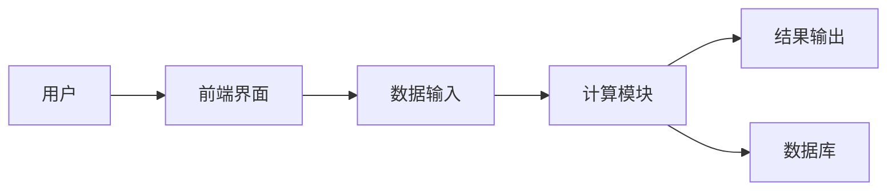

                 


# 《格雷厄姆特价股票理论对公司无形资产管理的影响》

## 关键词：格雷厄姆特价股票理论，公司无形资产，投资策略，价值评估，数学模型

## 摘要：
本文探讨了格雷厄姆特价股票理论如何影响公司无形资产管理。通过分析格雷厄姆的内在价值公式、无形资产的评估方法以及两者结合的算法，展示了如何将格雷厄姆的理论应用于实际投资决策中。文章详细介绍了理论背景、核心概念、数学模型、系统架构和项目实战，最后总结了最佳实践和未来展望。

---

## 第一部分：背景介绍

### 第1章：格雷厄姆特价股票理论的核心概念

#### 1.1 问题背景与问题描述
- **问题背景**：传统股票估值方法依赖于市盈率和市净率，但忽略了企业无形资产的价值。
- **问题描述**：无形资产（如品牌、专利、商誉）在企业价值中的权重越来越大，传统方法难以准确评估。
- **解决方案**：引入格雷厄姆的内在价值公式，考虑未来现金流和折现率，更准确地评估企业价值。
- **边界与外延**：格雷厄姆理论适用于成熟企业，不适用于初创公司或亏损企业。
- **核心要素**：未来现金流、折现率、经济寿命。

#### 1.2 核心概念与联系
- **格雷厄姆理论**：基于未来现金流折现计算内在价值，寻找低于内在价值的股票。
- **无形资产**：品牌、专利等难以量化的资产，影响企业长期价值。
- **关联性**：格雷厄姆理论通过未来现金流考虑无形资产的价值，提供了评估的框架。

### 第2章：格雷厄姆理论的核心原理

#### 2.1 格雷厄姆理论的数学模型
- **内在价值公式**：
  $$ V = \frac{E}{(1 + r)^n} $$
  其中，V为内在价值，E为未来现金流，r为折现率，n为时间跨度。

#### 2.2 无形资产的评估模型
- **经济寿命**：无形资产的有效使用年限。
- **市场价值**：基于市场供需的评估。
- **折旧方法**：直线法或年数总和法。

#### 2.3 理论与实践结合
- 通过实例分析，展示如何将格雷厄姆理论应用于无形资产丰富的公司，如科技公司。

---

## 第二部分：算法实现与数学模型

### 第3章：格雷厄姆理论的算法实现

#### 3.1 理论算法流程图


#### 3.2 无形资产评估的算法实现


#### 3.3 核心算法的Python实现
```python
def graham_intrinsic_value(enterprise_value, cash_flow, discount_rate, years):
    return cash_flow / (1 + discount_rate) ** years

# 示例：评估某公司
cash_flow = 10000000
discount_rate = 0.05
years = 5
intrinsic_value = graham_intrinsic_value(None, cash_flow, discount_rate, years)
print(f"内在价值：{intrinsic_value}")
```

---

## 第三部分：系统分析与架构设计

### 第4章：系统功能设计

#### 4.1 领域模型


#### 4.2 系统架构


#### 4.3 接口设计
- 用户输入：公司名称、行业、财务数据。
- 输出：内在价值、投资建议。

---

## 第四部分：项目实战

### 第5章：项目实现

#### 5.1 环境安装
- 安装Python和相关库（pandas、numpy）。

#### 5.2 核心代码实现
```python
import pandas as pd
import numpy as np

def calculate_intrinsic_value(cash_flows, discount_rate):
    return sum(cash_flows) / (1 + discount_rate)

# 示例数据
cash_flows = [1000000, 1200000, 1500000]
discount_rate = 0.05
iv = calculate_intrinsic_value(cash_flows, discount_rate)
print(f"内在价值：{iv}")
```

#### 5.3 案例分析
- 公司A：现金流预测为3年，每年1000万美元，折现率5%，计算内在价值并与当前股价比较。

---

## 第五部分：总结与展望

### 第6章：小结
- 格雷厄姆理论通过未来现金流评估企业价值，特别适用于无形资产丰富的公司。
- 结合数学模型和系统架构，投资者可以更准确地进行投资决策。

### 第7章：注意事项
- 无形资产的评估需考虑其经济寿命和市场价值。
- 折现率的选择对结果影响重大，需谨慎评估。

### 第8章：拓展阅读
- 格兰厄姆的其他投资理论。
- 无形资产的最新评估方法。

---

## 总结
本文通过详细分析格雷厄姆特价股票理论，展示了其在公司无形资产管理中的应用。通过数学模型、算法实现和系统设计，提供了实用的投资决策框架。未来的研究可以进一步探索无形资产的动态评估方法。

