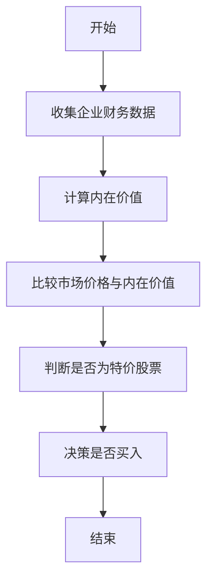
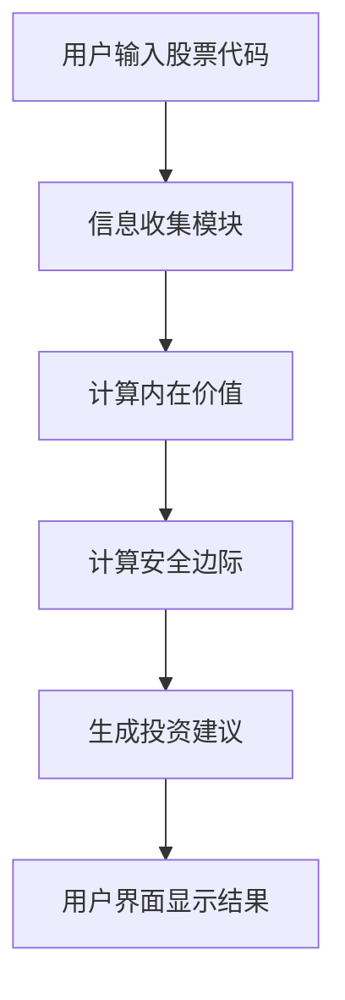
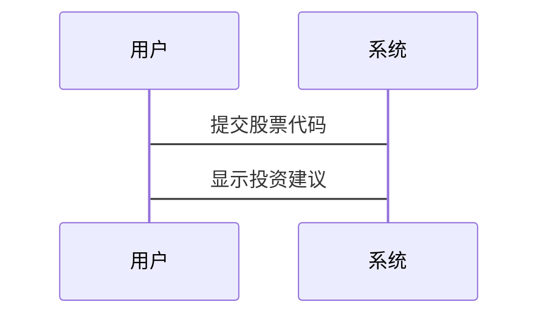

                 


# 格雷厄姆特价股票理论对投资者教育的启示

## 关键词：价值投资、特价股票、投资者教育、投资策略、投资心理、安全边际、长期收益

## 摘要：本文探讨格雷厄姆的特价股票理论对投资者教育的启示，分析其核心概念、算法原理和数学模型，并通过实际案例和系统分析，揭示该理论对现代投资策略的影响，强调其在投资者教育中的重要性。

---

# 第一部分: 格雷厄姆与特价股票理论的背景

## 第1章: 格雷厄姆的生平与投资理念

### 1.1 格雷厄姆的生平简介
本·格雷厄姆（Ben Graham）是20世纪著名的投资家和价值投资理论的创始人。他出生于1894年，曾在哥伦比亚大学教授证券分析，其学生包括沃伦·巴菲特等知名投资者。格雷厄姆的职业生涯始于1920年代，当时他开始实践和推广价值投资的理念。

### 1.2 格雷厄姆的投资哲学与价值投资
格雷厄姆的投资哲学以“安全边际”为核心，主张以低于内在价值的价格买入股票。他认为市场波动性较大，投资者应关注企业的基本面，而非市场的短期波动。这种理念为价值投资奠定了基础。

### 1.3 格雷厄姆与巴菲特的师生关系
格雷厄姆是巴菲特的导师，巴菲特深受其影响，将格雷厄姆的价值投资理念发扬光大。两人的关系不仅是师生，更是价值投资领域的传奇。

## 第2章: 特价股票理论的起源与发展

### 2.1 特价股票的定义与特征
特价股票是指市场价格低于其内在价值的股票。格雷厄姆认为，这种股票具有较高的安全边际，适合长期投资。

### 2.2 格雷厄姆对市场波动的研究
格雷厄姆研究发现，市场波动往往导致股票价格与内在价值脱节，这为寻找特价股票提供了机会。

### 2.3 格雷厄姆理论在投资实践中的应用
格雷厄姆的理论被广泛应用于机构投资和个人投资，尤其在经济衰退期间表现尤为突出。

## 第3章: 格雷厄姆特价股票理论对投资者教育的启示

### 3.1 投资者教育的重要性
投资者教育是价值投资成功的关键。格雷厄姆的理论强调了理性投资的重要性，帮助投资者避免情绪化决策。

### 3.2 格雷厄姆理论对投资者心理的影响
格雷厄姆的理论帮助投资者克服短期波动的干扰，培养长期投资的耐心和信心。

### 3.3 格雷厄姆理论在现代投资中的地位
尽管市场环境变化，格雷厄姆的理论依然具有重要价值，特别是在当前量化投资和算法交易盛行的时代。

---

# 第二部分: 格雷厄姆特价股票理论的核心概念

## 第1章: 格雷厄姆投资模型的原理

### 1.1 格雷厄姆投资模型的定义
格雷厄姆投资模型基于企业的基本面分析，寻找被市场低估的股票。

### 1.2 投资模型的流程图


### 1.3 内在价值的计算公式
$$ V = \frac{E}{4.41} $$
其中，$E$ 是企业未来7年预期收益的总和，$V$ 是内在价值。

## 第2章: 特价股票的筛选标准

### 2.1 格雷厄姆的安全边际计算
安全边际 = 内在价值 - 市场价格。

### 2.2 特价股票的筛选指标
| 指标名称 | 定义 | 重要性 |
|----------|------|--------|
| 市盈率   | 价格/每股收益 | 低市盈率表示低估 |
| 市净率   | 价格/每股净资产 | 低市净率表示低估 |

### 2.3 特价股票的ER实体关系图
```mermaid
er
    顾客 --|{购买}|-< 实体: 特价股票
    实体: 特价股票 --|{属性}|-< 属性: 市盈率、市净率
```

## 第3章: 格雷厄姆投资模型的数学模型

### 3.1 内在价值的数学公式
$$ V = \frac{E}{4.41} $$

### 3.2 安全边际的计算
$$ \text{安全边际} = V - P $$

### 3.3 格雷厄姆投资模型的Python实现
```python
# 计算内在价值
def calculate_intrinsic_value(eps, years=7, multiplier=4.41):
    total_earnings = eps * years
    intrinsic_value = total_arnings / multiplier
    return intrinsic_value

# 计算安全边际
def calculate_margin_of_safety(intrinsic_value, price):
    mos = intrinsic_value - price
    return mos

# 示例
eps = 10  # 每股收益
price = 50  # 市场价格
iv = calculate_intrinsic_value(eps)
mos = calculate_margin_of_safety(iv, price)
print(f"内在价值: {iv}, 安全边际: {mos}")
```

---

# 第三部分: 格雷厄姆特价股票理论的系统分析与架构设计

## 第1章: 系统功能设计

### 1.1 系统功能模块
- 信息收集模块：收集企业财务数据。
- 分析模块：计算内在价值和安全边际。
- 决策支持模块：提供投资建议。

### 1.2 系统功能流程图


## 第2章: 系统架构设计

### 2.1 系统架构
- 数据层：存储企业财务数据。
- 业务逻辑层：计算内在价值和安全边际。
- 用户界面层：展示结果。

### 2.2 系统架构图


## 第3章: 系统接口设计

### 3.1 系统接口
- 输入接口：接受股票代码和财务数据。
- 输出接口：显示投资建议。

### 3.2 系统接口序列图


---

# 第四部分: 项目实战

## 第1章: 环境安装

### 1.1 安装Python环境
- 安装Python 3.8或更高版本。
- 安装必要的库：pandas、numpy。

## 第2章: 核心代码实现

### 2.1 计算内在价值和安全边际的Python代码
```python
import pandas as pd

# 定义计算内在价值和安全边际的函数
def calculate_intrinsic_value(eps, years=7, multiplier=4.41):
    total_earnings = eps * years
    intrinsic_value = total_earnings / multiplier
    return intrinsic_value

def calculate_margin_of_safety(intrinsic_value, price):
    mos = intrinsic_value - price
    return mos

# 示例数据
data = {'股票代码': ['AAPL', 'GOOGL', 'MSFT'],
        '每股收益': [10, 20, 15],
        '市场价格': [100, 150, 120]}
df = pd.DataFrame(data)

# 计算内在价值和安全边际
for index, row in df.iterrows():
    eps = row['每股收益']
    price = row['市场价格']
    iv = calculate_intrinsic_value(eps)
    mos = calculate_margin_of_safety(iv, price)
    print(f"股票代码: {row['股票代码']}, 内在价值: {iv}, 安全边际: {mos}")
```

## 第3章: 案例分析

### 3.1 实际案例分析
假设某股票的每股收益为10，市场价格为50，则：
$$ V = \frac{10 \times 7}{4.41} \approx 15.88 $$
安全边际 = 15.88 - 50 = -34.12，表示市场价格高于内在价值，不是特价股票。

---

# 第五部分: 最佳实践与总结

## 第1章: 最佳实践 tips

### 1.1 投资者的注意事项
- 长期投资，避免频繁交易。
- 结合宏观经济环境进行投资决策。

## 第2章: 总结

### 2.1 格雷厄姆理论的核心价值
格雷厄姆的理论为投资者提供了理性投资的框架，强调安全边际和内在价值的重要性。

### 2.2 未来展望
随着市场的变化，格雷厄姆的理论需要与现代投资工具和技术相结合，以适应新的挑战。

---

通过本文的分析，读者可以深入了解格雷厄姆的特价股票理论，并将其应用于实际投资中。希望这篇文章能为投资者教育和实践提供有价值的启示。

