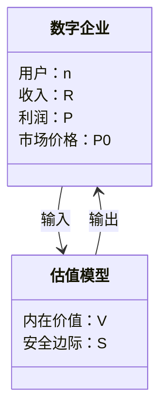

                 


# 《格雷厄姆特价股票理论对数字原生企业估值的启示》

> **关键词**：格雷厄姆投资理论，数字原生企业，企业估值，特价股票，内在价值，安全边际

> **摘要**：本文探讨了格雷厄姆价值投资理论在数字原生企业估值中的应用。通过分析数字原生企业的独特特性，结合格雷厄姆的内在价值计算和安全边际原则，提出了一套适用于数字企业的估值模型，并通过实际案例进行了验证。文章还讨论了数字企业的特殊估值指标，如用户价值和数据资产，及其对传统估值方法的补充作用。

---

## 第1章: 格雷厄姆投资理论与数字原生企业的背景

### 1.1 格雷厄姆投资理论的核心概念

#### 1.1.1 价值投资的基本原理
格雷厄姆的价值投资理论强调以低于内在价值的价格购买优质股票。他认为市场先生（市场情绪）会导致股票价格波动，投资者应利用这种波动，以合理价格买入并长期持有优质资产。

**数学模型**：
内在价值公式：
$$
\text{内在价值} = \sum_{t=1}^{\infty} \frac{\text{现金流}_t}{(1 + r)^t}
$$
其中，\( r \) 为折现率。

#### 1.1.2 特价股票的定义与特征
格雷厄姆将“特价股票”定义为市场价格远低于其内在价值的股票。其特征包括：
- 价格低于清算价值。
- 股息率高且稳定。
- 公司财务状况稳健。

#### 1.1.3 格雷厄姆投资策略的历史演变
格雷厄姆的投资策略从早期的“烟屁股”策略（投资于被市场抛弃的低成长性股票）发展到更注重安全边际和风险控制的价值投资方法。

---

### 1.2 数字原生企业的定义与特点

#### 1.2.1 数字原生企业的概念
数字原生企业是指那些从创立之初就基于数字技术构建商业模式的企业，如互联网公司、软件即服务（SaaS）公司等。

#### 1.2.2 数字原生企业的核心特征
- **轻资产模式**：依赖数据和算法，而非实体资产。
- **高增长潜力**：通过网络效应和数据驱动的增长。
- **无形资产主导**：核心竞争力体现在技术、数据和品牌。

#### 1.2.3 数字原生企业与传统企业的区别
| 特性         | 数字原生企业         | 传统企业           |
|--------------|----------------------|--------------------|
| 资产结构     | 轻资产               | 重资产             |
| 增长驱动     | 数据和技术           | 实体资产和劳动力   |
| 估值挑战     | 高不确定性           | 较为稳定           |

---

### 1.3 格雷厄姆理论与数字原生企业的结合

#### 1.3.1 格雷厄姆理论的适用性分析
尽管格雷厄姆理论最初针对传统企业，但其核心思想（安全边际、内在价值）仍可应用于数字企业。

#### 1.3.2 数字原生企业估值的特殊性
数字企业的价值更多体现在未来的增长潜力，而非当前的财务指标。因此，传统估值指标（如市盈率）可能不足以准确反映其价值。

---

## 第2章: 格雷厄姆理论的核心模型与数字企业的适应性

### 2.1 现值计算模型

#### 2.1.1 现值公式与应用
现值公式：
$$
PV = \frac{CF}{(1 + r)^n}
$$
其中，\( CF \) 为现金流，\( r \) 为折现率，\( n \) 为时间。

#### 2.1.2 现值计算的数学模型
对于数字企业，现金流的预测更具挑战性，需考虑用户增长和收入模型。

---

### 2.2 内在价值计算模型

#### 2.2.1 内在价值的定义
内在价值是未来现金流的现值，反映了企业的实际价值。

#### 2.2.2 内在价值与市场价格的关系
当市场价格低于内在价值时，企业具备投资价值。

---

### 2.3 股东权益分析模型

#### 2.3.1 股东权益的构成
股东权益包括股本、留存收益等，是企业价值的重要组成部分。

#### 2.3.2 股东权益与企业价值的关系
企业价值 = 股东权益 + 债务价值。

---

## 第3章: 数字原生企业估值的核心指标与模型

### 3.1 传统企业估值指标

#### 3.1.1 市盈率（P/E）
市盈率 = 股价 / 每股收益。

#### 3.1.2 市净率（P/B）
市净率 = 股价 / 每股净资产。

#### 3.1.3 股息率
股息率 = 每股股息 / 股价。

---

### 3.2 数字原生企业的特殊估值指标

#### 3.2.1 用户价值
用户价值 = 用户生命周期价值（CLV）。

#### 3.2.2 技术壁垒
技术壁垒的强弱影响企业的竞争地位。

#### 3.2.3 数据资产
数据资产的价值体现在未来的收益能力。

---

### 3.3 数字原生企业估值模型的构建

#### 3.3.1 模型构建的逻辑
数字企业的估值模型需综合考虑用户增长、收入模型和技术壁垒。

#### 3.3.2 模型的数学表达
$$
\text{企业价值} = \text{用户价值} \times \text{用户增长潜力}
$$

---

## 第4章: 格雷厄姆理论在数字原生企业估值中的应用

### 4.1 格雷厄姆理论的核心原则

#### 4.1.1 安全边际
安全边际 = 内在价值 - 市场价格。

#### 4.1.2 股票的内在价值
内在价值是未来现金流的现值。

#### 4.1.3 市场先生的疯狂
市场情绪波动导致股票价格偏离内在价值。

---

### 4.2 数字原生企业估值中的安全边际

#### 4.2.1 安全边际的计算方法
$$
\text{安全边际} = \text{内在价值} - \text{市场价格}
$$

#### 4.2.2 安全边际与投资风险
安全边际越大，投资风险越小。

---

### 4.3 理论与实践的结合

#### 4.3.1 传统企业的适用性
格雷厄姆理论在传统企业中已得到验证。

#### 4.3.2 数字原生企业的适用性
需调整模型以反映数字企业的特点。

---

## 第5章: 数字原生企业估值的系统分析

### 5.1 问题场景介绍
数字企业的估值需考虑用户增长、技术壁垒和数据资产。

### 5.2 系统功能设计
领域模型类图（Mermaid）：



---

### 5.3 系统架构设计
架构图（Mermaid）：


---

## 第6章: 项目实战与案例分析

### 6.1 环境安装
需安装Python、Pandas、NumPy等工具。

### 6.2 核心实现代码

```python
def calculate_intrinsic_value(cash_flows, discount_rate):
    pv = 0
    for i, cf in enumerate(cash_flows):
        pv += cf / (1 + discount_rate) ** i
    return pv

# 示例
cash_flows = [100, 200, 300]
discount_rate = 0.1
iv = calculate_intrinsic_value(cash_flows, discount_rate)
print(f"内在价值：{iv}")
```

---

### 6.3 实际案例分析
以某互联网公司为例，计算其内在价值和安全边际。

---

## 第7章: 总结与展望

### 7.1 本章小结
格雷厄姆理论在数字原生企业估值中具有重要启示，需结合企业的特殊性进行调整。

### 7.2 展望未来
未来需进一步研究数字企业的动态估值模型，以应对市场变化。

---

## 总结

通过结合格雷厄姆的价值投资理论和数字原生企业的特点，我们可以构建更精准的企业估值模型。这不仅有助于投资者做出明智决策，也为数字企业的长期发展提供了理论支持。

