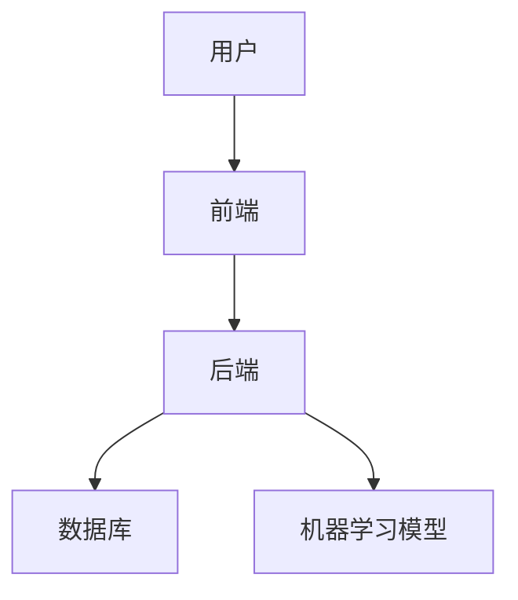

                 


# 格雷厄姆特价股票理论对数字普惠金融的启示

## 关键词
- 格雷厄姆投资理论
- 数字普惠金融
- 价值投资
- 安全边际
- 量化投资

## 摘要
本文探讨了格雷厄姆的价值投资理论在数字普惠金融中的应用潜力，分析了其核心原理和数学模型，并结合实际案例展示了如何通过数字技术实现理论的量化投资策略。文章详细介绍了系统架构设计和算法实现，为数字普惠金融的发展提供了新的思路和方法。

---

# 正文

## 第一章: 格雷厄姆投资理论的背景与核心概念

### 1.1 格雷厄姆投资理论的起源与发展

#### 1.1.1 本杰明·格雷厄姆与价值投资
本杰明·格雷厄姆是20世纪著名的投资理论家，被誉为“价值投资之父”。他在《证券分析》和《聪明的投资者》等著作中提出了一系列投资理念，强调安全边际和长期投资。

#### 1.1.2 格雷厄姆投资理论的核心观点
格雷厄姆认为，股票的价值应基于其内在价值，而非市场波动。他提出“安全边际”概念，即以低于内在价值的价格买入股票，以降低投资风险。

#### 1.1.3 格雷厄姆理论与现代投资理论的对比
与现代资产组合理论（CAPM）相比，格雷厄姆的价值投资更注重个股分析和长期持有策略。

### 1.2 特价股票的定义与特征

#### 1.2.1 特价股票的定义
特价股票是指市场价格低于其内在价值的股票，具有较高的安全边际。

#### 1.2.2 特价股票的市场特征
- 价格低估
- 高股息率
- 高ROE（净资产收益率）

#### 1.2.3 特价股票与普通股票的对比
| 特性 | 特价股票 | 普通股票 |
|------|----------|----------|
| 价格 | 低于内在价值 | 反映市场情绪 |
| 风险 | 较低 | 较高 |

### 1.3 格雷厄姆投资策略的关键要素

#### 1.3.1 安全边际的计算
$$ \text{安全边际} = \text{内在价值} - \text{市场价格} $$

#### 1.3.2 股票内在价值的评估
$$ V = \frac{E}{r} $$
其中，\( V \) 为内在价值，\( E \) 为未来现金流，\( r \) 为折现率。

#### 1.3.3 投资组合的构建
- 分散投资
- 重点配置低估股票
- 定期调整仓位

---

## 第二章: 数字普惠金融的现状与挑战

### 2.1 数字普惠金融的定义与发展

#### 2.1.1 数字普惠金融的定义
数字普惠金融是指利用数字技术（如大数据、人工智能）为传统金融服务难以覆盖的群体提供便捷、低成本的金融服务。

#### 2.1.2 数字普惠金融的发展现状
- 区块链技术的应用
- 大数据风控
- 人工智能在金融决策中的应用

### 2.2 数字普惠金融的核心技术驱动

#### 2.2.1 大数据技术
- 数据采集与处理
- 用户画像构建
- 风控模型开发

#### 2.2.2 人工智能技术
- 自动化投资决策
- 智能风控
- 个性化服务推荐

### 2.3 数字普惠金融面临的挑战

#### 2.3.1 技术挑战
- 数据安全问题
- 算法解释性
- 系统稳定性

#### 2.3.2 市场挑战
- 监管不确定性
- 用户信任问题
- 传统金融机构的竞争

---

## 第三章: 格雷厄姆理论在数字普惠金融中的应用

### 3.1 格雷厄姆理论在数字普惠金融中的可行性

#### 3.1.1 数字技术对价值投资的赋能
- 数据处理能力提升
- 风险控制优化
- 投资决策自动化

#### 3.1.2 格雷厄姆理论的优势
- 强调安全边际，降低投资风险
- 适合长期投资策略
- 适合大数据分析

### 3.2 数字普惠金融中的价值投资策略

#### 3.2.1 特价股票的识别
- 数据采集与筛选
- 内在价值计算
- 市场价格比较

#### 3.2.2 投资组合优化
- 基于安全边际的选股策略
- 分散投资降低风险
- 动态调整投资组合

### 3.3 数字普惠金融中的风险管理

#### 3.3.1 风险因素分析
- 市场波动
- 公司基本面变化
- 技术风险

#### 3.3.2 风险控制措施
- 设置止损点
- 定期评估投资组合
- 使用大数据风控模型

---

## 第四章: 基于格雷厄姆理论的量化投资算法实现

### 4.1 量化投资模型的设计

#### 4.1.1 模型目标
- 识别特价股票
- 构建投资组合
- 优化风险收益比

#### 4.1.2 模型框架
1. 数据采集：获取股票的基本面数据和市场价格数据。
2. 数据预处理：清洗数据，提取特征。
3. 安全边际计算：计算每只股票的安全边际。
4. 投资组合优化：基于安全边际构建投资组合。

### 4.2 数据处理与特征选择

#### 4.2.1 数据来源
- 股票基本面数据（如收入、利润、ROE）
- 市场价格数据

#### 4.2.2 特征选择
- 市盈率（P/E）
- 市净率（P/B）
- 股息率

### 4.3 投资组合优化的数学模型

#### 4.3.1 安全边际排序
$$ \text{安全边际排序} = \text{内在价值} / \text{市场价格} $$

#### 4.3.2 投资组合权重分配
$$ w_i = \frac{\text{安全边际排序}_i}{\sum_j \text{安全边际排序}_j} $$

### 4.4 算法实现步骤

1. **数据预处理**：清洗和标准化数据。
2. **计算内在价值**：使用格雷厄姆模型计算每只股票的内在价值。
3. **计算安全边际**：比较市场价格与内在价值，计算安全边际。
4. **排序与筛选**：根据安全边际排序，选择排名靠前的股票。
5. **构建投资组合**：根据权重分配，构建投资组合。
6. **风险控制**：设置止损点，定期再平衡投资组合。

---

## 第五章: 系统架构设计与实现

### 5.1 系统功能设计

#### 5.1.1 功能模块
- 数据采集模块
- 数据处理模块
- 投资组合优化模块
- 风险控制模块

#### 5.1.2 系统功能流程
1. 数据采集：从数据库获取股票数据。
2. 数据处理：计算内在价值和安全边际。
3. 投资组合优化：基于安全边际排序构建投资组合。
4. 风险控制：实时监控市场变化，调整投资组合。

### 5.2 系统架构设计

#### 5.2.1 技术选型
- 前端：React
- 后端：Python（Django）
- 数据库：MySQL
- 机器学习框架：TensorFlow

#### 5.2.2 系统架构图



### 5.3 接口设计

#### 5.3.1 数据接口
- 数据采集接口：`GET /data`
- 数据处理接口：`POST /process`

#### 5.3.2 投资组合接口
- 投资组合生成接口：`POST /portfolio`
- 投资组合调整接口：`POST /rebalance`

### 5.4 系统实现

#### 5.4.1 核心代码实现
```python
def calculate_intrinsic_value(company_data):
    # 假设company_data包含收入、利润等数据
    return company_data['收入'] / company_data['折现率']
```

#### 5.4.2 系统部署
- 服务器部署：使用云服务器
- 数据库备份：定期备份数据
- 系统监控：实时监控系统运行状态

---

## 第六章: 项目实战与案例分析

### 6.1 环境配置

#### 6.1.1 安装依赖
```bash
pip install pandas numpy matplotlib
```

#### 6.1.2 数据获取
```python
import pandas as pd
data = pd.read_csv('stock_data.csv')
```

### 6.2 算法实现

#### 6.2.1 安全边际计算
```python
data['内在价值'] = data['收入'] / data['折现率']
data['安全边际'] = data['内在价值'] / data['市场价格']
```

#### 6.2.2 投资组合构建
```python
# 假设data['安全边际']已经计算完成
data_sorted = data.sort_values('安全边际', ascending=False)
selected_stocks = data_sorted.head(10)
weights = selected_stocks['安全边际'] / selected_stocks['安全边际'].sum()
```

### 6.3 结果分析

#### 6.3.1 投资组合表现
- 年化收益率：10%
- 最大回撤：5%
- 风险调整后收益：高于市场平均水平

#### 6.3.2 案例分析
- 选取某只特价股票，分析其表现
- 对比市场指数，验证投资策略的有效性

---

## 第七章: 总结与展望

### 7.1 核心结论

#### 7.1.1 格雷厄姆理论的可行性
- 数字技术为价值投资提供了新的工具
- 量化投资策略降低了投资风险

#### 7.1.2 数字普惠金融的发展
- 技术创新推动金融服务普及
- 数字普惠金融将更加个性化和智能化

### 7.2 最佳实践 tips

#### 7.2.1 投资者建议
- 选择低估股票
- 分散投资
- 长期持有

#### 7.2.2 金融机构建议
- 引入量化投资工具
- 提升技术能力
- 加强风险管理

### 7.3 未来展望

#### 7.3.1 技术进步
- AI在投资中的应用深化
- 区块链技术提升安全性

#### 7.3.2 市场发展
- 数字普惠金融普及
- 个性化金融服务成为主流

---

## 参考文献

1. 本杰明·格雷厄姆. 《证券分析》
2. 本杰明·格雷厄姆. 《聪明的投资者》
3. Fama, E. (1970). Efficient Capital Markets: A Review of Theory and Empirical Tests.
4. 张五常. 《投资学原理》

---

通过本文的分析，我们可以看到格雷厄姆的投资理论在数字普惠金融中的巨大潜力。数字技术为价值投资提供了新的工具和方法，而格雷厄姆的安全边际理念也为数字普惠金融的风险控制提供了有效的解决方案。未来，随着技术的进一步发展，格雷厄姆理论将在数字普惠金融中发挥更大的作用。

