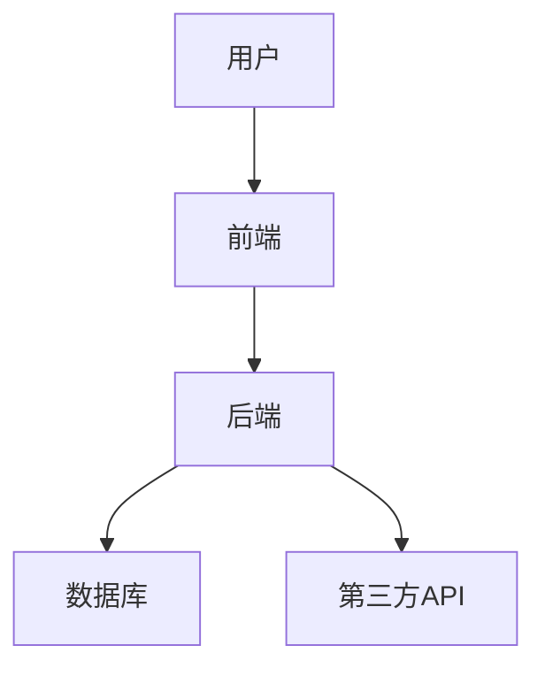

                 


# 《格雷厄姆特价股票理论对普惠金融科技的启示》

## 关键词：格雷厄姆、股票理论、普惠金融、金融科技、价值投资

## 摘要：本文探讨了格雷厄姆的价值投资理论如何为普惠金融科技提供理论基础和实践启示。通过分析格雷厄姆的安全边际、内在价值等核心概念，结合现代金融科技手段，提出了一种基于格雷厄姆理论的普惠金融系统设计方案，并通过实际案例展示了该理论在股票分析中的应用。

---

# 第1章: 格雷厄姆价值投资理论的背景与核心概念

## 1.1 格雷厄姆价值投资理论的起源与发展

### 1.1.1 价值投资的起源
价值投资是一种以基本面分析为基础的投资策略，其核心在于寻找市场价格低于其内在价值的股票。这一理念起源于20世纪初，由本杰明·格雷厄姆（Benjamin Graham）和戴维·多德（David Dodd）共同提出。格雷厄姆是哥伦比亚大学的教授，他的学生包括沃伦·巴菲特（Warren Buffett）等著名投资者。

### 1.1.2 格雷厄姆的投资理念
格雷厄姆提出的价值投资理念强调“安全边际”（Margin of Safety）和“内在价值”（Intrinsic Value）的概念。他认为，股票不仅仅是一种金融工具，更是一种企业所有权的代表。投资者应关注企业的基本面，而非市场的短期波动。

### 1.1.3 格雷厄姆理论的核心观点
1. **安全边际**：市场价格与内在价值之间的差额，即安全边际越大，投资的风险越小。
2. **内在价值**：股票的真正价值，基于企业的盈利能力、资产质量等因素计算得出。
3. **市场先生**：市场情绪的波动性，投资者应避免被市场情绪左右。

## 1.2 普惠金融与金融科技的结合

### 1.2.1 普惠金融的定义与目标
普惠金融是指通过金融体系的优化，使更多的人能够获得便捷、可负担的金融服务，尤其是中小微企业和低收入群体。

### 1.2.2 金融科技在普惠金融中的作用
金融科技（Fintech）通过技术手段降低了金融服务的成本和门槛，使普惠金融的目标更加接近。例如，大数据分析、人工智能和区块链等技术的应用，使得金融信息的获取和分析更加高效。

### 1.2.3 格雷厄姆理论与普惠金融的契合点
格雷厄姆理论强调基本面分析和长期价值，这与普惠金融的目标高度契合。通过分析企业的内在价值，投资者可以更好地选择具有长期增长潜力的企业，从而实现普惠金融的目标。

## 1.3 格雷厄姆价值投资理论的核心概念

### 1.3.1 安全边际
安全边际是格雷厄姆理论的核心之一，它是指市场价格低于内在价值的部分。通过计算安全边际，投资者可以评估投资的风险和收益。

### 1.3.2 内在价值
内在价值是股票的真正价值，与市场价格无关。计算内在价值的方法包括现金流折现法（DCF）等。

### 1.3.3 市场先生
市场先生是格雷厄姆用来形容市场情绪波动的一个比喻。投资者应避免被市场情绪左右，而是应关注企业的基本面。

## 1.4 格雷厄姆投资策略的优缺点

### 1.4.1 优点
1. **长期稳定收益**：价值投资注重长期持有，避免短期波动。
2. **风险可控**：通过安全边际的计算，降低了投资风险。

### 1.4.2 缺点
1. **对数据要求高**：需要详细的企业基本面数据。
2. **短期表现不佳**：在市场狂热时，价值投资的表现可能不如趋势投资。

### 1.4.3 适用场景
1. **长期投资者**：适合那些追求长期稳定收益的投资者。
2. **价值型投资者**：适合那些关注企业基本面的投资者。

## 1.5 本章小结
本章介绍了格雷厄姆价值投资理论的背景、核心概念以及其与普惠金融的契合点。通过分析安全边际、内在价值和市场先生等概念，我们理解了格雷厄姆理论的核心思想，并为后续的理论分析和系统设计奠定了基础。

---

# 第2章: 格雷厄姆价值投资模型的数学解析

## 2.1 格雷厄姆内在价值计算公式

### 2.1.1 内在价值的定义
内在价值是股票的真正价值，与市场价格无关。计算内在价值的方法多种多样，其中最常用的是现金流折现法（DCF）。

### 2.1.2 内在价值的计算公式
$$ V = \frac{E}{(1 + r)^n} $$
其中：
- \( V \) 是内在价值
- \( E \) 是未来现金流
- \( r \) 是折现率
- \( n \) 是时间跨度

### 2.1.3 示例计算
假设某企业未来5年的现金流分别为100、120、140、160、180万元，折现率为10%。计算其内在价值：
$$ V = \frac{100}{(1 + 0.1)^1} + \frac{120}{(1 + 0.1)^2} + \frac{140}{(1 + 0.1)^3} + \frac{160}{(1 + 0.1)^4} + \frac{180}{(1 + 0.1)^5} $$
计算结果为：\( V \approx 411.59 \) 万元

## 2.2 安全边际的量化方法

### 2.2.1 安全边际的计算公式
$$ \text{安全边际} = \text{内在价值} - \text{市场价格} $$

### 2.2.2 安全边际的评估指标
安全边际越大，投资风险越小。通常认为，安全边际应至少为内在价值的20%。

### 2.2.3 示例计算
假设某股票的内在价值为100元，市场价格为80元，则安全边际为20元（20%）。

## 2.3 格雷厄姆投资模型的优化与改进

### 2.3.1 现代投资组合理论的引入
现代投资组合理论（MPT）强调分散投资以降低风险。结合格雷厄姆的理论，可以通过分散投资降低单一股票的风险。

### 2.3.2 风险调整后的价值模型
通过引入风险调整因子，可以更准确地计算内在价值。

### 2.3.3 数据驱动的优化方法
利用大数据技术，对企业的基本面数据进行深度分析，优化内在价值的计算模型。

## 2.4 本章小结
本章详细介绍了格雷厄姆价值投资模型的数学解析，包括内在价值的计算公式和安全边际的量化方法。通过示例计算，我们理解了这些模型的实际应用，并探讨了如何通过现代技术优化这些模型。

---

# 第3章: 格雷厄姆投资策略的算法实现

## 3.1 算法原理

### 3.1.1 数据采集与预处理
1. 采集企业的财务数据，包括收入、利润、现金流等。
2. 对数据进行清洗和标准化处理。

### 3.1.2 股票估值模型的实现
1. 使用现金流折现法（DCF）计算内在价值。
2. 计算安全边际。

### 3.1.3 安全边际的计算
$$ \text{安全边际} = \text{内在价值} - \text{市场价格} $$

## 3.2 格雷厄姆投资策略的Python实现

### 3.2.1 环境安装
需要安装以下库：
- `pandas`：用于数据处理
- `numpy`：用于数值计算
- `scikit-learn`：用于机器学习

### 3.2.2 核心代码示例

```python
import pandas as pd
import numpy as np

# 示例数据
data = {
    '现金流': [100, 120, 140, 160, 180],
    '折现率': 0.1
}

# 计算内在价值
def calculate_intrinsic_value(cash_flows, discount_rate):
    return sum(cash_flow / (1 + discount_rate) ** i for i, cash_flow in enumerate(cash_flows))

# 示例计算
intrinsic_value = calculate_intrinsic_value(data['现金流'], data['折现率'])
print(f"内在价值: {intrinsic_value}")

# 计算安全边际
market_price = 80
margin_of_safety = intrinsic_value - market_price
print(f"安全边际: {margin_of_safety}")
```

### 3.2.3 代码解读
1. **数据采集与预处理**：使用Pandas库读取数据，并对数据进行清洗。
2. **内在价值计算**：使用现金流折现法计算内在价值。
3. **安全边际计算**：根据市场价格和内在价值计算安全边际。

## 3.3 算法优化与改进

### 3.3.1 数据驱动优化
通过机器学习技术，对企业的基本面数据进行深度分析，优化内在价值的计算模型。

### 3.3.2 并行计算
通过并行计算技术，提高算法的计算效率。

## 3.4 本章小结
本章通过Python代码实现了格雷厄姆投资策略的核心算法，包括数据采集、内在价值计算和安全边际计算。通过优化算法，我们可以提高计算效率，并为普惠金融系统的实现提供技术支持。

---

# 第4章: 格雷厄姆投资策略在普惠金融科技中的应用

## 4.1 普惠金融系统的应用场景

### 4.1.1 中小微企业的融资需求
中小微企业通常缺乏足够的抵押品和信用记录，难以获得传统金融机构的贷款。

### 4.1.2 个人投资者的财富管理需求
个人投资者需要通过低门槛的投资工具实现财富增值。

## 4.2 系统功能设计

### 4.2.1 用户管理
1. **注册与登录**：用户可以通过手机号或邮箱注册。
2. **个人信息管理**：用户可以管理自己的个人信息。

### 4.2.2 数据采集与处理
1. **企业基本面数据采集**：采集企业的收入、利润、现金流等数据。
2. **股票市场数据采集**：采集股票的市场价格、成交量等数据。

### 4.2.3 投资策略执行
1. **内在价值计算**：根据企业基本面数据计算内在价值。
2. **安全边际计算**：根据市场价格和内在价值计算安全边际。
3. **投资决策**：根据安全边际和市场趋势，生成投资建议。

### 4.2.4 系统监控与反馈
1. **系统监控**：监控系统的运行状态。
2. **用户反馈**：收集用户的反馈，优化系统功能。

## 4.3 系统架构设计

### 4.3.1 系统架构图


### 4.3.2 接口设计
1. **API接口**：提供RESTful API，供前端调用。
2. **数据接口**：与第三方数据源对接，获取实时数据。

### 4.3.3 系统交互流程
1. **用户登录**：用户通过前端登录系统。
2. **数据查询**：用户输入股票代码，查询股票信息。
3. **投资建议**：系统根据数据计算内在价值和安全边际，生成投资建议。

## 4.4 本章小结
本章探讨了格雷厄姆投资策略在普惠金融科技中的应用场景，并设计了一个基于格雷厄姆理论的普惠金融系统。通过系统架构设计和功能实现，我们展示了如何将格雷厄姆理论应用于实际的金融业务中。

---

# 第5章: 格雷厄姆投资策略的优化与拓展

## 5.1 数据驱动的优化方法

### 5.1.1 大数据技术的应用
通过大数据技术，我们可以获取更多的企业基本面数据，提高内在价值的计算精度。

### 5.1.2 机器学习的应用
通过机器学习技术，可以预测企业的未来现金流，优化内在价值的计算模型。

## 5.2 系统扩展与集成

### 5.2.1 与区块链技术的结合
通过区块链技术，可以实现金融数据的可信共享，降低数据获取成本。

### 5.2.2 与云计算的结合
通过云计算技术，可以提高系统的计算能力和数据存储能力。

## 5.3 本章小结
本章探讨了格雷厄姆投资策略的优化方法，包括大数据技术和机器学习的应用。同时，我们还探讨了系统扩展的方向，为未来的研究提供了方向。

---

# 第6章: 格雷厄姆投资策略的案例分析与实际应用

## 6.1 案例分析

### 6.1.1 案例背景
某中小微企业，营业收入稳步增长，净利润率为10%。

### 6.1.2 数据分析
通过对企业基本面数据的分析，计算出该企业的内在价值为1000万元。

### 6.1.3 投资决策
根据市场价格和内在价值，计算出安全边际为20%。因此，该股票具有较高的投资价值。

## 6.2 实际应用

### 6.2.1 中小微企业融资
通过格雷厄姆理论，投资者可以发现具有长期增长潜力的中小微企业，为其提供融资支持。

### 6.2.2 个人投资者财富管理
通过格雷厄姆理论，个人投资者可以实现财富的长期增值。

## 6.3 本章小结
本章通过案例分析，展示了格雷厄姆投资策略在普惠金融科技中的实际应用。通过分析中小微企业的基本面数据，我们计算出其内在价值，并根据安全边际制定投资策略。

---

# 第7章: 结论与展望

## 7.1 本研究的主要结论
1. 格雷厄姆价值投资理论为普惠金融科技提供了理论基础。
2. 通过大数据技术和机器学习，可以优化格雷厄姆投资策略。
3. 基于格雷厄姆理论的普惠金融系统具有广阔的应用前景。

## 7.2 未来研究方向
1. **技术优化**：进一步研究如何利用人工智能技术优化内在价值计算模型。
2. **系统扩展**：探索如何将格雷厄姆理论应用于其他金融领域。
3. **政策支持**：研究如何通过政策支持推动普惠金融的发展。

## 7.3 本章小结
本章总结了本研究的主要结论，并展望了未来的研究方向。通过技术优化和系统扩展，我们可以进一步推动格雷厄姆理论在普惠金融科技中的应用。

---

# 参考文献
（此处列出相关文献和参考资料）

