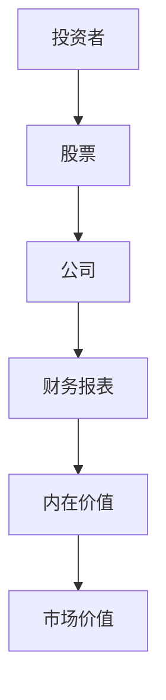
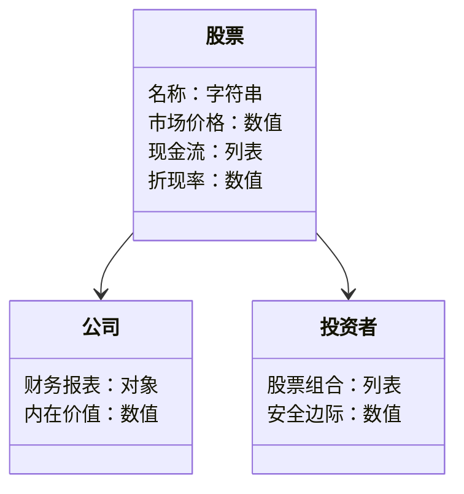
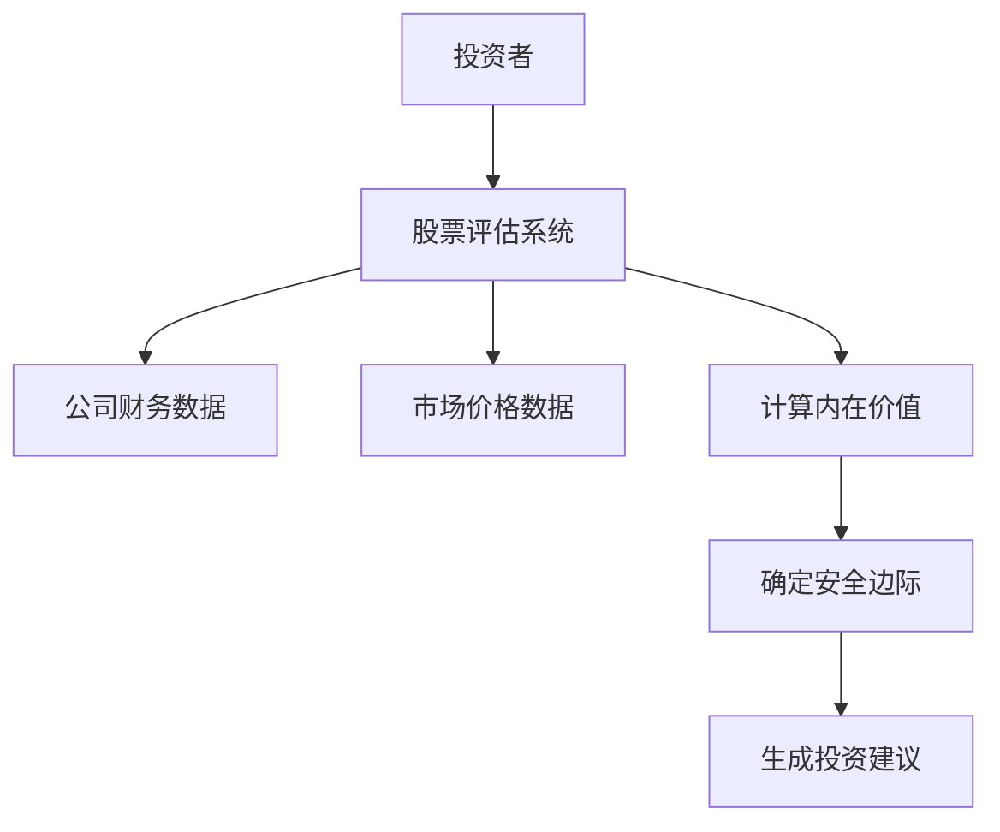
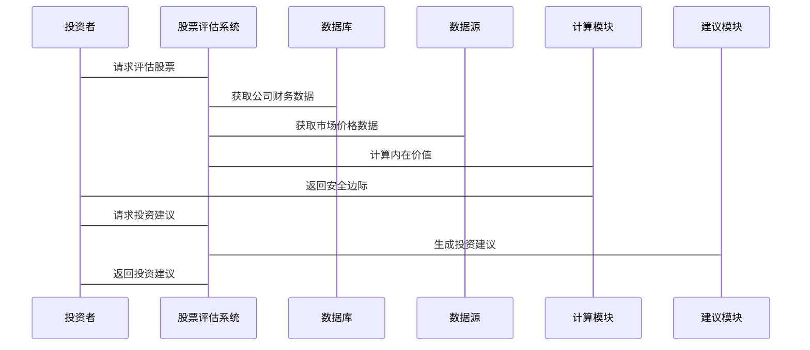

                 


# 格雷厄姆特价股票理论对现代公司估值的启示

## 关键词：价值投资、格雷厄姆理论、公司估值、安全边际、内在价值

## 摘要：格雷厄姆的特价股票理论是价值投资的基石，其核心思想是通过寻找市场价格低于内在价值的股票来实现长期收益。本文从理论背景、核心概念、数学模型、系统架构和实战案例等方面，详细阐述了格雷厄姆理论对现代公司估值的启示，特别是其对安全边际和内在价值的强调，为投资者提供了新的视角。

---

## 第1章 格雷厄姆特价股票理论概述

### 1.1 投资理念的演变

#### 1.1.1 从传统投资到价值投资的演变
传统投资方法侧重于市场趋势和短期波动，而价值投资则强调基本面分析和长期持有。格雷厄姆是价值投资的鼻祖，他的理论为现代投资分析奠定了基础。

#### 1.1.2 格雷厄姆投资理念的核心思想
格雷厄姆认为，股票价格往往偏离其内在价值，投资者应通过分析公司的财务状况，寻找被市场低估的投资标的。

#### 1.1.3 格雷厄姆理论的现实意义
在现代市场中，格雷厄姆的理论依然适用，尤其是在市场波动加剧的情况下，安全边际的重要性更加凸显。

### 1.2 格雷厄姆理论的核心思想

#### 1.2.1 什么是特价股票
特价股票是指市场价格低于其内在价值的股票，具有较高的投资潜力。

#### 1.2.2 格雷厄姆的安全边际概念
安全边际是内在价值与市场价格之间的差额，用于缓冲市场波动带来的风险。

#### 1.2.3 价值投资的基本原则
价值投资强调长期持有、分散投资和安全边际的重要性，旨在通过长期持有优质资产实现超额收益。

### 1.3 现代公司估值的挑战与机遇

#### 1.3.1 现代公司估值的核心问题
现代公司估值需要考虑财务状况、行业趋势、宏观经济环境等多重因素，且这些因素往往动态变化。

#### 1.3.2 格雷厄姆理论在现代的应用
格雷厄姆的安全边际和内在价值概念为现代公司估值提供了新的视角，尤其是在市场波动加剧的情况下。

#### 1.3.3 理论与实践的结合
通过结合格雷厄姆的理论与现代分析工具，投资者可以更精准地评估公司的价值。

### 1.4 本章小结
本章介绍了格雷厄姆的理论背景及其核心思想，分析了其在现代公司估值中的应用和意义。

---

## 第2章 格雷厄姆理论的核心概念

### 2.1 格雷厄姆理论的核心要素

#### 2.1.1 内在价值的定义与计算
内在价值是公司未来现金流的现值，计算公式如下：
$$ V = \sum_{t=1}^{n} \frac{CF_t}{(1 + r)^t} $$
其中，\( CF_t \) 是第 \( t \) 年的现金流，\( r \) 是折现率，\( n \) 是时间跨度。

#### 2.1.2 安全边际的数学模型
安全边际公式为：
$$ M = V - P $$
其中，\( V \) 是内在价值，\( P \) 是市场价格。

#### 2.1.3 股价波动与公司基本面的对比
股价波动主要受市场情绪影响，而公司基本面则反映了企业的实际经营状况。通过对比，可以识别出被低估的股票。

### 2.2 核心概念的属性对比

| 概念          | 内在价值 | 市场价格 |
|---------------|----------|----------|
| 定义          | 公司未来现金流的现值 | 股票在市场上的交易价格 |
| 计算方式      | 使用DCF模型计算 | 由市场供需决定 |
| 影响因素      | 现金流、折现率 | 市场情绪、投资者预期 |

### 2.3 ER实体关系图



---

## 第3章 格雷厄姆估值算法的数学模型

### 3.1 内在价值的计算公式

#### 3.1.1 格雷厄姆内在价值公式
$$ V = \frac{E}{(1 + r)^n} $$
其中，\( E \) 是未来现金流的总和，\( r \) 是折现率，\( n \) 是时间跨度。

#### 3.1.2 举例说明
假设某公司未来3年的现金流分别为100、200、300，折现率为10%。计算内在价值：
$$ V = \frac{100}{1.1} + \frac{200}{(1.1)^2} + \frac{300}{(1.1)^3} \approx 100 + 169.81 + 225.39 \approx 495.20 $$

### 3.2 安全边际的计算

#### 3.2.1 举例说明
假设某股票的内在价值为500，市场价格为400，则安全边际为：
$$ M = 500 - 400 = 100 $$

### 3.3 算法实现

```python
def calculate_intrinsic_value(cash_flows, discount_rate, years):
    intrinsic_value = 0
    for i in range(years):
        intrinsic_value += cash_flows[i] / (1 + discount_rate) ** i
    return intrinsic_value

# 示例
cash_flows = [100, 200, 300]
discount_rate = 0.1
years = 3
iv = calculate_intrinsic_value(cash_flows, discount_rate, years)
print(f"内在价值为：{iv}")
```

---

## 第4章 系统分析与架构设计

### 4.1 问题场景介绍
投资者需要一个系统来评估公司的内在价值，并识别出被低估的股票。

### 4.2 系统功能设计

#### 4.2.1 领域模型


### 4.3 系统架构设计



### 4.4 系统接口设计
系统需要接口来获取公司财务数据和市场价格数据，计算内在价值，并生成投资建议。

### 4.5 系统交互



---

## 第5章 项目实战

### 5.1 环境安装
需要安装Python和相关库，如Pandas和NumPy。

### 5.2 核心实现

```python
import pandas as pd
import numpy as np

def calculate_intrinsic_value(cash_flows, discount_rate, years):
    iv = 0
    for i in range(years):
        iv += cash_flows[i] / (1 + discount_rate) ** i
    return iv

# 示例数据
cash_flows = pd.Series([100, 200, 300])
discount_rate = 0.1
years = 3
iv = calculate_intrinsic_value(cash_flows, discount_rate, years)
print(f"内在价值为：{iv}")
```

### 5.3 案例分析
以某公司为例，计算其内在价值，并与市场价格进行对比，确定是否存在安全边际。

---

## 第6章 总结与展望

### 6.1 总结
格雷厄姆的理论为现代公司估值提供了重要启示，特别是其对安全边际和内在价值的强调，为投资者提供了新的视角。

### 6.2 展望
未来，随着人工智能和大数据技术的发展，格雷厄姆理论的应用将更加广泛和精准。

---

## 关注事项

1. **安全边际的重要性**：在投资决策中，安全边际是降低风险的关键因素。
2. **长期投资**：价值投资强调长期持有，避免短期波动的影响。
3. **持续学习**：市场环境不断变化，投资者需要持续学习和调整策略。

---

## 最佳实践 Tips

- 在实际操作中，结合格雷厄姆的理论和现代分析工具，可以更精准地评估公司价值。
- 通过定期复盘和调整投资组合，优化投资策略。

---

## 参考文献

- 格雷厄姆的著作《聪明的投资者》
- 现代投资理论的相关文献
- 相关学术论文和研究报告

---

通过以上结构，我们可以系统地分析格雷厄姆特价股票理论对现代公司估值的启示，并通过具体案例和数学模型加以验证。希望这篇文章能为投资者提供新的视角和实践指导。

