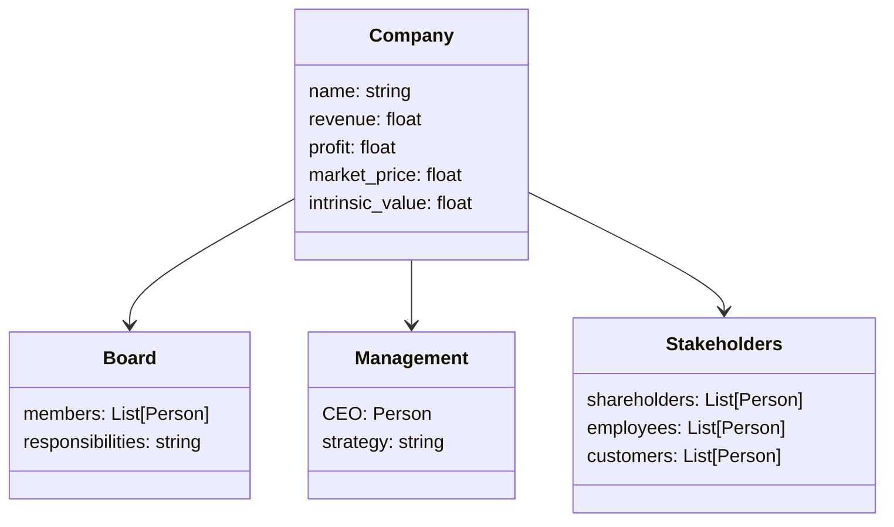
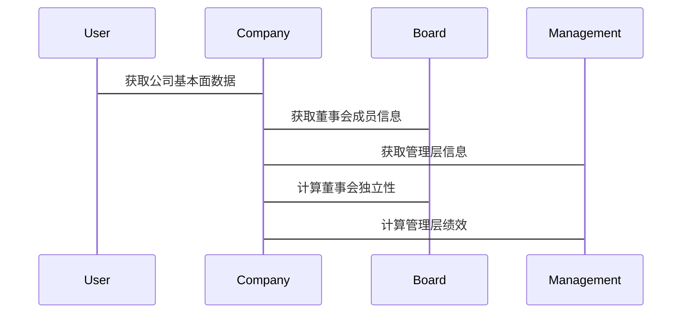

                 


# 格雷厄姆特价股票理论对现代公司治理的启示

## 关键词：
- 格雷厄姆特价股票理论
- 现代公司治理
- 价值投资
- 股票估值
- 公司治理结构

## 摘要：
本文探讨了格雷厄姆的价值投资理论如何为现代公司治理提供新的视角和实践启示。通过分析格雷厄姆的安全边际概念、价值评估方法及其数学模型，本文揭示了这些理论如何应用于公司治理中的股东价值最大化、利益相关者治理和长期战略制定。文章结合实际案例和系统架构，展示了格雷厄姆理论在现代公司治理中的潜在应用价值和实际意义。

---

# 第一部分: 格雷厄姆特价股票理论的背景与基础

## 第1章: 格雷厄姆特价股票理论概述

### 1.1 格雷厄姆投资理论的核心概念

#### 1.1.1 价值投资的定义与核心原则
价值投资是一种投资策略，强调以低于内在价值的价格购买优质资产。格雷厄姆在其著作《证券分析》中提出，投资者应关注企业的基本面，寻找市场估值低于其内在价值的股票。核心原则包括：
- **安全性**：投资应基于安全边际，即市场价格远低于内在价值。
- **长期视角**：关注企业的长期盈利能力，而非短期市场波动。
- **Margin of Safety (安全边际)**：购买价格与内在价值的差额，确保投资的安全性。

#### 1.1.2 格雷厄姆的安全边际概念
安全边际是格雷厄姆理论的核心，它通过比较市场价格与内在价值来确定投资的安全性。当市场价格远低于内在价值时，投资具有较高的安全边际，降低了市场波动带来的风险。

#### 1.1.3 格雷厄姆的选股标准与策略
格雷厄姆提出了具体的选股标准，包括：
- 企业具有稳定的盈利能力。
- 企业具有较低的债务负担。
- 企业具有较高的分红率。
- 企业市场价格远低于其内在价值。

### 1.2 格雷厄姆特价股票理论的数学模型

#### 1.2.1 股票内在价值的计算公式
格雷厄姆提出了股票内在价值的计算公式：
$$ V = \frac{E}{(k - g)} $$
其中：
- \( V \) 是股票的内在价值。
- \( E \) 是企业的年均收益。
- \( k \) 是折现率。
- \( g \) 是收益增长率。

#### 1.2.2 股票市场价格与安全边际的关系
股票市场价格与内在价值的关系可以用以下公式表示：
$$ \text{安全边际} = V - P $$
其中：
- \( P \) 是股票的市场价格。
- \( V \) 是股票的内在价值。

### 1.3 格雷厄姆理论与现代金融学的联系

#### 1.3.1 格雷厄姆理论在现代金融学中的地位
格雷厄姆的价值投资理论为现代金融学奠定了基础，尤其是在公司治理和投资决策方面。

#### 1.3.2 格雷厄姆理论与CAPM模型的对比
CAPM模型（资本资产定价模型）是基于市场风险的定价模型，而格雷厄姆的理论则更关注企业内在价值的安全边际。

#### 1.3.3 格雷厄姆理论与行为金融学的结合
行为金融学关注投资者心理，而格雷厄姆的理论强调理性分析和长期投资，两者可以结合以提供更全面的投资策略。

### 1.4 本章小结
本章介绍了格雷厄姆的价值投资理论，包括其核心概念、数学模型及其与现代金融学的联系。这些理论为现代公司治理提供了重要的启示，尤其是在企业价值评估和长期战略制定方面。

---

# 第二部分: 现代公司治理的现状与挑战

## 第2章: 现代公司治理的核心问题

### 2.1 现代公司治理的定义与框架

#### 2.1.1 公司治理的定义
公司治理是指通过公司章程、董事会、管理层和利益相关者之间的关系，确保企业有效运作和合规经营。

#### 2.1.2 现代公司治理的三大支柱
- **董事会**：负责监督公司战略和管理层。
- **管理层**：负责日常经营和管理。
- **利益相关者**：包括股东、员工、客户和债权人。

### 2.2 现代公司治理的主要挑战

#### 2.2.1 代理问题与利益冲突
代理问题是指董事会和管理层之间的利益冲突，可能导致管理层追求短期利益而非公司长期价值。

#### 2.2.2 短期主义与长期价值的平衡
现代公司治理中，短期业绩压力可能导致企业忽视长期战略。

#### 2.2.3 数字化时代下的公司治理创新
随着数字化转型，公司治理需要适应新的技术环境和商业模式。

### 2.3 现代公司治理的数学模型

#### 2.3.1 公司治理效率的衡量指标
公司治理效率可以用以下指标衡量：
- 董事会独立性。
- 监管合规性。
- 透明度和披露质量。

#### 2.3.2 公司治理风险的评估模型
公司治理风险可以用以下公式评估：
$$ R = \sum_{i=1}^{n} (w_i \cdot r_i) $$
其中：
- \( w_i \) 是风险因子的权重。
- \( r_i \) 是风险因子的评分。

#### 2.3.3 公司治理与企业绩效的回归分析
公司治理与企业绩效的关系可以用回归分析模型表示：
$$ Y = \beta X + \epsilon $$
其中：
- \( Y \) 是企业绩效。
- \( X \) 是公司治理变量。
- \( \beta \) 是回归系数。
- \( \epsilon \) 是误差项。

### 2.4 本章小结
本章分析了现代公司治理的核心问题，包括代理问题、短期主义和数字化转型的挑战。通过数学模型和回归分析，揭示了公司治理与企业绩效之间的关系。

---

# 第三部分: 格雷厄姆特价股票理论对现代公司治理的启示

## 第3章: 格雷厄姆理论对现代公司治理的启示

### 3.1 格雷厄姆理论在公司治理中的应用

#### 3.1.1 治理框架的构建
格雷厄姆的安全边际概念可以应用于公司治理，确保治理结构的安全性和有效性。

#### 3.1.2 股东价值最大化
格雷厄姆的价值投资理论强调股东价值最大化，可以通过合理的股权结构和分红策略实现。

#### 3.1.3 利益相关者治理
格雷厄姆的长期投资理念可以应用于利益相关者治理，通过与利益相关者的长期合作实现共赢。

### 3.2 格雷厄姆理论与公司治理框架的结合

#### 3.2.1 股东权益保护
格雷厄姆的安全边际概念可以用于保护股东权益，确保股东投资的安全性。

#### 3.2.2 董事会治理
格雷厄姆的选股标准可以应用于董事会治理，确保董事会成员的高质量和独立性。

#### 3.2.3 长期战略制定
格雷厄姆的长期投资理念可以应用于公司的长期战略制定，确保公司的可持续发展。

### 3.3 格雷厄姆理论对现代公司治理的创新

#### 3.3.1 数字化时代的治理创新
格雷厄姆理论可以与数字化技术结合，创新公司治理模式。

#### 3.3.2 利益相关者治理的创新
格雷厄姆理论可以应用于利益相关者治理，通过长期合作实现共赢。

### 3.4 本章小结
本章探讨了格雷厄姆理论对现代公司治理的启示，包括治理框架的构建、股东价值最大化和利益相关者治理的创新。

---

# 第四部分: 格雷厄姆理论在现代公司治理中的应用案例

## 第4章: 格雷厄姆理论在现代公司治理中的应用案例

### 4.1 案例分析: 苹果公司的治理实践

#### 4.1.1 苹果公司治理的现状
苹果公司以其高效的治理结构和长期战略闻名。

#### 4.1.2 格雷厄姆理论的应用
苹果公司的治理实践体现了格雷厄姆的长期投资理念，注重股东价值最大化和利益相关者治理。

### 4.2 案例分析: 特斯拉公司的治理实践

#### 4.2.1 特斯拉公司治理的现状
特斯拉公司以其创新的治理模式和长期战略闻名。

#### 4.2.2 格雷厄姆理论的应用
特斯拉公司的治理实践体现了格雷厄姆的安全边际概念，注重公司内在价值和长期发展。

### 4.3 案例分析: 中国企业的治理实践

#### 4.3.1 中国企业治理的现状
中国企业的治理结构不断完善，注重公司治理的创新。

#### 4.3.2 格雷厄姆理论的应用
中国企业的治理实践体现了格雷厄姆的长期投资理念，注重股东价值最大化和利益相关者治理。

### 4.4 本章小结
本章通过具体案例分析了格雷厄姆理论在现代公司治理中的应用，揭示了其在实际中的价值和潜力。

---

# 第五部分: 格雷厄姆理论与公司治理的系统架构设计

## 第5章: 格雷厄姆理论与公司治理的系统架构设计

### 5.1 问题场景介绍

#### 5.1.1 格雷厄姆理论的应用需求
企业需要通过格雷厄姆理论优化公司治理结构，实现股东价值最大化和长期发展。

#### 5.1.2 现有系统的问题
现有公司治理系统可能存在代理问题、短期主义和利益相关者治理不足的问题。

### 5.2 系统功能设计

#### 5.2.1 领域模型设计
领域模型设计如下：


#### 5.2.2 系统架构设计
系统架构设计如下：
```mermaid
containerDiagram
    container Web Application {
        Service Layer
        Data Layer
        Presentation Layer
    }
    container Database {
        Company Data
        Board Data
        Management Data
        Stakeholders Data
    }
```

#### 5.2.3 系统接口设计
系统接口设计如下：
- 公司治理模块：
  - 获取公司基本面数据
  - 计算内在价值
  - 计算安全边际
- 董事会治理模块：
  - 获取董事会成员信息
  - 计算董事会独立性
- 管理层治理模块：
  - 获取管理层信息
  - 计算管理层绩效

#### 5.2.4 系统交互设计
系统交互设计如下：


### 5.3 本章小结
本章通过系统架构设计，展示了格雷厄姆理论在现代公司治理中的应用，揭示了其在系统设计中的潜在价值。

---

# 第六部分: 项目实战: 基于格雷厄姆理论的企业治理评分系统

## 第6章: 项目实战: 基于格雷厄姆理论的企业治理评分系统

### 6.1 项目介绍

#### 6.1.1 项目背景
随着企业治理的复杂化，开发一个基于格雷厄姆理论的企业治理评分系统具有重要意义。

#### 6.1.2 项目目标
开发一个能够评估企业治理结构和股东价值的评分系统。

### 6.2 项目环境配置

#### 6.2.1 系统需求
- 支持公司基本面数据的输入和处理。
- 支持董事会和管理层信息的输入和处理。
- 支持治理评分的计算和展示。

#### 6.2.2 技术选型
- 前端: HTML, CSS, JavaScript
- 后端: Python, Flask
- 数据库: SQLite
- 开发工具: VSCode, Jupyter Notebook

### 6.3 项目核心代码实现

#### 6.3.1 数据采集与预处理
```python
import pandas as pd

# 读取公司基本面数据
df = pd.read_csv('company.csv')

# 计算内在价值
def calculate_intrinsic_value(revenue, profit, market_price):
    return revenue + profit - market_price

# 计算安全边际
def calculate_margin_of_safety(intrinsic_value, market_price):
    return intrinsic_value - market_price

# 应用函数
df['intrinsic_value'] = df.apply(lambda x: calculate_intrinsic_value(x['revenue'], x['profit'], x['market_price']), axis=1)
df['margin_of_safety'] = df.apply(lambda x: calculate_margin_of_safety(x['intrinsic_value'], x['market_price']), axis=1)
```

#### 6.3.2 治理评分系统实现
```python
from flask import Flask, render_template, request
import sqlite3

app = Flask(__name__)

@app.route('/')
def home():
    return render_template('index.html')

@app.route('/score', methods=['POST'])
def score():
    company_name = request.form['company_name']
    con = sqlite3.connect('governance.db')
    cur = con.cursor()
    cur.execute("SELECT * FROM companies WHERE name = ?", (company_name,))
    result = cur.fetchone()
    con.close()
    if not result:
        return "Company not found"
    else:
        return f"Governance score for {company_name}: {result[5]}"

if __name__ == '__main__':
    app.run(debug=True)
```

#### 6.3.3 案例分析与结果解读
```python
import pandas as pd
import sqlite3

# 数据库连接
con = sqlite3.connect('governance.db')

# 查询公司治理评分
cur = con.cursor()
cur.execute("SELECT name, governance_score FROM companies ORDER BY governance_score DESC")
results = cur.fetchall()

# 展示结果
print("Company Name | Governance Score")
print("-----------------------------")
for row in results:
    print(f"{row[0]} | {row[1]}")
```

### 6.4 项目小结
本章通过项目实战，展示了基于格雷厄姆理论的企业治理评分系统的开发过程，包括数据采集、系统设计和结果解读。

---

# 第七部分: 格雷厄姆理论与现代公司治理的未来展望

## 第7章: 格雷厄姆理论与现代公司治理的未来展望

### 7.1 格雷厄姆理论的持续价值

#### 7.1.1 价值投资与长期战略
格雷厄姆的价值投资理论将继续为现代公司治理提供长期战略的指导。

#### 7.1.2 数字化时代的创新
随着数字化技术的发展，格雷厄姆理论将在公司治理中发挥更大的作用。

### 7.2 现代公司治理的未来趋势

#### 7.2.1 可持续发展与ESG投资
可持续发展和ESG投资将成为公司治理的重要组成部分。

#### 7.2.2 全球化与公司治理
全球化背景下，公司治理将更加注重跨国合作和利益相关者治理。

### 7.3 格雷厄姆理论与未来公司治理的结合

#### 7.3.1 数字化治理的创新
格雷厄姆理论将与数字化技术结合，创新公司治理模式。

#### 7.3.2 全球化背景下的治理实践
格雷厄姆理论将在全球化背景下，推动公司治理的国际化和标准化。

### 7.4 本章小结
本章展望了格雷厄姆理论与现代公司治理的未来发展方向，强调了其在可持续发展和全球化背景下的重要性。

---

# 结论: 格雷厄姆特价股票理论对现代公司治理的启示

通过本文的探讨，我们可以看到格雷厄姆的价值投资理论为现代公司治理提供了重要的启示和实践价值。格雷厄姆的安全边际概念、价值评估方法和长期投资理念可以应用于公司治理的多个方面，包括治理框架的构建、股东价值最大化和利益相关者治理。未来，随着数字化技术和全球化的深入发展，格雷厄姆理论将在现代公司治理中发挥更大的作用，推动企业实现可持续发展和长期价值创造。

---

# 最佳实践 Tips:

- **理论与实践结合**：在实际应用中，应将格雷厄姆理论与公司治理的具体需求相结合，制定合理的治理策略。
- **长期视角**：公司治理应注重长期价值创造，避免短期主义的干扰。
- **利益相关者治理**：在利益相关者治理中，应注重长期合作，实现共赢。

通过本文的分析和实践，我们可以更好地理解和应用格雷厄姆理论，为现代公司治理提供新的思路和方法。

