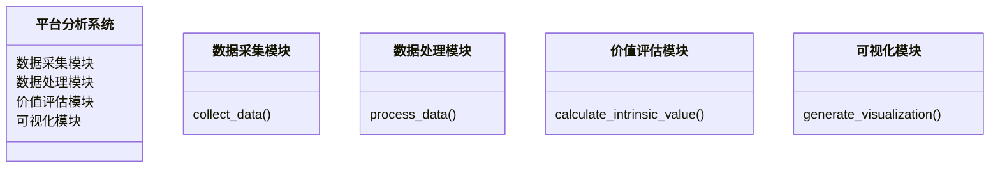
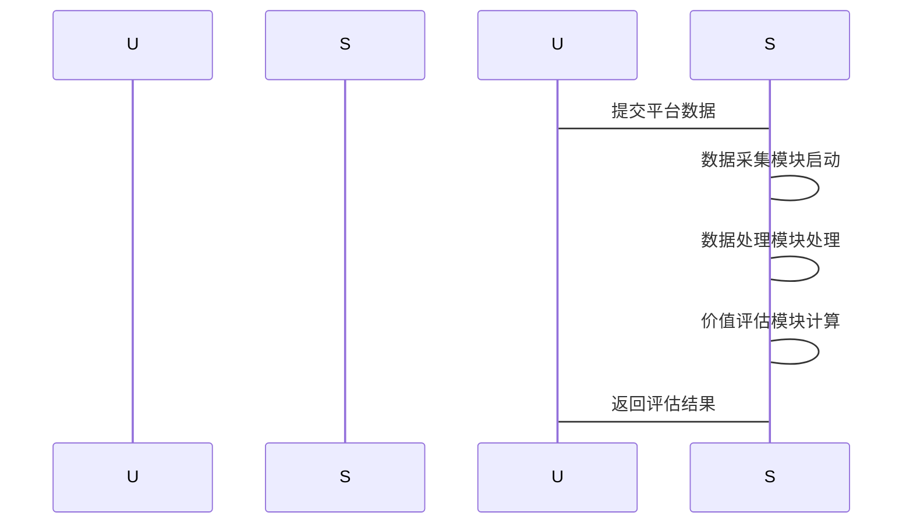

                 


# 《格雷厄姆特价股票理论对现代平台经济的启示》

## 关键词：格雷厄姆投资理论、平台经济、价值评估、算法原理、系统架构

## 摘要：本文探讨了格雷厄姆的价值投资理论如何启示现代平台经济的发展。通过分析平台经济的核心要素和网络效应，结合格雷厄姆的特价股票理论，提出了基于数学模型和算法的平台价值评估方法，并设计了一个分析平台，为投资者提供科学决策支持。

---

## 第一部分：背景介绍

### 第1章：格雷厄姆特价股票理论概述

#### 1.1 格雷厄姆投资理论的起源
- **1.1.1 本杰明·格雷厄姆：价值投资之父**
  - 格雷厄姆是20世纪最具影响力的投资者之一，提出了价值投资的理念。
  - 他的理论强调购买低于其内在价值的股票，长期持有，等待市场重新评估。
  
- **1.1.2 特价股票的定义与特征**
  - 特价股票是指市场价格低于其内在价值的股票。
  - 格雷厄姆通过市盈率、市净率等指标筛选低估股票。

- **1.1.3 格雷厄姆投资理论的核心思想**
  - 投资的本质是购买企业的部分所有权。
  - 投资者应关注企业的基本面，而非市场波动。
  - 安全边际是投资成功的关键。

#### 1.2 格雷厄姆投资策略的关键原则
- **1.2.1 股票内在价值的计算方法**
  - 内在价值 = 未来现金流的现值。
  - 公式：$$V = \sum_{t=1}^{n} \frac{CF_t}{(1+r)^t}$$，其中$CF_t$是第t年的现金流，$r$是折现率。

- **1.2.2 避免情绪化投资的重要性**
  - 投资者应避免受市场情绪影响，坚持理性分析。

- **1.2.3 安全边际的概念与应用**
  - 安全边际 = 内在价值 - 市场价格。
  - 确保在市场价格下跌时仍能保持 profitability。

### 第2章：现代平台经济的崛起

#### 2.1 平台经济的基本概念
- **2.1.1 平台经济的定义与特征**
  - 平台经济是以互联网为基础，通过撮合交易双方进行资源配置的商业模式。
  - 特征包括双边市场、网络效应和数据驱动。

- **2.1.2 平台经济的商业模式分析**
  - 收入来源：佣金、订阅费、广告收入。
  - 核心竞争力：数据处理能力、用户粘性和生态系统。

- **2.1.3 平台经济与传统经济的对比**
  - 平台经济具有更高的效率和灵活性。
  - 传统经济依赖于实体资源，而平台经济依赖于数据和技术。

### 第3章：格雷厄姆特价股票理论与现代平台经济的结合

#### 3.1 平台经济中的价值评估
- **3.1.1 平台企业的价值评估模型**
  - 采用格雷厄姆的内在价值法，结合平台经济的特征。
  - 公式：$$V = \text{用户价值} \times \text{用户粘性} \times \text{网络效应}$$

- **3.1.2 平台经济中的安全边际概念**
  - 平台企业的安全边际 = 内在价值 - 市场估值。
  - 通过分析用户增长和网络效应来评估安全边际。

- **3.1.3 平台企业的内在价值与市场价值对比**
  - 内在价值：基于用户数量、活跃度和收入的现值。
  - 市场价值：二级市场的市值，可能受情绪影响。

---

## 第二部分：核心概念与联系

### 第4章：核心概念与联系

#### 4.1 核心概念的原理
- **格雷厄姆理论的核心原理**
  - 内在价值计算。
  - 安全边际的应用。

- **平台经济的核心要素**
  - 数据驱动。
  - 网络效应。
  - 用户粘性。

#### 4.2 核心概念的特征对比
| 概念         | 格雷厄姆理论                  | 平台经济               |
|--------------|-------------------------------|------------------------|
| 核心目标     | 寻找低估股票                 | 提供高效交易撮合       |
| 评估指标     | 市盈率、市净率               | 用户数量、活跃度       |
| 风险控制     | 安全边际                    | 网络效应的稳定性       |

#### 4.3 实体关系图（ER图）
```mermaid
er
    %% 平台经济中的实体关系图
    entity 用户 {
        id
        用户名
        邮箱
    }

    entity 平台 {
        id
        平台名称
        服务类型
    }

    entity 交易 {
        id
        用户id
        平台id
        交易时间
        交易金额
    }

    用户 -o-> 交易
    平台 -o-> 交易
```

---

## 第三部分：算法原理讲解

### 第5章：算法原理

#### 5.1 平台经济价值评估算法
- **算法步骤**
  1. 收集目标平台的用户数据、收入数据。
  2. 计算用户价值：$$\text{用户价值} = \text{ARPU} \times \text{用户数量}$$
  3. 评估网络效应：$$\text{网络效应} = \text{用户增长率} \times \text{用户活跃度}$$
  4. 计算内在价值：$$V = \text{用户价值} \times \text{网络效应} \times \text{折现率}$$
  5. 比较市场估值与内在价值，确定安全边际。

- **代码实现**
  ```python
  def calculate_intrinsic_value(platform_data, discount_rate):
      arpu = platform_data['ARPU']
      user_count = platform_data['用户数量']
      growth_rate = platform_data['用户增长率']
      user_engagement = platform_data['用户活跃度']
      
      user_value = arpu * user_count
      network_effect = growth_rate * user_engagement
      intrinsic_value = user_value * network_effect / (1 + discount_rate)
      
      return intrinsic_value

  # 示例数据
  platform_data = {
      'ARPU': 50,
      '用户数量': 1000000,
      '用户增长率': 0.3,
      '用户活跃度': 0.8
  }
  discount_rate = 0.1

  iv = calculate_intrinsic_value(platform_data, discount_rate)
  print(f"内值：{iv}")
  ```

---

## 第四部分：系统架构与设计

### 第6章：系统架构

#### 6.1 平台架构设计
- **模块划分**
  - 数据采集模块：收集用户、交易数据。
  - 数据处理模块：计算用户价值、网络效应。
  - 价值评估模块：应用算法计算内在价值。
  - 可视化模块：生成图表展示结果。

- **类图设计**


#### 6.2 系统交互设计


---

## 第五部分：项目实战

### 第7章：项目实战

#### 7.1 选择目标平台
- 以某电商平台为例，分析其用户增长和收入情况。

#### 7.2 数据收集与处理
- 收集过去三年的用户数据、收入数据。
- 计算ARPU、用户增长率等指标。

#### 7.3 应用算法进行评估
- 使用上述算法计算平台的内在价值。
- 比较市场估值与内在价值，确定投资机会。

#### 7.4 分析结果展示
- 生成图表展示用户增长趋势、内在价值与市场估值对比。

---

## 第六部分：总结与展望

### 第8章：总结与未来展望

#### 8.1 全文总结
- 格雷厄姆理论为平台经济的价值评估提供了新的视角。
- 算法和系统设计为投资者提供了科学决策工具。

#### 8.2 未来展望
- 结合人工智能技术，提升评估模型的准确性。
- 开发更多基于平台经济的创新投资策略。

#### 8.3 小结
- 投资者应结合格雷厄姆理论与平台经济的特点，制定合理的投资策略。
- 平台经济的未来充满机遇，但也需要谨慎评估风险。

---

通过以上结构，文章详细探讨了格雷厄姆理论在平台经济中的应用，结合理论分析、算法设计和系统实现，为投资者提供了科学的决策支持。

