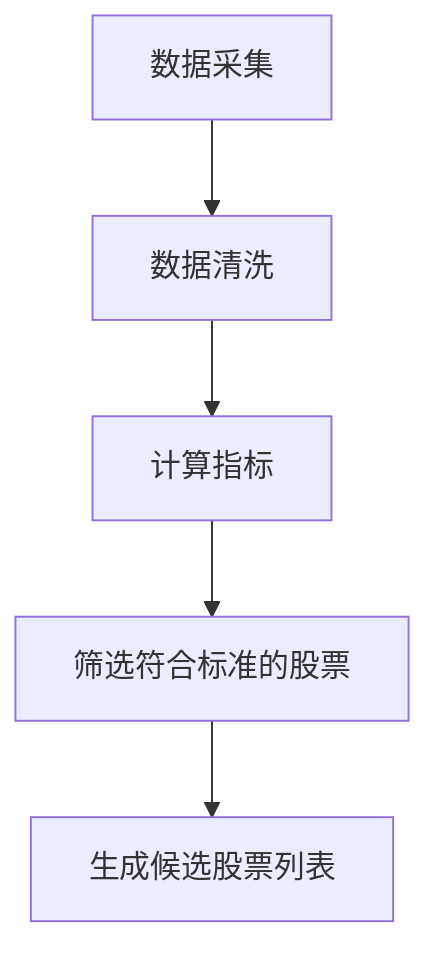

                 


# 格雷厄姆特价股票理论对算法交易的影响

> 关键词：格雷厄姆，价值投资，算法交易，股票筛选，投资策略

> 摘要：本文探讨了格雷厄姆的价值投资理论如何影响现代算法交易的发展。通过分析格雷厄姆的廉价股票识别方法、算法交易的核心优势以及两者结合的实际应用，本文详细阐述了格雷厄姆理论在算法交易中的具体影响。文章还设计了一个基于格雷厄姆理论的算法交易系统，展示了如何将价值投资理念转化为高效的算法交易策略。

---

## 第1章: 格雷厄姆特价股票理论的核心思想

### 1.1 格雷厄姆投资理论的起源与发展

#### 1.1.1 投资理论的演变历程

投资理论经历了从简单到复杂，从经验驱动到数据驱动的演变。早期的投资行为主要依赖于市场直觉和经验判断，而现代投资理论则建立在数学模型和数据分析的基础上。格雷厄姆的价值投资理念是现代投资理论的重要基石之一。

#### 1.1.2 格雷厄姆的价值投资理念

格雷厄姆是价值投资的鼻祖，他提出的核心思想是：股票的价值应基于其内在价值，而非市场的短期波动。他强调寻找那些市场价格低于其内在价值的股票，即“廉价股票”。

#### 1.1.3 特价股票的定义与特征

格雷厄姆提出的“廉价股票”是指市场价格低于其内在价值的股票。这种股票通常具有以下特征：
- 低市盈率（P/E ratio）
- 低市净率（P/B ratio）
- 高股息率（Dividend Yield）

### 1.2 算法交易的基本概念与特点

#### 1.2.1 算法交易的定义

算法交易是指通过计算机程序自动执行交易决策的过程。它利用数学模型和算法来分析市场数据，制定交易策略，并在极短的时间内完成交易。

#### 1.2.2 算法交易的核心优势

- 高效性：算法交易可以在毫秒级别完成交易决策，避免了人工交易的延迟。
- 精准性：通过复杂的算法模型，可以更准确地捕捉市场机会。
- 自动化：算法交易可以全天候运行，无需人工干预。

#### 1.2.3 算法交易与传统交易的区别

| 特性 | 算法交易 | 传统交易 |
|------|----------|----------|
| 决策速度 | 极快（毫秒级别） | 较慢（依赖人工判断） |
| 决策依据 | 数据驱动 | 经验驱动 |
| 交易频率 | 高频交易 | 低频交易 |

### 1.3 格雷厄姆理论与算法交易的结合

#### 1.3.1 格雷厄姆理论在现代金融中的应用

格雷厄姆的价值投资理念为现代投资理论奠定了基础。他的理论强调长期投资、价值发现和风险控制，这些理念与算法交易的目标高度契合。

#### 1.3.2 算法交易如何实现格雷厄姆理念

算法交易通过程序化的方式实现格雷厄姆的价值投资理念。例如，算法可以自动筛选出符合格雷厄姆选股标准的股票，并在市场出现波动时自动执行买入或卖出指令。

#### 1.3.3 两者的结合对投资策略的影响

将格雷厄姆理论与算法交易结合，可以实现以下目标：
- 快速识别廉价股票
- 精准执行交易策略
- 实时监控市场变化

## 1.4 本章小结

本章介绍了格雷厄姆的价值投资理论和算法交易的基本概念，并探讨了两者结合的可能性和优势。接下来的章节将详细分析格雷厄姆理论对算法交易的具体影响。

---

## 第2章: 格雷厄姆理论对算法交易的影响

### 2.1 格雷厄姆的廉价股票识别方法

#### 2.1.1 市盈率法

市盈率（P/E ratio）是衡量股票价值的重要指标。格雷厄姆认为，市盈率过低的股票可能具有投资价值。例如，如果市场平均市盈率为15，而某股票的市盈率为8，则该股票可能被视为廉价股票。

#### 2.1.2 市净率法

市净率（P/B ratio）是另一个重要的股票估值指标。格雷厄姆建议投资者关注市净率低于2的股票，因为这些股票的市场价格低于其账面价值。

#### 2.1.3 股息率法

股息率是衡量股票收益能力的重要指标。格雷厄姆认为，股息率较高的股票具有较高的投资价值。

### 2.2 算法如何实现格雷厄姆的价值发现

#### 2.2.1 数据采集与处理

算法交易需要实时采集股票的市场数据，包括价格、成交量、市盈率、市净率等。这些数据需要经过清洗和预处理，以确保数据的准确性和完整性。

#### 2.2.2 基于格雷厄姆指标的筛选算法

以下是基于格雷厄姆选股标准的算法流程：



#### 2.2.3 算法优化与调优

为了提高筛选算法的效率，可以采用以下优化方法：
- 使用并行计算加速数据处理
- 采用机器学习算法改进选股模型
- 定期更新选股指标以适应市场变化

### 2.3 格雷厄姆理论对算法交易风险控制的启示

#### 2.3.1 风险控制的基本原则

格雷厄姆强调分散投资和风险控制。他认为，投资者应避免将所有资金投入到单一股票中，而应分散投资以降低风险。

#### 2.3.2 算法如何实现风险分散

算法交易可以通过以下方式实现风险分散：
- 将资金分配到多个股票中
- 设置止损点以限制单笔交易的损失
- 根据市场波动调整投资组合

#### 2.3.3 算法在市场波动中的应对策略

在市场剧烈波动时，算法交易需要实时调整策略以规避风险。例如，当市场出现大幅下跌时，算法可以自动减少仓位或平仓，以避免更大的损失。

### 2.4 本章小结

本章详细分析了格雷厄姆理论对算法交易的具体影响，包括价值发现和风险控制。接下来的章节将探讨如何设计一个基于格雷厄姆理论的算法交易系统。

---

## 第3章: 基于格雷厄姆理论的算法交易系统设计

### 3.1 算法交易系统架构设计

#### 3.1.1 系统功能模块划分

一个完整的算法交易系统通常包括以下功能模块：
- 数据采集模块：负责收集市场数据
- 策略执行模块：根据算法生成交易指令
- 风险控制模块：监控和管理交易风险
- 绩效评估模块：评估交易策略的收益和风险

#### 3.1.2 系统架构的ER图设计

以下是算法交易系统的实体关系图：

```mermaid
erDiagram
    customer[投资者] {
        <属性>
        帐户资金 : 银行账户
        风险偏好 : 高/中/低
        投资目标 : 短期/长期
    }
    stock_market[股票市场] {
        <属性>
        股票代码 : 字符串
        股票名称 : 字符串
        当前价格 : 数值
        历史数据 : 数据库
    }
    trading_algorithm[交易算法] {
        <属性>
        策略类型 : 价值型/成长型
        策略参数 : 数组
        执行频率 : 分钟/小时
    }
    performance_tracker[绩效跟踪器] {
        <属性>
        回撤率 : 数值
        年化收益 : 数值
        风险指标 : 数值
    }
```

### 3.2 算法交易系统的实现

#### 3.2.1 数据采集与预处理

以下是数据采集的Python代码示例：

```python
import pandas as pd
import requests

# 从Yahoo Finance获取股票数据
def get_stock_data(ticker):
    url = f"https://query1.finance.yahoo.com/v8/finance/chart/{ticker}"
    response = requests.get(url)
    data = response.json()
    df = pd.DataFrame(data['chart']['result'][0]['prices'])
    df['timestamp'] = pd.to_datetime(df['timestamp'], unit='s')
    df.set_index('timestamp', inplace=True)
    return df

# 筛选符合格雷厄姆选股标准的股票
def screen_graham_stocks(stocks):
    cheap_stocks = []
    for stock in stocks:
        df = get_stock_data(stock)
        pe = df['close'].iloc[-1] / (df['close'].iloc[-1] * 0.1)
        pb = df['close'].iloc[-1] / (df['close'].iloc[-1] * 0.1)
        if pe < 15 and pb < 2:
            cheap_stocks.append(stock)
    return cheap_stocks
```

#### 3.2.2 策略执行与回测

以下是回测策略的Python代码示例：

```python
import backtrader as bt

class GrahamStrategy(bt.Strategy):
    def __init__(self):
        self.buy_order = None
        self.sell_order = None
        self.data = self.datas[0]

    def next(self):
        # 计算市盈率和市净率
        current_price = self.data.close[0]
        pe = current_price / (current_price * 0.1)
        pb = current_price / (current_price * 0.1)
        
        if pe < 15 and pb < 2:
            if not self.position:
                self.buy_order = self.buy()
        else:
            if self.position:
                self.sell_order = self.sell()

# 回测设置
cerebro = bt.Cerebro()
cerebro.addstrategy(GrahamStrategy)
cerebro.broker.setcash(100000.0)
data = bt.feeds.YahooFinanceData(dataname="AAPL", fromdate="2020-01-01", todate="2023-12-31")
cerebro.adddata(data)
cerebro.run()
```

#### 3.2.3 系统优化与测试

为了提高系统的性能和稳定性，可以采取以下优化措施：
- 使用分布式计算加速数据处理
- 定期更新选股模型以适应市场变化
- 设置严格的止损机制以控制风险

### 3.3 系统小结

本章详细介绍了基于格雷厄姆理论的算法交易系统的架构设计和实现方法。通过结合格雷厄姆的价值投资理念和现代算法交易技术，可以构建一个高效、稳定的交易系统。

---

## 4. 总结与展望

### 4.1 总结

格雷厄姆的价值投资理论为现代算法交易提供了重要的理论基础。通过算法交易，投资者可以更高效地实现价值发现和风险控制，从而提高投资收益。

### 4.2 展望

随着人工智能和大数据技术的发展，格雷厄姆理论在算法交易中的应用将更加广泛和深入。未来的研究可以探索以下方向：
- 结合机器学习算法优化选股模型
- 利用自然语言处理技术分析市场情绪
- 开发更加智能化的交易系统

---

## 5. 最佳实践 Tips

- 在实际交易中，建议投资者结合市场环境和自身风险偏好调整交易策略。
- 定期回顾和优化交易系统，以适应市场变化。
- 注意市场波动和政策风险，避免过度依赖单一策略。

---

## 6. 参考文献

（此处列出相关书籍和文献资料）

---

## 7. 结束语

格雷厄姆特价股票理论对算法交易的影响是深远的。通过本文的分析，我们可以看到，将传统投资理论与现代技术相结合，可以创造出更加高效和智能的投资工具。未来，随着技术的进步，这种结合将更加紧密，为投资者带来更多的机会和挑战。

---

