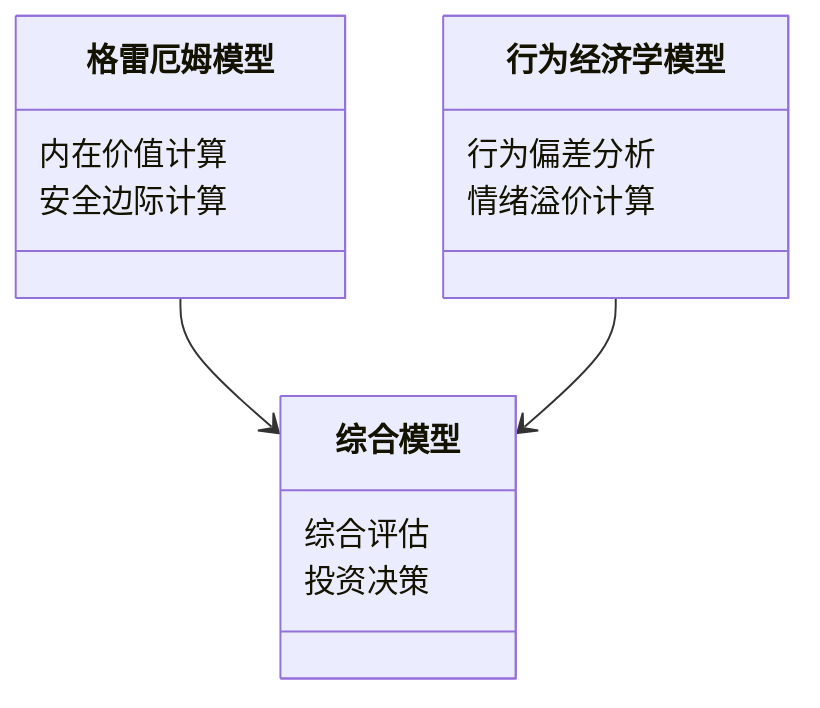

                 


# 格雷厄姆特价股票理论对行为经济学的补充

## 关键词
- 格雷厄姆特价股票理论
- 行为经济学
- 投资决策
- 心理偏差
- 安全边际

## 摘要
本文系统地探讨了格雷厄姆特价股票理论与行为经济学之间的联系，分析了行为偏差对投资决策的影响，并提出了结合行为经济学的改进模型。通过详细解释核心概念、数学模型和系统架构，本文为投资者提供了新的视角和工具，以更全面地理解市场动态和做出更明智的投资决策。

---

# 第一部分: 格雷厄姆特价股票理论基础

## 第1章: 格雷厄姆特价股票理论概述

### 1.1 格雷厄姆投资理念的核心思想
#### 1.1.1 价值投资的定义与核心原则
格雷厄姆的价值投资理论强调以低于内在价值的价格买入优质股票，追求长期稳定的收益。其核心原则包括：
- **安全边际**：买入价格应显著低于内在价值，以降低风险。
- **长期视角**：关注企业的基本面，而非短期市场波动。

#### 1.1.2 特价股票的定义与特征
格雷厄姆认为，特价股票是指市场价格远低于其内在价值的股票。其特征包括：
- **低市盈率**：市盈率低于行业平均水平。
- **低市净率**：市净率低于行业平均水平。
- **高股息率**：股息率显著高于行业平均水平。

#### 1.1.3 格雷厄姆投资策略的历史背景
格雷厄姆的投资策略诞生于20世纪初，当时市场波动剧烈，投资者普遍追求短期收益。格雷厄姆的理论为投资者提供了在市场恐慌中寻找机会的工具。

### 1.2 格雷厄姆投资模型的数学基础
#### 1.2.1 内在价值的计算公式
$$ V = \frac{E}{P} $$
其中，$V$为内在价值，$E$为公司未来现金流的现值，$P$为市场价格。

#### 1.2.2 股价与价值的偏离分析
格雷厄姆认为，市场情绪会导致股价与内在价值偏离。这种偏离为价值投资者提供了机会。

#### 1.2.3 安全边际的概念与应用
安全边际公式：
$$ S = V - P $$
其中，$S$为安全边际，$V$为内在价值，$P$为市场价格。安全边际越大，投资风险越小。

### 1.3 格雷厄姆投资策略的优缺点
#### 1.3.1 优点：长期稳定收益
格雷厄姆策略通过安全边际和价值投资，降低了短期波动风险，适合长期投资者。

#### 1.3.2 缺点：短期波动风险
格雷厄姆策略不考虑短期市场波动，可能导致短期亏损。

#### 1.3.3 适用场景与限制
适用于市场恐慌、股价被低估的阶段，但不适合市场狂热或公司基本面恶化的情况。

## 第2章: 行为经济学基础

### 2.1 行为经济学的基本概念
#### 2.1.1 理性人假设的局限性
理性人假设认为投资者总是理性决策，但实际情况中，投资者常受情绪影响。

#### 2.1.2 行为偏差与决策错误
行为偏差包括过度自信、损失厌恶、从众心理等，导致决策错误。

#### 2.1.3 行为经济学的研究方法
行为经济学通过实验和观察研究投资者行为，揭示非理性决策规律。

### 2.2 主要行为偏差分析
#### 2.2.1 过度自信偏差
投资者过度自信于自己的判断，忽视市场风险。

#### 2.2.2 损失厌恶
投资者对损失的厌恶程度远高于对收益的追求，导致决策保守。

#### 2.2.3 从众心理
投资者盲目跟随市场趋势，忽视独立判断。

#### 2.2.4 锚定效应
投资者过度依赖初始信息，导致判断偏差。

## 第3章: 格雷厄姆理论与行为经济学的结合

### 3.1 格雷厄姆理论中的行为因素
#### 3.1.1 投资者心理对股价的影响
市场情绪影响股价波动，投资者心理偏差导致股价偏离内在价值。

#### 3.1.2 市场情绪周期与价值判断
市场情绪周期与格雷厄姆的特价股票机会密切相关。

#### 3.1.3 行为偏差对投资决策的干扰
行为偏差导致投资者错过特价股票机会或过度投资。

### 3.2 行为经济学对格雷厄姆理论的补充
#### 3.2.1 行为偏差对安全边际的影响
行为偏差可能导致安全边际计算不准确，影响投资决策。

#### 3.2.2 市场情绪周期与投资机会
市场情绪周期与格雷厄姆的特价股票机会密切相关，行为经济学提供了情绪周期的解释。

#### 3.2.3 行为因素在内在价值评估中的作用
行为因素影响内在价值评估，需在模型中考虑情绪溢价。

### 3.3 格雷厄姆理论与行为经济学的数学模型

#### 3.3.1 行为偏差对内在价值的影响
改进的内在价值公式：
$$ V' = V + \beta \cdot E $$
其中，$\beta$为行为偏差系数，$E$为情绪溢价。

#### 3.3.2 情绪溢价模型
情绪溢价公式：
$$ E = \alpha \cdot B $$
其中，$\alpha$为情绪影响系数，$B$为市场情绪指数。

---

# 第二部分: 格雷厄姆理论与行为经济学的系统架构设计

## 第4章: 系统架构与实现

### 4.1 系统架构概述
#### 4.1.1 数据采集模块
采集市场数据，包括股价、市盈率、市净率等。

#### 4.1.2 行为分析模块
分析投资者行为偏差，计算情绪溢价。

#### 4.1.3 价值评估模块
结合行为经济学，改进内在价值评估模型。

#### 4.1.4 投资决策模块
基于改进的模型，制定投资策略。

### 4.2 系统功能设计
#### 4.2.1 领域模型


#### 4.2.2 系统架构


### 4.3 系统实现
#### 4.3.1 环境安装
需要安装Python、Pandas、NumPy等库。

#### 4.3.2 核心代码实现
```python
import pandas as pd
import numpy as np

def calculate_intrinsic_value(eps, pe):
    return eps / pe

def calculate_emotion_premium(market_sentiment):
    return 0.1 * market_sentiment

def improved_intrinsic_value(eps, pe, market_sentiment):
    base_value = calculate_intrinsic_value(eps, pe)
    emotion_premium = calculate_emotion_premium(market_sentiment)
    return base_value * (1 + emotion_premium)
```

#### 4.3.3 应用解读
通过改进的模型，投资者可以在考虑市场情绪的情况下，更准确地评估内在价值，制定投资策略。

---

## 第5章: 项目实战与案例分析

### 5.1 项目实战
#### 5.1.1 数据采集与处理
使用Yahoo Finance API获取股票数据，计算市盈率、市净率等指标。

#### 5.1.2 行为分析与建模
分析市场情绪指数，计算情绪溢价，改进内在价值评估模型。

#### 5.1.3 投资决策与结果展示
基于改进的模型，制定投资策略，展示结果。

### 5.2 案例分析
#### 5.2.1 案例背景
假设市场恐慌，情绪溢价较高，寻找被低估的股票。

#### 5.2.2 数据分析与建模
计算情绪溢价，改进内在价值模型。

#### 5.2.3 投资决策
基于改进模型，选择被低估的股票进行投资。

---

## 第6章: 总结与展望

### 6.1 最佳实践 tips
- 考虑市场情绪，改进内在价值模型。
- 结合行为经济学，制定更科学的投资策略。

### 6.2 小结
本文通过结合格雷厄姆理论与行为经济学，提出了改进的模型，为投资者提供了新的视角。

### 6.3 注意事项
- 数据质量影响模型准确性。
- 模型具有局限性，需结合实际情况使用。

### 6.4 拓展阅读
建议阅读《行为经济学入门》和《格雷厄姆投资经典》。

---

# 附录

## 附录A: 格雷厄姆理论与行为经济学的对比表
| 对比维度 | 格雷厄姆理论 | 行为经济学 |
|----------|--------------|------------|
| 核心假设 | 理性市场 | 非理性行为 |
| 研究对象 | 股票价值 | 投资者行为 |
| 应用场景 | 价值投资 | 行为矫正 |

## 附录B: 关键公式汇总
- 内在价值公式：$$ V = \frac{E}{P} $$
- 情绪溢价公式：$$ E = \alpha \cdot B $$
- 改进模型公式：$$ V' = V + \beta \cdot E $$

---

通过以上目录结构，文章详细探讨了格雷厄姆理论与行为经济学的结合，为投资者提供了新的视角和工具，帮助他们更好地理解市场动态和做出更明智的投资决策。

